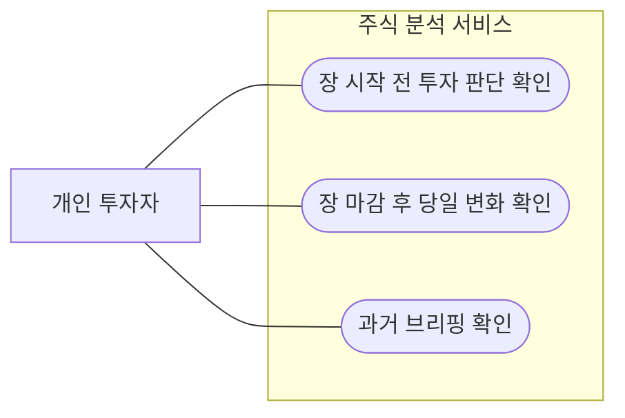
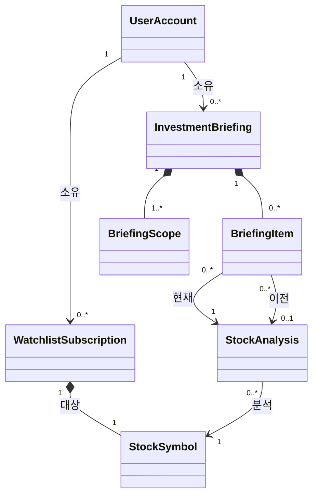
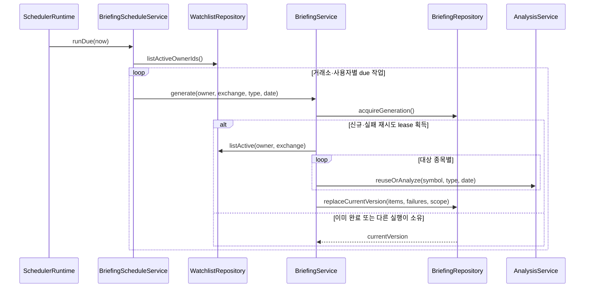

# AI 투자 브리핑 기능 설계

## 1. 목적과 현재 범위

사용자가 관심 종목의 장전 전망, 장후 변화와 판단 변화를 시기별로 확인할 수 있게 한다.

### 현재 반복에 포함

- 장 시작 전 투자 판단 확인
- 장 마감 후 당일 변화 확인
- 과거 브리핑 확인
- 사용자별 관심 종목 범위와 접근 제어
- 사용자와 무관한 공유 종목 분석 재사용
- 거래소별 거래일·개장·폐장 기준 예약 생성
- 일부 종목 실패 기록과 실패 종목 재시도
- 생성 시점 범위 스냅샷과 현재·이전 분석 근거 보존

### 현재 반복에서 제외

- 외부 채널 전달과 재전송 실행
- 사용자별 `NotificationConnection` 관리
- 자연어 `@종목`, `#필터` 해석
- 자동 매수·매도, 수익 보장과 개인화 재무 자문
- 포트폴리오 최적화와 실시간 틱 브리핑

외부 전달은 로그인과 별도의 사용자별 알림 연결이 구현된 뒤 후속 반복에서 활성화한다. 현재 구현은 브리핑 생성·저장·조회까지만 수행한다.

## 2. OOA

OOA는 주식 분석 서비스를 Black box로 다룬다. 화면, API, 내부 ID, 저장소, 스케줄러와 분석 컴포넌트는 유스케이스에 나타내지 않는다.

### 2.1 유스케이스 다이어그램



### 2.2 유스케이스 명세

#### UC-B01 장 시작 전 투자 판단 확인

- **목적**: 사용자가 정규장 시작 전에 관심 종목의 전망과 이전 판단 대비 변화를 확인한다.
- **주 액터**: 개인 투자자
- **트리거**: 사용자가 장 시작 전 최신 투자 브리핑을 요청한다.
- **사전조건**: 사용자가 로그인했고 하나 이상의 활성 관심 종목을 보유한다.
- **기본 흐름**:
  1. 사용자가 장 시작 전 최신 투자 브리핑을 요청한다.
  2. 서비스가 생성 당시 포함된 관심 종목과 각 종목의 현재 판단을 제공한다.
  3. 서비스가 비교 가능한 이전 판단과 달라진 종목을 우선하여 제공한다.
  4. 사용자가 전망, 판단 변화와 주의사항을 확인한다.
- **대안·예외 흐름**:
  - 아직 이용 가능한 브리핑이 없으면 서비스는 준비되지 않았음을 알린다.
  - 일부 종목을 분석할 수 없으면 서비스는 성공한 종목과 누락 사유를 함께 제공한다.
  - 활성 관심 종목이 없으면 서비스는 확인할 대상이 없음을 알린다.
- **성공 보장**: 사용자는 자신의 관심 종목을 기준으로 생성된 브리핑과 비교 가능한 판단 변화를 확인한다.
- **최소 보장**: 요청 실패가 기존 브리핑이나 공유 분석을 변경하지 않는다.

#### UC-B02 장 마감 후 당일 변화 확인

- **목적**: 사용자가 정규장 마감 후 관심 종목의 확정된 당일 변화와 판단 변화를 확인한다.
- **주 액터**: 개인 투자자
- **트리거**: 사용자가 장 마감 후 최신 요약을 요청한다.
- **사전조건**: 사용자가 로그인했고 하나 이상의 활성 관심 종목을 보유한다.
- **기본 흐름**:
  1. 사용자가 장 마감 후 최신 요약을 요청한다.
  2. 서비스가 생성 당시 포함된 관심 종목의 당일 변화와 현재 판단을 제공한다.
  3. 서비스가 장전 또는 직전의 비교 가능한 판단과 달라진 종목을 우선하여 제공한다.
  4. 사용자가 당일 변화, 판단 변화와 주의사항을 확인한다.
- **대안·예외 흐름**:
  - 확정된 장 마감 자료를 이용할 수 없으면 서비스는 아직 준비되지 않았음을 알린다.
  - 일부 종목의 자료만 준비되지 않았으면 서비스는 성공한 종목과 누락 사유를 함께 제공한다.
  - 모든 종목을 분석할 수 없으면 서비스는 빈 요약을 제공하지 않는다.
- **성공 보장**: 사용자는 확정된 장 마감 자료를 근거로 자신의 관심 종목의 당일 변화와 판단 변화를 확인한다.
- **최소 보장**: 준비되지 않은 자료를 확정 결과처럼 제공하지 않고 기존 브리핑을 변경하지 않는다.

#### UC-B03 과거 브리핑 확인

- **목적**: 사용자가 자신에게 제공된 과거 브리핑과 당시 포함된 대상을 확인한다.
- **주 액터**: 개인 투자자
- **트리거**: 사용자가 과거 브리핑 목록 또는 상세를 요청한다.
- **사전조건**: 사용자가 로그인했다.
- **기본 흐름**:
  1. 사용자가 과거 브리핑을 요청한다.
  2. 서비스가 해당 사용자에게 제공된 브리핑 목록을 제공한다.
  3. 사용자가 한 브리핑을 선택한다.
  4. 서비스가 생성 당시 대상, 현재·이전 판단과 누락 사유를 제공한다.
- **대안·예외 흐름**:
  - 해당 사용자에게 제공되지 않은 브리핑은 존재 여부를 드러내지 않는다.
  - 보존 정책에 따라 이전 재생성 버전이 폐기된 경우 서비스는 현재 보존된 버전만 제공한다.
- **성공 보장**: 조회로 브리핑, 생성 당시 대상과 공유 분석이 변경되지 않는다.
- **최소 보장**: 다른 사용자의 브리핑과 소유 정보를 노출하지 않는다.

### 2.3 OOA 도메인 모델



### 2.4 도메인 규칙

- 브리핑은 한 사용자 계정, 한 거래소, 한 현지 거래일과 한 브리핑 유형에 속한다.
- 브리핑 생성 범위는 생성 버전이 완료되는 순간 확정되며 그 버전을 해석하는 동안 바뀌지 않는다.
- 최신 버전만 보존하는 정책은 이전 버전 전체를 폐기할 수 있지만 보존된 버전의 범위를 재해석하지 않는다.
- 종목 분석은 사용자와 무관하며 사용자 조건, 개인정보와 전달 상태를 포함하지 않는다.
- 사용자별 브리핑은 공유 종목 분석을 복제하지 않고 선택·비교하여 제공한다.
- 이전 결과가 없거나 어느 한 판단이 불명확하면 판단 변경으로 표시하지 않는다.
- 장후 브리핑은 같은 거래일의 장전 판단을 우선 비교하고, 없으면 직전 비교 가능한 판단을 사용한다.
- 판단이 달라진 종목, 판단 단계 차이가 큰 종목, 신뢰도가 높은 종목, 자료 시각이 최신인 종목 순으로 우선한다.
- 휴장·조기 폐장·시간대와 서머타임은 거래소의 거래 세션을 기준으로 판단한다.
- 일부 종목 실패가 성공한 종목 결과를 소실시키지 않는다.

## 3. 기능 요구사항

구체적인 저장 구조와 인터페이스 계약은 OOA가 아니라 다음 요구사항과 OOD에서 다룬다.

| 요구사항 | 내용 | 근거 |
| --- | --- | --- |
| `FR-B01` | 현재 사용자 계정의 활성 관심 종목만 브리핑 범위에 포함한다. | `UC-B01`, `UC-B02` |
| `FR-B02` | 공유 종목 분석은 사용자별로 복제하거나 사용자 조건과 전달 상태를 포함하지 않는다. | `UC-B01`, `UC-B02` |
| `FR-B03` | 브리핑 조회는 인증된 현재 사용자 계정의 소유권으로 제한한다. | `UC-B03` |
| `FR-B04` | 생성 버전별 대상 범위와 현재·이전 공유 분석 근거를 보존한다. | `UC-B01~03` |
| `FR-B05` | 거래소의 거래일, 개장·폐장, 조기 폐장과 시간대를 반영해 장전·장후 브리핑을 예약 생성한다. | `UC-B01`, `UC-B02` |
| `FR-B06` | 일부 종목이 일시적으로 실패하면 성공 항목을 다시 분석하지 않고 실패 종목만 재시도한다. | `UC-B01`, `UC-B02` 예외 흐름 |
| `FR-B07` | 같은 사용자·거래소·유형·거래일·버전에서 종목과 실행을 중복 저장하지 않는다. | `UC-B01`, `UC-B02` 성공 보장 |
| `FR-B08` | 장후 자료는 요청 거래일의 일봉 존재 여부를 확인하고 준비되지 않은 종목을 재시도 대상으로 기록한다. | `UC-B02` 최소 보장 |
| `FR-B09` | 로그인만 완료되고 활성 알림 연결이 없으면 외부 전달을 만들거나 시도하지 않는다. | 로그인 `FR-L06` |
| `FR-B10` | 운영자용 강제 실행은 일반 사용자 세션과 별도의 신뢰된 자격 증명을 요구한다. | 운영 안전 요구 |
| `FR-B11` | 서버 시작 시 즉시 due 작업을 확인하고 허용된 생성 창 안의 놓친 작업을 중복 없이 생성한다. | 예약 생성 가용성 |
| `FR-B12` | 재생성은 같은 브리핑의 현재 버전을 교체하고 버전 번호를 증가시키며 이전 버전은 보존하지 않는다. | 이슈 #25의 9번 A안 |

### 3.1 종목 검색 연동 요구

자연어 `@종목`, `#필터`의 입력·검색·후보 선택은 PR #23의 종목 검색 컨텍스트가 담당한다. 브리핑 컨텍스트는 확정된 구조화 종목 식별자 집합만 받으며 문자열을 재해석하지 않는다.

PR #23이 병합되기 전에는 정규화된 provider symbol을 임시 식별자로 사용한다. 병합 후 `listed_security_id`로 전환하고 종목명 기준 최종 정렬을 적용한다.

## 4. OOD

### 4.1 책임 배정

| OOD 요소 | 책임 | 추적 요구사항 |
| --- | --- | --- |
| `BriefingScheduleService` | 거래 세션별 due 판단, 활성 구독 소유자별 생성 요청 | `FR-B05`, `FR-B11` |
| `BriefingService` | 범위 확정, 공유 분석 선택·생성, 비교·정렬, 부분 실패와 재시도 조정 | `FR-B01`, `FR-B02`, `FR-B04`, `FR-B06`, `FR-B08` |
| `TradingCalendar` | 휴장·조기 폐장·시간대·서머타임이 반영된 거래 세션 제공 | `FR-B05` |
| `MarketDataProvider` | 현재 자료와 지정 거래일의 장 마감 자료 제공 | `FR-B08` |
| `WatchlistRepository` | 사용자별 활성 구독과 활성 구독 소유자 조회 | `FR-B01`, `FR-B11` |
| `AnalysisRepository` | 사용자 무관 공유 분석과 이전 비교 분석 조회 | `FR-B02`, `FR-B04` |
| `BriefingRepository` | 생성 lease, 현재 버전, 범위·항목·실패와 고유키 저장 | `FR-B04`, `FR-B06`, `FR-B07`, `FR-B12` |
| 브리핑 API | 현재 사용자 조회와 신뢰된 운영자 실행 경계 | `FR-B03`, `FR-B10` |
| `BriefingDeliveryService` | 후속 반복에서 활성 사용자별 알림 연결이 확인된 브리핑만 전달 | `FR-B09` |

### 4.2 판단 비교와 정렬

AI 자유문장은 다음 값으로 정규화한다.

```text
STRONG_BUY → BUY → HOLD → SELL → STRONG_SELL
```

판단할 수 없는 응답은 `UNKNOWN`이다. 현재 또는 이전 판단이 `UNKNOWN`이면 `comparison_status=NOT_COMPARABLE`, `judgment_changed=false`로 처리한다.

정렬 순서는 다음과 같다.

1. `judgment_changed=true`
2. 판단 단계 변화의 절댓값 내림차순
3. 제공된 분석 신뢰도 내림차순
4. 자료 기준시각 내림차순
5. 현재 반복에서는 종목 코드, PR #23 이후에는 종목명 순

### 4.3 생성·재시도 시퀀스



`PARTIAL` 브리핑에 retryable 실패가 있으면 다음 due 실행이 새 생성 버전을 획득한다. 이미 성공한 종목은 같은 공유 분석을 재사용하고 실패 종목만 새 분석을 요청한다. 성공한 실패 기록은 제거하며 다시 실패한 기록의 시도 횟수는 증가한다.

### 4.4 예약 생성 정책

- 장전 생성 창: 거래소 개장 60분 전부터 개장 직전까지
- 장후 생성 창: 거래소 폐장 시점부터 90분 뒤까지
- 런타임은 서버 시작 직후 한 번 due 작업을 확인한 뒤 설정 간격으로 반복한다.
- 허용 창이 지난 장전 브리핑은 목적을 잃으므로 뒤늦게 생성하지 않는다.
- 장후 브리핑은 90분 창 안에서 자료가 준비되는 동안 재시도한다.
- 고유키와 생성 lease로 시작 직후 복구와 정기 실행이 겹쳐도 중복 생성을 막는다.

### 4.5 데이터 모델

#### `investment_briefings`

`id`, `user_account_id`, `briefing_type`, `exchange`, `trading_date`, `status`, `summary`, `generated_at`, `generation_started_at`, `version`, `failure_count`를 저장한다.

`UNIQUE(user_account_id, exchange, briefing_type, trading_date)`로 같은 논리 브리핑의 현재 버전을 하나만 보존한다.

#### `briefing_scopes`

현재 생성 버전의 `source_type`, `source_value`와 확정된 종목 식별자 목록을 저장한다. `force` 재생성은 이전 버전 전체를 폐기하고 새 현재 버전의 scope를 원자적으로 교체한다.

#### `briefing_items`

현재·이전 공유 분석 참조, 정규화 판단, 비교 상태, 판단 거리, 표시 순위, 신뢰도와 변경 이유를 저장한다. 현재 반복은 `(briefing_id, symbol)`, PR #23 이후에는 `(briefing_id, listed_security_id)`를 고유하게 유지한다.

#### `briefing_failures`

실패 종목, 오류 코드·메시지, 재시도 가능 여부, 시도 횟수와 해결 시각을 저장한다. 현재 버전에 남은 실패만 유지한다.

#### `briefing_deliveries`

후속 알림 연결 반복에서 채널별 전달 상태를 저장한다. 활성 `NotificationConnection`이 확인되지 않으면 레코드를 만들지 않는다.

### 4.6 API와 신뢰 경계

| 메서드 | 경로 | 인증·책임 |
| --- | --- | --- |
| `GET` | `/users/me/briefings` | 서비스 세션의 현재 사용자 목록 |
| `GET` | `/users/me/briefings/{id}` | 현재 사용자 소유 상세, 타 사용자 항목은 `404` |
| `POST` | `/internal/briefings/run` | 서비스 세션과 별도의 내부 운영 자격 증명을 모두 요구하는 수동 실행 |

클라이언트가 사용자 식별자를 헤더나 본문으로 지정할 수 없다. 내부 실행 API도 현재 세션 계정의 브리핑만 생성하며 별도 내부 자격 증명 없이는 호출할 수 없다.

### 4.7 외부 전달 후속 설계 경계

현재 런타임은 브리핑 전달 서비스를 호출하지 않는다. 후속 반복에서는 다음 조건을 모두 만족할 때만 저장 완료된 브리핑을 전달한다.

- 브리핑 소유자의 활성 `NotificationConnection`이 존재한다.
- 연결이 요청 채널과 일치한다.
- 같은 브리핑·채널 전달이 이미 성공하지 않았다.

전달 실패는 브리핑 생성 상태를 변경하지 않는다. 사용자별 연결 저장소와 재시도 간격·최대 횟수·최종 실패 가시성이 구현되기 전에는 전역 카카오 자격 증명으로 전달하지 않는다.

## 5. 실패 및 경계 시나리오

| 상황 | 처리 |
| --- | --- |
| 관심 종목 없음 | 브리핑을 만들지 않고 대상 없음 결과 |
| 휴장일 | 브리핑을 만들지 않음 |
| 일부 종목 일시 실패 | 성공 항목으로 `PARTIAL`, 실패 종목만 다음 실행에서 재시도 |
| 모든 종목 실패 | `FAILED`, 허용 생성 창 안에서 재시도 |
| 장후 자료 미확정 | retryable 실패로 기록하고 빈 브리핑을 제공하지 않음 |
| 비정상 AI 판단 | `UNKNOWN`, 변경 비교에서 제외 |
| 작업 중 관심 종목 변경 | 획득한 현재 버전의 시작 시점 범위로 완료 |
| 중복 스케줄 실행 | 고유키와 생성 lease로 하나만 생성 |
| 로그인만 완료 | 전달 레코드와 외부 메시지를 만들지 않음 |
| 다른 사용자 상세 조회 | 존재 여부를 드러내지 않고 `404` |
| 내부 실행 자격 증명 없음 | 요청 거부 |

## 6. 이슈 #25 결정

| 항목 | 결정 |
| --- | --- |
| 실패 종목 | retryable 실패 종목만 재시도하고 성공 공유 분석 재사용 |
| 카카오 전달 | 사용자별 알림 연결 후속 반복까지 비활성화, 공용 연결 사용 안 함 |
| 놓친 일정 | 시작 즉시 due 확인, 장전 60분·장후 90분 허용 창 안에서만 복구 |
| 운영 DB | Alembic 사용; 운영 DB 제품·백업 복구·CI는 배포 작업으로 분리 |
| AI 표시 | 신뢰도는 선택값, 판단 변경 이유는 변경된 경우만 표시 |
| 종가 | 해당 거래일 일봉이 있을 때 사용, 장후 90분 안에 재시도, 공급자 수정 자동 재생성 안 함 |
| 재생성 버전 | A안: 최신 버전만 보존하고 논리 브리핑 ID의 `version` 증가 |
| 로그인 | 서비스 세션의 `UserAccount.id` 사용, 알림 연결과 분리 |

## 7. 완료 기준

- 세 유스케이스가 현재 사용자 소유권 경계에서 동작한다.
- 장전·장후 브리핑이 거래소별 세션에 맞춰 생성된다.
- 서버 시작 직후 허용 생성 창의 due 작업을 확인한다.
- 같은 논리 브리핑과 같은 버전의 종목 항목이 중복 생성되지 않는다.
- 일부 실패 후 성공 분석을 재사용하고 실패 종목만 재시도한다.
- 판단 변경 종목이 우선 표시되고 비교 불가 판단을 변경으로 오인하지 않는다.
- 생성 버전의 범위와 현재·이전 공유 분석 근거가 함께 보존된다.
- 인증되지 않은 요청과 다른 사용자 요청이 브리핑을 생성·조회하지 못한다.
- 내부 자격 증명 없는 사용자가 강제 실행하지 못한다.
- 로그인만으로 외부 브리핑 전달이 활성화되지 않는다.
- PR #23 병합 전 임시 symbol 경계와 병합 후 정식 ID 전환 지점이 분리되어 있다.

## 8. 자체 검토

- UI와 내부 구현을 교체해도 OOA 유스케이스 문장이 유지된다.
- OOA 기본 흐름은 사용자와 서비스의 관찰 가능한 상호작용만 표현한다.
- 유스케이스 다이어그램에 내부 저장소, 내부 ID, 스케줄러와 처리 순서가 없다.
- 잘못 사용된 `include`가 없다.
- 모든 현재 OOD 요소는 `FR-B01~12` 중 하나 이상으로 추적된다.
