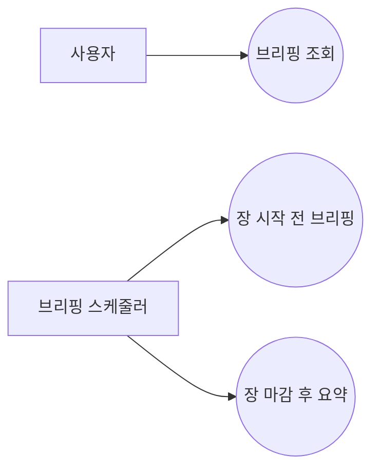
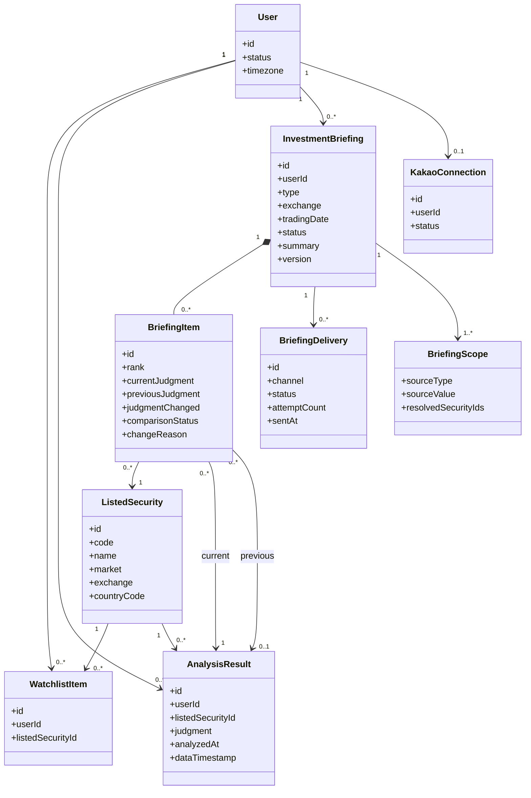
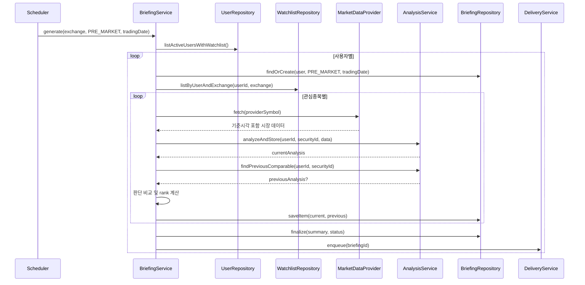
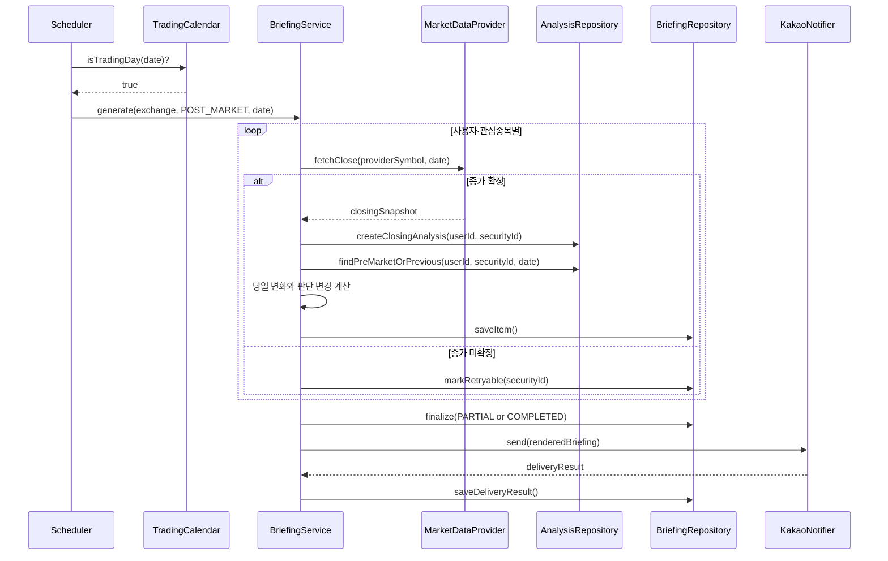

# 3. AI 투자 브리핑 기능 설계

## 1. 목적

사용자의 관심종목을 대상으로 다음 두 종류의 AI 브리핑을 제공한다.

- **장 시작 전 브리핑**: 해당 종목이 속한 거래소의 정규장 시작 전에 전망과 주의사항을 제공한다.
- **장 마감 후 하루 요약**: 해당 거래소의 종가 기준 당일 변화와 분석 결과를 요약한다.

두 브리핑 모두 직전 비교 가능한 분석과 **투자 판단이 달라진 종목을 가장 먼저 표시**한다.

## 2. 범위

### 포함

- 사용자별 관심종목 분석
- 장 시작 전 및 장 마감 후 예약 생성
- 이전 분석과 투자 판단 비교
- 판단 변경 종목 우선 정렬
- 브리핑 저장·조회
- 카카오 등 연동 채널 전달과 재시도
- 종목 멘션과 필터를 이용한 브리핑 대상 범위 지정
- 한국·미국 등 거래소별 거래일과 시간대에 따른 생성

### 제외

- 자동 매수·매도
- 수익 보장 또는 개인화된 재무 자문
- 포트폴리오 최적화
- 실시간 틱 단위 브리핑

## 3. 유즈케이스 다이어그램



## 4. 상세 유즈케이스

### UC-B01 장 시작 전 브리핑

1. 대상 거래소의 장 시작 전에 사용자의 관심종목을 분석한다.
2. 직전 분석과 판단이 달라진 종목을 먼저 정렬한다.
3. 브리핑을 저장하고 사용자에게 전달한다.

### UC-B02 장 마감 후 요약

1. 대상 거래소의 장 마감 후 종가 기준으로 관심종목을 분석한다.
2. 장전 또는 직전 분석과 비교해 당일 변화와 판단 변경을 요약한다.
3. 요약을 저장하고 사용자에게 전달한다.

### UC-B03 브리핑 조회 및 대상 지정

사용자는 본인의 브리핑만 조회한다. 필요하면 자연어 입력에서 `@종목` 또는 `#필터`로 분석 대상을 지정할 수 있다.

```text
@삼성전자와 @Apple의 오늘 판단 변화 비교
#반도체 종목 중 판단이 바뀐 종목만 요약
```

`@종목`은 하나의 종목 ID, `#필터`는 시장·국가·산업에 해당하는 종목 집합으로 해석한다. 생성 당시 사용한 종목 ID 목록을 저장하여 과거 브리핑의 대상이 나중에 바뀌지 않게 한다.

## 5. 도메인 모델



## 6. 핵심 도메인 규칙

### 투자 판단 정규화

AI의 자유문장을 직접 비교하지 않고 다음과 같은 제한된 값으로 정규화한다.

```text
STRONG_BUY → BUY → HOLD → SELL → STRONG_SELL
```

판단할 수 없는 응답은 `UNKNOWN`으로 저장한다.

### 판단 변경 기준

- 장 시작 전: 같은 사용자·종목의 직전 유효 분석과 비교한다.
- 장 마감 후: 같은 거래일의 장 시작 전 분석을 우선 비교한다.
- 장전 분석이 없으면 같은 사용자·종목의 직전 유효 분석을 사용한다.
- 이전 결과가 없거나 어느 한쪽이 `UNKNOWN`이면 `comparison_status=NOT_COMPARABLE`이다.
- 비교 불가 상태는 판단 변경으로 표시하지 않는다.
- 현재 및 이전 분석 ID를 모두 저장하여 변경 근거를 추적할 수 있게 한다.
- 서로 다른 거래소의 분석은 각 거래소의 현지 거래일을 기준으로 비교한다.

### 거래소별 실행 기준

- 종목은 `exchange`를 통해 거래 캘린더와 시간대에 연결한다.
- 한국 종목은 KRX 거래일과 `Asia/Seoul`, 미국 종목은 NASDAQ/NYSE 거래일과 해당 시장 시간대를 사용한다.
- 사용자가 한국과 미국 종목을 모두 보유하면 한 번의 전역 브리핑이 아니라 시장별 브리핑을 생성한다.
- 서머타임은 고정 UTC 시각으로 계산하지 않고 거래소 캘린더가 제공하는 개장·폐장 시각으로 계산한다.
- 휴장 또는 조기 폐장도 거래소 캘린더 기준으로 처리한다.

### 우선 표시 순서

1. `judgment_changed=true`
2. 판단 단계 변화의 절댓값
3. 분석 신뢰도 내림차순
4. 데이터 기준시각 내림차순
5. 종목명 가나다순

“판단 변경”은 표시 우선순위이며 자동 매매 신호나 알림조건 충족과 동일하지 않다.

### 멘션 및 필터 해석

브리핑 서비스가 자연어 문자열에서 다시 종목명을 추측하지 않는다. 입력 단계에서 종목 검색 서비스가 확정한 `listed_security_id`와 필터를 구조화된 요청으로 전달받는다.

```json
{
  "request_text": "@삼성전자와 #반도체 판단 변경 요약",
  "security_ids": [101],
  "filters": [
    {"type": "INDUSTRY", "value": "SEMICONDUCTOR"}
  ]
}
```

`@삼성전자`와 `#반도체`의 결과가 겹치면 같은 종목은 한 번만 분석한다.

## 7. 데이터 모델

### `investment_briefings`

| 컬럼 | 설명 |
| --- | --- |
| `id` | 브리핑 ID |
| `user_id` | 소유 사용자 |
| `type` | `PRE_MARKET`, `POST_MARKET` |
| `exchange` | 브리핑 대상 거래소 또는 시장 그룹 |
| `trading_date` | 해당 거래소의 현지 거래일 |
| `status` | `GENERATING`, `COMPLETED`, `PARTIAL`, `FAILED` |
| `summary` | 전체 브리핑 요약 |
| `generated_at` | 생성 완료 시각 |
| `version` | 재생성 버전 |

동일 실행 중복 방지를 위해 `UNIQUE(user_id, exchange, type, trading_date)`를 둔다.

### `briefing_items`

| 컬럼 | 설명 |
| --- | --- |
| `briefing_id` | 소속 브리핑 |
| `listed_security_id` | 대상 종목 |
| `current_analysis_id` | 현재 분석 |
| `previous_analysis_id` | 비교 분석 |
| `rank` | 표시 순서 |
| `judgment_changed` | 판단 변경 여부 |
| `comparison_status` | `COMPARABLE`, `NOT_COMPARABLE` |
| `change_reason` | 판단 변경 이유 |

`UNIQUE(briefing_id, listed_security_id)`로 한 브리핑 안의 종목 중복을 막는다.

### `briefing_deliveries`

채널별 발송 상태와 재시도 횟수를 관리한다. `UNIQUE(briefing_id, channel)`로 같은 브리핑의 중복 발송을 방지한다.

## 8. 장 시작 전 브리핑 시퀀스



## 9. 장 마감 후 하루 요약 시퀀스



## 10. 브리핑 표시 예

```text
[판단 변경] 삼성전자 (005930)
매수 → 관망
변경 이유: 거래량 둔화와 단기 지지선 이탈

SK하이닉스 (000660)
매수 유지
핵심 요약: ...
```

## 11. API

| 메서드 | 경로 | 설명 |
| --- | --- | --- |
| `GET` | `/users/me/briefings` | 내 브리핑 목록 |
| `GET` | `/users/me/briefings/{id}` | 내 브리핑 상세 |
| `POST` | `/internal/briefings/run` | 운영자용 유형·기준일 지정 실행 |

사용자용 API는 요청의 인증 컨텍스트에서 `user_id`를 가져오며 다른 사용자의 브리핑 접근 시 `404`로 처리한다.

## 12. 실패 및 경계 시나리오

| 상황 | 처리 |
| --- | --- |
| 관심종목 없음 | `SKIPPED_EMPTY_WATCHLIST`, 브리핑 미발송 |
| 휴장일 | `SKIPPED_NON_TRADING_DAY` |
| 미국 서머타임 전환 | 거래소 캘린더의 당일 개장·폐장 시각 사용 |
| 한 시장만 데이터 장애 | 해당 시장 브리핑만 실패 처리하고 다른 시장은 계속 생성 |
| 일부 종목 분석 실패 | 나머지 종목으로 `PARTIAL` 브리핑 생성 |
| 전체 시장 데이터 장애 | 빈 브리핑을 보내지 않고 `FAILED` 후 재시도 |
| 비정상 AI 판단값 | `UNKNOWN`, 비교 대상 제외 |
| 작업 중 관심종목 삭제 | 작업 시작 시점 스냅샷 기준으로 완료 |
| 멘션과 필터 결과가 중복 | `listed_security_id` 기준 중복 제거 |
| 필터 결과가 지나치게 많음 | 최대 종목 수를 제한하고 사용자에게 범위 축소 요청 |
| 비활성 종목 멘션 | 과거 결과 조회만 허용하고 신규 브리핑 분석에서는 제외 |
| 카카오 발송 실패 | 브리핑은 유지하고 전달 레코드만 재시도 |
| 스케줄러 중복 실행 | 고유키와 DB 잠금으로 단일 실행 보장 |

## 13. 현재 코드 변경 지점

현재 `AnalysisResult`와 저장소 API는 `symbol`만으로 결과를 조회한다. 사용자별 브리핑을 안전하게 구현하려면 다음과 같이 바꿔야 한다.

1. 분석결과에 `user_id`, `listed_security_id`를 추가한다.
2. `get_latest(symbol)`을 `get_latest(user_id, listed_security_id)`로 변경한다.
3. 기존 전체 관심종목 배치를 사용자별 관심종목 배치로 전환한다.
4. 종목별 분석 생성과 브리핑 집계를 별도 서비스로 분리한다.
5. 브리핑 생성 성공과 채널 전달 성공을 별도 상태로 관리한다.
6. 알림조건·브리핑 입력이 공통 종목 검색 서비스의 구조화된 엔티티 참조를 사용하게 한다.

## 14. 완료 기준

- 장 시작 전과 장 마감 후 브리핑이 별도 유형으로 생성된다.
- 서로 다른 사용자의 분석과 브리핑이 섞이지 않는다.
- 동일 사용자·거래소·유형·거래일의 브리핑이 중복 생성되지 않는다.
- 판단 변경 종목이 유지 종목보다 먼저 표시된다.
- 이전 분석이 없거나 판단이 불명확하면 변경으로 오판하지 않는다.
- 일부 종목 또는 카카오 발송 실패가 성공한 분석을 소실시키지 않는다.
- 휴장일에는 브리핑이 생성·발송되지 않는다.
- `@종목`과 `#필터`로 지정한 브리핑 범위가 문자열 추측 없이 종목 ID 목록으로 확정된다.
- 한국과 미국 종목이 각 거래소의 거래일·개장·폐장 시각에 맞춰 별도 브리핑으로 생성된다.
