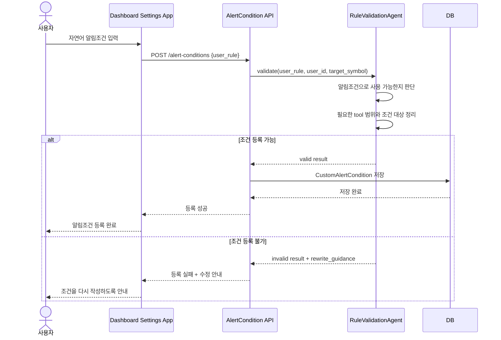
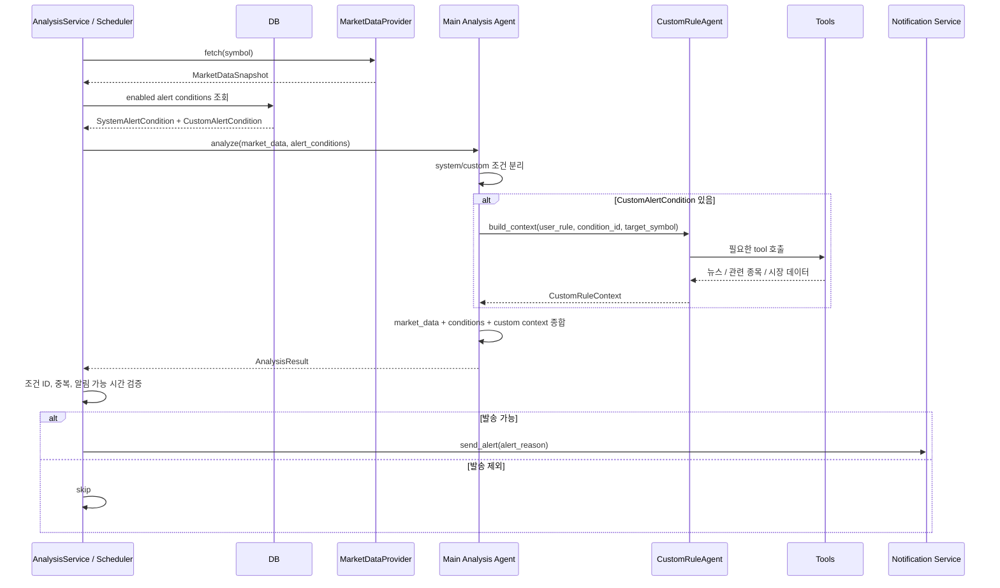
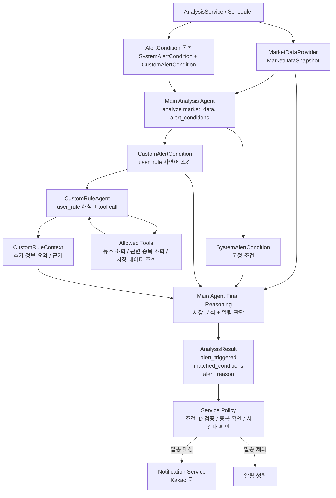
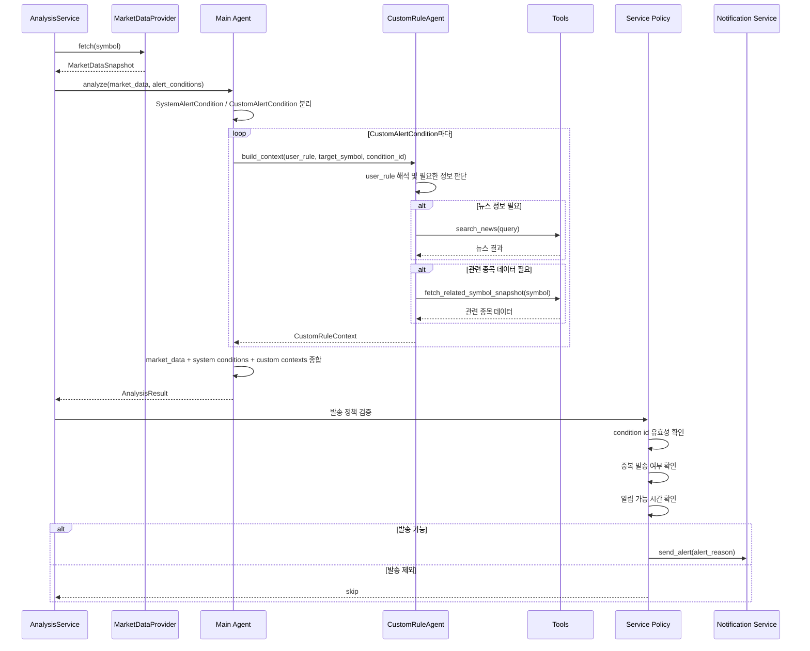
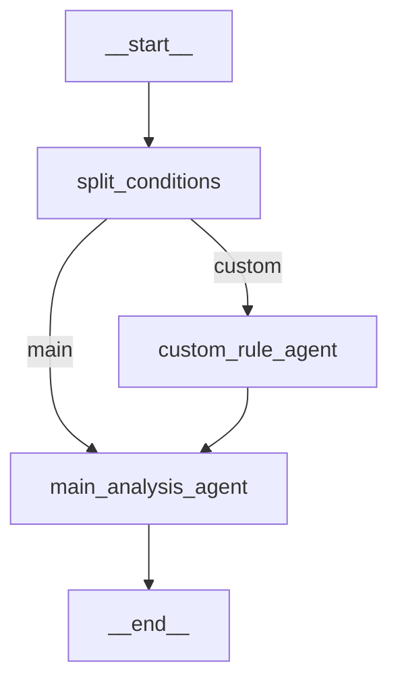

# 알림 에이전트 설계

## 목적

이 문서는 주식 분석 시스템에서 알림 발송 여부를 어떻게 판단할지 정의한다. 핵심 방향은 사용자가 자연어로 입력한 커스텀 알림조건을 지원하면서도, 시스템이 제공하는 고정 알림조건과 알림 발송 정책을 명확히 분리하는 것이다.

## 설계 방향

알림조건은 두 종류로 나눈다.

- `SystemAlertCondition`: 시스템이 미리 정의한 고정 조건
- `CustomAlertCondition`: 사용자가 자연어로 입력한 자유 조건

분석 서비스는 시장 데이터를 조회하고, 알림조건 목록을 메인 분석 에이전트에 전달한다. 메인 분석 에이전트는 시스템 조건을 직접 분석 컨텍스트로 사용하고, 커스텀 조건은 `CustomRuleAgent`에게 넘겨 필요한 외부 정보를 수집하게 한다.

최종 알림 발송 여부는 메인 분석 에이전트가 판단하되, 서비스 계층은 조건 ID 검증, 중복 발송 방지, 알림 가능 시간 확인 같은 운영 정책을 반드시 적용한다.

커스텀 알림조건은 등록 시점과 분석 시점의 책임을 분리한다.

- 등록 시점: 사용자가 대시보드 설정 앱에서 자연어 조건을 입력하면 `RuleValidationAgent`가 해당 문장이 알림조건으로 사용할 수 있는지 판단한다. 사용할 수 있으면 정규화된 `CustomAlertCondition`으로 DB에 저장하고, 사용할 수 없으면 사용자에게 다시 작성하라고 안내한다.
- 분석 시점: 분석 서비스는 DB에 저장된 유효한 사용자 알림조건만 읽는다. 사용자 조건이 있으면 메인 분석 에이전트가 `CustomRuleAgent`를 호출해 필요한 tool로 자료를 수집하고, 그 결과를 최종 분석에 사용한다.

이 분리로 `CustomRuleAgent`는 매 분석마다 조건 자체가 성립 가능한지 검증하지 않고, 이미 승인된 `user_rule`을 실행하기 위한 context 수집에 집중한다.

## 조건 등록 유즈케이스

사용자가 자연어로 알림조건을 등록할 때는 먼저 조건 검증 단계를 거친다.



`RuleValidationAgent`는 아래 내용을 판단한다.

- 조건이 알림으로 평가 가능한 문장인지
- 대상 종목 또는 비교 대상이 충분히 명확한지
- 시스템이 허용한 tool로 필요한 정보를 수집할 수 있는지
- 조건이 너무 모호하거나 지속적인 사람 판단을 요구하지 않는지
- 사용자가 다시 작성해야 한다면 어떤 식으로 고치면 되는지

예를 들어 아래 조건은 등록 가능하다.

```text
엔비디아가 하루 5% 이상 급등하거나 반도체 악재 뉴스가 나오면 삼성전자 알려줘
```

반대로 아래 조건은 너무 모호하므로 재작성을 요청한다.

```text
뭔가 분위기가 안 좋으면 알려줘
```

## 분석 실행 유즈케이스

분석 실행 시점에는 DB에 저장된 유효한 알림조건만 사용한다.



## 전체 구조



## 실행 시퀀스



## 알림조건 모델

```python
from typing import Literal, Union

from pydantic import BaseModel, Field


class AlertCondition(BaseModel):
    id: str
    kind: Literal["system", "custom"]
    name: str
    enabled: bool = True


class SystemAlertCondition(AlertCondition):
    kind: Literal["system"] = "system"
    code: str
    description: str


class CustomAlertCondition(AlertCondition):
    kind: Literal["custom"] = "custom"
    user_id: int
    target_symbol: str | None = None
    user_rule: str
    validation_summary: str | None = None
    required_tools: list[str] = Field(default_factory=list)


AlertConditionUnion = Union[SystemAlertCondition, CustomAlertCondition]


class RuleValidationResult(BaseModel):
    is_valid: bool
    normalized_name: str | None = None
    normalized_rule: str | None = None
    target_symbol: str | None = None
    required_tools: list[str] = Field(default_factory=list)
    validation_summary: str
    rewrite_guidance: str | None = None
```

`SystemAlertCondition`은 시스템이 제공하는 고정 조건이다. 예를 들면 가격 급등락, 거래량 급증, 변동성 확대, 이동평균 크로스 같은 조건이다.

`CustomAlertCondition`은 사용자가 자연어로 입력한 조건이다. 사용자는 필요한 데이터 요구사항을 직접 입력하지 않고 `user_rule`만 작성한다.

`RuleValidationResult`는 사용자가 입력한 자연어 조건을 DB에 저장해도 되는지 판단한 결과다. `is_valid=true`이면 `normalized_rule`, `target_symbol`, `required_tools`, `validation_summary`를 이용해 `CustomAlertCondition`을 저장한다. `is_valid=false`이면 `rewrite_guidance`를 사용자에게 보여준다.

예시:

```text
엔비디아가 급등하거나 반도체 악재 뉴스가 나오면 삼성전자 알려줘
```

## RuleValidationAgent

`RuleValidationAgent`는 사용자 자연어 조건을 등록하기 전에 실행되는 검증 에이전트다. 이 에이전트는 실제 분석을 수행하지 않고, 입력 문장이 시스템에서 실행 가능한 알림조건인지 판단한다.

역할:

- 사용자의 `user_rule`이 알림조건으로 평가 가능한지 판단
- 조건 대상 종목과 비교 대상이 충분히 명확한지 확인
- 필요한 tool 범위가 시스템의 allowlist 안에 있는지 확인
- 너무 모호하거나 실행 불가능한 조건이면 재작성 안내 생성
- 등록 가능한 조건이면 정규화된 이름, 조건 문장, 대상 종목, 필요한 tool 목록을 반환

예상 출력:

```json
{
  "is_valid": true,
  "normalized_name": "엔비디아 급등 및 반도체 악재 감지",
  "normalized_rule": "NVDA가 하루 5% 이상 상승하거나 반도체 업종 관련 부정적 뉴스가 확인되면 005930.KS에 대해 알림",
  "target_symbol": "005930.KS",
  "required_tools": ["fetch_related_symbol_snapshot", "search_news"],
  "validation_summary": "관련 종목 가격 데이터와 뉴스 검색으로 평가 가능한 조건입니다.",
  "rewrite_guidance": null
}
```

등록 불가 예시:

```json
{
  "is_valid": false,
  "normalized_name": null,
  "normalized_rule": null,
  "target_symbol": null,
  "required_tools": [],
  "validation_summary": "조건이 너무 모호해서 어떤 데이터로 판단해야 하는지 정할 수 없습니다.",
  "rewrite_guidance": "알림을 받을 종목, 비교 대상, 판단 기준을 함께 적어주세요. 예: 엔비디아가 하루 5% 이상 오르면 삼성전자 알려줘."
}
```

## CustomRuleAgent

`CustomRuleAgent`는 커스텀 자연어 조건을 처리하는 단일 서브 에이전트다. 조건별로 에이전트를 여러 개 만들지 않는다.

`CustomRuleAgent`는 DB에 저장된, 즉 `RuleValidationAgent` 검증을 통과한 조건만 입력받는다. 따라서 이 에이전트의 주 책임은 조건 등록 가능성 판단이 아니라, 분석 시점에 필요한 자료를 tool로 수집하고 `CustomRuleContext`로 요약하는 것이다.

역할:

- 검증된 `CustomAlertCondition.user_rule` 해석
- 필요한 외부 정보 판단
- 허용된 tool 호출
- 수집한 정보를 `CustomRuleContext`로 요약

예상 출력:

```python
from typing import Any

from pydantic import BaseModel, Field


class CustomRuleContext(BaseModel):
    condition_id: str
    user_rule: str
    gathered_facts: list[str] = Field(default_factory=list)
    evidence: dict[str, Any] = Field(default_factory=dict)
    summary: str
    confidence: float | None = None
```

예시:

```json
{
  "condition_id": "custom.user_1.semiconductor_watch",
  "user_rule": "엔비디아가 급등하거나 반도체 악재 뉴스가 나오면 삼성전자 알려줘",
  "gathered_facts": [
    "NVDA는 전일 대비 6.2% 상승했습니다.",
    "최근 24시간 반도체 수출 규제 관련 부정적 뉴스가 확인됐습니다."
  ],
  "evidence": {
    "related_symbols": {
      "NVDA": {
        "change_percent": 6.2
      }
    },
    "news_count": 2
  },
  "summary": "사용자 조건에 부합할 가능성이 높습니다.",
  "confidence": 0.82
}
```

## Tool 정의 위치

`CustomRuleAgent`가 사용할 tool은 agent 내부에 직접 정의하지 않고 별도 모듈에 둔다.

```text
app/
  tools/
    __init__.py
    news.py
    market.py
    registry.py
```

예시:

```python
# app/tools/news.py
from langchain_core.tools import tool


@tool
def search_news(query: str, lookback_days: int = 1) -> list[dict]:
    """Search recent news for a query."""
    return []
```

```python
# app/tools/market.py
from langchain_core.tools import tool

from app.market_data import YFinanceMarketDataProvider


@tool
def fetch_related_symbol_snapshot(symbol: str) -> dict:
    """Fetch recent market indicators for a related symbol."""
    provider = YFinanceMarketDataProvider()
    snapshot = provider.fetch(symbol)
    return snapshot.model_dump(mode="json")
```

```python
# app/tools/registry.py
from app.tools.market import fetch_related_symbol_snapshot
from app.tools.news import search_news


def get_custom_rule_tools():
    return [
        search_news,
        fetch_related_symbol_snapshot,
    ]
```

Tool은 반드시 allowlist 방식으로 주입한다. 사용자의 자연어 조건이 자유롭더라도 agent가 사용할 수 있는 외부 행동 범위는 시스템이 통제해야 한다.

## LangGraph 구성

LangGraph의 자동 다이어그램은 `add_node()`로 등록된 노드만 보여준다. 따라서 에이전트가 다이어그램에 드러나게 하려면 에이전트 호출을 감싼 노드 이름을 명시적으로 등록한다.

- `split_conditions`: 일반 Python 노드. 알림조건을 system/custom으로 분리한다.
- `custom_rule_agent`: `CustomRuleAgent`를 실행하는 노드. 커스텀 조건이 있을 때만 실행한다.
- `main_analysis_agent`: 메인 분석 에이전트를 실행하는 노드. 시장 데이터, 시스템 조건, 커스텀 조건, 커스텀 context를 종합한다.

`compiled_graph.get_graph().draw_mermaid()`를 호출하면 대략 아래와 같은 구조가 나온다.



대략적인 코드:

```python
# app/agent_graph.py
from langgraph.graph import END, StateGraph

from app.alert_conditions import AlertConditionUnion
from app.schemas import AnalysisResult, MarketDataSnapshot, model_to_dict, parse_model_json


class MainAnalysisAgent:
    def __init__(self, *, gemini_client, custom_rule_agent):
        self.gemini_client = gemini_client
        self.custom_rule_agent = custom_rule_agent
        self.graph = self._build_graph()

    def analyze(
        self,
        market_data: MarketDataSnapshot,
        alert_conditions: list[AlertConditionUnion],
    ) -> AnalysisResult:
        result = self.graph.invoke(
            {
                "market_data": market_data,
                "alert_conditions": alert_conditions,
            }
        )
        return result["analysis_result"]

    def _build_graph(self):
        graph = StateGraph(AnalysisGraphState)

        graph.add_node("split_conditions", self._split_conditions)
        graph.add_node("custom_rule_agent", self._run_custom_rule_agent)
        graph.add_node("main_analysis_agent", self._run_main_analysis_agent)

        graph.set_entry_point("split_conditions")
        graph.add_conditional_edges(
            "split_conditions",
            self._should_run_custom_rule_agent,
            {
                "custom": "custom_rule_agent",
                "main": "main_analysis_agent",
            },
        )
        graph.add_edge("custom_rule_agent", "main_analysis_agent")
        graph.add_edge("main_analysis_agent", END)

        return graph.compile()

    def _split_conditions(self, state: AnalysisGraphState) -> dict:
        system_conditions = []
        custom_conditions = []

        for condition in state["alert_conditions"]:
            if condition.kind == "system":
                system_conditions.append(condition)
            elif condition.kind == "custom":
                custom_conditions.append(condition)

        return {
            "system_conditions": system_conditions,
            "custom_conditions": custom_conditions,
        }

    def _should_run_custom_rule_agent(self, state: AnalysisGraphState) -> str:
        if state.get("custom_conditions"):
            return "custom"
        return "main"

    def _run_custom_rule_agent(self, state: AnalysisGraphState) -> dict:
        market_data = state["market_data"]
        contexts = []

        for condition in state.get("custom_conditions", []):
            context = self.custom_rule_agent.build_context(
                target_symbol=market_data.symbol,
                condition_id=condition.id,
                user_rule=condition.user_rule,
            )
            contexts.append(context.model_dump(mode="json"))

        return {"custom_contexts": contexts}

    def _run_main_analysis_agent(self, state: AnalysisGraphState) -> dict:
        payload = {
            "market_data": model_to_dict(state["market_data"]),
            "system_alert_conditions": [
                condition.model_dump(mode="json")
                for condition in state.get("system_conditions", [])
            ],
            "custom_alert_conditions": [
                condition.model_dump(mode="json")
                for condition in state.get("custom_conditions", [])
            ],
            "custom_contexts": state.get("custom_contexts", []),
        }

        prompt = f"""
너는 주식 분석 메인 에이전트다.

입력된 market_data를 분석하고,
system_alert_conditions와 custom_alert_conditions 중 충족된 조건이 있는지 판단해라.

custom_alert_conditions는 custom_contexts를 참고해서 판단한다.
matched_alert_conditions에는 반드시 입력받은 condition id만 사용한다.
존재하지 않는 condition id를 만들지 마라.

반드시 AnalysisResult JSON 스키마로만 응답해라.

payload:
{payload}
"""

        raw_json = self.gemini_client.generate_json(prompt)
        analysis_result = parse_model_json(AnalysisResult, raw_json)

        return {"analysis_result": analysis_result}
```

## Main Agent 입력

메인 에이전트는 최종적으로 아래 데이터를 모두 받는다.

```json
{
  "market_data": "...",
  "system_alert_conditions": ["..."],
  "custom_alert_conditions": ["..."],
  "custom_contexts": ["..."],
  "analysis_time_hint": "..."
}
```

메인 에이전트의 규칙:

- `matched_alert_conditions`에는 입력받은 condition id만 사용한다.
- 존재하지 않는 condition id를 만들어내지 않는다.
- 시스템 조건은 고정 설명과 시장 데이터를 근거로 판단한다.
- 커스텀 조건은 `CustomRuleContext`를 근거로 판단한다.
- 알림이 필요하면 사용자가 이해할 수 있는 `alert_reason`을 작성한다.

## 서비스 계층 책임

메인 에이전트가 `alert_triggered`를 반환하더라도, 서비스 계층은 바로 발송하지 않는다.

서비스 계층에서 확인할 것:

- `matched_alert_conditions`가 실제 입력한 조건 ID인지
- `alert_triggered=true`인데 매칭 조건이 비어 있지 않은지
- `alert_reason`이 존재하는지
- 같은 사용자, 같은 종목, 같은 조건으로 이미 발송한 적이 없는지
- 알림 가능 시간대인지

이 정책은 agent가 아니라 애플리케이션 코드가 담당한다.

## 현재 구현에서의 변경 방향

현재 `GeminiAnalysisAgent.analyze()`는 문자열 기반 조건을 받는다.

```python
def analyze(
    self,
    market_data: MarketDataSnapshot,
    alert_conditions: Iterable[str] | None = None,
) -> AnalysisResult:
```

개선 후에는 구조화된 조건 모델을 받도록 바꾼다.

```python
def analyze(
    self,
    market_data: MarketDataSnapshot,
    alert_conditions: Iterable[AlertConditionUnion] | None = None,
) -> AnalysisResult:
```

기본 시스템 조건은 문자열 목록이 아니라 `SystemAlertCondition` 목록으로 관리한다.

커스텀 조건은 초기에는 DB 없이 샘플 데이터로 시작할 수 있고, 이후 사용자별 조건 저장소를 추가한다.

## 단계별 구현 계획

1. `AlertCondition`, `SystemAlertCondition`, `CustomAlertCondition` 모델 추가
2. `RuleValidationResult` 모델 추가
3. 기본 시스템 알림조건을 구조화된 목록으로 변경
4. `RuleValidationAgent` 인터페이스 추가
5. 자연어 사용자 조건 등록 API 추가
6. 등록 성공 시 `CustomAlertCondition` 저장소에 저장
7. 등록 실패 시 `rewrite_guidance`를 사용자에게 반환
8. `CustomRuleAgent` 인터페이스 추가
9. `app/tools` 모듈과 tool registry 추가
10. LangGraph 기반 `MainAnalysisAgent` 추가
11. `AnalysisService`가 DB에서 enabled alert conditions를 읽어 새 agent에 전달하도록 변경
12. agent 결과의 condition id 검증 로직 추가
13. 뉴스/관련 종목 tool을 실제 provider와 연결

## 핵심 원칙

- 사용자는 `user_rule`만 입력한다.
- `RuleValidationAgent`가 등록 시점에 자연어 조건이 알림조건으로 실행 가능한지 검증한다.
- 유효한 조건만 DB에 저장한다.
- 분석 실행 시점에는 DB에 저장된 enabled 알림조건만 읽는다.
- `CustomRuleAgent`는 검증된 조건에 필요한 정보를 tool로 수집한다.
- 메인 에이전트가 시장 데이터, 시스템 조건, 커스텀 조건, 커스텀 context를 종합해 알림 판단을 한다.
- 서비스 계층은 발송 정책과 검증을 담당한다.
- 알림 서비스는 판단하지 않고 메시지를 전달하는 역할만 가진다.
