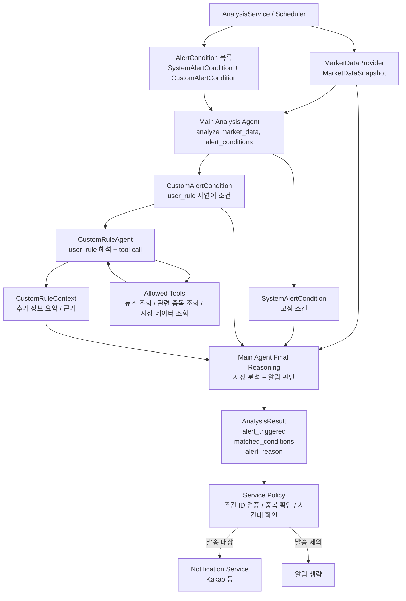
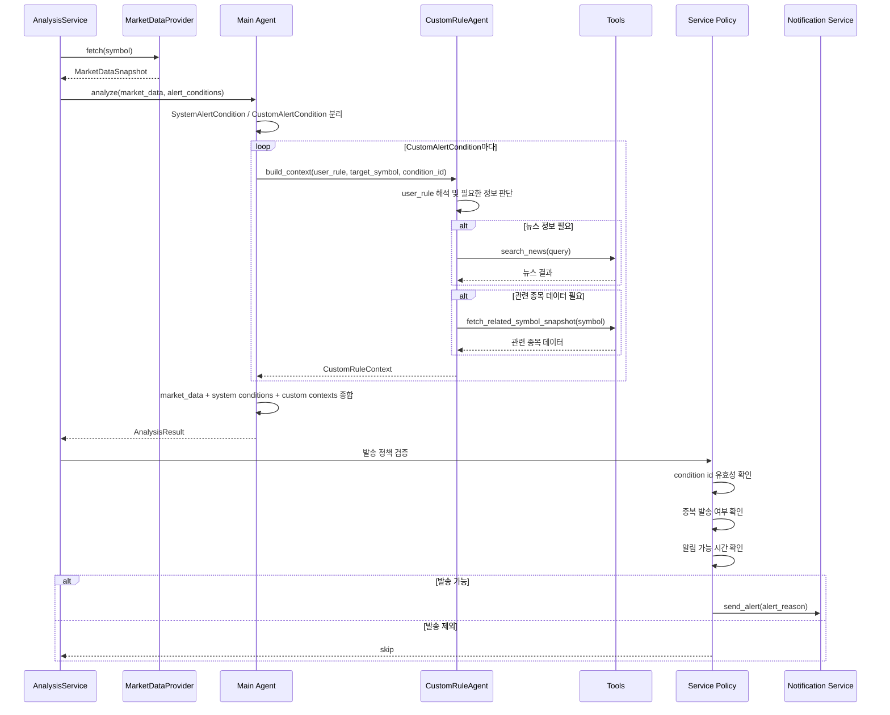
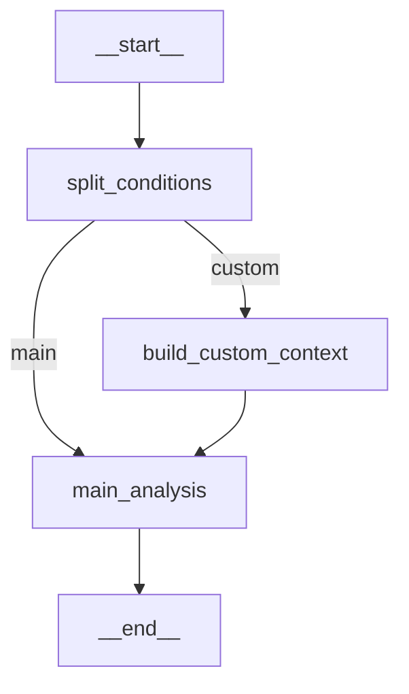

# 알림 에이전트 설계

## 목적

이 문서는 주식 분석 시스템에서 알림 발송 여부를 어떻게 판단할지 정의한다. 핵심 방향은 사용자가 자연어로 입력한 커스텀 알림조건을 지원하면서도, 시스템이 제공하는 고정 알림조건과 알림 발송 정책을 명확히 분리하는 것이다.

## 설계 방향

알림조건은 두 종류로 나눈다.

- `SystemAlertCondition`: 시스템이 미리 정의한 고정 조건
- `CustomAlertCondition`: 사용자가 자연어로 입력한 자유 조건

분석 서비스는 시장 데이터를 조회하고, 알림조건 목록을 메인 분석 에이전트에 전달한다. 메인 분석 에이전트는 시스템 조건을 직접 분석 컨텍스트로 사용하고, 커스텀 조건은 `CustomRuleAgent`에게 넘겨 필요한 외부 정보를 수집하게 한다.

최종 알림 발송 여부는 메인 분석 에이전트가 판단하되, 서비스 계층은 조건 ID 검증, 중복 발송 방지, 알림 가능 시간 확인 같은 운영 정책을 반드시 적용한다.

## 전체 구조



## 실행 시퀀스



## 알림조건 모델

```python
from typing import Literal, Union

from pydantic import BaseModel


class AlertCondition(BaseModel):
    id: str
    kind: Literal["system", "custom"]
    name: str
    enabled: bool = True


class SystemAlertCondition(AlertCondition):
    kind: Literal["system"] = "system"
    code: str
    description: str


class CustomAlertCondition(AlertCondition):
    kind: Literal["custom"] = "custom"
    user_id: int
    target_symbol: str | None = None
    user_rule: str


AlertConditionUnion = Union[SystemAlertCondition, CustomAlertCondition]
```

`SystemAlertCondition`은 시스템이 제공하는 고정 조건이다. 예를 들면 가격 급등락, 거래량 급증, 변동성 확대, 이동평균 크로스 같은 조건이다.

`CustomAlertCondition`은 사용자가 자연어로 입력한 조건이다. 사용자는 필요한 데이터 요구사항을 직접 입력하지 않고 `user_rule`만 작성한다.

예시:

```text
엔비디아가 급등하거나 반도체 악재 뉴스가 나오면 삼성전자 알려줘
```

## CustomRuleAgent

`CustomRuleAgent`는 커스텀 자연어 조건을 처리하는 단일 서브 에이전트다. 조건별로 에이전트를 여러 개 만들지 않는다.

역할:

- `CustomAlertCondition.user_rule` 해석
- 필요한 외부 정보 판단
- 허용된 tool 호출
- 수집한 정보를 `CustomRuleContext`로 요약

예상 출력:

```python
from typing import Any

from pydantic import BaseModel, Field


class CustomRuleContext(BaseModel):
    condition_id: str
    user_rule: str
    gathered_facts: list[str] = Field(default_factory=list)
    evidence: dict[str, Any] = Field(default_factory=dict)
    summary: str
    confidence: float | None = None
```

예시:

```json
{
  "condition_id": "custom.user_1.semiconductor_watch",
  "user_rule": "엔비디아가 급등하거나 반도체 악재 뉴스가 나오면 삼성전자 알려줘",
  "gathered_facts": [
    "NVDA는 전일 대비 6.2% 상승했습니다.",
    "최근 24시간 반도체 수출 규제 관련 부정적 뉴스가 확인됐습니다."
  ],
  "evidence": {
    "related_symbols": {
      "NVDA": {
        "change_percent": 6.2
      }
    },
    "news_count": 2
  },
  "summary": "사용자 조건에 부합할 가능성이 높습니다.",
  "confidence": 0.82
}
```

## Tool 정의 위치

`CustomRuleAgent`가 사용할 tool은 agent 내부에 직접 정의하지 않고 별도 모듈에 둔다.

```text
app/
  tools/
    __init__.py
    news.py
    market.py
    registry.py
```

예시:

```python
# app/tools/news.py
from langchain_core.tools import tool


@tool
def search_news(query: str, lookback_days: int = 1) -> list[dict]:
    """Search recent news for a query."""
    return []
```

```python
# app/tools/market.py
from langchain_core.tools import tool

from app.market_data import YFinanceMarketDataProvider


@tool
def fetch_related_symbol_snapshot(symbol: str) -> dict:
    """Fetch recent market indicators for a related symbol."""
    provider = YFinanceMarketDataProvider()
    snapshot = provider.fetch(symbol)
    return snapshot.model_dump(mode="json")
```

```python
# app/tools/registry.py
from app.tools.market import fetch_related_symbol_snapshot
from app.tools.news import search_news


def get_custom_rule_tools():
    return [
        search_news,
        fetch_related_symbol_snapshot,
    ]
```

Tool은 반드시 allowlist 방식으로 주입한다. 사용자의 자연어 조건이 자유롭더라도 agent가 사용할 수 있는 외부 행동 범위는 시스템이 통제해야 한다.

## LangGraph 구성

LangGraph에서 `split_conditions`, `build_custom_context`, `main_analysis`는 각각 독립 에이전트가 아니라 그래프의 노드다.

- `split_conditions`: 일반 Python 노드. 알림조건을 system/custom으로 분리한다.
- `build_custom_context`: 노드 내부에서 `CustomRuleAgent`를 호출한다.
- `main_analysis`: 노드 내부에서 메인 LLM 분석을 수행한다.



대략적인 코드:

```python
from langgraph.graph import END, StateGraph


graph = StateGraph(AnalysisGraphState)

graph.add_node("split_conditions", split_conditions)
graph.add_node("build_custom_context", build_custom_context)
graph.add_node("main_analysis", main_analysis)

graph.set_entry_point("split_conditions")
graph.add_conditional_edges(
    "split_conditions",
    should_build_custom_context,
    {
        "custom": "build_custom_context",
        "main": "main_analysis",
    },
)
graph.add_edge("build_custom_context", "main_analysis")
graph.add_edge("main_analysis", END)

compiled_graph = graph.compile()
```

## Main Agent 입력

메인 에이전트는 최종적으로 아래 데이터를 모두 받는다.

```json
{
  "market_data": "...",
  "system_alert_conditions": ["..."],
  "custom_alert_conditions": ["..."],
  "custom_contexts": ["..."],
  "analysis_time_hint": "..."
}
```

메인 에이전트의 규칙:

- `matched_alert_conditions`에는 입력받은 condition id만 사용한다.
- 존재하지 않는 condition id를 만들어내지 않는다.
- 시스템 조건은 고정 설명과 시장 데이터를 근거로 판단한다.
- 커스텀 조건은 `CustomRuleContext`를 근거로 판단한다.
- 알림이 필요하면 사용자가 이해할 수 있는 `alert_reason`을 작성한다.

## 서비스 계층 책임

메인 에이전트가 `alert_triggered`를 반환하더라도, 서비스 계층은 바로 발송하지 않는다.

서비스 계층에서 확인할 것:

- `matched_alert_conditions`가 실제 입력한 조건 ID인지
- `alert_triggered=true`인데 매칭 조건이 비어 있지 않은지
- `alert_reason`이 존재하는지
- 같은 사용자, 같은 종목, 같은 조건으로 이미 발송한 적이 없는지
- 알림 가능 시간대인지

이 정책은 agent가 아니라 애플리케이션 코드가 담당한다.

## 현재 구현에서의 변경 방향

현재 `GeminiAnalysisAgent.analyze()`는 문자열 기반 조건을 받는다.

```python
def analyze(
    self,
    market_data: MarketDataSnapshot,
    alert_conditions: Iterable[str] | None = None,
) -> AnalysisResult:
```

개선 후에는 구조화된 조건 모델을 받도록 바꾼다.

```python
def analyze(
    self,
    market_data: MarketDataSnapshot,
    alert_conditions: Iterable[AlertConditionUnion] | None = None,
) -> AnalysisResult:
```

기본 시스템 조건은 문자열 목록이 아니라 `SystemAlertCondition` 목록으로 관리한다.

커스텀 조건은 초기에는 DB 없이 샘플 데이터로 시작할 수 있고, 이후 사용자별 조건 저장소를 추가한다.

## 단계별 구현 계획

1. `AlertCondition`, `SystemAlertCondition`, `CustomAlertCondition` 모델 추가
2. 기본 시스템 알림조건을 구조화된 목록으로 변경
3. `GeminiAnalysisAgent.analyze()`가 구조화된 조건을 payload에 포함하도록 변경
4. `CustomRuleAgent` 인터페이스 추가
5. `app/tools` 모듈과 tool registry 추가
6. LangGraph 기반 `MainAnalysisAgent` 추가
7. 기존 `AnalysisService`에서 새 agent를 호출하도록 연결
8. agent 결과의 condition id 검증 로직 추가
9. 사용자 커스텀 조건 저장소 추가
10. 뉴스/관련 종목 tool을 실제 provider와 연결

## 핵심 원칙

- 사용자는 `user_rule`만 입력한다.
- `CustomRuleAgent`가 필요한 정보를 tool로 수집한다.
- 메인 에이전트가 시장 데이터, 시스템 조건, 커스텀 조건, 커스텀 context를 종합해 알림 판단을 한다.
- 서비스 계층은 발송 정책과 검증을 담당한다.
- 알림 서비스는 판단하지 않고 메시지를 전달하는 역할만 가진다.
