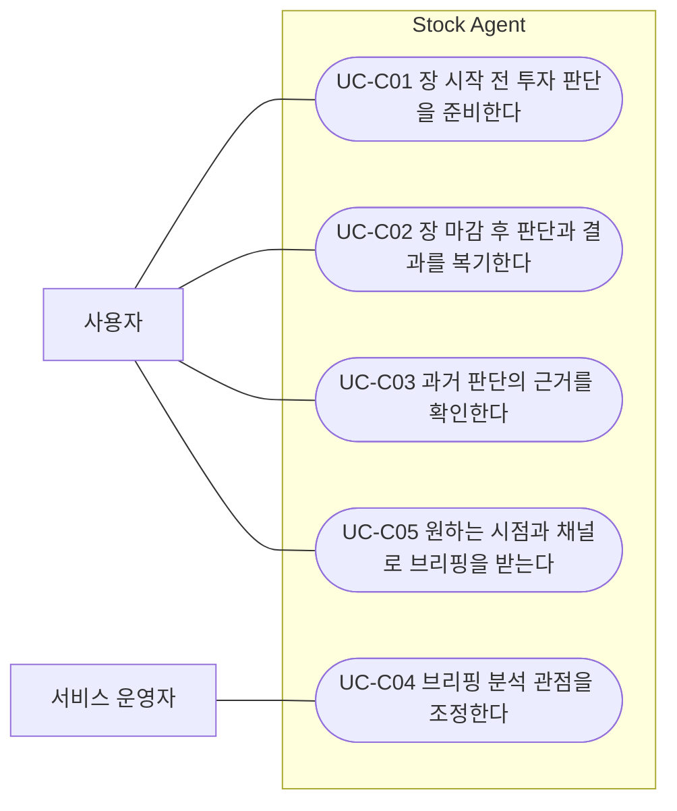
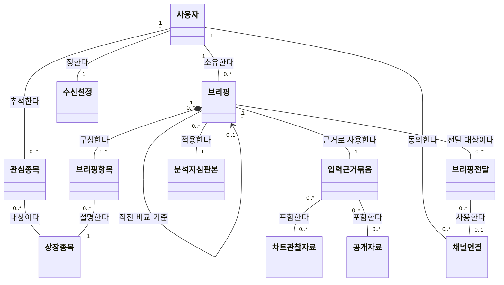
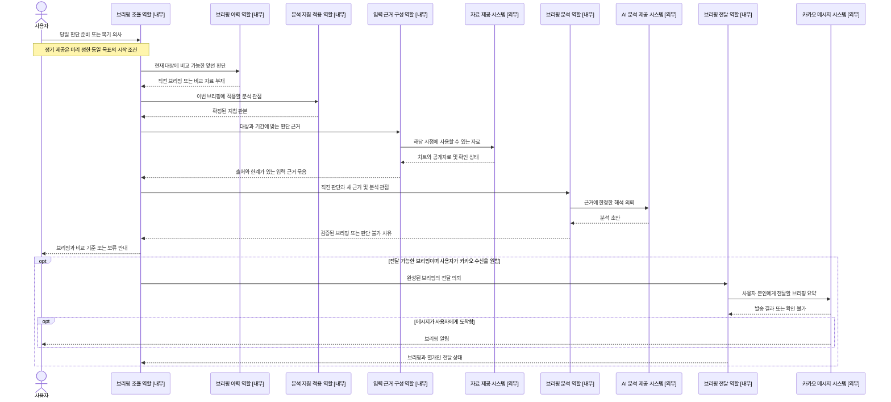
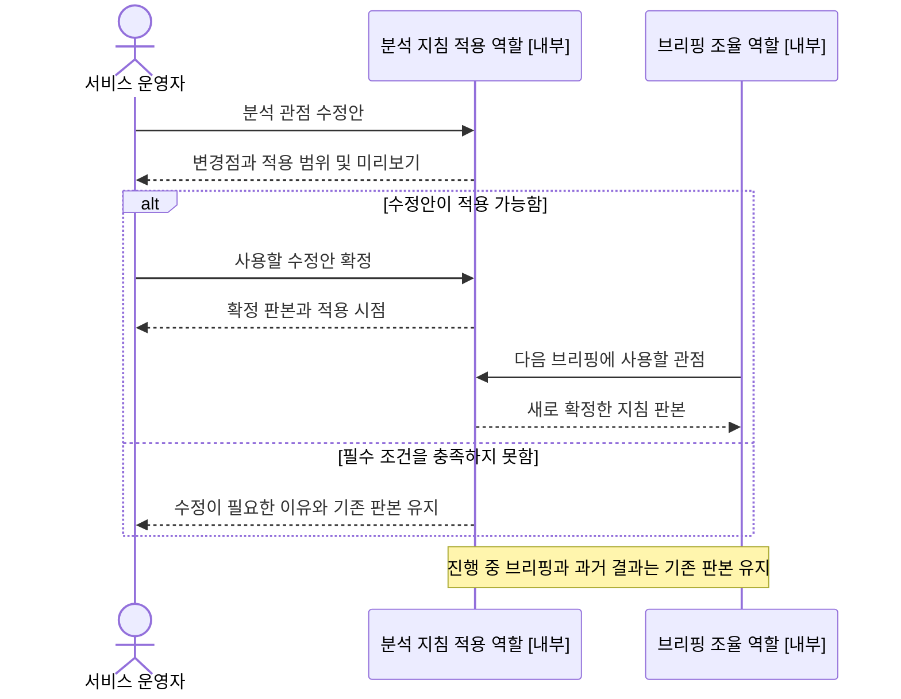
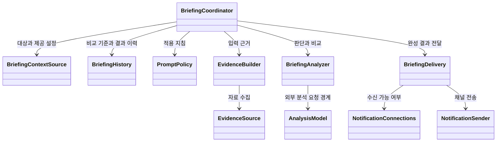

# 차트·공개자료·직전 브리핑을 연결하는 투자 브리핑 설계

작성일: 2026-09-14 · 상태: **v1.0 OOD 확정 — 구현 기준** · 기준: [AGENTS.md](../AGENTS.md)

함께 읽기: [구현·실행 안내](../docs/continuous_briefing_implementation.md), [편집 가능한 분석 지침](../prompt.md).

사용자는 직전 브리핑에서 무엇을 판단했는지 이어서 확인하고, n일 차트와 새 공개자료를 근거로 지금의 판단과 변화 이유를 이해한다. 분석 관점은 `prompt.md`로 수정할 수 있고, 완성된 브리핑은 사용자가 연동한 카카오 채널로 전달한다.

이 설계에서 **서비스 운영자**는 ‘브리핑이 무엇을 중점적으로 분석할지 정하는 사람’이다. 예를 들어 개발·운영을 맡은 사람이 ‘거래량 변화와 새 공시를 더 자세히 설명하자’고 분석 기준을 바꾼다. **사용자**는 자신의 관심종목 브리핑을 받아보는 사람이다. 혼자 개발하고 사용하는 단계에서는 한 사람이 두 역할을 맡을 수 있다.

| 구분 | 쉽게 말하면 | 이번 설계에서 하는 일 |
| --- | --- | --- |
| 사용자 — 사람 | 브리핑을 받아보는 사람 | 관심종목과 수신 방식을 정하고 결과를 확인 |
| 서비스 운영자 — 사람 | 서비스의 공통 분석 기준을 정하는 사람 | 분석 관점과 설명 방식을 수정하고 적용할 내용을 결정 |
| 분석 지침 적용 역할 — 시스템 내부 | 정해진 기준을 이번 분석에 제공하는 기능 | 유효한 지침을 적용하고 어떤 버전을 사용했는지 보존 |

공통 지침은 서비스 운영자가 편집한다. 초기 편집 권한은 프로젝트의 지침 파일을 변경하고 적용할 수 있는 개발·운영 권한으로 제한한다. 별도 관리자 계정·관리 화면과 사용자별 지침 편집은 이번 구현 범위에 포함하지 않는다.

이 문서는 **OOA → 도메인 → 관계 중심 시퀀스 → 클래스 책임과 계약** 순서다. 2026-09-14 사용자가 초안의 동작 가정을 모두 수용하고 OOD 확정을 요청했으므로, 아래 설계를 구현 기준으로 확정한다. 최초 시퀀스에는 오퍼레이션, 매개변수, 저장 순서, HTTP 요청과 상세 알고리즘을 넣지 않는다. 클래스의 입력·결과·상태 책임은 6절에서 정의한다.

설계·구현의 반복은 **확정 설계로 구현 → 구현 중 놓친 문제 발견 → 관련 설계와 코드를 보완 → 검증**을 뜻한다. 구현 전에 여러 차례 설계 승인을 받는 절차를 두지 않는다. 2026-09-21 구현 구체화·검증 및 실행 방법은 [구현 기록](../docs/continuous_briefing_implementation.md)에 정리했다. 아래 관계 중심 시퀀스는 상세 구현과 분리해 유지한다.

## 1. 범위와 기존 문서의 관계

| 구분 | 이번 범위 |
| --- | --- |
| 사용자 목표 | 장전 판단 준비, 장후 복기, 과거 판단 확인, 분석 관점 조정, 원하는 방식으로 브리핑 받기 |
| 입력 | 생성 당시 관심종목, 차트 관찰기간, 공개자료, 직전 브리핑, 적용할 분석 지침 |
| 결과 | 결론, 근거와 출처, 직전 대비 변화, 자료 한계, 다음 관찰사항 |
| 연동 | 기존 관심종목·인증·사용자별 카카오 연결과 협력 |
| OOD 확정 범위 | 클래스 책임·협력, 입력·결과 계약, 상태와 보존 책임, 지침 적용, 중복·실패 처리 |
| 구현 중 구체화 | 실제 메서드 시그니처, 공급자 어댑터, DB 매핑·마이그레이션, 처리 용량과 타임아웃 |

기존 [투자 브리핑 설계 PR #24](https://github.com/PhilPark-geosr/stock-agent/pull/24)의 사용자 목표와 장전·장후 독립 제공 설정을 이어받는다. 이 문서의 `UC-C*`, `FR-C*`는 기존 번호와 충돌하지 않는 확장 명세다.

연속 브리핑 구현에서는 아래 변경표와 이 문서의 v1.0을 기준으로 삼는다. 이전 설계 문서와 데모는 기존 동작을 확인하는 자료로 유지한다.

| 기존 결정 또는 구현 | 이번 확정 설계에서의 처리 |
| --- | --- |
| 장후는 당일 장전 브리핑과 비교 | 유지. 오늘 장전 기록을 우선 사용하고, 오늘 기록이 없으면 그 부재를 반드시 표시 |
| 장전은 직전 거래일 장후 분석 우선 | 비교 가능한 직전 **브리핑**을 사용하도록 확정. 종목 분석과 브리핑을 같은 자료로 취급하지 않음 |
| 장전의 전날 분석이 없으면 공개자료만 사용 | **차트가 있으면 활용하도록 변경 확정**. 구현 시 데모와 실제 브리핑에 같은 정책을 적용 |
| 장후 비교 시 과거 장전을 오늘 것으로 사용하지 않음 | 유지. 이전 거래일 기록을 사용하면 날짜와 ‘오늘 장전 대비 비교 불가’를 함께 표시 |
| `prompt.md` | 루트의 편집 가능한 지침을 운영 CLI로 미리보기·적용·롤백하며 실행마다 적용 판본을 보존 |

## 2. OOA: 시스템 경계

Stock Agent의 경계에는 브리핑 준비·분석·이력 관리·제공 설정·전달 조율이 포함된다.

외부 액터는 **사용자**, **서비스 운영자**, **거래자료 제공 시스템**, **공개자료 제공 시스템**, **외부 AI 분석 제공 시스템**, **카카오 메시지 시스템**이다. 서비스 운영자는 공통 분석 기준을 정하는 사람을 뜻한다. 사용자와 운영자는 참여 목적이 다른 역할이며 동일인일 수 있다. 이번 범위의 분석 지침은 서비스 공통 지침이다.

실제 외부 AI 서비스는 시스템 밖에 있지만 이를 연결하는 에이전트·어댑터는 내부다. 내부 스케줄러, DB, 저장소, 분석 조율자와 메시지 전송 어댑터는 액터가 아니다. 정기 실행은 사용자가 미리 요청한 목표가 시작되는 조건이다.

### 유스케이스 다이어그램

이 그림은 사용자 목표와 사람 액터의 관계만 보여주는 유스케이스 도식이다. 외부 제공자의 지원 관계는 시스템 경계 설명과 후속 시퀀스에서 다룬다. 공통 사용자 목표 재사용이 없으므로 `include`를 사용하지 않는다.

### UC-C01 장 시작 전 투자 판단을 준비한다

- **목적:** 관심종목의 이전 판단과 새 근거를 비교해 당일 관찰할 사항을 이해한다.
- **주 액터:** 사용자.
- **트리거:** 사용자가 장전 판단 준비를 요청하거나 미리 정한 장전 제공 시점에 도달한다.
- **사전조건:** 사용자의 분석 대상 관심종목이 정해져 있다.
- **기본 흐름:**
  1. 사용자는 관심종목에 대한 당일 판단 준비를 요청한다.
  2. 시스템은 대상과 자료의 기준 시점을 알린다.
  3. 시스템은 결론, 직전 판단과의 차이, 근거와 자료 한계를 포함한 브리핑을 제공한다.
  4. 사용자는 당일 주의할 변화와 판단을 다시 살펴볼 조건을 확인한다.
- **대안·예외:** 이전 브리핑이 없으면 최초 판단이며 비교 불가임을 알린다. 일부 자료만 있으면 제한된 판단과 누락 범위를 제시한다. 판단 근거가 전혀 없으면 판단을 보류하고 자료 부족을 알린다. 자동 제공이 꺼져 있으면 정기 제공을 시작하지 않으며 기존 기록은 열람할 수 있다.
- **성공 보장:** 사용자는 기준 시점의 판단과 근거, 이전 판단 대비 변화 또는 비교 불가 사유를 구분할 수 있다.

### UC-C02 장 마감 후 판단과 결과를 복기한다

- **목적:** 거래 종료 후 이전 전망과 실제 흐름을 비교하고 다음 거래일 관찰사항을 이해한다.
- **주 액터:** 사용자.
- **트리거:** 사용자가 장후 복기를 요청하거나 미리 정한 장후 제공 시점에 도달한다.
- **사전조건:** 분석 대상이 정해져 있고 해당 시장의 거래가 종료되었다.
- **기본 흐름:**
  1. 사용자는 당일 관심종목의 결과 복기를 요청한다.
  2. 시스템은 당일 최종 판단과 근거를 제공한다.
  3. 시스템은 앞선 브리핑의 전망과 실제 흐름의 차이를 비교 기준과 함께 설명한다.
  4. 사용자는 오늘의 주요 변화와 다음 거래일에 확인할 사항을 이해한다.
- **대안·예외:** 확정된 마감 자료가 없으면 해당 종목의 장후 판단을 보류한다. 오늘 장전 기록이 없으면 그 사실을 알리고 당일 자료로 복기한다. 일부 종목만 복기 가능하면 가능한 범위를 제공한다. 정기 제공을 원하지 않으면 자동 제공하지 않는다.
- **성공 보장:** 사용자는 실제 흐름과 이전 전망의 차이, 확정되지 않은 부분, 다음 관찰사항을 구분한다.

### UC-C03 과거 판단의 근거를 확인한다

- **목적:** 과거 판단이 어떤 자료와 분석 관점으로 작성되었는지 되짚는다.
- **주 액터:** 사용자.
- **트리거:** 사용자가 자신의 과거 브리핑을 확인하려 한다.
- **사전조건:** 사용자가 식별되어 있다.
- **기본 흐름:**
  1. 사용자는 확인할 과거 브리핑의 범위를 제시한다.
  2. 시스템은 당시 대상, 기준 시점, 결론, 근거와 비교 기준을 제공한다.
  3. 시스템은 당시 적용된 분석 관점과 자료 한계를 함께 설명한다.
- **대안·예외:** 기록이 없거나 열람 권한이 없으면 내용을 제공하지 않는다. 원문 접근이 불가능해졌다면 보존된 근거와 원문 확인의 한계를 구분한다.
- **성공 보장:** 현재 관심종목이나 분석 지침이 바뀌어도 사용자는 당시 판단을 원래 맥락으로 확인한다.

### UC-C04 브리핑 분석 관점을 조정한다

- **목적:** 서비스에서 제공하는 브리핑의 공통 분석 관점과 설명 방식을 개선한다.
- **주 액터:** 서비스 운영자.
- **트리거:** 운영자가 브리핑을 검토하고 분석 관점이나 설명 방식을 바꿀 필요를 발견한다.
- **사전조건:** 운영자가 서비스의 공통 분석 기준을 변경할 권한을 가진다.
- **기본 흐름:**
  1. 운영자는 원하는 분석 관점과 설명 기준을 제시한다.
  2. 시스템은 변경 내용과 적용 범위, 적용 시점을 확인할 수 있게 제공한다.
  3. 운영자는 이후 브리핑에 사용할 분석 기준을 결정한다.
  4. 시스템은 이후 브리핑에 확정된 관점을 적용한다.
- **대안·예외:** 지침이 비어 있거나 필수 결과를 충족할 수 없으면 문제를 알리고 기존 지침을 유지한다. 검토 중 내용을 다시 수정하면 바뀐 내용을 다시 검토한다. 이전 관점으로 되돌릴 수 있다.
- **성공 보장:** 운영자는 변경한 분석 기준의 적용 범위와 시점을 알며 진행 중·과거 브리핑의 기준이 몰래 바뀌지 않는다.

### UC-C05 원하는 시점과 채널로 브리핑을 받는다

- **목적:** 사용자가 정한 시점과 수신 방식으로 자신의 브리핑을 받아본다.
- **주 액터:** 사용자.
- **트리거:** 사용자가 브리핑 수신을 원하거나 기존 수신 방식을 변경한다.
- **사전조건:** 사용자가 식별되어 있다.
- **기본 흐름:**
  1. 사용자는 원하는 브리핑 시점과 수신 방식을 제시한다.
  2. 시스템은 필요한 수신 동의와 사용 가능한 상태를 안내한다.
  3. 사용자는 수신에 필요한 동의를 제공한다.
  4. 시스템은 약속한 시점에 준비된 브리핑을 지정한 방식으로 전달하고 전달 상태를 제공한다.
- **대안·예외:** 동의가 없거나 수신 연결이 끊어지면 복구에 필요한 사항을 알린다. 전달 실패 시 브리핑은 열람 가능하며 전달 상태를 구분한다. 사용자가 수신을 중단하면 이후 해당 채널로 전달하지 않는다. 브리핑 생성 실패 시 존재하지 않는 브리핑을 전달하지 않는다.
- **성공 보장:** 사용자는 자신의 브리핑만 받으며, 제공 성공·전달 실패·미연결을 구분할 수 있다.

## 3. 확정된 동작과 기능 요구사항

사용자가 수용한 동작은 다음과 같다. 이 동작과 아래 UC/FR을 OOD 및 구현의 기준으로 사용한다.

| 항목 | 확정된 동작 |
| --- | --- |
| n일 차트 | 최근 n거래일의 일봉 사용 |
| 오늘 앞선 브리핑 없음 | 직전 거래일 브리핑 사용, 실제 비교 날짜 표시 |
| 직전 브리핑도 없음 | 차트·공개자료로 최초 분석, 비교 불가 표시 |
| 차트·공개자료 모두 부족 | 현재 판단 보류, 자료 부족 표시 |
| 지침 수정 | 개발·운영하는 사람이 공통 `prompt.md`를 수정하고 적용 |
| 지침 변경 시점 | 다음 분석부터 적용, 진행 중·과거 결과는 당시 지침 유지 |
| 카카오 실패 | 완성된 분석 결과 유지, 전달 실패 별도 표시 |

표의 `C01`은 `UC-C01`을 뜻한다. FR 추적에서 `FR-C01/C10`은 `FR-C01`, `FR-C10`의 축약이다.

| ID | 요구사항 | 근거 |
| --- | --- | --- |
| FR-C01 | 생성 시작 시 사용자·관심종목·거래소·목적·기준 시점을 고정한다. 거래소별 현지 거래일로 구분한다. | C01, C02, C03 |
| FR-C02 | 차트 관찰기간 n과 단위를 명시한다. 최근 n거래일의 일봉이며 장전은 직전 완료 거래일까지, 장후는 당일 확정 일봉까지 사용한다. n은 양의 정수이고 지원 범위를 벗어나면 원인을 알린다. | C01, C02 |
| FR-C03 | 동일 사용자의 비교 가능한 직전 브리핑을 선택하고 실제 날짜·종류·자료 기준을 표시한다. 다른 사용자 기록과 현재 생성 중 기록을 사용하지 않는다. | C01, C02, C03 |
| FR-C04 | 공개자료는 출처, 공개 시각, 수집 시각, 대상 종목과 자료 확인 상태를 보존한다. 기준 시점 이후 공개된 내용은 현재 판단에 사용하지 않는다. | C01, C02, C03 |
| FR-C05 | ‘조회 성공 0건’, ‘조회 실패’, ‘지연’, ‘자료 부족’을 구분한다. 차트·공개자료가 모두 없으면 과거 결론만으로 현재 판단을 확정하지 않는다. | C01, C02 |
| FR-C06 | 결론 → 근거 → 직전 대비 변화 → 한계 → 다음 관찰사항 순서로 제공한다. 공개된 사실과 분석의 해석을 구분하고 비교 불가를 판단 변경으로 집계하지 않는다. | C01, C02, C03 |
| FR-C07 | 서비스 운영자는 공통 분석 관점과 문체를 UTF-8 `prompt.md`에서 수정할 수 있다. 입력 전달, 출력 검증, 수신 권한은 별도 시스템 계약으로 둔다. 운영자는 사람의 역할이며 별도 관리자 계정·관리 화면의 신설을 뜻하지 않는다. | C04 |
| FR-C08 | 변경 지침을 검증·미리보기한 뒤 확정할 수 있게 한다. 확정 이후 시작하는 브리핑에 적용하고 지침을 한 번 읽어 실행 전체에 고정한다. | C04 |
| FR-C09 | 브리핑에 사용한 지침 판본·내용, 입력 스냅샷, 비교 브리핑과 결과를 연결해 보존한다. 롤백과 명시적 재분석은 과거 결과를 덮어쓰지 않는다. | C03, C04 |
| FR-C10 | 브리핑 조회와 전달은 해당 사용자 권한을 따른다. 원문·직전 브리핑·편집 지침 안의 문장으로 수신자나 접근 범위를 바꿀 수 없다. | C03, C04, C05 |
| FR-C11 | 장전·장후 자동 제공과 카카오 수신을 독립적으로 설정한다. 수동 요청은 자동 제공 설정과 구분한다. 준비된 브리핑의 카카오 전달은 사용자 수신 설정을 따른다. | C01, C02, C05 |
| FR-C12 | 카카오 연결·동의를 사용자별로 확인한다. 발송 직전에 수신 중단·연결 해제 여부를 다시 확인한다. | C05 |
| FR-C13 | 브리핑 생성 상태와 전달 상태를 분리한다. 카카오 실패는 완성 브리핑이나 다른 사용자의 처리를 무효화하지 않는다. | C03, C05 |
| FR-C14 | 동일 논리 요청의 생성 및 동일 결과의 채널 전달 중복을 억제한다. 재전달은 기존 결과를 사용하고 새 분석을 실행하지 않는다. 결과가 불명확한 전송은 성공·실패를 단정하지 않는다. | C01, C02, C05 |
| FR-C15 | 브리핑 전달과 사용자 조건 알림은 서로 다른 목적이다. 동일 카카오 연결·전송 기능을 활용하되 브리핑 전달 여부를 종목의 알림조건 충족 여부로 결정하지 않는다. | C05 |
| FR-C16 | 출력의 대상·기준 시각·근거 참조·필수 항목을 검증한 결과만 브리핑으로 확정한다. 지침 변경과 자료 잘림이 이 계약을 무력화하지 못한다. | C01, C02, C04 |
| FR-C17 | 사용자는 자신의 현재 관심종목 중 이번 브리핑의 대상을 지정한다. 시스템은 생성 전에 대상과 기간을 확인할 수 있게 하고 선택한 대상만 분석한다. 자동 제공 대상으로 저장하는 행위는 이번 요청과 구분하며, 타인·미등록·다른 시장의 종목은 허용하지 않는다. | C01, C02, C03, C05 |

2026-09-21 사용자 요청에 따른 보완: UC-C01/C02의 대상은 관심종목 전체로 고정하지 않고 사용자가 정한 부분집합일 수 있다. 대상이 없으면 등록·선택이 필요함을 안내한다. 사용자는 과거 브리핑의 대상을 불러온 뒤 현재 대상으로 다시 확인할 수 있다. 이는 기존 판단 준비·복기 목표의 구체화이며 ‘선택’을 별도 유스케이스로 만들지 않는다.

FR-C17 구현: `BriefingRequest`는 이번 선택, `BriefingSettings`는 저장한 자동 제공 대상을 보존한다. `BriefingContextSource`는 소유자·활성 관심종목·시장 일치를 검증해 선택 대상을 고정한다. `BriefingHistory`는 그 대상을 당시 맥락으로 보존한다. 신규 관심종목은 저장한 지정 대상에 자동 추가하지 않으며, 관심종목에서 해제한 종목은 정기 실행에서 제외한다. 지정 대상이 모두 해제되면 다른 종목으로 대체하지 않는다. 기존 설정에 지정 대상이 없는 경우에만 이전의 전체 관심종목 동작을 유지한다.

화면 흐름: 관심종목 선택 → 기간·장전/장후 조건 확인 → 선택 요약 확인 → 브리핑 생성. 별도 영역에서 현재 대상·기간을 자동 제공 설정으로 저장한다. 빈 목록, 미선택, 생성 불가능 시간, 지침·공시·카카오 연결 상태를 실행 전에 설명한다. 기존 분석 시각·수집 범위 정책은 이번 UI 개선으로 변경하지 않는다.

### 직전 브리핑 선택 규칙

먼저 동일 사용자·거래소의 브리핑 중 현재 실행 시작 전에 사용 가능했던 결과만 후보로 삼는다. 자료 기준 시각은 현재 기준 시각보다 앞서야 하며, 생성 실패·판단 보류·현재 실행·미래 기준 자료는 제외한다. 재분석에서도 자신이나 동시 실행 결과를 참조해 순환하지 않는다.

1. 장후는 **오늘 장전 브리핑**을 우선 비교한다. 같은 날 여러 판본이 있다면 앞의 시간·품질 조건을 충족하는 완료된 판본 중 가장 최근 기록을 선택한다. 매번 사용자에게 비교 대상을 고르게 하지 않는다.
2. 그 외에는 오늘 앞서 제공 가능한 브리핑, 그다음 직전 거래일의 비교 가능한 브리핑 순으로 선택한다. 장전은 통상 직전 거래일 장후 브리핑으로 이어진다.
3. 직전 거래일에도 없으면 최초 브리핑으로 처리한다. 더 오래된 기록은 이력으로 열람할 수 있지만 자동 비교 대상으로 거슬러 올라가지 않는다.
4. 관심종목이 바뀌면 공통 종목만 비교한다. 새 종목은 ‘이전 판단 없음’, 제외된 종목은 새 분석 대상에서 제외한다. 부분 브리핑은 유효한 항목만 비교한다.
5. 지침 판본이나 관찰기간이 달라졌으면 비교 기준 변경을 표시한다. 지침 변경에 따른 결론 차이를 시장 변화라고 단정하지 않는다.

예: 오늘 장후의 직전 기록이 금요일 장후라면 ‘오늘 장전 대비 변화’는 비교 불가다. 대신 ‘금요일 장후 대비 변화’라고 표시할 수 있다. 원문의 ‘오늘의 직전 브리핑’은 프롬프트에 고정 문장으로 강제하지 않고 선택된 실제 비교 기준을 전달한다.

### 차트와 공개자료의 시간·품질 기준

- n은 분석 요청 또는 저장된 제공 설정에서 반드시 공급한다. 둘 다 없으면 기간을 정하도록 안내하고 실행하지 않는다. 기본 숫자를 임의로 추정하지 않는다. 공급자가 지원하는 상한과 입력 용량은 구현 설정으로 관리하며, 초과 요청을 조용히 축소하지 않는다. 설명용 n=20은 제품 기본값이 아니다.
- 휴장일은 거래일 수에 포함하지 않는다. 상장 이력이 짧거나 거래 정지로 관측이 없으면 달력만큼 임의로 봉을 채우지 않고 요청 기간과 실제 관측 수를 표시한다.
- 공개자료 범위는 차트 관찰기간 시작부터 현재 기준 시점까지다. 그 안에서 직전 브리핑의 자료 기준 이후 공개된 자료를 새 근거로 구분한다. 기간 밖 공시가 직전 브리핑에 있으면 과거 판단의 맥락으로만 표시하고 새로 확인된 근거로 승격하지 않는다.
- 공개 시각이 확인되지 않으면 현재 판단의 확정 근거로 채택하지 않는다. 기준 시점 이후 수집된 자료는 공개 시각이 이전임을 검증할 수 있을 때만 사용하고 늦은 수집임을 기록한다. 과거 재생에서는 당시 보존한 스냅샷만 사용한다.
- 예정 이벤트는 ‘발표 예정’이라는 사실이 기준 시점 전에 공개되었을 때 사용할 수 있다. 미래 실적 결과를 이미 알려진 사실로 사용하지 않는다.
- 정상 조회 0건은 ‘해당 범위의 공개자료 없음’이다. 수집 실패는 ‘확인 불가’이며 둘 다 가격 추세 지속의 직접 근거가 아니다.
- 장전은 최신 차트나 유효 공개자료 중 하나라도 있으면 근거 범위에 한정한 부분 판단을 허용한다. 장후의 가격 복기는 확정된 당일 마감 자료를 요구한다. 부족한 종목은 보류하고 나머지를 부분 제공한다.

## 4. 도메인 모델: 업무 개념과 관계

용어는 [CONTEXT.md](../CONTEXT.md)를 따른다. 아래 `classDiagram`은 도메인 개념도이며 구현 클래스·테이블을 확정하는 그림이 아니다. 속성·오퍼레이션·외부 심볼·내부 식별자를 넣지 않는다.

| 개념·관계 | 업무 의미 | 추적 |
| --- | --- | --- |
| 사용자·관심종목·상장종목 | 종목은 여러 사용자가 추적할 수 있으나 브리핑은 특정 사용자에게 속함 | FR-C01, C10 |
| 브리핑·브리핑항목 | 사용자의 대상 묶음과 각 종목 판단. 실패한 실행 자체는 완성 브리핑이 아님 | FR-C05, C06, C16 |
| 직전 비교 관계 | 브리핑 전체의 비교 기준은 최대 하나. 공통 종목의 항목만 대응 | FR-C03 |
| 입력근거묶음·차트관찰자료·공개자료 | 당시 자료와 사용 가능 범위를 설명 | FR-C02, C04, C05, C09 |
| 분석지침판본 | 결과의 분석 관점을 재확인할 기준 | FR-C07~C09 |
| 수신설정·채널연결·브리핑전달 | 수신 의사, 수신 가능한 연결, 실제 전달 결과를 구분. 미연결 상태의 전달 기록은 연결 참조 없이 사유를 보존 | FR-C11~C15 |

## 5. 초기 시퀀스: 관계와 협력 책임

**아래 협력 관계를 OOD로 확정한다.** 참가자는 역할이며 6절의 클래스 책임과 대응한다. 화살표는 책임 사이에 오가는 정보의 의미를 나타낸다. 외부 시스템과 내부 역할을 구분하고 최초 시퀀스의 관계 중심 표현을 유지한다.

### S-C01 브리핑을 준비하고 받는 협력

추적: UC-C01/C02/C05, FR-C01~C06/C10~C16. 연결 확인·발송 실패 정책은 FR과 아래 전달 설계에서 설명한다. 초기 시퀀스를 인증·토큰·재시도 처리도로 확장하지 않는다.

### S-C02 분석 관점을 바꾸는 협력

추적: UC-C04, FR-C07~C09/C16. 파일 편집·검증·적용은 이 사용자 목표를 이루는 단계이며 별도 유스케이스가 아니다.

## 6. 확정 클래스 설계: 책임·협력·계약

아래 클래스의 책임과 의존 방향을 구현 기준으로 확정한다. 협력 계약은 입력·결과·불변조건으로 정의한다. 메서드 이름과 DB 매핑은 이 계약을 따라 구현하며, 구현에서 발견한 문제가 있으면 관련 계약과 코드를 함께 보완한다.

| 클래스·인터페이스 | 맡을 책임 | 시퀀스·요구사항 근거 |
| --- | --- | --- |
| BriefingCoordinator | 대상·실행 기준을 고정하고 분석, 이력, 전달을 연결 | S-C01, FR-C01/C11/C13/C14 |
| BriefingContextSource | 기존 인증·관심종목·거래일·제공 설정에서 이번 요청의 맥락을 구성하는 조회 인터페이스 | S-C01의 요청 시작, FR-C01/C02/C10/C11 |
| BriefingHistory | 비교 기준 선택과 생성 당시 결과·근거 보존 | S-C01, FR-C03/C09/C10/C14 |
| PromptPolicy | 운영자가 정한 지침의 검증·적용·버전 보존을 맡는 내부 클래스. S-C01/C02의 ‘분석 지침 적용 역할’에 대응하며 사람 액터와 구분 | S-C01/C02, FR-C07~C09/C16 |
| EvidenceBuilder | 기간·기준 시점에 맞는 근거와 누락 상태 구성 | S-C01, FR-C02/C04/C05 |
| EvidenceSource | 거래자료·공개자료 제공 시스템과 교환 | S-C01, FR-C02/C04 |
| BriefingAnalyzer | 기존 판단과 새 근거를 비교하고 출력 적합성 검증 | S-C01, FR-C05/C06/C16 |
| AnalysisModel | 외부 AI 제공 시스템의 응답을 분석 역할에 전달 | S-C01, FR-C06/C16 |
| BriefingDelivery | 수신 설정 확인, 전달 예약·결과 및 재전달 책임 | S-C01, FR-C11~C15 |
| NotificationConnections | 해당 사용자의 현재 유효 연결 확인 | S-C01 전달 협력, FR-C10/C12 |
| NotificationSender | 정해진 수신 연결로 외부 카카오 전송 | S-C01 전달 협력, FR-C12/C13/C15 |

`BriefingCoordinator`, `PromptPolicy`, `EvidenceBuilder`, `BriefingAnalyzer`, `BriefingDelivery`는 애플리케이션 책임이다. `BriefingHistory`, `BriefingContextSource`, `EvidenceSource`, `AnalysisModel`, `NotificationConnections`, `NotificationSender`는 저장·조회·외부 연동의 인터페이스다. 실제 어댑터는 기존 기능을 연결하며, 책임 하나마다 새 저장소나 서비스를 기계적으로 만들지 않는다.

### 6.1 클래스 협력 계약

| 책임 | 입력 | 결과·불변조건 | 추적 |
| --- | --- | --- | --- |
| 실행 조율 | 인증된 요청 주체 또는 저장된 정기 제공 요청, 브리핑 목적·시점·n | 한 실행에 대상·기간·지침·비교 기준을 고정. 수신 실패가 분석 결과를 변경하지 않음 | FR-C01/C08/C13/C14 |
| 맥락 조회 | 요청 주체, 제공 목적과 기준 시점 | 해당 사용자 대상·시장 거래일·n·제공 설정. 대상 조회 오류를 빈 목록이나 임의 종목으로 대체하지 않음 | FR-C01/C02/C10/C11 |
| 브리핑 이력 | 소유자와 실행 맥락, 완료 결과 | 3절에 따른 이전 결과 선택, 실행 중복 예약, 확정 결과 보존. 타인 결과는 반환하지 않음 | FR-C03/C09/C10/C14 |
| 지침 적용 | 운영자의 수정안 또는 이번 실행의 지침 요청 | 검증된 불변 `PromptVersion`. 유효 지침이 없으면 생성 시작 불가 | FR-C07~C09 |
| 근거 구성 | 대상·거래일 범위·자료 기준 시각 | `EvidenceSnapshot`. 각 자료에 실제 범위·출처·수집 상태를 포함 | FR-C02/C04/C05 |
| 분석·검증 | 고정 맥락·지침·근거·직전 브리핑 | 검증된 `Briefing` 또는 보류·실패 이유. 외부 발송이나 지침 파일 수정 권한을 갖지 않음 | FR-C05/C06/C10/C16 |
| 외부 모델 | 분석에 필요한 입력과 출력 계약 | 미검증 분석 결과. 소유자 권한·전달 상태는 모델 응답으로 결정하지 않음 | FR-C06/C10/C16 |
| 브리핑 전달 | 확정된 브리핑 참조와 소유자 | 현재 수신 설정·연결 재확인 후 `BriefingDeliveryRecord`. 기존 브리핑만 사용 | FR-C11~C15 |
| 연결 조회·전송 | 소유자·채널, 현재 유효 연결과 메시지 | 수신 가능 여부 및 접수 성공·명확한 실패·결과 확인 불가. LLM이 수신 연결을 지정하지 않음 | FR-C10/C12/C13 |

### 6.2 보존할 객체와 관계

다음은 OOD의 데이터 계약이다. 유스케이스에 내부 식별자를 노출하지 않으며, 실제 필드명·타입·테이블 분리는 구현에서 이 계약을 따른다.

| 객체 | 보존할 내용 | 소유 책임·근거 |
| --- | --- | --- |
| BriefingRun | 소유자, 논리 요청 식별, 대상·거래일·목적·n·시작 시점, 적용 지침·비교 기준, 진행 상태·실패 이유 | BriefingHistory, FR-C01/C03/C08/C14 |
| PromptVersion | 검증해 적용한 지침 원문, 내용 식별값, 버전과 적용 이력. 원문은 덮어쓰지 않음 | PromptPolicy, FR-C07~C09 |
| EvidenceSnapshot | 실제 사용한 차트·공개자료와 출처·시각·범위, 누락·제외 상태. 조회 가능한 출처 링크만 남기고 내용을 잃지 않음 | EvidenceBuilder가 구성, BriefingHistory가 보존, FR-C04/C05/C09 |
| Briefing | 실행 참조, 전체 요약, 종목별 항목, 지침·근거·직전 결과 참조, 품질 상태, 명시적 재분석이면 원본 참조 | BriefingHistory, FR-C03/C06/C09/C16 |
| BriefingItem | 대상 종목, 판단·이유·근거 참조, 비교 상태와 이전 판단, 자료 한계, 다음 관찰 조건 | BriefingAnalyzer, FR-C05/C06/C16 |
| BriefingDeliveryRecord | 브리핑·소유자·채널, 수신 연결, 전달할 메시지, 전달 상태·시도별 결과 | BriefingDelivery, FR-C10~C15 |

실행 기록은 결과가 없는 실패도 남길 수 있고, 완료된 브리핑은 실행 하나당 최대 하나다. 새 재분석은 별도 실행과 결과를 만들며 원본을 보존한다. 사용자별 수신 설정·카카오 연결은 기존 기능을 사용하고 브리핑 안에 토큰을 복사하지 않는다.

### 6.3 결과 계약과 검증

- 브리핑 결론은 기존 브리핑 목표의 `매수 / 매도 / 보류`를 사용한다. 차트 분석의 `상승 / 하락 / 중립 / 관망`은 근거 입력이며 단순 치환하지 않는다. 근거가 충분하지 않으면 `보류`와 사유를 제공한다.
- 종목별로 결론·이유·사용 근거·비교 상태·한계·다음 관찰사항을 포함한다. 일부 종목을 평가할 수 없으면 해당 항목에 보류 이유를 남긴다. 모델이 종목을 빠뜨린 결과를 완성된 전체 브리핑으로 확정하지 않는다.
- 비교 상태는 `유지 / 변경 / 비교 불가`다. 비교 대상·판단이 유효한지는 시스템이 확인하고, 모델은 차이의 이유를 설명한다. 지침·n이 달라진 경우 비교 기준 변경을 별도로 표시한다.
- 지침과 실행 맥락·근거는 구분해 모델에 전달한다. 대상·시점·n·비교 결과 선택은 시스템이 정하고, 응답에 임의의 대상이나 근거 참조가 있으면 검증 실패로 처리한다.
- 입력 용량에 맞출 때 공개자료를 중복 제거하고 새 자료부터 배치한다. 요약한 자료는 원자료와 연결하고, 제외한 범위와 이유를 기록한다. 필수 차트·비교 맥락조차 전달할 수 없으면 기간을 임의로 줄이지 않고 생성 실패로 처리한다.
- 모델 결과의 형식·필수 항목 오류는 동일 입력과 검증 오류를 전달해 한 번 다시 요청한다. 두 번째 오류 또는 통신 장애는 실패로 남긴다. 완료·부분 완료 결과만 채널 전달 대상으로 확정한다.

추적: FR-C02~C06/C09/C16. JSON 직렬화와 메서드 시그니처는 이 의미 계약을 구현하는 방식이며 최초 시퀀스에 추가하지 않는다.

### 6.4 상태·중복·중단 복구

| 대상 | 상태 전이와 규칙 | 근거 |
| --- | --- | --- |
| 생성 실행 | 준비 중 → 완료 / 부분 완료 / 보류 / 실패. 유효한 종목이 하나 이상이고 누락·보류가 있으면 부분 완료, 모두 판단 불가면 보류. 모델·검증·저장 오류는 실패 | FR-C05/C13/C16 |
| 지침 | 수정안 → 검증됨 → 적용 중. 검증된 내용 식별값을 확인해 활성 버전을 원자적으로 교체. 실패 시 이전 버전 유지 | FR-C08/C09 |
| 전달 | 미요청 또는 미연결은 이유를 보존. 전달 가능하면 대기 → 전송 중 → 접수 성공 / 실패 / 결과 확인 불가. 전송 전 동의 철회 시 취소 | FR-C11~C14 |
| 생성 중복 | 소유자·거래소·기준일·목적·예약 회차 또는 수동 요청 식별을 원자적으로 예약. 같은 요청은 기존 실행·결과를 반환 | FR-C14 |
| 전달 중복 | 브리핑·소유자·채널당 논리 전달 한 건. 수신 연결이 바뀌어도 성공한 전달을 자동으로 새로 만들지 않음. 실패 재전달은 같은 논리 전달의 새 시도로 기록하고, 재전달 요청 식별로 중복 요청을 억제. 한 논리 전달의 전송 시도는 동시에 하나만 진행 | FR-C12/C14 |
| 생성 도중 중단 | 처리 소유권 만료 후 한 작업자만 인계. 고정 입력이 완성돼 있으면 같은 실행을 이어가고, 완료 전 입력이 유실됐으면 실패 처리 후 명시적 재분석 | FR-C08/C09/C14 |
| 전달 도중 중단 | 외부 전송 전임이 확실하면 대기로 복구. 전송했을 가능성이 있으면 결과 확인 불가로 남기고 자동 재전송하지 않음 | FR-C13/C14 |

초기 전달 정책은 실패 자동 재전달 0회다. 명확한 실패는 사용자 또는 운영자의 재전달 요청으로 다시 시도한다. 결과 확인 불가는 중복 도착 가능성을 안내한 뒤 명시적 재전달 요청으로 처리한다. 카카오 자격 갱신은 전송 어댑터 책임이며 브리핑을 재생성하지 않는다.

생성 완료 결과와 필요한 전달 대기를 함께 보존한 뒤 외부 발송을 수행한다. 작업 소유권 만료·인계 후 이전 작업자가 결과를 덮어쓰지 못하도록 소유권을 확인한다. 처리 소유권의 구체적인 저장 방식·만료 시간은 구현 설정이다. 외부 전송 중에는 DB 트랜잭션을 오래 유지하지 않는다.

한 사용자 처리의 조회·예약·분석·전달 전체를 실패 격리 범위로 둔다. 연결 조회나 기록 오류도 해당 사용자 실패로 남기고 다른 사용자 처리를 계속한다. 저장 자체가 실패하면 생성·전달 성공으로 표시하지 않는다.

## 7. `prompt.md` 수정 가능 설계

루트의 [prompt.md](../prompt.md)는 분석 관점과 서술 방식을 정한 **편집 가능한 지침**이다. `PromptPolicy`와 운영 CLI가 검증·적용한 판본을 실행에 연결한다.

### 누가 무엇을 바꾸는가

서비스 운영자가 `prompt.md`의 분석 관점과 설명 문장을 수정한다. 예를 들어 ‘주요 변화를 간략히 설명한다’를 ‘거래량 변화와 새 공시가 이전 판단을 바꾸는 이유를 자세히 설명한다’로 바꿀 수 있다. 시스템은 적용 가능한 지침인지 확인하고, 운영자가 사용하기로 정한 내용을 다음 분석부터 사용한다.

이때 사용자마다 다른 관심종목·차트 기간·직전 브리핑·공개자료는 분석 실행 시 시스템이 제공한다. 분석 기준을 수정할 때마다 이 자료를 사람이 파일에 옮겨 적을 필요는 없다. 카카오 수신자는 사용자의 연결·수신 설정에 따라 정한다.

예를 들어 오전 브리핑에 사용한 기준을 오후에 수정하면, 다음 브리핑은 새 기준으로 작성하고 오전 브리핑에는 당시 기준을 남긴다. 이전 결과를 다시 분석하는 일은 별도 요청으로 다룬다. 이는 FR-C07~C09를 설명하는 예시이며 유스케이스에 파일 편집 단계를 추가하는 것은 아니다.

| 경계 | 내용 | 변경 방법 |
| --- | --- | --- |
| 편집 지침 | 차트 해석 관점, 공개자료의 중요도, 변화 설명 깊이, 문체 | `prompt.md` 수정안 검토 후 적용 |
| 실행 입력 | 실제 n, 기간 단위, 기준 시점, 대상, 직전 브리핑, 차트, 공개자료, 자료 상태 | 시스템이 실행마다 별도 제공 |
| 출력·접근 계약 | 필수 결과, 출처 검증, 대상 격리, 수신자 결정, 실행 권한 | 요구사항과 구현 계약 변경으로 관리 |

### 지침의 수정·적용 생명주기

1. 서비스 운영자는 `prompt.md`를 수정한다. 전체 파일은 하나의 지침 초안이며 특정 편집기나 화면에 종속되지 않는다.
2. 시스템은 빈 내용·지원 용량·필수 결과와의 충돌을 확인하고 이전 지침과의 차이 및 고정된 예제 입력에 대한 미리보기를 제공한다. 미리보기는 카카오로 전송하지 않는다.
3. 운영자가 해당 수정안을 사용하기로 결정하면 검증했던 내용 식별값과 현재 수정안이 같은지 확인해 적용 버전을 원자적으로 교체한다. 검증 이후 내용이 달라졌으면 변경된 수정안을 다시 검증한다. 지침 수정안 적용은 UC-C04의 기능이며 설계 승인 절차가 아니다.
4. 브리핑 시작 시 활성 지침 내용과 판본을 고정한다. 실행 중 파일이 바뀌어도 진행 중인 분석이나 그 재시도에는 영향을 주지 않는다.
5. 파일 누락·손상·검증 실패 시 이미 활성화된 마지막 유효 판본을 유지하고 문제를 알린다. 최초 실행에 유효 판본이 전혀 없으면 분석을 시작하지 않는다.
6. 롤백은 이전 지침을 다음 실행의 활성 판본으로 선택하는 행위다. 과거 브리핑은 그대로 두고, 재분석을 요청하면 새 결과를 원본과 연결한다.

적용 범위는 서비스 공통 지침이다. 운영자의 파일 변경·적용 권한을 사용한다. 사용자의 n·관심종목·수신 설정은 실행 입력으로 관리하고 공통 파일에 섞지 않는다.

### 지침과 실행 입력의 경계

분석 입력은 ‘분석 요청 맥락 / 지침 판본 / 직전 브리핑 또는 부재 / 차트와 실제 관찰기간 / 공개자료와 출처 / 자료 확인 상태’를 구분한다. `prompt.md`에 자료를 수동 삽입하는 플레이스홀더를 요구하지 않는다. 시스템이 6절의 계약에 따라 별도 입력을 구성하며 n 값은 실행 입력으로 준다.

결과는 전체 요약과 종목별 결론·근거·비교 상태·한계·다음 관찰사항을 포함한다. 브리핑 결론과 비교 상태는 6.3절의 계약을 따른다. 문체를 수정해도 필수 항목과 대상·출처 검증은 유지한다.

직전 브리핑은 과거 해석이며 현재 사실을 대신하지 않는다. 공개자료 속 지시문은 근거 자료로 취급하고 시스템 정책으로 실행하지 않는다. LLM이 `prompt.md`를 스스로 덮어쓰는 경로는 없으며, 필요한 지침 변경은 수정안으로 제시한다.

자료가 입력 용량을 넘으면 6.3절에 따라 중복 제거·새 자료 우선·근거를 연결한 요약을 적용하고 제외 범위를 기록한다. 지침과 입력을 고정해도 모델의 같은 문장 재생성을 보장하는 것은 아니며, 감사 기준은 보존된 입력·지침·실제 결과다.

## 8. 카카오 연동 및 기존 코드와의 연결

카카오 알림은 **사용자 본인의 카카오톡 ‘나와의 채팅’ 전달**로 구현한다. 해당 메시지 기능은 로그인한 사용자 본인에게 전달하며 `talk_message` 동의가 필요하다. 사용자별 연결과 동의를 전제로 한다. [카카오 공식 REST API 문서](https://developers.kakao.com/docs/ko/kakaotalk-message/rest-api), 확인일 2026-09-14.

브리핑 요약은 결론, 주요 변화, 기준 시점, 자료 부족 여부와 원문 열람 경로를 담는다. 원문 열람에는 브리핑 소유자 권한이 필요하다. 메시지 길이와 링크 형식은 카카오 어댑터에서 검증하며, 길이가 초과되면 원문을 바꾸지 않고 요약을 줄인다. 실제 주소와 제한 수치는 연동 구현에서 확인한다.

| 상황 | 기대 동작 |
| --- | --- |
| 분석 완료, 수신 연결 유효 | 브리핑 전달을 예약하고 카카오 전송 결과를 별도로 기록 |
| 연결 없음·수신 OFF | 브리핑 열람은 허용하고 미전달 사유 표시 |
| 전송 직전 동의 철회 | 새 전송을 취소. 이미 외부에 접수된 메시지는 취소됐다고 표시하지 않음 |
| 생성 실패 | 전달할 브리핑 없음. 기존 정상 브리핑 유지 |
| 일부 종목만 분석 가능 | 부분 브리핑임을 요약에도 명시 |
| 카카오에서 명확한 실패 응답 | 전달 실패만 기록. 재전달 시 같은 결과 사용 |
| 전송 후 응답 유실 | 결과 확인 불가로 구분. 무조건 재전송하여 정확히 한 번 도착한다고 보장하지 않음 |
| 사용자 A의 전달 실패 | 사용자 B의 브리핑·전달을 계속 처리 |
| 동일 요청 재실행 | 동일 논리 실행의 기존 생성·전달 상태를 확인. 지침 변경만으로 새 브리핑을 자동 발송하지 않음 |

생성·전달 상태와 전이는 6.4절을 따른다. ‘발송 접수 성공’은 카카오 응답을 의미하며 사용자의 읽음 확인이 아니다.

동일 논리 실행은 사용자·거래소·기준일·브리핑 목적·예약 회차 또는 명시적 요청 단위로 구분한다. 원자적 예약과 중단 복구는 6.4절을 따른다. 지침 수정은 예약 회차를 새로 만들지 않는다. 명시적 재분석은 새 판본을 만들고 원본과 연결하며, 재전달과 구분한다.

### 현재 로컬과 원격 PR의 차이

확인한 로컬 HEAD는 `a407605`이며 작업 트리에 기존 사용자 변경이 있다. 이번 설계는 이를 병합하거나 구현 파일을 변경하지 않는다.

| 위치 | 확인 사실 | 이번 설계의 연결점 |
| --- | --- | --- |
| `app/integrations/llm/gemini_analysis_agent.py` | Python 상수와 코드에서 프롬프트 조합 | 브리핑 전용 지침 경계와 실행 입력 분리를 새로 구현해야 함 |
| `app/integrations/yfinance_market_data_provider.py` | 기본 3개월 조회·일봉·최대 60개 기록 | 임의 n거래일·기준 시점 계약을 충족하는지 별도 보완 필요 |
| `app/services/services.py` | 종목 분석과 기존 알림 처리 중심 | 관심종목 묶음·직전 브리핑 맥락은 별도 브리핑 책임에서 조율 |
| `app/integrations/kakao_notify.py` | 공용 설정에서 토큰을 얻는 기존 알림 구현 | 다중 사용자 수신 구현의 완성본으로 보지 않음 |
| 원격 PR #33 | 사용자별 평가 및 기존 사용자별 sender 재사용 | 사용자별 연결·전송 인터페이스에 연결. 조건 평가 흐름에 브리핑 생성을 끼워 넣지 않음 |

[PR #33](https://github.com/PhilPark-geosr/stock-agent/pull/33)은 2026-09-14 병합됐지만 확인한 로컬에는 해당 파일이 없다. 구현 착수 시 기반 브랜치를 확인한다. PR의 전달 예약은 분석·조건 평가에 연결되어 있으므로 브리핑 전달에는 6.2절의 `BriefingDeliveryRecord`와 6.4절의 중복 기준을 사용한다. 사용자별 카카오 연결·sender를 그 경계에 연결한다.

## 9. 확정 설계로 구현하고 발견한 문제를 보완하는 방식

현재 v1.0의 사용자 동작과 OOD는 확정됐다. 구현을 시작하기 위한 추가 설계 승인 단계는 없다. n은 요청·제공 설정에서 명시하고, 비교 범위·최소 근거·편집 주체는 3절, 결과 어휘·재전달·중단 복구는 6절의 결정으로 구현한다.

| 단계 | 수행할 일 | 완료 기준 |
| --- | --- | --- |
| OOA·OOD 확정 — 현재 | 사용자 동작, 도메인, 협력, 클래스 계약과 실패 정책 정리 | 이 문서 v1.0을 구현 기준으로 사용 |
| 입력·분석·이력 구현 | 대상·기간·직전 브리핑·지침을 고정하고 근거 수집, 결과 검증·보존 연결 | 최초·연속 브리핑과 누락 자료 시나리오 충족 |
| 카카오 전달 구현 | 사용자별 연결, 전달 기록, 중복 방지와 재전달 연결 | 분석·전달 분리 및 소유자 격리 시나리오 충족 |
| 구현 중 문제 발견 | 재현 조건과 현재 설계가 처리하지 못하는 이유 기록 | 영향을 받는 UC/FR와 클래스 책임 식별 |
| 설계·코드 보완 | 필요한 계약·상태·협력 또는 구현 세부사항 수정 | 재현 사례와 관련 수용 시나리오 검증 |

예를 들어 카카오가 접수한 직후 프로세스가 종료되는 문제가 발견되면, 전달 상태와 복구 동작을 구체화하고 그 경로를 검증한다. 구현에서 실제로 확인된 문제에 필요한 만큼 설계를 보완하며, 매 단계마다 전체 설계를 다시 승인받는 흐름으로 되돌리지 않는다.

메서드 이름·자료형·DB 매핑·타임아웃·처리 용량은 개발 과정에서 정하는 구현 사항이다. 새로운 문제가 확정된 사용자 동작 자체를 바꾸어야 할 때는 변경 이유와 영향을 설명한다. 사용자 가치를 바꾸지 않는 구현 보완은 이 기준 안에서 진행한다.

### 구현과 함께 검증할 수용 시나리오

| ID | 상황 | 기대 결과 | 추적 |
| --- | --- | --- | --- |
| AC-01 | 오늘 장전 브리핑이 있고 장후 생성 | 오늘 장전 전망과 당일 확정 흐름 비교 | C02, FR-C03/C06 |
| AC-02 | 오늘 장전 OFF, 전 거래일 브리핑 있음 | 당일 장전 비교 불가 명시. 과거 비교 날짜 구분 | C02, FR-C03/C11 |
| AC-03 | 최초 사용, 직전 기록 없음 | 새 근거로 최초 판단 또는 자료 부족 보류 | C01, FR-C03/C05 |
| AC-04 | n=20, 휴장일 또는 짧은 상장 이력 포함 | 거래일 범위와 실제 관측 수 구분, 가짜 봉 없음 | FR-C02 |
| AC-05 | 기사 0건과 기사 제공자 장애 | 자료 없음과 확인 불가를 다른 상태로 표시 | FR-C04/C05 |
| AC-06 | 기준 시점 이후 실적 결과 기사 | 현재 근거에서 제외 | FR-C04 |
| AC-07 | 분석 중 지침 수정·확정 | 현재 실행은 구판, 다음 실행은 신판, 각 판본 보존 | FR-C08/C09 |
| AC-08 | 지침 파일 손상 또는 검토 후 재수정 | 유효 판본 유지 또는 최초 실행 중단; 바뀐 수정안 재검토 | FR-C08 |
| AC-09 | 카카오 전송 실패 후 재전달 | 분석 재실행 없이 기존 결과만 전달 | FR-C13/C14 |
| AC-10 | 동일 예약 회차 중복 실행·동시 실행 | 생성·전달 중복 억제, 확인 불가 전송 별도 처리 | FR-C14 |
| AC-11 | A와 B가 같은 종목 보유 | 공개 근거 공유 가능, 이전 브리핑·수신 연결은 소유자별 격리 | FR-C01/C03/C10/C12 |
| AC-12 | 동일 시장 자료에 지침·n 변경 | 기준 변경 표시, 시장 변화로 단정하지 않음 | FR-C03/C09 |
| AC-13 | 수신 동의 철회 또는 사용자 한 명 실패 | 새 발송 중단, 다른 사용자 처리는 유지 | FR-C12/C13 |
| AC-14 | 공개자료에 지침 무시·수신자 변경 문장 | 근거 데이터로만 처리, 정책·지침 파일·수신자 변경 없음 | FR-C07/C10/C16 |
| AC-15 | 대상 종목 일부가 추가·삭제됨 | 공통 종목만 비교, 신규 종목은 비교 불가 | FR-C01/C03 |
| AC-16 | 카카오 접수 여부를 알기 전에 프로세스 중단 | 결과 확인 불가로 복구, 자동 재발송 없음 | FR-C13/C14 |
| AC-17 | 적용 검증 후 지침 파일이 다시 바뀜 | 검증한 버전만 적용하거나 변경안을 다시 검증 | FR-C08/C09 |
| AC-18 | 전달 실패 후 재연결 또는 같은 재전달 요청 중복 | 같은 브리핑의 논리 전달을 유지, 새 분석·중복 시도 없음 | FR-C12/C14 |
| AC-19 | 모델이 새 종목 또는 존재하지 않는 근거를 반환 | 출력 검증 실패, 미검증 브리핑 발송 없음 | FR-C10/C16 |

이 표는 구현의 수용 기준이다. 실제 검증 범위와 외부 연동의 한계는 [구현 기록](../docs/continuous_briefing_implementation.md)에 별도로 기록한다.

## 10. 절대 규칙 자체 검토

| 규칙 | 이번 문서에서 확인한 근거 |
| --- | --- |
| 1 사용자 목표 이름 | UC-C01~C05는 판단 준비·복기·근거 확인·관점 조정·수신 목표 |
| 2 Essential Style | 화면·파일·API를 교체해도 UC 명세의 목표와 상호작용 유지 |
| 3 Black box | UC 기본 흐름에 저장소·도메인 객체·내부 ID 없음 |
| 4 간결한 유스케이스 그림 | 액터와 목표 관계만 존재; 처리 순서 없음 |
| 5 include 의미 | 공통 목표 재사용이 없으므로 미사용 |
| 6 명세 분리·필수 항목 | 그림과 UC 명세 분리, ID·이름·목적·액터·트리거·사전조건·기본/예외·성공 보장 포함 |
| 7 목표와 구체 요구 분리 | `prompt.md`, n, 카카오, 판본·중복 처리는 FR 및 후속 설계에 배치 |
| 8 OOA 우선 | OOA를 먼저 작성했고 사용자가 동작 가정을 수용함. 이를 근거로 OOD v1.0 확정 |
| 9 추적 관계 | 도메인·시퀀스·클래스·데이터·상태 계약과 수용 시나리오에 UC/FR 표시 |
| 10 시스템 경계 | 실제 외부 시스템과 내부 역할 구분; 스케줄러·DB는 액터 아님 |
| 11 최종 자체 질문 | UI 교체 가능, 외부 관찰 흐름 유지, 유스케이스 그림에 내부 저장·ID·순서 없음, 모든 OOD 요소에 근거 있음 |

OOD 시퀀스에는 협력 순서가 있고 클래스 그림에는 내부 책임이 있다. 이를 유스케이스 다이어그램과 분리했다. 최초 시퀀스의 관계 중심 표현을 유지하며, 확정된 계약으로 구현하고 구현 중 드러난 문제를 설계와 코드에 함께 반영한다.
