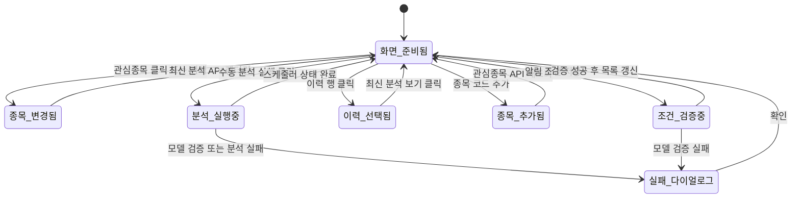

# Stock Agent Electron UI 설계안

## 1. 목적

Stock Agent의 현재 구현 기능을 데스크톱에서 사용하는 Electron 클라이언트를 정의한다. 새 투자 기능을 제안하는 것이 아니라, 이미 구현된 FastAPI 기능을 일관된 화면 흐름으로 제공하는 것이 목표다.

앱은 Electron main process가 로컬 FastAPI를 확인하거나 자동 실행하고, preload API를 통해 `관심종목 -> 최신 분석 -> 분석 이력 -> 알림 조건` 흐름을 실제 백엔드와 연결한다.

## 2. Electron 선택 이유

Electron은 새 백엔드를 만들지 않고 기존 FastAPI를 그대로 데스크톱 앱에서 사용할 수 있다는 점이 가장 크다. renderer는 preload에 허용된 메서드만 호출하고, main process가 로컬 HTTP 통신과 백엔드 프로세스 생명주기를 담당한다.

또한 HTML, CSS, JavaScript를 그대로 사용하므로 기존 웹 화면과 UI 설계 자산을 재사용하기 쉽다. 패키징 단계에서는 Windows/macOS/Linux 데스크톱 배포를 같은 코드베이스에서 검토할 수 있고, Electron의 main process, preload, renderer 구조를 이용해 화면 코드와 로컬 앱 권한을 분리할 수 있다.

민감 정보는 Electron 앱에 직접 보관하지 않는 것을 원칙으로 한다. Gemini API 키, 카카오 토큰, DB 접근은 FastAPI 백엔드가 담당하고, Electron은 사용자가 보는 화면과 백엔드 API 호출만 맡는다.

## 3. 기능 범위 정리

### 현재 구현 기능 기준

| 기능 | 백엔드 구현 기준 | 데스크톱 화면 표현 |
| --- | --- | --- |
| 관심종목 목록 | `GET /watchlist` | 좌측 관심종목 목록 |
| 관심종목 추가 | `POST /watchlist` | 종목 코드 입력 후 실제 목록 갱신 |
| 관심종목 삭제 | `DELETE /watchlist/{symbol}` | 관심종목 행의 삭제 버튼 |
| 최신 분석 조회 | `GET /stocks/{symbol}/analysis/latest` | 선택 종목의 최신 분석 카드 |
| 분석 이력 조회 | `GET /stocks/{symbol}/analysis` | 하단 이력 테이블 |
| 분석 상세 조회 | `GET /stocks/{symbol}/analysis/{id}` | 이력 클릭 시 분석 카드 교체 |
| 수동 분석 실행 | `POST /scheduler/run?force=true` | 상단 `수동 분석 실행` 버튼 |
| 카카오 알림 상태 | 분석 결과의 `should_alert`, `alert_reason`, `alert_sent_at` | 상태 스트립의 알림 카드 |
| 사용자 알림 조건 | `GET/POST/DELETE /alert-conditions` | 조건 조회, 검증·저장, 삭제 영역 |
| 카카오 로그인 | `GET /auth/kakao/login` | 기본 브라우저에서 OAuth 시작 |

### 이번 데모에서 의도적으로 제외

- 전체 포트폴리오 수익률, 투자금, 보유 수량
- 실시간 차트, 캔들 차트, 주문/매매 기능
- 다중 페이지 설정 화면

## 4. 화면 원칙

- 사이드바에서 관심종목, 최신 분석, 이력, 알림 화면을 독립적으로 전환한다.
- 화면을 전환해도 선택 종목과 이미 조회한 API 상태는 유지한다.
- 종목 선택은 관심종목 목록에서 시작한다.
- 최신 분석과 과거 이력은 같은 상세 카드에 표시해 비교 부담을 줄인다.
- 알림은 별도 기능처럼 과장하지 않고 분석 결과에 포함된 상태로 보여준다.
- 백엔드 연결 상태와 호출 API명을 화면에 노출한다.

## 5. 정보 구조

| 영역 | 역할 | 주요 내용 |
| --- | --- | --- |
| 좌측 흐름 안내 | 데모 진행 순서 안내 | 관심종목 선택, 최신 분석 확인, 이력 비교, 알림 상태 확인 |
| 상단 조작 영역 | 전역 조작 | 종목 검색, 수동 분석 실행 |
| 관심종목 영역 | 분석 대상 선택 | 종목 코드, 종목명, 알림 상태, 종목 추가 입력 |
| 현재 상태 요약 | 현재 상태 확인 | 선택 종목, 스케줄러 실행 상태, 데이터 기준 시각, 알림 상태 |
| 분석 상세 영역 | 최신/선택 이력 상세 | 판단, 요약, 현재가, 등락률, 참고 안내 |
| 분석 근거 영역 | 분석 근거 확인 | 핵심 근거, 위험 요인 |
| 주요 지표 영역 | 분석 입력 지표 확인 | 거래량 비율, 20일 저점, 20일 고점, 알림 조건 수 |
| 분석 이력 영역 | 저장된 분석 결과 확인 | 결과 ID, 분석 시각, 판단, 요약 |
| 사용자 알림 조건 영역 | 자연어 알림 규칙 관리 | 종목 코드, 사용자 규칙, 검증 결과, 카카오 로그인 |

## 6. UI 컴포넌트 다이어그램

```mermaid
flowchart TB
    SCREEN["관심종목 분석 앱 부팅 (src/renderer.js)"] --> SHELL["앱 화면 틀 (src/components/layout/app-shell.js)"]
    SCREEN --> STATE["앱 상태와 화면 모델 (src/state/app-state.js)"]
    SCREEN --> SERVICES["백엔드 접근점 (src/services/backend-service.js)"]
    SCREEN --> CONTROLLERS["이벤트 흐름 제어 (src/controllers/*.js)"]

    SHELL --> SIDE["화면 전환 메뉴 (src/components/layout/sidebar.js)"]
    SHELL --> TOP["상단 조작 영역 (src/components/layout/topbar.js)"]
    SHELL --> MAINVIEW["선택 화면 영역 (src/renderer.js)"]
    SHELL --> TOAST["사용자 동작 결과 알림 (src/components/ui/toast.js)"]
    SHELL --> DIALOG["검증/분석 실패 다이얼로그 (src/components/ui/dialog.js)"]

    SERVICES --> PRELOAD["허용된 백엔드 API (preload.js)"]
    PRELOAD --> MAIN["로컬 HTTP 요청과 FastAPI 실행 (main.js)"]

    CONTROLLERS --> NAV_CONTROLLER["화면 전환 (src/controllers/navigation-controller.js)"]
    CONTROLLERS --> WATCH_CONTROLLER["관심종목 흐름 (src/controllers/watchlist-controller.js)"]
    CONTROLLERS --> ANALYSIS_CONTROLLER["분석 조회/실행 흐름 (src/controllers/analysis-controller.js)"]
    CONTROLLERS --> ALERT_CONTROLLER["알림 조건 흐름 (src/controllers/alerts-controller.js)"]

    SIDE --> BRAND["서비스명 표시"]
    SIDE --> FLOW["관심종목 / 최신 분석 / 이력 / 알림 메뉴"]
    SIDE --> NOTICE["백엔드 연결 상태"]

    MAINVIEW --> GRID["현재 선택된 화면 1개 표시"]

    TOP --> SEARCH["관심종목 검색"]
    TOP --> RUN["수동 분석 실행"]

    GRID --> WATCH["관심종목 영역 (src/components/watchlist/watchlist-panel.js)"]
    GRID --> ANALYSIS_VIEW["최신 분석 화면 (src/components/analysis/analysis-overview.js)"]
    GRID --> HISTORY_VIEW["분석 이력 화면 (src/components/analysis/analysis-history-panel.js)"]
    GRID --> CONDITIONS["사용자 알림 조건 화면 (src/components/alerts/alert-conditions-panel.js)"]

    WATCH --> WATCH_ITEMS["관심종목 행 x N (src/components/watchlist/watchlist-row.js)"]
    WATCH --> ADD["관심종목 추가"]
    WATCH --> DELETE["관심종목 삭제"]

    ANALYSIS_VIEW --> STATUS["현재 상태 요약"]
    ANALYSIS_VIEW --> ANALYSIS["분석 상세 영역"]
    ANALYSIS_VIEW --> INSIGHT["분석 근거 영역 (src/components/analysis/insight-panel.js)"]
    ANALYSIS_VIEW --> METRICS["주요 지표 영역 (src/components/analysis/metrics-panel.js)"]

    STATUS --> SELECTED["선택 종목"]
    STATUS --> SCHEDULER["스케줄러 실행 상태"]
    STATUS --> DATA_TIME["데이터 기준 시각"]
    STATUS --> ALERT["카카오 알림 상태"]

    ANALYSIS --> VERDICT["종합 판단 배지"]
    ANALYSIS --> SUMMARY["분석 요약"]
    ANALYSIS --> PRICE["현재가와 등락률"]

    INSIGHT --> REASONS["핵심 근거"]
    INSIGHT --> RISKS["위험 요인"]

    HISTORY_VIEW --> HISTORY_ROW["분석 이력 행 x N"]
    HISTORY_VIEW --> LATEST["최신 분석 보기"]
    CONDITIONS --> CONDITION_FORM["알림 조건 검증·저장"]
    CONDITIONS --> CONDITION_ITEM["알림 조건 행 x N (src/components/alerts/alert-condition-item.js)"]
    CONDITIONS --> KAKAO_LOGIN["카카오 로그인"]

    ANALYSIS_CONTROLLER --> DIALOG
    ALERT_CONTROLLER --> DIALOG
```



괄호 안 경로는 해당 UI 영역을 생성하거나 렌더링하는 구현 파일이다. `controllers`는 클릭, 제출, API 호출 후 화면 갱신 흐름을 연결하고, `state`는 API 응답을 화면 모델로 정규화한다.

## 7. 주요 컴포넌트 책임

| 컴포넌트 | 입력 | 사용자 동작 | 상태 변화 |
| --- | --- | --- | --- |
| 관심종목 검색 | 종목 코드 또는 이름 | Enter 제출 | 백엔드 관심종목에서 일치 항목 선택 |
| 수동 분석 실행 버튼 | 현재 선택 종목 | 클릭 | 스케줄러 상태를 `실행 중 -> 완료`로 변경 |
| 관심종목 행 | 종목 코드, 종목명, 알림 상태 | 클릭 | 최신 분석과 이력 목록 교체 |
| 관심종목 추가 입력 | 종목 코드 | 제출 | API로 관심종목 추가 후 선택 |
| 현재 상태 요약 | 선택 종목, 스케줄러, 데이터 시각, 알림 상태 | 없음 | 선택 종목/수동 실행 결과에 따라 갱신 |
| 분석 상세 카드 | `AnalysisResultRead` | 없음 | 최신 또는 선택 이력 상세 표시 |
| 분석 근거 카드 | `key_reasons`, `risk_factors` | 없음 | 선택 분석 결과에 따라 목록 교체 |
| 주요 지표 카드 | `MarketIndicators`, 알림 조건 | 없음 | 선택 종목 기준 지표 표시 |
| 분석 이력 목록 | `AnalysisResultHistoryItem[]` | 이력 행 클릭 | 상세 카드가 해당 결과로 교체 |
| 사용자 알림 조건 | `CustomAlertConditionRead[]` | 저장 또는 삭제 | 검증 결과와 조건 목록 갱신 |
| 검증/분석 실패 다이얼로그 | 사용자용 실패 메시지 | 확인, 바깥 영역 클릭, Esc | 원본 에러는 콘솔에만 남기고 화면에는 정리된 안내 표시 |

구현 파일은 역할에 따라 다음처럼 대응한다.

| 구현 모듈 | 담당 UI 컴포넌트 |
| --- | --- |
| `src/components/layout/app-shell.js` | 앱 화면 틀, 공통 toast/dialog 포함 |
| `src/components/layout/sidebar.js` | 좌측 흐름 안내, 백엔드 연결 상태 |
| `src/components/layout/topbar.js` | 종목 검색, 수동 분석 실행 버튼 |
| `src/components/ui/toast.js` | 짧은 사용자 동작 결과 알림 |
| `src/components/ui/dialog.js` | 검증 실패, 분석 실패 등 재사용 다이얼로그 |
| `src/components/watchlist/watchlist-panel.js` | 관심종목 영역, 종목 추가 입력 |
| `src/components/watchlist/watchlist-row.js` | 관심종목 행, 선택/삭제 버튼 |
| `src/components/analysis/analysis-overview.js` | 현재 상태 요약, 분석 상세 |
| `src/components/analysis/insight-panel.js` | 핵심 근거, 위험 요인 카드 |
| `src/components/analysis/metrics-panel.js` | 주요 지표 카드 |
| `src/components/analysis/analysis-history-panel.js` | 분석 이력 목록과 최신 분석 보기 |
| `src/components/alerts/alert-conditions-panel.js` | 사용자 알림 조건 입력, 목록 영역 |
| `src/components/alerts/alert-condition-item.js` | 알림 조건 행과 삭제 버튼 |
| `src/renderer.js` | 앱 부팅, 화면 마운트, 컨트롤러 조립 |
| `src/state/app-state.js` | 선택 상태, 분석 응답 정규화, 화면 모델 생성 |
| `src/services/backend-service.js` | preload API 접근점 |
| `src/controllers/navigation-controller.js` | 독립 화면 전환 |
| `src/controllers/watchlist-controller.js` | 관심종목 검색, 추가, 선택, 삭제 흐름 |
| `src/controllers/analysis-controller.js` | 최신 분석 조회, 이력 상세, 수동 분석 실행, 실패 다이얼로그 |
| `src/controllers/alerts-controller.js` | 알림 조건 검증/저장/삭제, 카카오 로그인, 실패 다이얼로그 |
| `preload.js` | renderer에 허용된 백엔드 API 노출 |
| `main.js` | FastAPI 자동 실행, HTTP 요청, 외부 로그인 열기 |

## 8. 화면 상태



## 9. 상세 화면 설계

```text
+--------------------------------------------------------------------------------+
| 상단 조작 영역                                                                 |
| 관심종목 분석                                                                  |
| 관심종목 분석             [종목 검색 input] [수동 분석 실행]                  |
+----------------------+---------------------------------------------------------+
| 좌측 흐름 안내      | 주요 작업 영역                                          |
| - 1 관심종목 선택    | +-----------------------------------------------------+ |
| - 2 최신 분석 확인   | | 현재 상태 요약                                      | |
| - 3 이력 비교        | | 선택 종목 | 스케줄러 | 데이터 기준 | 알림          | |
| - 4 알림 상태 확인   | +-----------------------------------------------------+ |
|                      | +-----------------------------------------------------+ |
| BACKEND 연결 상태    | | 분석 상세 카드                                      | |
|                      | | [판단 배지] 종목명(코드)       현재가/등락률        | |
| 관심종목 영역        | | 요약 문장                                            | |
| - 종목 행            | +-----------------------------------------------------+ |
| - 종목 행            | +--------------------------+ +------------------------+ |
| - 종목 추가 input    | | 핵심 근거                | | 위험 요인              | |
|                      | +--------------------------+ +------------------------+ |
|                      | +-----------------------------------------------------+ |
|                      | | 주요 지표: 거래량, 20일 저점/고점, 알림 조건        | |
|                      | +-----------------------------------------------------+ |
|                      | +-----------------------------------------------------+ |
|                      | | 분석 이력: ID, 분석 시각, 판단, 요약                | |
|                      | +-----------------------------------------------------+ |
|                      | | 사용자 알림 조건: 규칙 입력, 저장, 삭제, 로그인     | |
|                      | +-----------------------------------------------------+ |
+----------------------+---------------------------------------------------------+
| [다이얼로그] 분석/검증 실패 시 사용자용 메시지와 확인 버튼 표시              |
+--------------------------------------------------------------------------------+
```

## 10. 실제 API 연결

| UI 동작 | 연결 API | 화면 반영 |
| --- | --- | --- |
| 앱 시작 | `GET /watchlist` | 좌측 관심종목 목록 초기화 |
| 종목 추가 | `POST /watchlist` | 성공 시 목록 재조회 또는 optimistic append |
| 종목 선택 | `GET /stocks/{symbol}/analysis/latest` | 상세 카드 렌더링 |
| 종목 선택 | `GET /stocks/{symbol}/analysis?limit=20` | 이력 테이블 렌더링 |
| 이력 클릭 | `GET /stocks/{symbol}/analysis/{id}` | 상세 카드 교체 |
| 수동 분석 실행 | `POST /scheduler/run?force=true` | 완료 후 최신 분석/이력 재조회 |
| 수동 분석 실패 | `POST /scheduler/run?force=true` 오류 또는 실패 결과 | 원본 에러 대신 재사용 다이얼로그 표시 |
| 알림 표시 | 분석 응답의 `should_alert`, `alert_reason`, `alert_sent_at` | 알림 상태 카드 갱신 |
| 알림 조건 저장 | `POST /alert-conditions` | 검증 성공 시 목록 갱신 |
| 알림 조건 검증 실패 | `POST /alert-conditions` 오류 | 원본 에러 대신 재사용 다이얼로그 표시 |
