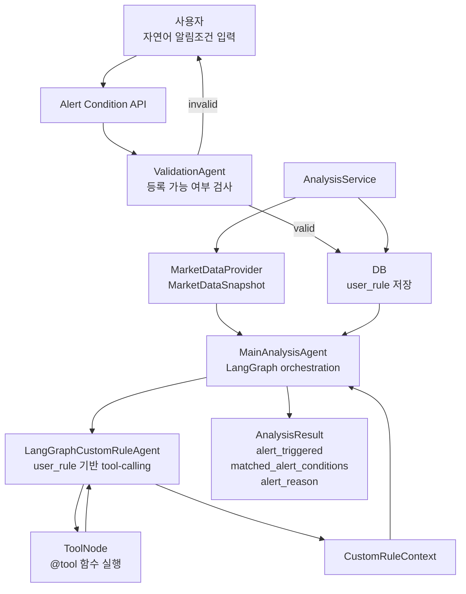
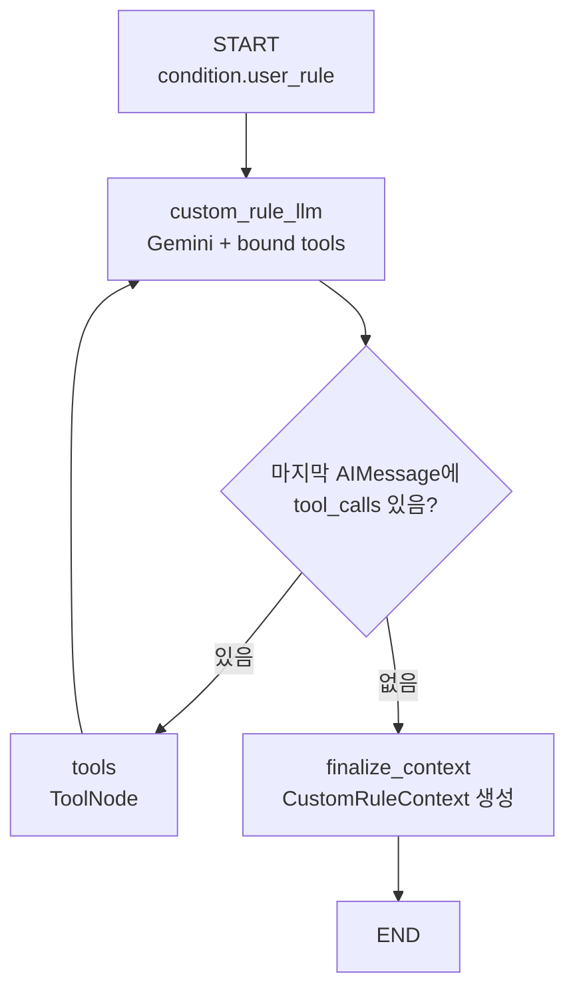
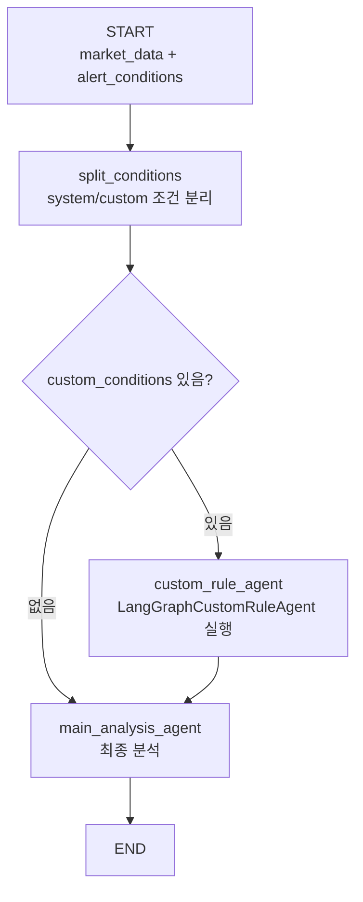

# LangGraph CustomRuleAgent 설계

## 목적

이 문서는 기존 `DefaultCustomRuleAgent`를 LangGraph tool-calling 기반 `CustomRuleAgent`로 교체하기 위한 설계를 정리한다.

현재 구현의 `DefaultCustomRuleAgent`는 `condition.required_tools`를 보고 정해진 tool을 실행한다. 변경하려는 구조에서는 사용자가 입력한 자연어 `user_rule`을 분석 시점에 `CustomRuleAgent`가 직접 해석하고, 필요하면 LLM tool-calling으로 적절한 tool을 선택해 호출한다.

## 핵심 방향

- 사용자는 자연어 알림조건만 입력한다.
- `ValidationAgent`는 등록 시점에 조건이 알림조건으로 쓸 수 있는지 검사한다.
- 조건이 유효하면 DB에는 사용자의 자연어 조건과 검증 요약을 저장한다.
- 분석 시점에 `CustomRuleAgent`가 DB에서 읽은 `user_rule`을 보고 필요한 tool을 선택한다.
- tool 실행 결과는 `CustomRuleContext`로 정리되어 `MainAnalysisAgent`에 전달된다.
- 최종 알림 여부는 여전히 `MainAnalysisAgent`가 판단한다.

## 현재 구조와 변경 구조

현재 구조:

```text
사용자 user_rule 입력
-> RuleValidationAgent가 required_tools / related_symbols / news_symbols 추출
-> DB에 실행 계획 저장
-> DefaultCustomRuleAgent가 required_tools를 보고 tool 실행
-> CustomRuleContext 생성
-> MainAnalysisAgent 최종 판단
```

변경 구조:

```text
사용자 user_rule 입력
-> ValidationAgent가 등록 가능 여부만 검사
-> DB에 user_rule 중심으로 저장
-> LangGraphCustomRuleAgent가 user_rule을 보고 tool call 여부 판단
-> ToolNode가 실제 tool 실행
-> CustomRuleContext 생성
-> MainAnalysisAgent 최종 판단
```

## 전체 흐름



## ValidationAgent 책임

`ValidationAgent`는 자연어 조건을 실행할 수 있는지 검사한다. 이 단계에서 실제 tool 실행 계획을 확정하지 않는다.

책임:

- 조건이 너무 모호하지 않은지 확인한다.
- 대상 종목이 명확한지 확인한다.
- 주식 알림조건으로 해석 가능한지 확인한다.
- 시스템이 가진 tool 범위 안에서 처리 가능한 종류인지 확인한다.
- 실패 시 사용자가 다시 작성할 수 있도록 `rewrite_guidance`를 반환한다.

저장 추천 필드:

```python
class CustomAlertCondition(BaseModel):
    id: str
    kind: Literal["custom"] = "custom"
    symbol: str
    name: str
    user_rule: str
    normalized_rule: str | None = None
    validation_summary: str
    enabled: bool = True
```

기존 `required_tools`, `related_symbols`, `news_symbols`는 필수 저장값에서 제외한다. 필요한 tool 선택은 분석 시점의 `LangGraphCustomRuleAgent`가 수행한다.

## CustomRuleAgent 책임

`LangGraphCustomRuleAgent`는 분석 시점에 custom alert condition을 받아서 `CustomRuleContext`를 만든다.

책임:

- `user_rule`을 LLM에게 전달한다.
- LLM이 필요한 tool call을 만들 수 있도록 tool 목록을 bind한다.
- LLM 응답에 `tool_calls`가 있으면 `ToolNode`로 이동한다.
- tool 실행 결과를 다시 LLM에게 전달한다.
- 더 이상 tool call이 없으면 최종 context를 만든다.

## CustomRuleAgent 노드 그래프



중요한 점:

- tool 사용 여부는 router가 판단하지 않는다.
- LLM이 `AIMessage.tool_calls`에 필요한 tool 호출 요청을 담아 반환한다.
- router는 `tool_calls`가 있는지 확인해서 `tools` 또는 `finalize_context`로 보내는 역할만 한다.
- 실제 tool 함수 실행은 `ToolNode`가 담당한다.

## MainAnalysisAgent와의 연결

기존 `MainAnalysisAgent` 그래프는 유지할 수 있다. 바뀌는 부분은 `custom_rule_agent` 노드 내부에서 호출하는 구현체다.



`MainAnalysisAgent` 입장에서는 `DefaultCustomRuleAgent`든 `LangGraphCustomRuleAgent`든 같은 인터페이스만 만족하면 된다.

```python
class CustomRuleAgent(Protocol):
    def build_context(self, condition: CustomAlertCondition) -> CustomRuleContext:
        ...
```

## Tool 정의 위치

tool은 agent 내부에 직접 흩뿌리지 않고 별도 모듈로 분리한다.

```text
app/
  custom_rule_tools/
    __init__.py
    market.py
    news.py
    registry.py
```

예시:

```python
# app/custom_rule_tools/news.py
from langchain_core.tools import tool


@tool
def fetch_symbol_news(symbol: str) -> list[dict]:
    """Fetch recent news for a stock symbol."""
    ...
```

```python
# app/custom_rule_tools/market.py
from langchain_core.tools import tool

from app.market_data import YFinanceMarketDataProvider
from app.schemas import model_to_dict


@tool
def fetch_related_symbol_snapshot(symbol: str) -> dict:
    """Fetch recent market-data indicators for a stock symbol."""
    snapshot = YFinanceMarketDataProvider().fetch(symbol)
    return model_to_dict(snapshot)
```

```python
# app/custom_rule_tools/registry.py
from app.custom_rule_tools.market import fetch_related_symbol_snapshot
from app.custom_rule_tools.news import fetch_symbol_news


def get_custom_rule_tools():
    return [
        fetch_symbol_news,
        fetch_related_symbol_snapshot,
    ]
```

## Gemini 연결 방식

현재 `GeminiAnalysisAgent`는 Gemini REST API를 직접 호출한다. LangGraph tool-calling 패턴을 쓰려면 LangChain ChatModel 어댑터를 사용하는 편이 좋다.

필요 패키지:

```text
langchain-google-genai
```

예상 설정:

```python
import os

from langchain_google_genai import ChatGoogleGenerativeAI


def build_custom_rule_llm():
    return ChatGoogleGenerativeAI(
        model=os.getenv("GEMINI_MODEL", "gemini-2.0-flash"),
        google_api_key=os.getenv("GEMINI_API_KEY"),
    )
```

API key는 코드에 직접 넣지 않고 `.env`의 `GEMINI_API_KEY`를 사용한다.

## 대략적인 코드 형태

```python
# app/custom_rule_agent.py
from __future__ import annotations

from typing import Annotated, Any, Protocol, TypedDict

from langchain_core.messages import HumanMessage, SystemMessage
from langchain_google_genai import ChatGoogleGenerativeAI
from langgraph.graph import END, StateGraph
from langgraph.graph.message import add_messages
from langgraph.prebuilt import ToolNode
from pydantic import BaseModel, Field

from app.alert_conditions import CustomAlertCondition
from app.custom_rule_tools.registry import get_custom_rule_tools


class CustomRuleContext(BaseModel):
    condition_id: str
    user_rule: str
    gathered_facts: list[str] = Field(default_factory=list)
    evidence: dict[str, Any] = Field(default_factory=dict)
    summary: str = ""


class CustomRuleAgent(Protocol):
    def build_context(self, condition: CustomAlertCondition) -> CustomRuleContext:
        ...


class CustomRuleAgentState(TypedDict):
    messages: Annotated[list, add_messages]
    condition: CustomAlertCondition
    custom_context: CustomRuleContext


class LangGraphCustomRuleAgent:
    def __init__(self, *, llm: ChatGoogleGenerativeAI) -> None:
        self.tools = get_custom_rule_tools()
        self.llm = llm.bind_tools(self.tools)
        self.graph = self._build_graph()

    def build_context(self, condition: CustomAlertCondition) -> CustomRuleContext:
        result = self.graph.invoke(
            {
                "condition": condition,
                "messages": [
                    SystemMessage(
                        content=(
                            "너는 사용자 주식 알림조건을 분석하기 위한 자료 수집 에이전트다. "
                            "필요한 경우에만 제공된 tool을 호출한다. "
                            "충분한 자료를 모으면 더 이상 tool을 호출하지 말고 요약한다."
                        )
                    ),
                    HumanMessage(
                        content=(
                            f"target_symbol: {condition.symbol}\n"
                            f"condition_id: {condition.id}\n"
                            f"user_rule: {condition.user_rule}"
                        )
                    ),
                ],
            }
        )
        return result["custom_context"]

    def _build_graph(self):
        graph = StateGraph(CustomRuleAgentState)

        graph.add_node("custom_rule_llm", self._call_llm)
        graph.add_node("tools", ToolNode(self.tools))
        graph.add_node("finalize_context", self._finalize_context)

        graph.set_entry_point("custom_rule_llm")
        graph.add_conditional_edges(
            "custom_rule_llm",
            self._route_after_llm,
            {
                "tools": "tools",
                "finalize": "finalize_context",
            },
        )
        graph.add_edge("tools", "custom_rule_llm")
        graph.add_edge("finalize_context", END)

        return graph.compile()

    def _call_llm(self, state: CustomRuleAgentState) -> dict:
        response = self.llm.invoke(state["messages"])
        return {"messages": [response]}

    @staticmethod
    def _route_after_llm(state: CustomRuleAgentState) -> str:
        last_message = state["messages"][-1]
        if getattr(last_message, "tool_calls", None):
            return "tools"
        return "finalize"

    def _finalize_context(self, state: CustomRuleAgentState) -> dict:
        condition = state["condition"]
        final_message = state["messages"][-1]

        return {
            "custom_context": CustomRuleContext(
                condition_id=condition.id,
                user_rule=condition.user_rule,
                summary=str(getattr(final_message, "content", "")),
                evidence={
                    "messages": [
                        str(getattr(message, "content", ""))
                        for message in state["messages"]
                        if getattr(message, "content", "")
                    ]
                },
            )
        }
```

## 서비스 조립 방식

기존:

```python
MainAnalysisAgent(
    main_model=GeminiAnalysisAgent(),
    custom_rule_agent=DefaultCustomRuleAgent(),
)
```

변경:

```python
MainAnalysisAgent(
    main_model=GeminiAnalysisAgent(),
    custom_rule_agent=LangGraphCustomRuleAgent(
        llm=build_custom_rule_llm(),
    ),
)
```

즉 `MainAnalysisAgent`의 큰 그래프는 유지하고, `custom_rule_agent` 구현체만 교체한다.

## 구현 단계

1. `langchain-google-genai` 의존성을 추가한다.
2. `app/custom_rule_tools` 모듈을 추가한다.
3. `fetch_symbol_news`, `fetch_related_symbol_snapshot` tool을 `@tool`로 정의한다.
4. `LangGraphCustomRuleAgent`를 추가한다.
5. `build_analysis_service()`에서 `DefaultCustomRuleAgent` 대신 `LangGraphCustomRuleAgent`를 주입한다.
6. `ValidationAgent` 결과 모델에서 `required_tools`, `related_symbols`, `news_symbols` 저장 의존도를 낮춘다.
7. DB 모델과 repository를 `user_rule`, `normalized_rule`, `validation_summary` 중심으로 정리한다.
8. 테스트에서 fake custom rule agent와 tool-calling agent 흐름을 분리해 검증한다.

## 주의사항

- LLM이 tool call을 반복할 수 있으므로 최대 반복 횟수 또는 recursion limit을 둔다.
- tool은 allowlist 방식으로만 주입한다.
- tool 결과는 최종 알림 판단이 아니라 참고 context다.
- 최종 `alert_triggered`, `matched_alert_conditions`, `alert_reason` 판단은 `MainAnalysisAgent`가 담당한다.
- 서비스 계층은 기존처럼 condition id 검증, 중복 발송 방지, 발송 가능 시간 확인을 수행한다.

