# 로그인 기능 및 다중 사용자 전환 설계

## 목적

카카오 로그인을 이용해 여러 개인 투자자가 하나의 서비스에 가입하고, 각자의 관심 종목·알림 조건·알림 연결·알림 이력을 안전하게 관리하도록 시스템 경계를 확장한다.

이 문서는 로그인 화면이나 인증 코드만을 다루지 않는다. 기존 단일 사용자 구조에 사용자 소유권 경계를 추가하면서 함께 변경되어야 하는 분석, 알림과 데이터 격리 정책을 기록한다.

## 개발 접근 방식

설계와 구현은 OOAD 관점에서 진행한다.

1. 이번 반복에서 완성할 사용자 유스케이스를 정한다.
2. 유스케이스에 등장하는 도메인 객체와 경계를 식별한다.
3. 각 객체의 책임과 협력 관계를 배정한다.
4. 사용자 소유권과 접근 제어 같은 불변식을 명시한다.
5. 유스케이스를 완성하는 최소 변경만 구현하고 검증한다.

장기 목표 모델과 이번 반복의 구현 범위를 구분한다. 목표 모델에 필요한 개념을 설계 문서에는 기록하되, 현재 유스케이스에 필요하지 않은 객체나 설정은 미리 구현하지 않는다.

## 1차 구현 목표

첫 번째 반복의 목표는 카카오 로그인으로 식별된 사용자가 자신의 데이터 경계 안에서 기존 핵심 기능을 사용하는 것이다.

### 포함 범위

- 카카오 로그인을 통한 사용자 계정 식별 또는 생성
- 인증된 요청에서 현재 사용자 식별
- 사용자별 관심 종목 구독 격리
- 사용자별 자연어 알림 조건 격리
- 활성 관심 종목 구독을 기준으로 공유 분석 조회 권한 제한
- 시스템 시장 신호 발생 시 이번 반복의 공통 발송 정책 적용

### 제외 범위

- 카카오 외 로그인 제공자
- 사용자별 시스템 알림 활성화 설정
- 사용자별 맞춤 분석 본문
- `required_tools`, `related_symbols`, `news_symbols` 실행 계획 재설계
- 시스템 신호 종류별 세부 수신 설정

## 현재 구조의 문제

- 관심 종목은 `symbol`만으로 전역에서 유일하며 사용자 소유자가 없다.
- 사용자 알림 조건은 종목에만 연결되고 사용자 소유자가 없다.
- 같은 종목의 모든 활성 사용자 조건이 하나의 분석 프롬프트에 함께 전달된다.
- 분석 본문, 조건 충족 결과와 알림 발송 상태가 하나의 분석 결과에 함께 저장된다.
- 카카오 OAuth 토큰은 단일 운영자 기준으로 `.env`에 저장된다.
- 현재 카카오 OAuth는 서비스 사용자 인증이 아니라 카카오톡 알림 권한 연결에 가깝다.

다중 사용자 환경에서 현재 구조를 유지하면 사용자 조건이 서로 섞이고 다른 사용자의 조건이나 알림 상태가 노출될 수 있다.

## 확정된 결정

### 다중 사용자 서비스

서비스는 한 PC의 로컬 프로필이 아니라 여러 사용자가 같은 서버를 이용하는 다중 사용자 서비스로 전환한다. `사용자 계정(UserAccount)`은 관심 종목, 사용자 알림 조건과 알림 연결의 소유권 및 접근 제어 경계다.

### 중앙 서버 구조

운영 환경에서는 여러 Electron 클라이언트가 하나의 중앙 FastAPI 서버와 공유 데이터베이스를 사용한다. Electron은 사용자 인터페이스와 API 호출을 담당하고, 사용자 인증·인가와 데이터 소유권 검사는 중앙 서버가 책임진다.

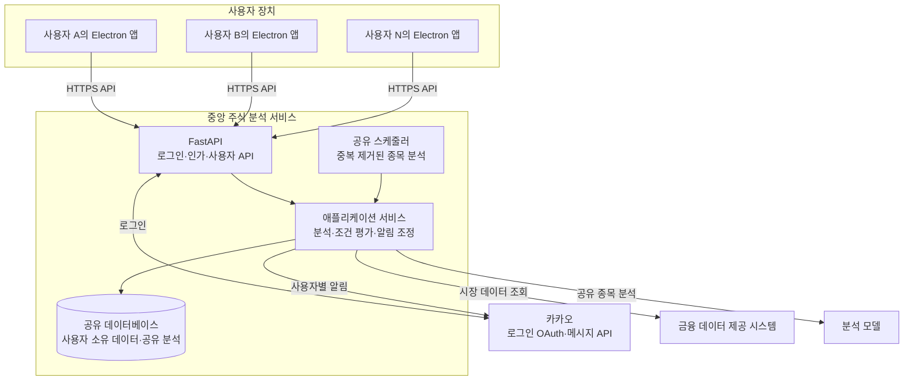

이 구조에서 Electron 앱은 운영용 FastAPI나 데이터베이스를 소유하거나 실행하지 않는다. 로컬 개발 환경에서는 같은 경계를 유지한 채 FastAPI와 데이터베이스를 개발자 PC에서 실행할 수 있다.

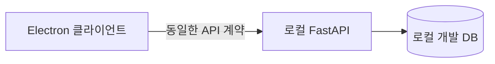

#### 책임 경계

| 구성 요소 | 책임 |
| --- | --- |
| Electron 클라이언트 | 로그인 시작, 사용자 입력과 결과 표시, 중앙 API 호출 |
| 중앙 FastAPI | 로그인 결과 처리, 현재 사용자 식별, 요청별 접근 권한 검사 |
| 애플리케이션 서비스 | 사용자 유스케이스 조정, 공유 분석과 사용자별 알림 흐름 분리 |
| 공유 스케줄러 | 활성 관심 종목의 중복 제거와 주기적 분석 시작 |
| 공유 데이터베이스 | 사용자 소유 데이터와 공유 분석의 일관된 보관 |

중앙 서버 구조는 현재의 Electron별 로컬 FastAPI·SQLite 실행 방식과 다른 배포 경계다. 구체적인 배포 기술과 데이터베이스 제품은 이 문서의 현재 범위에서 결정하지 않는다.

### 1차 구현 제약: 카카오 로그인

MVP 구현에서는 외부 로그인 제공자로 카카오만 지원한다. 이는 OOA 유스케이스의 목표가 아니라 첫 구현에서 선택한 외부 시스템 제약이다. 사용자 계정은 외부 제공자의 식별자와 분리된 고유 식별자를 가진다.

## OOA: 사용자 로그인 및 최초 가입

분석 단계에서는 구체적인 로그인 제공자, 프로토콜, UI와 프레임워크를 제외한다. 사용자의 목표, 서비스가 보장해야 할 결과와 도메인 개념만 표현한다.

### 1. 유스케이스 모델

사용자의 목표는 외부에서 확인된 신원으로 서비스에 로그인하는 것이다. 확인된 신원으로 가입한 사용자 계정이 없으면 최초 로그인 과정에서 사용자 계정을 자동 생성한다.

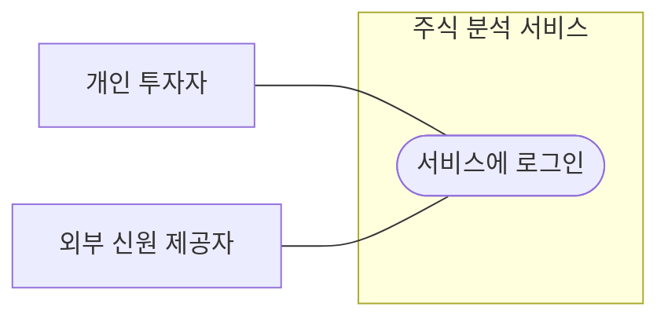

#### 기본 흐름

1. 개인 투자자가 서비스 로그인을 요청한다.
2. 외부 신원 제공자가 투자자의 신원을 확인한다.
3. 주식 분석 서비스가 확인된 외부 신원으로 이미 가입된 사용자 계정을 찾는다.
4. 기존 연결이 있으면 해당 사용자 계정으로 로그인한다.
5. 연결이 없으면 로그인 신원을 소유한 사용자 계정을 생성한다.
6. 사용자가 인증된 서비스 사용을 시작한다.

#### 사후 조건

- 성공 시 하나의 로그인 신원은 정확히 하나의 사용자 계정에 속한다.
- 최초 로그인이라면 사용자 계정과 그 계정이 소유한 로그인 신원이 함께 존재한다.
- 로그인만으로 알림 연결을 생성하지 않는다.

### 2. 로그인 도메인 모델

로그인 유스케이스에서 핵심 도메인 객체는 `UserAccount`와 `LoginIdentity`다. 로그인 제공자는 외부 행위자이며, 세션·컨트롤러·저장소는 도메인 객체가 아니므로 이 모델에 포함하지 않는다.

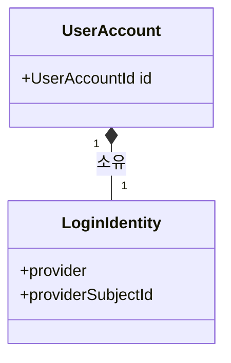

#### 도메인 객체의 책임

| 도메인 객체 | 책임 |
| --- | --- |
| `UserAccount` | 서비스 내부의 데이터 소유권과 계정 생명주기를 대표 |
| `LoginIdentity` | 로그인 제공자가 확인한 사람을 사용자 계정과 대응시키는 값 |

#### 불변식

- 같은 제공자의 같은 외부 사용자 식별자는 둘 이상의 `UserAccount`에 연결될 수 없다.
- 서비스 데이터는 외부 제공자의 식별자가 아니라 내부 `UserAccountId`를 소유권 기준으로 사용한다.
- 로그인 신원이 이미 사용자 계정에 속해 있으면 새 `UserAccount`를 생성하지 않는다.
- 최초 로그인에서 `UserAccount`와 `LoginIdentity`는 둘 다 생성되거나 둘 다 생성되지 않아야 한다.
- `LoginIdentity`는 독립된 식별자나 생명주기를 갖지 않으며 `UserAccount`가 소유한다.
- 로그인 성공이 `NotificationConnection` 생성을 의미하지 않는다.

### 3. 시스템 시퀀스 다이어그램

SSD에서는 주식 분석 서비스를 하나의 블랙박스로 취급한다. 컨트롤러, 저장소와 세션 발급 객체 같은 내부 설계 요소는 표시하지 않는다.

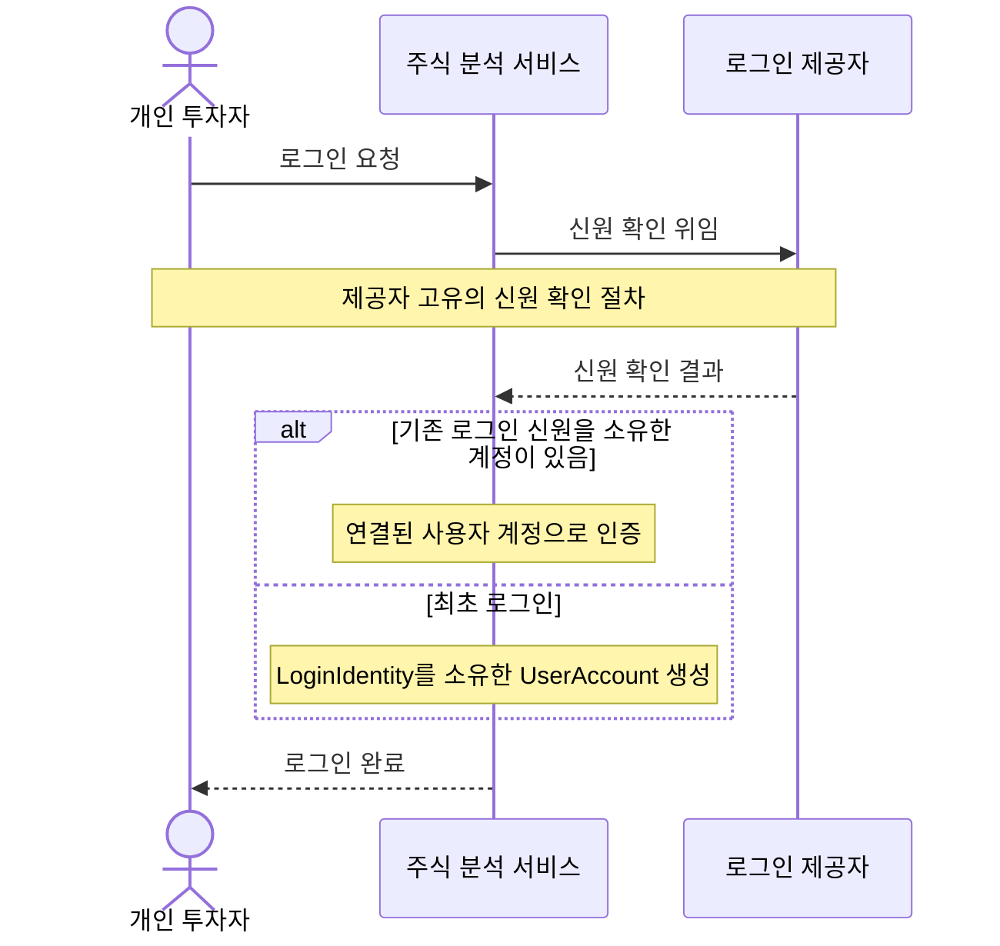

로그인 제공자와 개인 투자자 사이의 실제 인증 방법은 시스템 경계 밖에 있으므로 SSD에서 하나의 추상적인 절차로 숨긴다. 카카오의 리다이렉트, 동의 화면과 콜백 같은 상호작용은 OOD의 제공자별 로그인 설계에서 다룬다.

## OOD: 추상 로그인 설계 초안

첫 번째 OOD 초안은 외부 로그인 프로토콜의 세부 단계를 확정하지 않는다. `LoginService.login()`이라는 하나의 공개 연산으로 로그인 유스케이스를 표현하고, `ExternalLogin`이 제공자별 인증 과정을 숨긴 뒤 검증된 `LoginIdentity`를 반환한다고 본다.

`LoginService`가 유스케이스의 제어 책임을 가진다. 별도의 `AuthenticateAccount` 제어 객체는 만들지 않는다.

### 책임 배정

| 객체 | 책임 |
| --- | --- |
| `LoginService` | 외부 로그인을 요청하고 로그인 신원에 해당하는 사용자 계정을 조회하거나 생성한 뒤 인증 상태가 성립하도록 흐름 조정 |
| `ExternalLogin` | 제공자별 로그인 절차를 숨기고 검증된 `LoginIdentity` 반환 |
| `UserAccountRepository` | 로그인 신원으로 사용자 계정 조회 및 사용자 계정 저장 |
| `UserAccount` | 유효한 `LoginIdentity`를 소유한 새 계정 생성 규칙 보장 |
| `LoginIdentity` | 로그인 제공자와 제공자 사용자 식별자의 조합 표현 |

저장소는 기존 계정 조회와 생성된 계정 저장만 담당한다. 새 계정을 만드는 책임은 생성 규칙을 소유한 `UserAccount`에 두고, `LoginService`가 두 객체의 협력을 조정한다.

### 로그인 시퀀스 다이어그램 초안

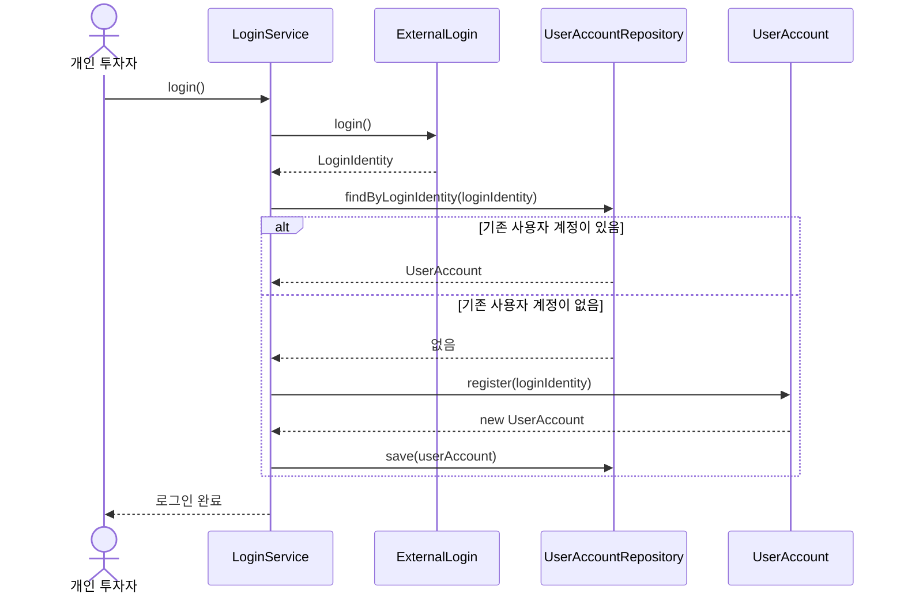

이 시퀀스의 `ExternalLogin.login()`은 카카오 OAuth의 실제 동기 호출 형태를 확정한 것이 아니라, 제공자별 인증 과정 전체를 하나의 추상적인 메시지로 표현한 것이다.

`login()`은 사용자 계정을 조회하거나 생성하는 것만으로 끝나지 않는다. 이후 요청에서도 해당 사용자 계정으로 인증되었다고 판단할 수 있는 상태가 성립해야 로그인 완료로 본다. 현재 초안은 이 상태를 추상화하며, 구체적인 세션·토큰 방식과 반환 모델은 후속 설계에서 결정한다.

### 설계 클래스 다이어그램 초안

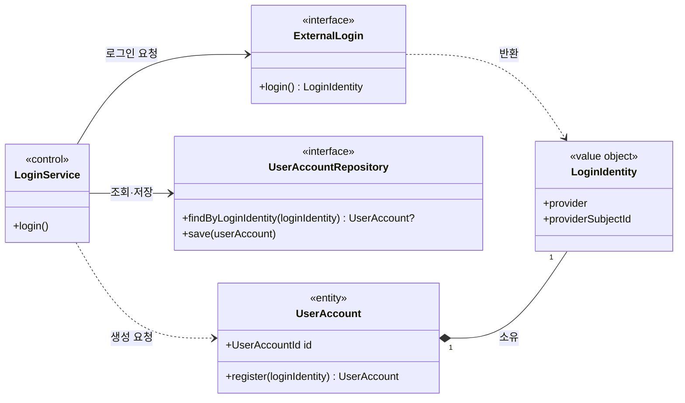

### 현재 초안에서 의도적으로 보류한 사항

- 카카오 로그인 시작과 콜백을 나누는 실제 프로토콜 흐름
- 로그인 완료 후 인증 상태를 유지하는 세션 또는 토큰 방식
- 외부 로그인 실패, 취소와 재시도 처리
- `UserAccount` 대신 별도의 응답 모델을 외부에 반환할지 여부

### 로그인과 알림 연결 분리

서비스 로그인과 카카오톡 알림 연결은 별개의 상태다.

- 로그인은 서비스 사용자가 누구인지 확인한다.
- 알림 연결은 사용자가 카카오톡 메시지를 받을 수 있는 권한과 연결 상태를 나타낸다.
- 사용자는 로그인했지만 알림은 연결하지 않은 상태일 수 있다.
- 알림 연결이 해제되어도 사용자 계정과 분석 정보는 유지된다.
- 카카오 알림 자격 증명은 전역 환경 설정이 아니라 사용자별 연결 정보가 된다.

### 공유 종목 분석과 사용자별 알림 평가 분리

사용자의 자연어 알림 조건은 분석 본문을 변경하지 않는다.

- 종목 분석은 시장 데이터를 근거로 종목과 분석 시점별 한 번 생성하며 사용자들이 공유한다.
- 사용자 알림 조건은 특정 사용자가 소유한다.
- 알림 평가는 공유 종목 분석과 사용자 조건을 결합해 사용자별로 수행한다.
- 알림 발송 및 발송 이력도 사용자별로 기록한다.

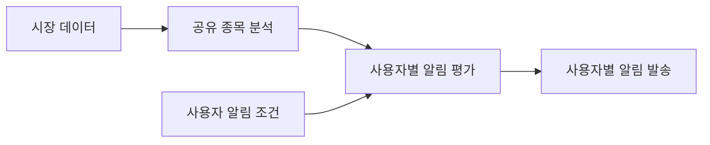

이 결정에 따라 현재 `AnalysisResult`에 포함된 사용자 조건 일치 결과와 단일 `alert_sent_at`은 공유 분석에서 분리되어야 한다.

### 관심 종목 구독 종료

사용자가 관심 종목 구독을 삭제하면 해당 구독에 속한 사용자 알림 조건도 함께 종료한다.

- `WatchlistSubscription` 하나는 한 `UserAccount`와 하나의 `StockSymbol` 사이의 독립적인 구독 관계다.
- `WatchlistSubscription`은 고유 식별자와 시작·종료 생명주기를 가진 애그리게이트 루트다.
- `UserAccount`는 구독 식별자 배열이나 구독 컬렉션을 저장하지 않는다. 사용자별 목록은 저장소가 `ownerId`로 조회한다.
- 종목은 이번 설계에서 별도 생명주기를 갖는 `Stock` 엔티티가 아니라 정규화된 `StockSymbol` 값 객체로 표현한다.
- 종료된 조건은 더 이상 평가하거나 알림을 발송하지 않는다.
- 구독 종료 시 그 구독의 활성 조건을 같은 시각에 함께 종료한다.
- 같은 종목을 다시 구독하면 새 구독 식별자가 발급되며 이전 조건을 자동으로 복원하지 않는다.
- 과거 조건 평가 및 알림 발송 이력은 유지한다.
- 다른 사용자가 해당 종목을 구독하고 있으면 공유 종목 분석은 계속 수행한다.

논리적으로 조건은 삭제되지만, 과거 평가 및 발송 이력이 참조할 수 있도록 필요한 조건 정보의 보존 방식은 구현 설계에서 정한다.

#### 관심 종목 구독 클래스 다이어그램

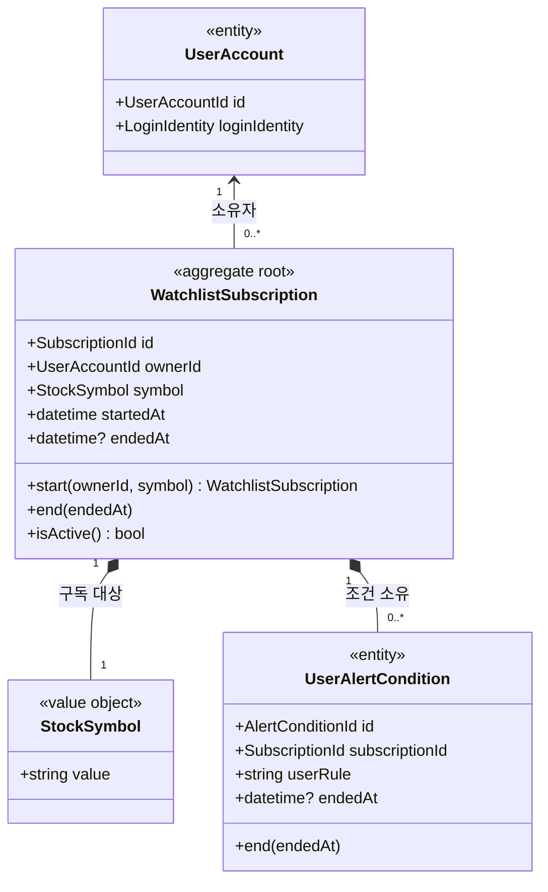

#### 구독 불변식

- 활성 구독은 `(ownerId, StockSymbol)` 조합당 하나만 존재한다.
- 서로 다른 사용자는 같은 종목 코드를 독립적으로 구독할 수 있다.
- 알림 조건은 `SubscriptionId`를 통해 사용자와 종목의 소유권을 따른다.
- 구독 종료와 그 구독의 활성 조건 종료는 하나의 일관된 변경으로 처리한다.

#### 관심 종목 구독 시퀀스

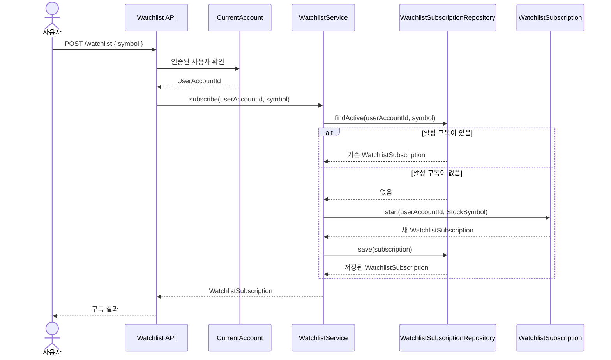

### 공유 분석 이력 접근

사용자가 관심 종목을 새로 구독하면 구독 시작 전에 생성되어 현재 보관 중인 공유 종목 분석 이력도 즉시 조회할 수 있다.

- 공유 종목 분석에는 다른 사용자의 조건, 평가 또는 개인정보를 포함하지 않는다.
- 사용자는 해당 종목의 활성 관심 종목 구독이 있는 동안 공유 분석 이력에 접근할 수 있다.
- 사용자별 분석 결과 복사본은 만들지 않는다.
- 구체적인 분석 이력 보존 기간과 조회 개수는 별도 운영 정책으로 정한다.

### 시스템 시장 신호의 공통 발송

첫 번째 반복에서는 사용자별 시스템 알림 수신 설정을 만들지 않는다. 공유 종목 분석에서 시스템 시장 신호가 감지되면 다음 조건을 모두 만족하는 사용자에게 자동 발송한다.

- 해당 종목의 관심 종목 구독이 활성 상태다.
- 카카오 알림 연결이 활성 상태다.

여기서 모든 사용자는 서비스의 전체 사용자 계정이 아니라 위 조건을 만족하는 모든 알림 대상 구독자를 뜻한다. 사용자별 음소거와 신호 종류별 수신 설정은 후속 반복으로 미룬다.

## 전체 도메인 모델 초안

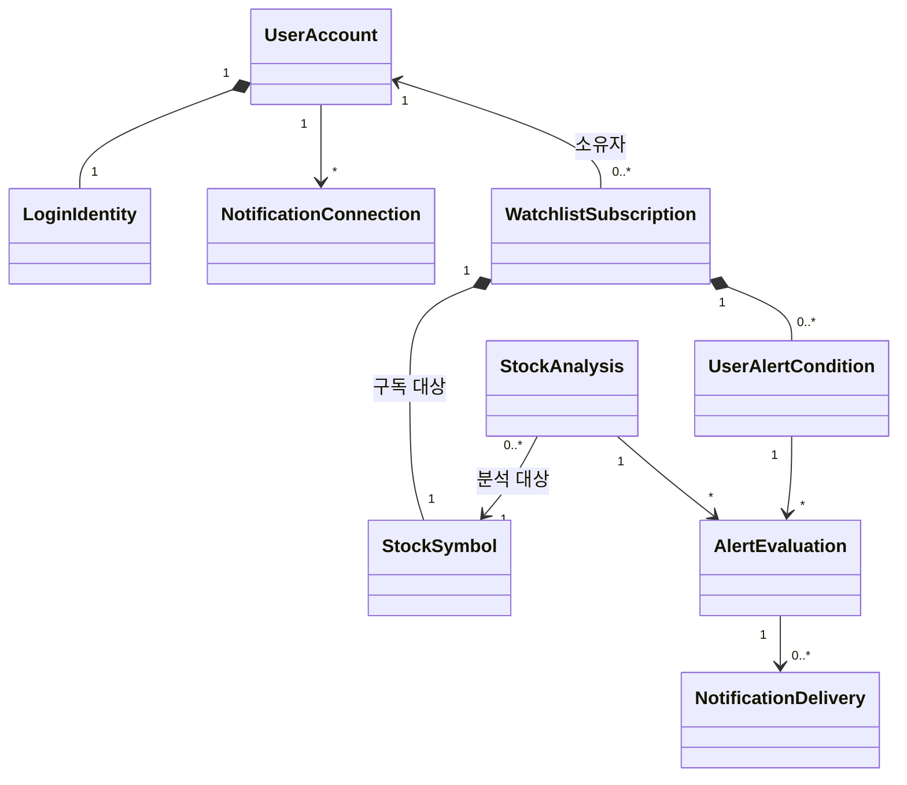

| 개념 | 책임 |
| --- | --- |
| `UserAccount` | 서비스 내부 계정과 데이터 소유권의 기준 |
| `LoginIdentity` | 사용자 계정이 소유하는 단일 로그인 신원 값 |
| `NotificationConnection` | 사용자와 카카오톡 알림 권한의 연결 상태 |
| `WatchlistSubscription` | 한 사용자 계정과 한 종목 코드 사이에서 독립적인 식별자와 생명주기를 갖는 구독 애그리게이트 |
| `StockSymbol` | 구독과 분석 대상을 나타내는 정규화된 종목 코드 값 |
| `StockAnalysis` | 사용자와 무관한 공유 종목 분석 |
| `UserAlertCondition` | 사용자가 특정 종목에 설정한 자연어 알림 조건 |
| `AlertEvaluation` | 한 분석 시점에 사용자 조건이 충족되었는지에 대한 판단 |
| `NotificationDelivery` | 사용자별 알림 발송 시도와 결과 |

## 처리 흐름 초안

장중 스케줄러는 모든 사용자 관심 종목에서 중복을 제거한 종목 집합을 만든다. 각 종목 분석은 한 번만 생성한다. 이후 해당 종목을 구독하는 사용자의 활성 조건을 개별 평가하고, 조건을 충족한 사용자에게만 연결된 알림 채널로 발송한다.

사용자 요청을 처리하는 API는 인증된 사용자를 기준으로 관심 종목, 알림 조건과 알림 이력을 제한해야 한다. 공유 분석도 사용자의 접근 정책을 거쳐 제공한다.

## 보류된 결정

### 사용자 조건 실행 계획

기존 `CustomAlertCondition.required_tools`, `related_symbols`, `news_symbols`는 과거의 사전 계산된 도구 실행 계획을 위한 필드다. 현재 기본 실행 경로는 `user_rule`을 보고 LLM이 도구를 동적으로 선택하므로 이 필드들이 사실상 사용되지 않는다.

다중 사용자 전환의 큰 구조가 확정된 뒤 다음 선택을 다시 검토한다.

- 조건 평가마다 LLM이 도구를 동적으로 선택한다.
- 조건 등록 시 구조화된 평가 계획을 만들고 반복 사용한다.

### 추가로 결정할 정책

- 로그인 세션의 유지 및 만료 정책
- 기존 단일 사용자 데이터의 최초 사용자 귀속 및 마이그레이션 정책
- 사용자 탈퇴 시 개인정보, 알림 자격 증명과 투자 활동 이력을 어떻게 처리할지

## 설계 원칙

- 모든 사용자 소유 데이터는 인증된 사용자 경계를 통해서만 접근한다.
- 공유 가능한 시장 데이터와 종목 분석은 사용자별로 불필요하게 복제하지 않는다.
- 사용자 조건, 평가와 알림 발송 상태는 공유 분석에 포함하지 않는다.
- 로그인 제공자와 사용자 계정 생명주기를 분리한다.
- 로그인과 외부 알림 권한을 같은 상태로 취급하지 않는다.
