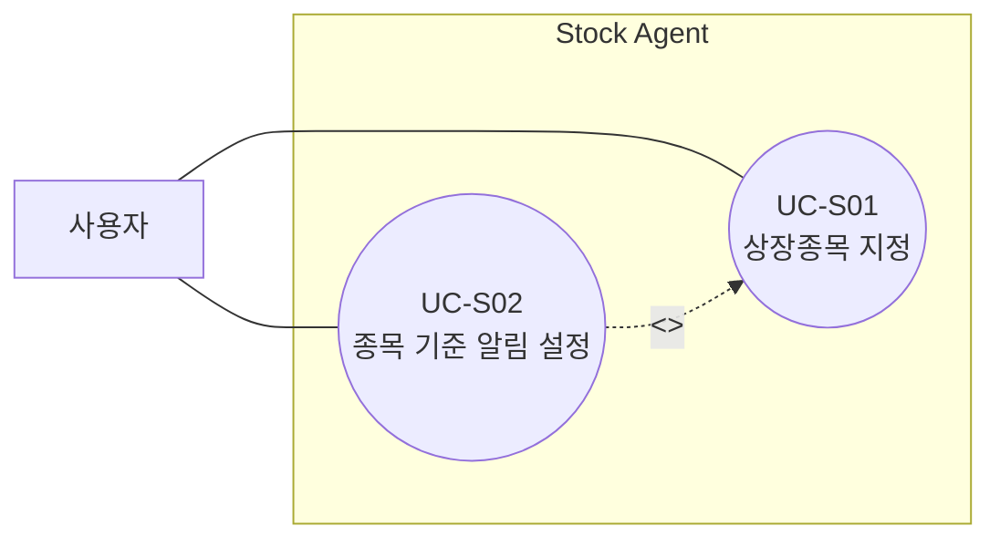
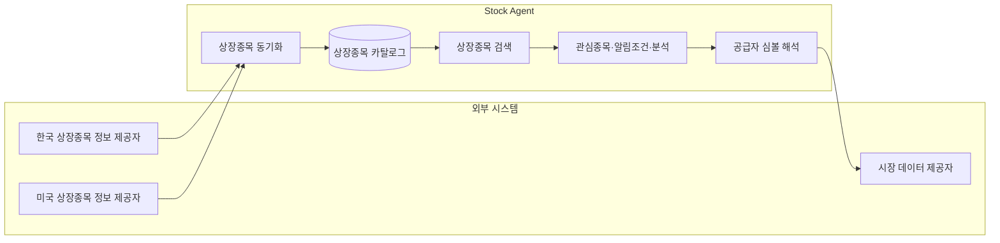
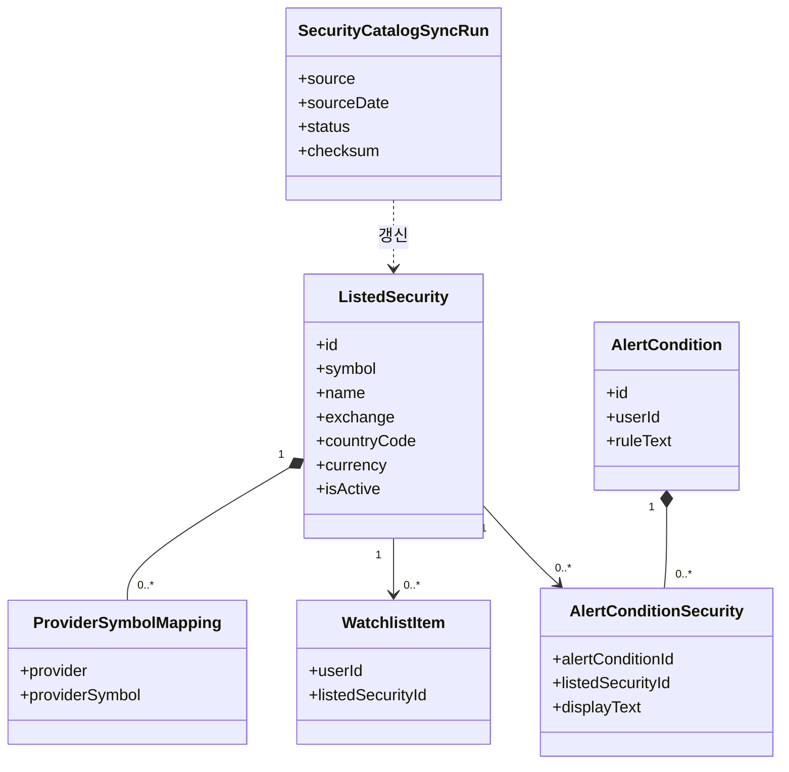
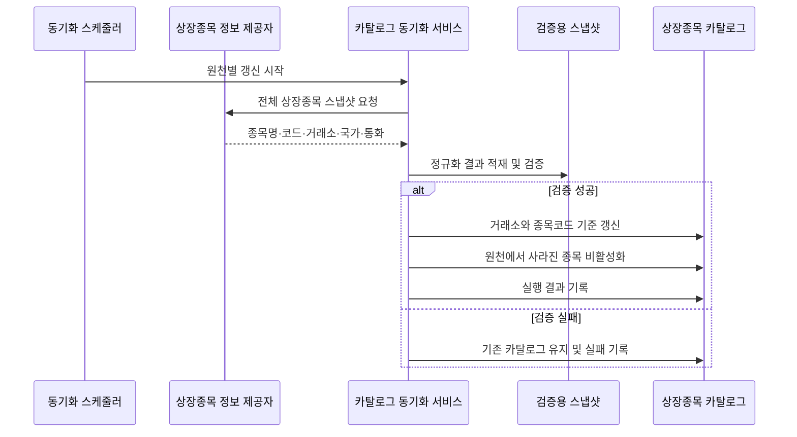
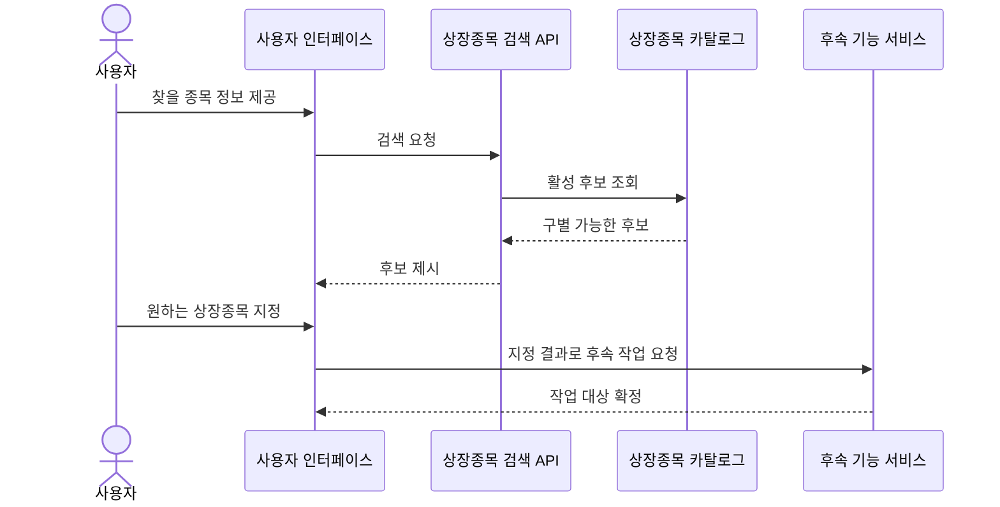
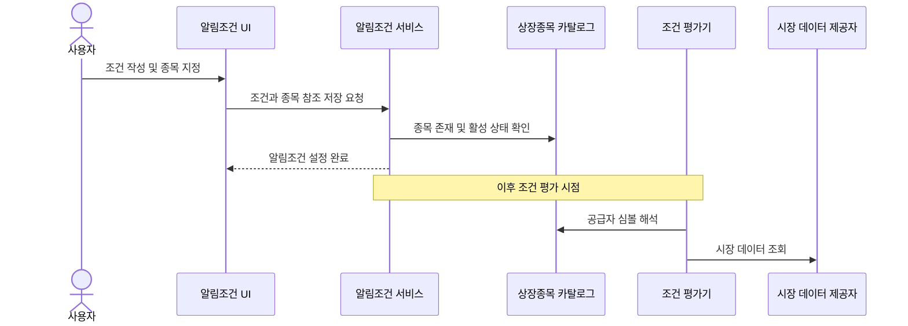

# 종목 지정 및 검색 기능 설계

## 1. 문서 목적

사용자가 거래소 종목코드나 외부 데이터 공급자의 심볼을 몰라도 원하는 상장종목을 찾고, 관심종목과 알림조건의 대상으로 정확히 지정할 수 있게 한다.

이 문서는 먼저 OOA 관점에서 사용자 목표와 외부에서 관찰 가능한 동작을 정의한다. 이후의 OOD 초안은 OOA에서 확정한 유스케이스와 기능 요구사항을 구현하기 위한 후보 설계이며, OOA 요구사항보다 우선하지 않는다.

이 문서에서 “추천”은 투자 종목 추천이 아니라 검색어와 일치하는 상장종목 후보 제시를 의미한다.

## 2. 범위와 시스템 경계

### 포함 범위

- 한국 KRX 및 미국 NASDAQ·NYSE 상장종목 찾기
- 종목명 전체·일부와 거래소 종목코드를 이용한 검색
- 찾은 상장종목을 관심종목으로 지정
- 알림조건의 대상 상장종목 지정
- 같은 이름 또는 코드의 후보를 구별할 정보 제공
- 종목명 변경과 상장폐지 상태 반영

### 제외 범위

- 수익률이나 AI 판단에 따른 투자 추천
- 미국 이외의 해외시장 동기화
- 실시간 시세 검색
- 자동 주문
- 다수 종목 범위를 한 번에 지정하는 시장·국가·산업 필터

### 시스템 경계

- **사용자**는 Stock Agent 밖에서 목표를 수행하는 주 액터다.
- **상장종목 정보 제공자**는 상장종목 원천 데이터를 제공하는 외부 시스템이다.
- 검색용 종목 저장소, 검색 서비스, 조건 평가기와 내부 식별자는 Stock Agent 내부 요소이므로 유스케이스 액터로 표현하지 않는다.

## 3. OOA — 사용자 목표와 요구사항

### 3.1 유스케이스 다이어그램



`UC-S02`에서 알림 대상을 정하려면 반드시 상장종목을 지정해야 하므로 `UC-S01`을 포함한다. 이 관계는 화면 이동이나 실행 순서를 나타내지 않고 공통 사용자 목표의 재사용을 뜻한다.

### 3.2 UC-S01 상장종목 지정

| 항목 | 내용 |
| --- | --- |
| ID | UC-S01 |
| 이름 | 상장종목 지정 |
| 목적 | 사용자는 종목코드를 몰라도 원하는 상장종목을 찾아 후속 작업의 대상으로 지정한다. |
| 주 액터 | 사용자 |
| 트리거 | 사용자가 관심종목 등록, 분석 조회 또는 알림 설정을 위해 종목 지정을 시작한다. |
| 사전조건 | 상장종목 정보가 검색 가능한 상태다. |

기본 흐름:

1. 사용자가 찾으려는 종목명 전체·일부 또는 알고 있는 종목코드를 제공한다.
2. 시스템이 입력과 일치하는 활성 상장종목 후보를 제시한다.
3. 사용자가 원하는 상장종목을 지정한다.
4. 시스템이 지정된 상장종목을 후속 작업의 대상으로 확정한다.

대안·예외 흐름:

- 2a. 일치하는 종목이 없으면 시스템은 결과가 없음을 알리고 다른 검색어를 제공할 수 있게 한다.
- 2b. 후보가 여러 개면 시스템은 사용자가 후보를 구별하는 데 필요한 종목코드, 거래소와 국가를 함께 제시한다.
- 2c. 더 이상 신규 지정할 수 없는 종목이면 시스템은 해당 상태를 알리고 활성 후보로 확정하지 않는다.
- 3a. 사용자가 지정을 취소하면 후속 작업의 대상은 변경되지 않는다.

성공 보장:

- 사용자가 지정한 하나의 활성 상장종목이 후속 작업의 대상으로 명확하게 확정된다.

### 3.3 UC-S02 종목 기준 알림 설정

| 항목 | 내용 |
| --- | --- |
| ID | UC-S02 |
| 이름 | 종목 기준 알림 설정 |
| 목적 | 사용자는 특정 상장종목을 명확하게 지정하여 해당 종목에 대한 알림조건을 설정한다. |
| 주 액터 | 사용자 |
| 트리거 | 사용자가 새 알림조건을 설정한다. |
| 사전조건 | 사용자가 알림조건을 관리할 수 있으며 상장종목을 지정할 수 있다. |

기본 흐름:

1. 사용자가 알림조건을 작성한다.
2. 사용자가 알림 대상 상장종목을 지정한다.
3. 사용자가 알림조건의 저장을 요청한다.
4. 시스템이 조건과 지정된 상장종목의 유효성을 검증한다.
5. 시스템이 알림조건을 저장한다.
6. 시스템이 해당 종목에 대한 알림조건이 설정되었음을 알린다.

대안·예외 흐름:

- 2a. 사용자는 종목 지정을 취소하고 조건 작성으로 돌아갈 수 있다.
- 4a. 종목이 지정되지 않았거나 더 이상 활성 상태가 아니면 시스템은 저장하지 않고 이유를 알린다.
- 4b. 조건 자체가 유효하지 않으면 시스템은 저장하지 않고 수정할 내용을 알린다.
- 5a. 동일한 조건의 중복이 허용되지 않는 경우 시스템은 기존 조건을 알리고 중복 저장하지 않는다.

성공 보장:

- 알림조건은 사용자가 확인하여 지정한 상장종목과 연결되어 저장된다.
- 시스템은 종목명을 추측하여 사용자가 지정하지 않은 종목을 조건에 연결하지 않는다.

### 3.4 기능 요구사항

유스케이스는 사용자 목표를 표현하고, 구체적인 입력 방식과 시스템 기능은 아래 요구사항으로 관리한다.

| ID | 요구사항 | 관련 유스케이스 |
| --- | --- | --- |
| FR-S01-01 | 사용자는 종목명 전체 또는 일부로 상장종목을 찾을 수 있어야 한다. | UC-S01 |
| FR-S01-02 | 사용자는 외부 조회 심볼을 몰라도 거래소 종목코드로 상장종목을 찾을 수 있어야 한다. | UC-S01 |
| FR-S01-03 | 시스템은 동명이거나 코드가 유사한 후보를 구별할 종목코드, 거래소와 국가를 제시해야 한다. | UC-S01 |
| FR-S01-04 | 시스템은 신규 지정 가능한 활성 상장종목만 확정해야 한다. | UC-S01 |
| FR-S01-05 | 시스템은 검색 결과가 없을 때 임의의 종목이나 외부 심볼을 생성하지 않아야 한다. | UC-S01 |
| FR-S02-01 | 사용자는 외부 조회 심볼을 알지 못해도 종목명으로 알림 대상 종목을 지정할 수 있어야 한다. | UC-S02 |
| FR-S02-02 | 시스템은 사용자가 후보를 명시적으로 확인한 경우에만 알림 대상 종목을 확정해야 한다. | UC-S02 |
| FR-S02-03 | 알림조건에서 종목 지정을 제거하면 저장되는 조건에서도 해당 종목 연결이 제거되어야 한다. | UC-S02 |
| FR-S02-04 | 종목명 변경 후에도 이미 저장된 알림조건은 같은 상장종목을 계속 가리켜야 한다. | UC-S02 |
| FR-M01-01 | 시스템은 한국과 미국 상장종목 정보를 서로 독립적으로 갱신할 수 있어야 한다. | UC-S01, UC-S02 지원 |
| FR-M01-02 | 비정상 원천 응답은 현재 사용 가능한 상장종목 정보를 훼손하지 않아야 한다. | UC-S01, UC-S02 지원 |
| FR-M01-03 | 상장폐지 후에도 기존 관심종목, 조건과 분석 이력의 종목 참조는 유지되어야 한다. | UC-S01, UC-S02 지원 |

## 4. UI·상호작용 요구사항

이 절은 유스케이스가 아니라 현재 UI에서 요구사항을 실현하는 한 가지 방법이다. UI가 바뀌어도 3장의 사용자 목표와 성공 보장은 유지되어야 한다.

### 4.1 일반 종목 검색


- 입력 중 일치 후보를 표시한다.
- 각 후보에는 종목명, 종목코드, 거래소와 국가를 함께 표시한다.
- 클라이언트가 `.KS`, `.KQ` 같은 데이터 공급자용 suffix를 만들지 않는다.

### 4.2 알림조건의 인라인 종목 지정


- `@` 입력은 단일 상장종목 후보를 찾는 UI 진입 방식으로 사용한다.
- 사용자가 후보를 선택하면 편집기는 종목명을 표시하되 선택 결과와 구조적으로 연결한다.
- 표시 토큰을 삭제하면 연결된 종목 지정도 제거한다.
- 일반 문장에 등장한 종목명은 사용자 확인 없이 자동 확정하지 않는다.

`#시장`, `#국가`, `#산업`처럼 여러 종목의 범위를 지정하는 기능은 단일 상장종목 지정과 의미가 다르므로 이번 범위에서 제외하고 별도 유스케이스로 분석한다.

## 5. OOD 초안 — 요구사항을 구현하는 구조

이 장부터 내부 구조를 다룬다. 내부 명칭, 테이블과 API는 구현 중 변경할 수 있지만 3장의 유스케이스와 기능 요구사항은 계속 만족해야 한다.

### 5.1 외부 연동과 내부 책임



상장종목 정보 제공자는 외부 시스템이고 상장종목 카탈로그는 Stock Agent 내부 저장소다. 둘을 모두 “종목 마스터”라고 부르지 않아 시스템 경계를 분명히 한다.

### 5.2 핵심 개념

| 개념 | 책임 | 근거 요구사항 |
| --- | --- | --- |
| `ListedSecurity` | 거래소에 상장된 하나의 금융상품을 안정적으로 식별한다. | FR-S01-03, FR-S02-04, FR-M01-03 |
| `SecurityCatalog` | 검색과 후속 참조에 사용할 상장종목 정보를 제공한다. | FR-S01-01~05 |
| `SecurityReference` | 관심종목이나 알림조건이 특정 상장종목을 가리키게 한다. | FR-S02-02~04 |
| `ProviderSymbolMapping` | 내부 상장종목을 외부 시장 데이터 공급자의 조회 심볼로 변환한다. | FR-S01-02 |
| `SecurityCatalogSyncRun` | 외부 원천 갱신의 기준일, 결과와 검증 상태를 기록한다. | FR-M01-01~02 |

### 5.3 도메인 및 데이터 관계



외부 공급자 심볼은 상장종목 자체의 식별자가 아니므로 별도 매핑으로 둔다. 관계 데이터는 내부 `listed_security_id`를 사용하고 외부 공급자를 호출할 때만 해당 매핑을 해석한다.

### 5.4 상장종목 카탈로그 동기화



운영 규칙:

- 한국과 미국 원천은 각각 독립적으로 실행한다.
- 빈 응답이나 비정상적인 종목 수 급감은 반영하지 않는다.
- 이름 변경은 같은 거래소·종목코드의 표시 이름을 갱신한다.
- 원천에서 사라진 종목은 삭제하지 않고 비활성화한다.
- 한 원천의 실패가 다른 원천의 반영을 막지 않는다.

### 5.5 검색과 후속 작업 연결



### 5.6 알림조건 저장과 평가



종목의 공급자 심볼 해석은 조건 저장이 아니라 실제 외부 데이터 조회 시점에 수행한다. 저장된 조건은 공급자 매핑이 변경되어도 같은 상장종목을 계속 참조한다.

## 6. 데이터 설계 후보

### 6.1 `listed_securities`

| 컬럼 | 설명 |
| --- | --- |
| `id` | 내부 상장종목 식별자 |
| `symbol` | 거래소 종목코드 또는 ticker |
| `name` | 현재 표시용 종목명 |
| `normalized_name` | 검색용 정규화 이름 |
| `market` | KOSPI, KOSDAQ, NASDAQ, NYSE 등 |
| `exchange` | 표준 거래소 코드 |
| `country_code` | KR, US |
| `currency` | KRW, USD |
| `security_type` | 주식, ETF, ETN 등 |
| `is_active` | 신규 지정 가능 여부 |
| `source_date` | 원천 기준일 |

제약 후보:

- `UNIQUE(exchange, symbol)`
- `INDEX(is_active, symbol)`
- `INDEX(is_active, normalized_name)`

### 6.2 `provider_symbol_mappings`

| 컬럼 | 설명 |
| --- | --- |
| `listed_security_id` | 내부 상장종목 참조 |
| `provider` | 시장 데이터 공급자 |
| `provider_symbol` | 해당 공급자의 조회 심볼 |

- `UNIQUE(listed_security_id, provider)`
- `UNIQUE(provider, provider_symbol)`

### 6.3 `watchlist_items`

- `user_id`
- `listed_security_id`
- `created_at`
- `UNIQUE(user_id, listed_security_id)`

### 6.4 `alert_condition_securities`

| 컬럼 | 설명 |
| --- | --- |
| `alert_condition_id` | 알림조건 참조 |
| `listed_security_id` | 사용자가 지정한 상장종목 참조 |
| `display_text` | 작성 당시 UI 표시 문자열 |

`display_text`는 표현 보존용이며 종목 식별에 사용하지 않는다.

### 6.5 `security_catalog_sync_runs`

원천, 기준일, checksum, 처리 건수, 검증 결과, 상태와 오류를 기록한다. 동일 원천 스냅샷의 중복 반영을 막고 실패 시 기존 카탈로그를 유지한다.

## 7. API 계약 후보

API는 내부 구현 예시이며 유스케이스 계약 자체가 아니다.

### 7.1 상장종목 검색

`GET /securities/search?q=애플&country=US&limit=10`

```json
{
  "items": [
    {
      "id": 205,
      "symbol": "AAPL",
      "name": "Apple Inc.",
      "market": "NASDAQ",
      "exchange": "XNAS",
      "country_code": "US"
    }
  ]
}
```

검색 정렬 후보:

1. 종목코드 완전 일치
2. 종목명 완전 일치
3. 종목명 접두 일치
4. 종목명 부분 일치
5. 동일 점수에서는 종목명순

활성 종목만 반환하며 기본 10개, 최대 20개로 제한한다.

### 7.2 관심종목 등록

`POST /users/me/watchlist`

```json
{
  "listed_security_id": 101
}
```

### 7.3 알림조건 저장

`POST /users/me/alert-conditions`

```json
{
  "rule_text": "@삼성전자가 5% 이상 하락하면 알려줘",
  "securities": [
    {
      "token": "@삼성전자",
      "listed_security_id": 101
    }
  ]
}
```

`user_id`는 요청 본문에서 받지 않고 인증 정보에서 결정한다. 서버는 상장종목의 존재 여부와 활성 상태를 검증한다.

## 8. 예외 및 운영 정책

| 상황 | 처리 | 근거 |
| --- | --- | --- |
| 같은 이름의 종목이 여러 개 | 종목코드·거래소·국가를 함께 제시 | FR-S01-03 |
| 검색 결과 없음 | 임의 심볼 생성 없이 결과가 없음을 안내 | FR-S01-05 |
| 상장폐지 종목 | 기존 참조와 이력은 유지하고 신규 지정에서 제외 | FR-S01-04, FR-M01-03 |
| 종목 지정 제거 | 알림조건의 구조화된 종목 참조도 제거 | FR-S02-03 |
| 종목명 변경 | 내부 참조는 유지하고 최신 표시명을 검색에 사용 | FR-S02-04 |
| 같은 ticker가 여러 거래소에 존재 | 거래소와 종목코드 조합으로 구분 | FR-S01-03 |
| 한 국가 원천 장애 | 기존 정보를 유지하고 다른 국가 갱신은 계속 | FR-M01-01~02 |
| 동기화 중 검색 | 마지막으로 검증 완료된 카탈로그를 조회 | FR-M01-02 |

## 9. 구현 순서

1. OOA 유스케이스와 FR 요구사항을 검토·확정한다.
2. 상장종목 카탈로그와 공급자 심볼 매핑을 추가한다.
3. 한국·미국 원천 어댑터와 검증 가능한 동기화 흐름을 구현한다.
4. FR-S01 요구사항을 만족하는 검색 API를 구현한다.
5. 관심종목 관계를 내부 상장종목 참조로 전환한다.
6. 일반 검색 UI를 적용하고 UC-S01 인수 테스트를 통과시킨다.
7. 알림조건의 구조화된 종목 지정을 구현하고 UC-S02 인수 테스트를 통과시킨다.
8. 분석·뉴스 조회 직전에 공급자 심볼을 해석하도록 전환한다.

## 10. 완료 기준

- 종목명 전체·일부와 종목코드로 같은 상장종목을 찾을 수 있다.
- 후보가 여러 개면 사용자가 구별할 정보를 제공한다.
- 결과가 없을 때 임의의 외부 심볼을 생성하지 않는다.
- 클라이언트가 데이터 공급자 suffix를 만들지 않아도 종목을 지정할 수 있다.
- 사용자가 확인한 종목만 관심종목 또는 알림조건의 대상으로 확정된다.
- 알림조건의 종목 표시를 제거하면 구조화된 종목 참조도 제거된다.
- 종목명 변경이나 상장폐지 후에도 기존 관심종목, 조건과 분석 이력의 참조가 유지된다.
- 한국과 미국 갱신이 서로 독립적으로 실패하고 재실행될 수 있다.
- 유스케이스 다이어그램에는 내부 저장소, 내부 ID, UI 단계 또는 처리 순서가 노출되지 않는다.
- 각 내부 설계 요소가 어떤 `UC-*` 또는 `FR-*` 요구사항을 구현하는지 설명할 수 있다.
