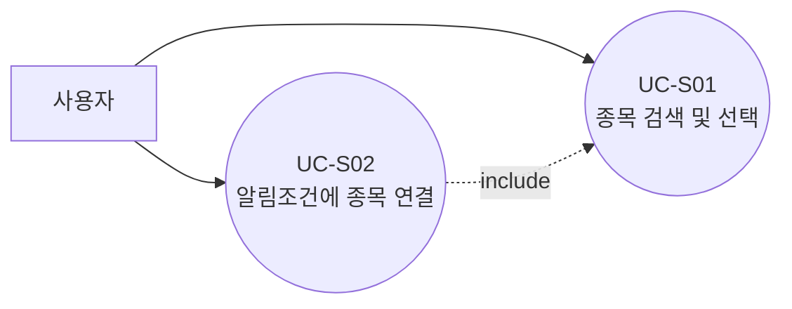
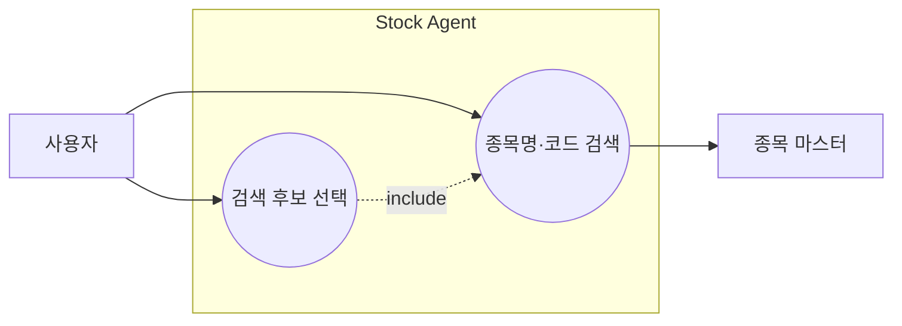
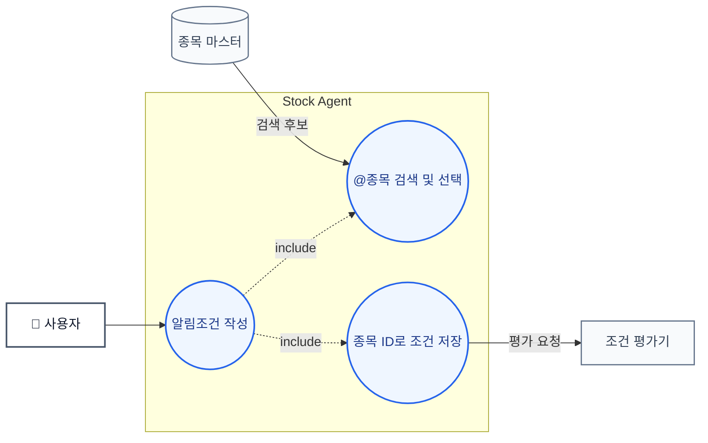
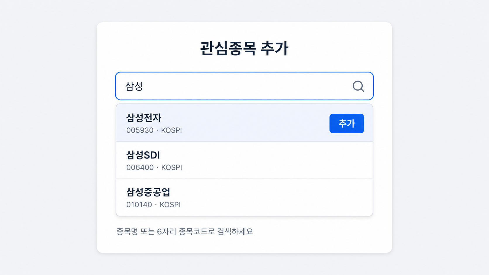
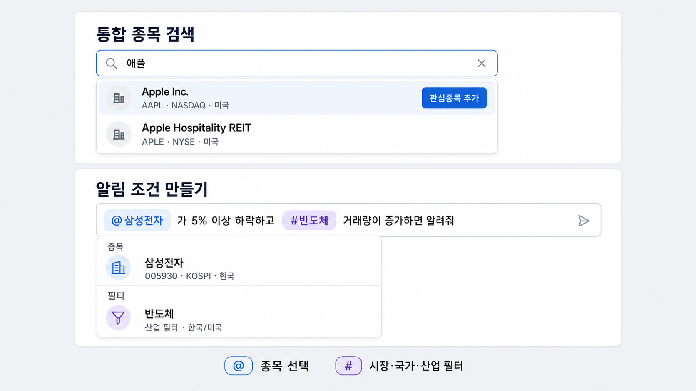
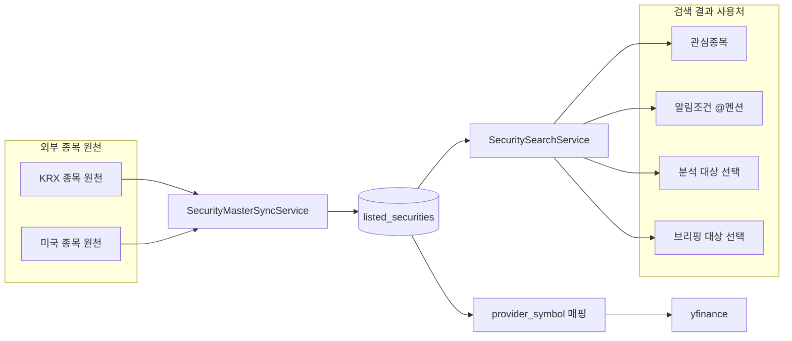
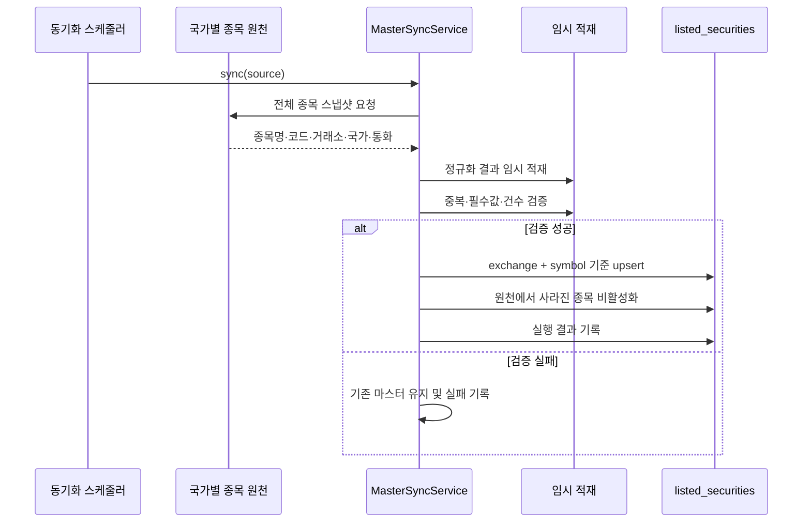
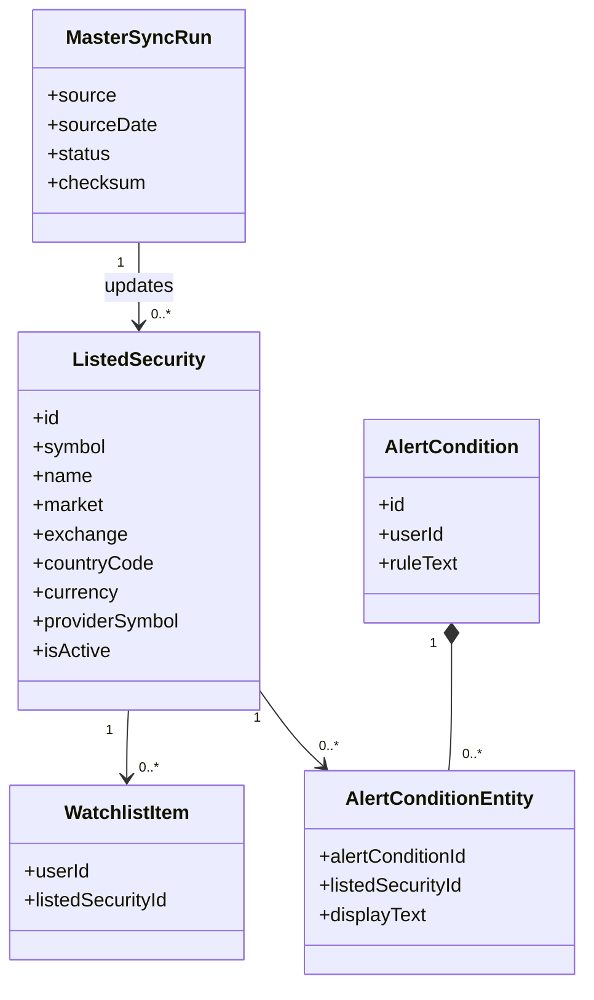
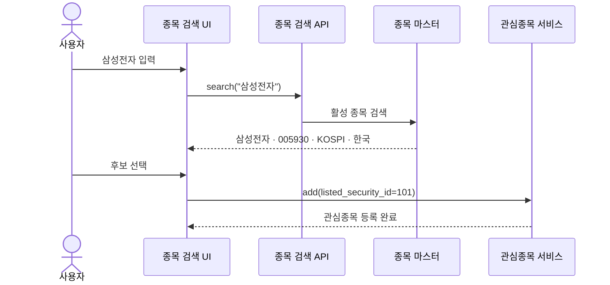
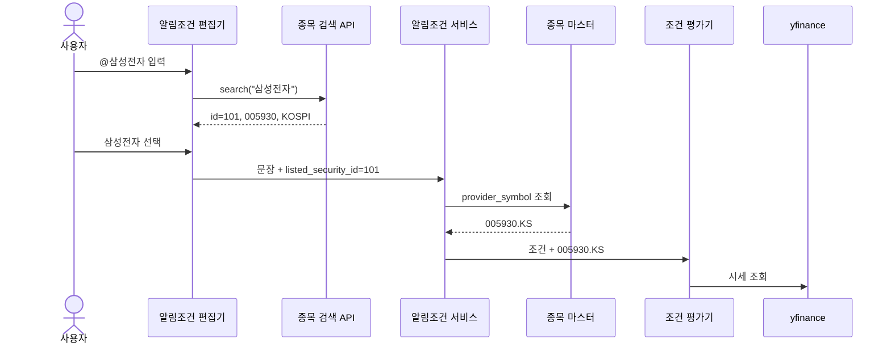

# 2. 종목명 자동검색·추천 기능 설계

## 1. 목적

현재 시스템은 관심종목과 알림조건에 `005930.KS` 같은 외부 조회 심볼을 직접 입력해야 한다. 이를 개선하여 사용자가 종목명 또는 거래소 종목코드만으로 한국·미국 종목을 찾고, 선택한 종목을 관심종목이나 알림조건에 연결할 수 있게 한다.

이 문서에서 “추천”은 투자 추천이 아니라 **검색어와 일치하는 상장종목 후보 제시**를 의미한다.

## 2. 범위

### 포함

- 한국 KRX 및 미국 NASDAQ·NYSE 종목 마스터 동기화
- 종목명·종목코드·거래소·국가 기반 검색
- 검색 후보를 통한 관심종목 등록
- 알림조건 문장 안의 `@종목` 검색과 종목 ID 연결
- `#시장`, `#국가`, `#산업` 범위 필터
- 종목명 변경과 상장폐지 반영

### 제외

- 수익률이나 AI 판단에 따른 투자 추천
- 미국 이외의 해외시장 동기화
- 실시간 시세 검색
- 자동 주문

## 3. 사용자 유즈케이스

### 3.1 유즈케이스 다이어그램



UC-S02는 알림조건 문장 안에서 종목 후보를 검색하고 하나를 선택해야 하므로 UC-S01을 포함한다. 관심종목 등록은 UC-S01의 선택 결과를 사용하는 후속 동작으로 보고 이 다이어그램에서는 별도 유즈케이스로 분리하지 않는다.

외부 종목 마스터 동기화는 사용자가 수행하는 기능이 아니므로 유즈케이스 다이어그램에서 제외하고 시스템 구조에서 설명한다.

### UC-S01 종목 검색 및 선택

#### UC-S01 유즈케이스 다이어그램



| 항목 | 내용 |
| --- | --- |
| 목적 | 종목코드를 몰라도 종목명으로 원하는 상장종목을 찾는다 |
| 입력 | 종목명 또는 거래소 종목코드 |
| 결과 | 사용자가 선택한 하나의 `listed_security_id` |

기본 흐름:

1. 사용자가 `삼성전자`, `005930`, `Apple`, `AAPL` 등을 입력한다.
2. 시스템이 활성 종목 마스터를 검색한다.
3. 종목명·코드·거래소·국가를 포함한 후보를 표시한다.
4. 사용자가 하나를 선택한다.
5. 선택한 종목 ID를 관심종목 등록 또는 분석 조회에 사용한다.

예외:

- 결과가 없으면 임의의 외부 심볼을 생성하지 않고 검색어 수정을 안내한다.
- 후보가 여러 개면 거래소와 국가를 함께 표시한다.
- 이미 등록된 관심종목이면 중복 생성하지 않고 기존 항목을 반환한다.

### UC-S02 알림조건에 종목 연결

#### UC-S02 유즈케이스 다이어그램



| 항목 | 내용 |
| --- | --- |
| 목적 | 알림조건에서 종목코드 대신 종목명을 사용한다 |
| 입력 | `@` 다음에 입력한 종목명 또는 코드 |
| 결과 | 알림조건 문장과 연결된 하나 이상의 `listed_security_id` |

기본 흐름:

1. 사용자가 알림조건에 `@삼성전자`처럼 입력한다.
2. 시스템이 커서 위치에 종목 후보를 표시한다.
3. 사용자가 `삼성전자 · 005930 · KOSPI · 한국`을 선택한다.
4. 편집기는 `@삼성전자` 토큰을 표시하고 내부 종목 ID를 연결한다.
5. 알림조건 저장 시 문장과 구조화된 종목 참조를 함께 전송한다.
6. 서버가 내부 종목 ID를 외부 조회 심볼로 변환해 조건 평가기에 전달한다.

예외:

- 종목을 선택하기 전에는 멘션을 확정하지 않는다.
- 멘션 토큰을 삭제하면 연결된 종목 ID도 제거한다.
- 비활성 종목은 신규 조건에 연결하지 않는다.
- 일반 문장 속 종목명은 후보를 제안할 수 있지만 사용자 확인 없이 자동 확정하지 않는다.

## 4. 화면 예시와 입력 규칙

### 4.1 일반 종목 검색



화면은 종목명, 종목코드, 시장을 함께 보여준다. 클라이언트는 `.KS`, `.KQ` 같은 공급자 suffix를 만들지 않고 선택한 `listed_security_id`만 서버에 전달한다.

### 4.2 알림조건의 인라인 종목 검색



| 입력 | 의미 | 저장 값 |
| --- | --- | --- |
| `@삼성전자` | 단일 종목 | `listed_security_id` |
| `@Apple` | 검색 후 확정한 단일 해외 종목 | `listed_security_id` |
| `#KOSPI` | 시장 범위 | `MARKET=KOSPI` |
| `#미국` | 국가 범위 | `COUNTRY=US` |
| `#반도체` | 산업 범위 | 표준 산업 ID |

`@`는 하나의 종목을 가리키고 `#`는 여러 종목의 범위를 가리킨다.

## 5. 전체 시스템 구조



### 5.1 식별자와 외부 코드의 구분

| 구분 | 삼성전자 | Apple | 용도 |
| --- | --- | --- | --- |
| 표시 종목명 | `삼성전자` | `Apple Inc.` | 화면과 검색 |
| 거래소 종목코드 | `005930` | `AAPL` | 종목 원천의 코드 |
| 내부 종목 ID | `101` | `205` | 관심종목·알림조건·분석 관계 |
| 외부 조회 심볼 | `005930.KS` | `AAPL` | yfinance 호출 |

기능 간 관계는 내부 종목 ID로 저장한다. 외부 조회 심볼은 공급자 호출 직전에 종목 마스터에서 조회한다.

### 5.2 종목 마스터 동기화

한국과 미국 원천은 서로 다른 어댑터로 수집하지만 하나의 공통 종목 마스터에 저장한다.



운영 규칙:

- 한국과 미국 동기화는 각각 독립적으로 실행한다.
- 빈 응답이나 비정상적인 종목 수 급감은 반영하지 않는다.
- 종목명 변경은 같은 거래소·코드의 이름을 갱신한다.
- 원천에서 사라진 종목은 삭제하지 않고 `is_active=false`로 변경한다.
- 한 원천의 실패가 다른 원천의 반영을 막지 않는다.

## 6. 도메인 및 데이터 모델



### 6.1 `listed_securities`

| 컬럼 | 설명 |
| --- | --- |
| `id` | 내부 종목 식별자 |
| `symbol` | 거래소 종목코드 또는 ticker |
| `name` | 표시용 종목명 |
| `normalized_name` | 검색용 정규화 이름 |
| `market` | KOSPI, KOSDAQ, NASDAQ, NYSE 등 |
| `exchange` | 표준 거래소 코드 |
| `country_code` | KR, US |
| `currency` | KRW, USD |
| `security_type` | 주식, ETF, ETN 등 |
| `provider_symbol` | yfinance 조회 심볼 |
| `is_active` | 신규 검색·등록 가능 여부 |
| `source_date` | 원천 기준일 |

제약:

- `UNIQUE(exchange, symbol)`
- `INDEX(is_active, symbol)`
- `INDEX(is_active, normalized_name)`

### 6.2 `watchlist_items`

- `user_id`
- `listed_security_id`
- `created_at`
- `UNIQUE(user_id, listed_security_id)`

### 6.3 `alert_condition_entities`

| 컬럼 | 설명 |
| --- | --- |
| `alert_condition_id` | 알림조건 |
| `listed_security_id` | 선택한 종목 |
| `display_text` | 작성 당시 표시명 |

한 알림조건에서 여러 종목을 참조할 수 있으므로 기존 단일 `symbol` 컬럼만으로는 충분하지 않다.

### 6.4 `master_sync_runs`

원천, 기준일, checksum, 처리 건수, 상태와 오류를 기록한다. 동일 원천 스냅샷의 중복 반영을 막는다.

## 7. 상세 처리 흐름

### 7.1 검색과 관심종목 등록



### 7.2 알림조건의 종목명과 외부 코드 연결



`@삼성전자`는 단순 문자열이 아니라 내부 종목 ID와 연결된 토큰이다. 조건 평가기는 종목명을 다시 추측하지 않는다.

## 8. 검색 규칙과 API

### 8.1 검색 정렬

1. 종목코드 완전 일치
2. 종목명 완전 일치
3. 종목명 접두 일치
4. 종목명 부분 일치
5. 동일 점수에서는 종목명순

활성 종목만 반환하며 기본 10개, 최대 20개로 제한한다.

### 8.2 종목 검색

`GET /securities/search?q=애플&country=US&limit=10`

```json
{
  "items": [
    {
      "id": 205,
      "symbol": "AAPL",
      "name": "Apple Inc.",
      "market": "NASDAQ",
      "exchange": "XNAS",
      "country_code": "US"
    }
  ]
}
```

관심종목, 알림조건 멘션, 분석 대상과 브리핑 대상 선택에서 같은 API를 사용한다.

### 8.3 관심종목 등록

`POST /users/me/watchlist`

```json
{
  "listed_security_id": 101
}
```

### 8.4 알림조건 저장

`POST /users/me/alert-conditions`

```json
{
  "rule_text": "@삼성전자가 5% 이상 하락하면 알려줘",
  "entities": [
    {
      "token": "@삼성전자",
      "type": "SECURITY",
      "listed_security_id": 101
    }
  ]
}
```

`user_id`는 요청 본문에서 받지 않고 인증 정보에서 결정한다. 서버는 종목 ID의 존재 여부와 활성 상태를 검증한다.

## 9. 예외 및 운영 정책

| 상황 | 처리 |
| --- | --- |
| 같은 이름의 종목이 여러 개 | 코드·거래소·국가를 함께 표시 |
| 검색 결과 없음 | 임의 심볼 생성 없이 검색어 수정 안내 |
| 상장폐지 종목 | 기존 관심종목·조건·분석은 유지하고 신규 선택에서 제외 |
| 멘션 토큰 삭제 | 연결된 종목 참조도 함께 삭제 |
| 종목명 변경 | 내부 ID는 유지하고 최신 표시명 사용 |
| 같은 ticker가 여러 거래소에 존재 | `(exchange, symbol)`로 구분 |
| KRX 원천 장애 | 기존 한국 마스터 유지, 미국 동기화는 계속 |
| 미국 원천 장애 | 기존 미국 마스터 유지, 한국 동기화는 계속 |
| 동기화 중 검색 | 마지막으로 확정된 마스터 버전 조회 |
| 비정상 원천 스냅샷 | 반영하지 않고 실패 기록 |

## 10. 현재 코드와 구현 순서

현재 코드는 사용자가 입력한 문자열에 `.KS`를 붙여 관심종목으로 저장하고, 알림조건도 `symbol` 문자열을 별도로 받는다. 종목명 검색과 마스터 동기화는 아직 구현되어 있지 않다.

권장 순서:

1. `listed_securities`, `master_sync_runs` 추가
2. KRX·미국 종목 원천 어댑터 및 동기화 서비스 구현
3. 종목 검색 API 구현
4. 관심종목을 `listed_security_id` 참조로 전환
5. 공통 자동완성 UI를 관심종목 화면에 적용
6. 알림조건 편집기에 `@종목` 토큰과 `alert_condition_entities` 적용
7. 분석·뉴스 조회 직전에 `provider_symbol`을 해석하도록 변경

## 11. 완료 기준

- `삼성전자`와 `005930`이 같은 한국 종목을 반환한다.
- `Apple`과 `AAPL`이 같은 미국 종목을 반환한다.
- 검색 결과에 종목명·코드·거래소·국가가 표시된다.
- 클라이언트가 `.KS`, `.KQ`를 만들지 않아도 관심종목을 등록할 수 있다.
- `@삼성전자`를 선택하면 알림조건에 내부 종목 ID가 저장된다.
- 조건 평가 시 내부 종목 ID가 `005930.KS`로 변환된다.
- `#반도체`와 `#KOSPI`가 단일 종목으로 해석되지 않는다.
- 한국과 미국 동기화가 서로 독립적으로 실패·재실행될 수 있다.
- 상장폐지 후에도 기존 관심종목과 분석 이력의 종목 참조가 유지된다.
