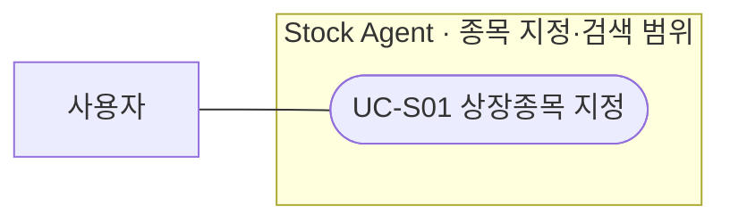
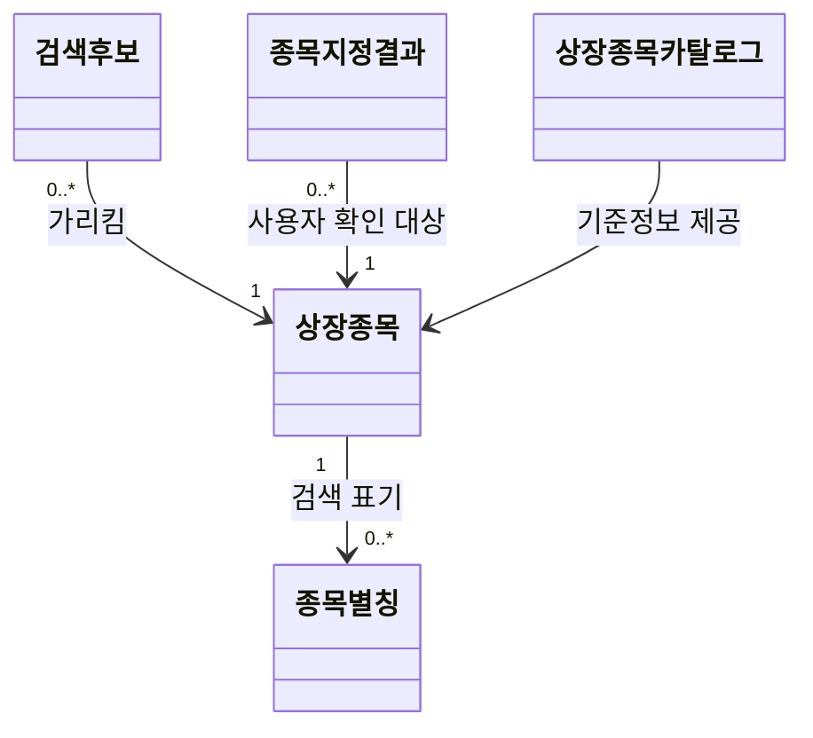
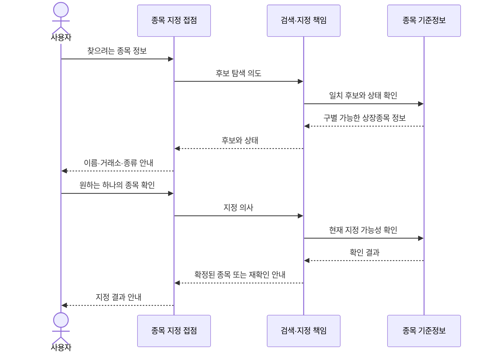
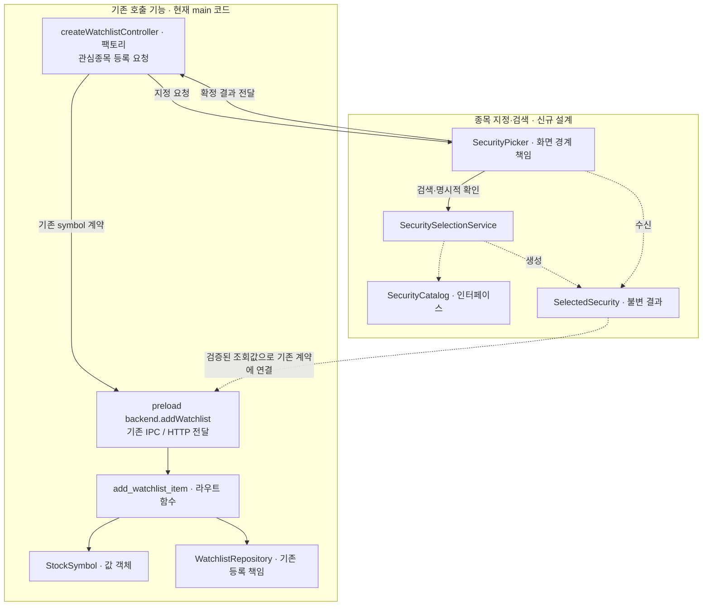
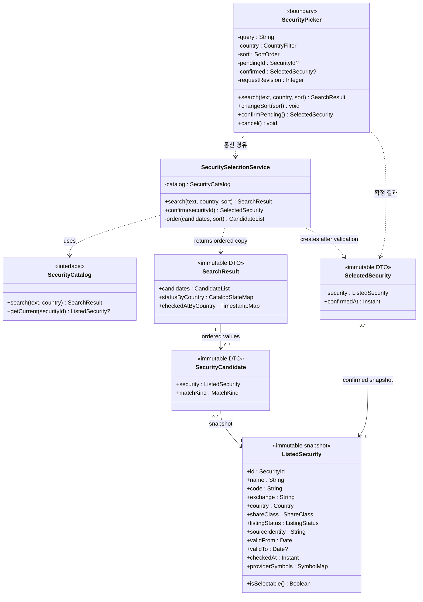
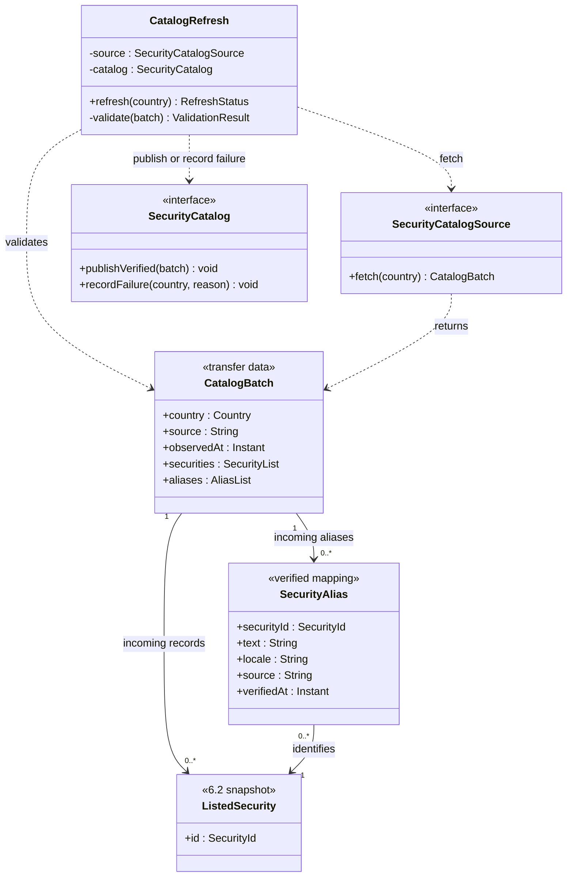

# 종목 지정·검색 독립 설계

2026-09-28 · v2.2 클래스 협력·상세 설계 보완 · [공유용 다이어그램·화면 예시](stock_matching_review.html)

**목표:** 사용자가 종목명·코드·검증된 별칭으로 후보를 찾고, 원하는 하나의 상장종목을 명확히 지정한다. 이 기능의 결과는 **확정한 종목 정보**다.

이전 v2에서 추가했던 구독 관리·브리핑 대상 정책·웹 적용 순서·알림 범위는 이번 설계에서 제거했다. 해당 기능은 종목 지정 결과를 사용하는 호출자로만 취급한다. 이번 작업은 설계 수정이며 제품 기능 변경이 아니다.

## 1. 확정 범위와 기준

| 항목 | 결정 |
| --- | --- |
| 지원 범위 | **한국·미국 주식**. 사용자 D3=A 확정. 보통주·우선주는 구별하고 ETF·ETN은 이번 범위에서 제외 |
| 검색 입력 | 종목명 전체·일부, 거래소 코드/티커, 검증된 별칭 |
| 해외 한글 검색 | **검증된 한글 별칭 지원**. 사용자 D4=A 확정. 예: 등록된 ‘애플’ 별칭으로 해당 후보 탐색 |
| 확정 방법 | 후보를 사용자가 명시적으로 확인. 1건만 검색되어도 자동 확정하지 않음 |
| 반환 결과 | 사용자가 지정한 하나의 종목과 구별 정보. 취소·실패는 이전 대상을 유지 |
| 후속 기능과의 경계 | 관심종목 등록, 알림 설정, 브리핑 등은 결과를 전달받아 각자의 기존 규칙으로 처리 |

이전 선택 질문 **D1(웹/Electron), D2(알림 대상 범위), D5(재등록 시 브리핑 복원)는 폐기**한다. 구독·알림·브리핑 정책은 이 설계에서 변경하지 않는다. 특정 화면 기술이나 클라이언트 이관을 선행조건으로 삼지 않는다.

기존 설계: [PR #23](https://github.com/PhilPark-geosr/stock-agent/pull/23), `d9c0246`. 코드 비교 기준은 2026-09-28 확인한 `main`의 `12ba6a4`다. 기존 PR에 있던 알림조건 자체의 설계는 이번 독립 명세에서 다루지 않는다.

### 현재 코드 때문에 보완할 부분

| 현재 코드에서 확인한 것 | 검색·지정 기능의 보완 |
| --- | --- |
| 화면 검색은 현재 등록 목록에서 심볼/표시값이 일치하는 첫 항목을 찾음 | 전체 지원 종목의 카탈로그를 검색하고 구별 가능한 후보를 제시 |
| 등록 시 main은 점 없는 입력에 `.KS`를 붙임 | 입력 문자열로 거래소를 추정하지 않고, 후보의 검증된 코드·거래소를 사용 |
| `StockSymbol`은 공백 제거·대문자 변환을 하는 값 객체 | 문자열 정규화와 실제 상장종목 존재·상태 검증을 구분 |
| 후속 API가 `symbol`을 받음 | 확정 결과를 현재 계약에 맞춰 전달하는 경계만 제시. 후속 저장 구조 전체를 전환하지 않음 |

근거: [화면 검색·등록](https://github.com/PhilPark-geosr/stock-agent/blob/12ba6a4766565b3218a146dabf9c7c40a1c912b7/desktop-demo/src/controllers/watchlist-controller.js#L44), [심볼 값 객체](https://github.com/PhilPark-geosr/stock-agent/blob/12ba6a4766565b3218a146dabf9c7c40a1c912b7/app/domain/symbols.py), [현재 등록 계약](https://github.com/PhilPark-geosr/stock-agent/blob/12ba6a4766565b3218a146dabf9c7c40a1c912b7/app/api/routes.py#L253).

## 2. OOA — 하나의 사용자 목표

### 시스템 경계

주 액터는 사용자다. 상장종목 정보 제공자는 검색 기준정보를 공급하는 실제 외부 시스템이다. 카탈로그·매칭 처리·선택 검증은 내부 책임이다. 유스케이스 그림에는 사용자와 목표의 관계만 나타낸다. 검색·클릭·저장이나 내부 ID 전달을 독립 유스케이스로 만들지 않는다.

```mermaid
flowchart LR
  U["사용자"]
  subgraph S["Stock Agent · 종목 지정·검색 범위"]
    UC(["UC-S01 상장종목 지정"])
  end
  U --- UC
```

### UC-S01 · 상장종목 지정

| 항목 | 명세 |
| --- | --- |
| ID | UC-S01 |
| 이름 | 상장종목 지정 |
| 목적 | 사용자가 원하는 상장종목을 후속 작업의 대상으로 정확히 정한다. |
| 주 액터 | 사용자 |
| 트리거 | 사용자가 종목을 지정하려 한다. |
| 사전조건 | 서비스를 이용할 수 있고 사용 가능한 상장종목 정보가 있다. |
| 기본 흐름 | ① 사용자가 알고 있는 종목명·코드 등을 제공한다. ② 시스템이 일치하는 후보와 구별 정보를 제시한다. ③ 사용자가 원하는 하나의 종목을 확인한다. ④ 시스템이 지정된 종목을 작업 대상으로 확정했음을 알린다. |
| 대안·예외 | 일치 없음은 다른 입력을 안내한다. 후보가 여러 개면 거래소·국가·주식 종류로 구별한다. 더 이상 신규 지정할 수 없는 종목은 이유를 알리고 확정하지 않는다. 정보 확인이 불가능하면 ‘결과 없음’과 구분한다. 사용자가 취소하면 기존 대상은 바뀌지 않는다. |
| 성공 보장 | 사용자가 확인한 하나의 유효한 상장종목이 대상으로 정해진다. 시스템이 첫 후보나 문장 속 이름을 임의로 확정하지 않는다. |

## 3. 기능 요구사항

| ID | 요구사항 | 추적 |
| --- | --- | --- |
| FR-S01-01 | 종목명 전체·일부로 후보를 찾을 수 있다. | UC-S01 |
| FR-S01-02 | 거래소 코드·티커로 찾을 수 있고, 외부 조회 suffix를 사용자가 만들 필요가 없다. | UC-S01 |
| FR-S01-03 | 이름·코드·거래소·국가·주식 종류로 후보를 구별한다. | UC-S01 |
| FR-S01-04 | 신규 지정 가능한 종목만 확정하며 확정 시 현재 상태를 다시 검증한다. | UC-S01 |
| FR-S01-05 | 결과가 없을 때 임의 종목·심볼을 생성하지 않는다. | UC-S01 |
| FR-S01-06 | 검증된 한글 별칭으로 해외 주식 후보를 찾는다. 오타·자동 번역·모델 추측으로 대상을 확정하지 않는다. | UC-S01, D4=A |
| FR-S01-07 | 명시적 사용자 확인 후에만 지정 결과를 반환한다. 취소 또는 실패하면 새 지정 결과를 반환하지 않는다. | UC-S01 |
| FR-S01-08 | 확정 결과는 어느 기능에서 요청했는지와 독립적인 종목 정보이며, 호출한 기능의 등록·조건·수신 상태를 변경하지 않는다. | UC-S01 |
| FR-S01-09 | 후보를 관련도순, 표시 이름 오름차순·내림차순, 코드 오름차순으로 정렬한다. 순서 변경으로 자동 지정하거나 선택 대상을 바꾸지 않는다. | UC-S01, 사용자 정렬 요청 |
| FR-M01-01 | 한국·미국 주식 정보를 독립적으로 갱신할 수 있다. | UC-S01 지원, D3=A |
| FR-M01-02 | 비정상 원천 응답은 마지막 유효 정보를 훼손하지 않는다. 지연·장애와 정상 결과 없음을 구별한다. | UC-S01 지원 |
| FR-M01-03 | 이름 변경·상장 상태 변경을 반영하되 코드 재사용을 같은 종목으로 오인하지 않는다. 과거 식별 기록을 덮어쓰지 않는다. | UC-S01 지원 |

## 4. 도메인 — 입력·후보·확정 결과를 구별

- **상장종목:** 거래소에 상장된 하나의 주식. 발행사가 같아도 보통주와 우선주는 별개다.
- **종목 별칭:** 검증된 다른 표기. 같은 별칭이 여러 후보에 대응할 수 있다.
- **검색 후보:** 입력과 대응하는 상장종목. 후보 순위는 투자 추천이 아니다.
- **종목 지정 결과:** 사용자가 확인한 종목의 식별·표시 정보. 관심종목 등록이나 알림 설정의 완료를 뜻하지 않는다.

```mermaid
classDiagram
  상장종목 "1" --> "0..*" 종목별칭 : 검색 표기
  검색후보 "0..*" --> "1" 상장종목 : 가리킴
  종목지정결과 "0..*" --> "1" 상장종목 : 사용자 확인 대상
  상장종목카탈로그 --> 상장종목 : 기준정보 제공
```

같은 이름·별칭의 후보를 하나로 합치지 않는다. 이름 변경만으로 종목 정체성이 바뀌지 않으며, 과거 종목의 코드가 새 종목에 재사용되면 별도로 구별한다. 여기서 구독·브리핑·알림의 도메인 관계는 재설계하지 않는다.

## 5. 관계 중심 시퀀스

메서드·매개변수·SQL·저장 순서 없이 책임 사이의 관계만 표시한다.

```mermaid
sequenceDiagram
  actor U as 사용자
  participant I as 종목 지정 접점
  participant S as 검색·지정 책임
  participant C as 종목 기준정보
  U->>I: 찾으려는 종목 정보
  I->>S: 후보 탐색 의도
  S->>C: 일치 후보와 상태 확인
  C-->>S: 구별 가능한 상장종목 정보
  S-->>I: 후보와 상태
  I-->>U: 이름·거래소·종류 안내
  U->>I: 원하는 하나의 종목 확인
  I->>S: 지정 의사
  S->>C: 현재 지정 가능성 확인
  C-->>S: 확인 결과
  S-->>I: 확정된 종목 또는 재확인 안내
  I-->>U: 지정 결과 안내
```

경계에서 호출 기능은 `확정된 종목 / 취소 / 실패` 중 하나를 전달받는다. 확정된 종목을 관심종목에 등록할지, 조건에 연결할지, 분석에 사용할지는 그 호출 기능의 책임이다. 이것들은 본 시퀀스의 내부 처리 단계가 아니다.

## 6. OOD — 주변 연결과 상세 클래스 설계

이 절은 합의된 종목 지정 범위와 정렬 요청을 구체화한 **구현 전 설계**다. 현재 제품 코드에 아래 클래스가 이미 존재한다는 뜻은 아니다. 5절의 최초 시퀀스는 관계 중심으로 유지하고, 속성·오퍼레이션은 이 절에 별도로 기술한다. 클래스 이름은 책임을 식별하며 파일 수나 프로세스 수를 정하지 않는다.

### 6.1 주변 코드와의 협력 관계

기존 연결부는 클래스가 아닌 함수·팩토리도 있으므로 **연결 구조도**로 표시한다. 아래 관심종목 등록은 현재 코드에 연결하는 예시다. 적용 순서나 구독 정책을 새로 정하는 그림이 아니다.

```mermaid
flowchart TB
  subgraph EXISTING["기존 호출 기능 · 현재 main 코드"]
    W["createWatchlistController · 팩토리\n관심종목 등록 요청"]
    B["preload backend.addWatchlist\n기존 IPC / HTTP 전달"]
    R["add_watchlist_item · 라우트 함수"]
    SY["StockSymbol · 값 객체"]
    WR["WatchlistRepository · 기존 등록 책임"]
    W -->|기존 symbol 계약| B
    B --> R
    R --> SY
    R --> WR
  end
  subgraph NEW["종목 지정·검색 · 신규 설계"]
    UI["SecurityPicker · 화면 경계 책임"]
    S["SecuritySelectionService"]
    C["SecurityCatalog · 인터페이스"]
    OUT["SelectedSecurity · 불변 결과"]
    UI -->|검색·명시적 확인| S
    S -.-> C
    S -.->|생성| OUT
    UI -.->|수신| OUT
  end
  W -->|지정 요청| UI
  UI -->|확정 결과 전달| W
  OUT -.->|검증된 조회값으로 기존 계약에 연결| B
```

- `SecurityPicker`는 화면의 상태·검색 요청·정렬·명시적 확인을 맡는 경계 책임이다. 특정 UI 프레임워크의 클래스 선언을 강제하지 않는다. 서버와의 요청 전달은 기존 bridge/라우트 방식을 재사용한다. 이 구조도에서는 그 검색용 전달 경로를 생략했다.
- `createWatchlistController`의 등록 입력 처리에 지정 결과를 연결한다. 현재 등록 목록 안에서 찾는 `search-form`과 `selectStock()`은 기존 목록 탐색 책임이며 전체 종목 검색과 구별한다.
- `SelectedSecurity`는 데이터를 전달할 뿐 `backend.addWatchlist()`를 직접 호출하지 않는다. 구조도의 점선은 데이터 이용 관계다. 실제 후속 호출은 호출 기능이 수행한다.
- 기존 API용 조회값은 `ListedSecurity.providerSymbols`의 검증된 대응값을 사용한다. 없으면 연결 불가를 알린다. `StockSymbol.of()`는 기존 정규화만 담당하며 종목 존재 검증을 대체하지 않는다. 클라이언트가 `.KS`를 추정하지 않는다.
- 알림·분석 등 다른 호출 기능도 같은 지정 결과를 받을 수 있다. 여기서 그 내부 클래스·상태 전이·등록 권한을 변경하지 않는다.

### 6.2 상세 클래스 — 검색·정렬·확정

표기: `+` 공개 책임, `-` 내부 상태/보조 책임. 점선 화살표는 사용 또는 생성 의존성, 실선과 숫자는 연관·다중성이다. 인터페이스는 구현체를 요구하는 계약이다. 불변 DTO의 실선은 **응답 안의 값 관계**이며 DB 외래키나 살아 있는 엔티티 참조가 아니다. 수명 소유권을 확정하지 않았으므로 합성(검은 마름모)을 사용하지 않는다.

```mermaid
classDiagram
  class SecurityPicker {
    <<boundary>>
    -query : String
    -country : CountryFilter
    -sort : SortOrder
    -pendingId : SecurityId?
    -confirmed : SelectedSecurity?
    -requestRevision : Integer
    +search(text, country, sort) SearchResult
    +changeSort(sort) void
    +confirmPending() SelectedSecurity
    +cancel() void
  }
  class SecuritySelectionService {
    -catalog : SecurityCatalog
    +search(text, country, sort) SearchResult
    +confirm(securityId) SelectedSecurity
    -order(candidates, sort) CandidateList
  }
  class SecurityCatalog {
    <<interface>>
    +search(text, country) SearchResult
    +getCurrent(securityId) ListedSecurity?
  }
  class SearchResult {
    <<immutable DTO>>
    +candidates : CandidateList
    +statusByCountry : CatalogStateMap
    +checkedAtByCountry : TimestampMap
  }
  class SecurityCandidate {
    <<immutable DTO>>
    +security : ListedSecurity
    +matchKind : MatchKind
  }
  class ListedSecurity {
    <<immutable snapshot>>
    +id : SecurityId
    +name : String
    +code : String
    +exchange : String
    +country : Country
    +shareClass : ShareClass
    +listingStatus : ListingStatus
    +sourceIdentity : String
    +validFrom : Date
    +validTo : Date?
    +checkedAt : Instant
    +providerSymbols : SymbolMap
    +isSelectable() Boolean
  }
  class SelectedSecurity {
    <<immutable DTO>>
    +security : ListedSecurity
    +confirmedAt : Instant
  }
  SecurityPicker ..> SecuritySelectionService : 통신 경유
  SecurityPicker ..> SelectedSecurity : 확정 결과
  SecuritySelectionService ..> SecurityCatalog : uses
  SecuritySelectionService ..> SearchResult : returns ordered copy
  SecuritySelectionService ..> SelectedSecurity : creates after validation
  SearchResult "1" --> "0..*" SecurityCandidate : ordered values
  SecurityCandidate "0..*" --> "1" ListedSecurity : snapshot
  SelectedSecurity "0..*" --> "1" ListedSecurity : confirmed snapshot
```

`SecurityPicker` → 서비스는 논리적인 의존성이다. 실제 클라이언트/서버 사이에서는 기존 통신 경계를 통과하며 서버 객체를 클라이언트가 직접 보유하지 않는다. 별도의 검색 전송 클래스까지 미리 추가하지 않는다.

| 계약 | 동작·예외와 근거 |
| --- | --- |
| `search(text, country, sort)` | 카탈로그가 이름·코드·검증된 별칭으로 후보를 찾고 일치 종류를 붙인다. 서비스가 정렬한 새 결과를 반환한다. 정상 0건과 국가별 정보 확인 불가를 구분한다. S01-01~06/09, M01-02 |
| `getCurrent(securityId)` | 존재하지 않는 식별값은 없음으로 반환한다. 기준정보 이용 불가는 별도 오류로 전달하며 없음과 혼동하지 않는다. 마지막 유효 자료를 사용하는 경우 확인 시점도 반환한다. S01-04/05, M01-02 |
| `order(candidates, sort)` | 관련도 또는 이름·코드 정렬 중 선택한 기준만 적용한다. 동점 규칙은 10절. 독립 정책 클래스는 현재 필요하지 않아 서비스의 보조 책임으로 둔다. S01-09 |
| `confirm(securityId)` | 현재 카탈로그에서 동일 식별값을 다시 조회하고 한국·미국 주식 범위 및 신규 지정 가능 상태를 확인한 뒤 결과를 생성한다. 없거나 지정 불가·정보 확인 불가이면 이유를 반환하고 확정 결과는 생성하지 않는다. S01-04/05/07 |
| `isSelectable()` | 지원 국가·주식 종류와 상장 상태로 판단한다. 정보 신뢰성/갱신 장애는 카탈로그의 상태 계약에서 처리하며 이 메서드가 원천을 조회하지 않는다. S01-03/04 |
| `SecurityPicker` 상태 | 후보 표시와 확정 결과를 분리한다. 선택은 행 번호가 아닌 종목 식별값으로 유지한다. 정렬 후에도 동일 후보를 유지하고, 검색 조건에서 제외되면 미확정 선택만 해제한다. 이전 요청 응답은 revision으로 무시한다. 취소·오류는 기존 확정 결과를 보존한다. S01-07/09, 7절 UI |

자료형 의미: `Country=KR/US`, `CountryFilter=ALL/KR/US`, `SortOrder=RELEVANCE/NAME_ASC/NAME_DESC/CODE_ASC`, `MatchKind`는 10절의 일치 종류다. `CatalogState=READY/STALE/UNAVAILABLE`로 정상·갱신 지연·이용 불가를 구분한다. STALE은 마지막 검증 자료가 있다는 뜻이며 실제 확인 시점을 함께 알린다. UNAVAILABLE 국가에는 확정 결과를 만들지 않는다. 장애를 상장폐지나 정상 0건으로 해석하지 않는다. 지연 허용시간의 숫자는 공급자 갱신 계약을 확인한 뒤 정하며 임의 값은 넣지 않는다.

`SecurityId`는 상장종목의 안정적인 내부 식별값이고 표시 코드와 다르다. `sourceIdentity`는 원천의 식별 근거, `validFrom/validTo`는 해당 코드 대응의 유효기간이다. `providerSymbols`는 기존 조회 계약용 검증된 공급자별 값이다. 코드 재사용 시 새 식별값을 사용한다. 같은 종목의 표시명 갱신은 정체성 변경이 아니며 반환값은 확정 시의 최신 검증 정보다.

### 6.3 상세 클래스 — 기준정보·별칭 갱신

검색 서비스와 갱신 책임이 **같은 SecurityCatalog 계약**을 사용한다. 아래는 6.2에서 생략한 쓰기 측 계약이며 별개의 동명 카탈로그를 만드는 것이 아니다. 저장 구현체·외부 공급자 구현체는 아직 선정하지 않았다.

```mermaid
classDiagram
  class CatalogRefresh {
    -source : SecurityCatalogSource
    -catalog : SecurityCatalog
    +refresh(country) RefreshStatus
    -validate(batch) ValidationResult
  }
  class SecurityCatalogSource {
    <<interface>>
    +fetch(country) CatalogBatch
  }
  class SecurityCatalog {
    <<interface>>
    +publishVerified(batch) void
    +recordFailure(country, reason) void
  }
  class CatalogBatch {
    <<transfer data>>
    +country : Country
    +source : String
    +observedAt : Instant
    +securities : SecurityList
    +aliases : AliasList
  }
  class ListedSecurity {
    <<6.2 snapshot>>
    +id : SecurityId
  }
  class SecurityAlias {
    <<verified mapping>>
    +securityId : SecurityId
    +text : String
    +locale : String
    +source : String
    +verifiedAt : Instant
  }
  CatalogRefresh ..> SecurityCatalogSource : fetch
  CatalogRefresh ..> SecurityCatalog : publish or record failure
  CatalogRefresh ..> CatalogBatch : validates
  SecurityCatalogSource ..> CatalogBatch : returns
  CatalogBatch "1" --> "0..*" ListedSecurity : incoming records
  CatalogBatch "1" --> "0..*" SecurityAlias : incoming aliases
  SecurityAlias "0..*" --> "1" ListedSecurity : identifies
```

- 외부 공급자는 실제 외부 시스템이고 `SecurityCatalogSource`는 **내부 인터페이스**다. 공급자에 연결할 어댑터가 이를 구현한다. 공급자가 미정이므로 특정 제품이나 새로운 외부 액터를 가정하지 않는다.
- `CatalogRefresh`는 국가별 수집·완전성·종류·식별 대응·별칭 출처를 검증한다. `RefreshStatus=UPDATED/REJECTED/FAILED`; `ValidationResult`는 통과 여부와 사유를 담는 값이며 독립 서비스가 아니다.
- `CatalogBatch`는 아직 반영되지 않은 입력 묶음이다. `ListedSecurity` 형태의 입력값도 검증 전에는 확정 가능한 기준정보가 아니다. 원천이 안정적 식별값을 제공하지 않으면 어댑터에서 기존 식별 이력과 대조하며, 식별을 입증하지 못한 항목을 자동 병합하지 않는다.
- `publishVerified()`는 한 국가의 검증된 변경을 원자적으로 반영하고 기존 식별·코드 유효기간 이력을 보존하는 계약이다. 한 국가 실패가 다른 국가의 유효 자료를 지우지 않는다. 구체 DB 테이블·트랜잭션 구현은 이 계약을 만족하도록 정한다.
- `recordFailure()`는 갱신 상태만 기록한다. 빈 응답·급감·불완전 수집만으로 종목을 대량 비활성화하지 않는다. 마지막 유효 자료가 있으면 STALE, 없으면 UNAVAILABLE로 알린다. 폐지가 검증된 종목은 신규 지정할 수 없다.
- 별칭 레코드 하나는 한 상장종목만 가리킨다. 같은 `text`의 레코드 여러 개가 서로 다른 상장종목을 가리킬 수 있으므로 ‘구글’ 같은 중복 별칭을 한 종목으로 합치지 않는다. 검증되지 않은 번역이나 모델 출력은 `SecurityAlias`로 게시하지 않는다.

### 6.4 OOD 추적표

아래 ID는 모두 `FR-` 접두사를 생략했다. 기존 클래스 연결은 기존 기능의 재설계가 아니라 S01-08의 경계를 설명한다.

| 설계 요소 | 책임·관계의 근거 |
| --- | --- |
| `SecurityPicker` 및 서비스 의존성 | S01-03/07/09, 7절 UI: 후보·확정 상태 분리, 명시적 확인, 정렬·응답 순서 |
| `SecuritySelectionService` | S01-01~09: 탐색 조정·정렬·재검증·결과 생성 |
| `SecurityCatalog` 읽기 계약 | S01-01~06, M01-02/03: 후보·현재 식별/상태·국가별 신뢰 상태 |
| `SearchResult` → `SecurityCandidate` | S01-03/05/09, M01-02: 순서가 있는 후보 0개 이상과 자료 상태 |
| `SecurityCandidate` → `ListedSecurity` | S01-01~06/09: 입력 일치 종류와 한 종목의 구별 정보 |
| `ListedSecurity` | S01-03/04, M01-03: 종류·상태·식별 이력; S01-02/08: 검증된 기존 조회값 |
| `SelectedSecurity` → `ListedSecurity` | S01-07/08: 확인한 하나의 종목 스냅샷, 호출 기능과 독립적인 결과 |
| `SecurityAlias` → `ListedSecurity` | S01-06, M01-03: 검증된 표기와 종목 대응 |
| `CatalogRefresh` → `SecurityCatalogSource` | M01-01~03: 국가별 원천 수집·검증·실패 처리 |
| `CatalogBatch` 및 레코드 관계 | M01-01~03: 국가별 검증·반영 단위, 유효 정보 보호 |
| `SecurityCatalog` 게시·실패 계약 | M01-01~03: 부분 반영 방지·이력 보존·마지막 유효 자료 유지 |
| 기존 controller/bridge/route/`StockSymbol`/repository 연결 | S01-02/08: 확정 결과를 기존 계약에 연결, 후속 권한·등록 책임은 호출 기능에 유지 |

이 문서는 구현 전 설계다. 클래스·인터페이스의 제품 구현과 실시간 원천 검증은 후속 구현 작업에서 수행한다.

## 7. 입출력과 화면 예시

### 독립 계약 후보

| 입력/출력 | 내용 |
| --- | --- |
| 후보 탐색 입력 | 이름·코드·별칭, 선택적인 국가 범위와 정렬 기준 |
| 후보 결과 | 종목 식별, 이름, 코드, 거래소, 국가, 주식 종류, 지정 가능 상태, 기준정보 시점 |
| 지정 확인 입력 | 사용자가 확인한 후보 식별. 표시 문자열만으로 재추측하지 않음 |
| 확정 결과 | 확인된 종목 식별·구별 정보. 실패 시 이유, 취소 시 새 결과 없음 |

구현 접점 예시는 `GET /securities/search`와 지정 확인 책임이다. 지정 확인은 독립 API 또는 기존 호출 API가 재사용하는 공통 서비스로 구현할 수 있다. 별도 확인 결과를 받았다고 등록 권한·후속 작업 성공이 보장되지는 않으며, 호출 기능은 자신의 기존 검증을 수행한다.

현재처럼 호출 API가 외부 `symbol`을 요구하면 검증된 종목 정보에 대응하는 조회값을 경계에서 변환한다. 변환할 수 없으면 안내하고 클라이언트가 `.KS`를 붙여 추정하지 않는다. 이 설계만으로 구독·알림 DB 컬럼을 바꾸거나 기존 이력을 재작성하지 않는다.

### 화면 동작

1. ‘삼성전자’ 또는 ‘애플’, `AAPL` 등의 입력을 받는다.
2. 후보에 이름·코드·거래소·국가·주식 종류를 함께 표시한다.
3. 사용자가 한 후보를 확인하면 확정된 종목을 호출한 화면으로 전달한다.
4. 입력 변경 후 늦게 도착한 이전 결과는 버린다. 키보드로 후보 이동·확정·취소가 가능해야 한다.

검색 상태는 `입력 대기 / 조회 중 / 후보 있음 / 일치 없음 / 정보 확인 불가 / 지정 불가`를 구별한다. 결과 1건 자동 확정과 자유 입력 종목 자동 등록은 하지 않는다. `@` 입력은 이 기능을 여는 선택적 UI 방식이며, 알림 문장 파싱·여러 대상 정책을 여기서 추가하지 않는다.

## 8. 구현 순서와 남은 확인

1. 한국·미국 주식 기준정보와 검증된 한글 별칭 원천을 비교한다.
2. 카탈로그·후보 탐색·지정 확인을 구현하고 독립 계약을 검증한다.
3. 호출 화면에 공통 검색·지정 접점을 연결한다. 첫 적용 위치는 기존 기능 개발 흐름에서 정하며 별도 웹 이전 과제로 확대하지 않는다.
4. 검증된 확정 결과를 기존 호출 계약에 연결한다. 호출 기능의 정책은 그대로 둔다.

**현재 추가로 선택받을 사용자 기능 정책은 없다.** D3·D4는 확정됐다. 실제 기준정보/별칭 공급자는 아직 선정하지 않았으므로 구현 전에 지원 범위·식별 정확도·갱신·이용 조건을 확인해야 한다. 비용이나 사용자에게 보이는 제한이 생기면 구체적인 후보와 영향을 제시해 확인한다. 원천의 기술적 채택을 사용자에게 막연히 떠넘기지 않는다.

## 9. 인수 기준과 설계 자체 검토

| 사례 | 기대 결과 |
| --- | --- |
| ‘삼성’ 검색 | 보통주·우선주 등 후보를 구별하고 선택한 한 종목만 확정 |
| 코스닥 6자리 코드 | 코스피 suffix를 추정하지 않고 기준정보의 거래소로 확인 |
| `aapl`, ` AAPL ` | 정규화 후 같은 후보를 찾되 존재 여부는 카탈로그로 검증 |
| 등록된 ‘애플’ 별칭 | 검증된 대응 후보 제시. 임의 번역으로 다른 종목 확정 금지 |
| 이름·별칭 중복 | 후보를 모두 구별해 제시하고 첫 항목 자동 확정 금지 |
| ETF·ETN 검색 | 이번 지원 범위 밖임을 안내하고 주식으로 오인하여 확정하지 않음. 원천에서 종류까지 확인되지 않으면 일치 없음과 범위 안내를 함께 제공 |
| 오타·없는 이름 | 임의 심볼 생성 없이 다른 입력 안내 |
| 지정 직전 비활성 상태 변경 | 확정을 중지하고 이유 안내 |
| 원천 갱신 장애 | 유효 기준정보 보존, 정보 지연과 정상 0건 구분 |
| 취소·실패 | 새 지정 결과 없음, 호출 기능의 기존 대상·설정 불변 |
| 다른 기능에서 같은 종목 지정 | 동일 종목 정보 반환, 구독·알림·브리핑 상태의 자동 변경 없음 |
| 이름 변경·코드 재사용 | 이름 변경과 새 상품을 구별해 오매칭 방지 |

### 규칙별 재검토 결과

**이전 v2.1을 상세 클래스 설계까지 완료한 문서로 설명한 것은 부정확했다.** 6개 책임의 요구사항 근거는 있었지만 주변 코드와의 연결, 속성·오퍼레이션, 다중성, 정렬 책임의 추적이 부족했다. 초기 시퀀스를 간단히 그리라는 규칙은 상세 클래스 설계를 생략하라는 뜻이 아니다. 이전 범위 확대도 사용자 요청에 맞지 않아 v2.1에서 철회했다.

| AGENTS 규칙 | v2.1 확인 결과 → 이번 보완·근거 |
| --- | --- |
| 1. 사용자 목표로 UC 명명 | 충족. UC-S01 하나이며 입력·정렬·확정은 별도 UC가 아님 (2절) |
| 2. Essential Style | 충족. UC 기본 흐름은 화면 기술·API·DB 교체 후에도 성립 (2절) |
| 3. Black box | 충족. UC의 결과는 사용자 대상 지정이며 내부 식별·저장소를 노출하지 않음 |
| 4. 간결한 UC 그림 | 충족. 사용자와 목표만 연결. 내부 협력 그림은 OOD 절로 분리 |
| 5. include 용도 | include를 사용하지 않음. 처리 순서로 오용하지 않음 |
| 6. 그림/명세 분리·필수 항목 | ID·이름이 제목에만 있었음. 명세 표에도 명시하고 흐름·예외·성공 보장 유지 |
| 7. 목표와 기능 요구 분리 | 기본 분리는 충족. 뒤에만 있던 정렬 FR을 3절로 통합하고 클래스에 추적 |
| 8. OOA 선행·합의 | 사용자가 확정한 범위·가정과 D3/D4 및 후속 정렬 요청을 기준으로 OOD 구체화. 공급자·지연 허용시간·저장 기술을 합의 완료로 간주하지 않음 (1·6·8절) |
| 9. OOD 추적 | 부분 충족이었음. 기존 6개 책임 표만으로 모든 요소·관계 설명이 부족. 경계·DTO·정렬·갱신 계약까지 6.4에 추적 |
| 10. 시스템 경계 | 충족. 사람/외부 공급자와 내부 카탈로그 구별. 내부 공급자 인터페이스와 외부 시스템 차이를 추가 명시 |
| 11. 자체 검토 | 이전 선언만으로는 검토 근거가 부족. 이 표와 6.4 추적표로 다섯 질문에 대한 근거를 명시 |
| 사용자 추가 규칙: 초기 시퀀스는 관계 중심 | 5절 유지. 상세 속성·메서드는 6.2/6.3으로 분리 |

규칙 11의 ‘다이어그램에 내부 정보가 노출되지 않았는가’는 규칙 3·4의 **유스케이스 다이어그램**에 적용한다. OOD 클래스 다이어그램은 내부 구조를 설명하되 유스케이스 그림과 섞지 않는다. 구현 전 검증할 사항은 8절의 원천 식별 정확도·갱신 계약·이용 조건이며, 이를 확인한 것으로 표시하지 않는다.

## 10. 검색 결과 정렬 정책

3절의 **FR-S01-09 (UC-S01)** 를 구체화한다. 검색 결과를 관련도순, 종목명 오름차순/내림차순, 종목코드 오름차순으로 표시할 수 있다. 정렬은 후보의 표시 순서만 바꾸고 종목을 자동 지정하지 않는다.

- 관련도순 기본 제안: 코드 완전 일치 → 이름 완전 일치 → 별칭 완전 일치 → 이름/코드 앞부분 → 별칭 앞부분 → 이름/코드 부분 → 별칭 부분 일치. 동점은 표시 이름·국가·거래소·코드·식별값으로 안정적으로 구별한다.
- 이름 정렬은 화면에 표시한 이름을 기준으로 한국어 로캘의 문자열 비교를 적용한다. 별칭 검색어가 표시 이름을 바꾸지는 않는다. 빈 검색어의 초기 후보는 선택한 국가 범위에서 제공하며 관련도순에서도 이름순으로 정렬한다. 대용량 후보의 조회 단위는 구현 시 원천 규모에 맞춰 정한다.
- 이름/코드 정렬을 선택하면 관련도 점수를 정렬에 혼합하지 않는다. 후보를 고른 뒤 정렬을 바꾸어도 같은 종목 선택을 유지한다.
- 검색어 변경이나 필터로 선택 후보가 사라지면 미확정 선택을 해제한다. 이미 확정한 결과는 새 후보를 명시적으로 확정하기 전까지 보존한다.
- 결과가 없는 경우 선택한 검색 범위에서 일치하는 후보가 없음을 안내한다. 동일 별칭이 여러 주식 종류에 대응하면 각 후보를 구별해 제시한다.
