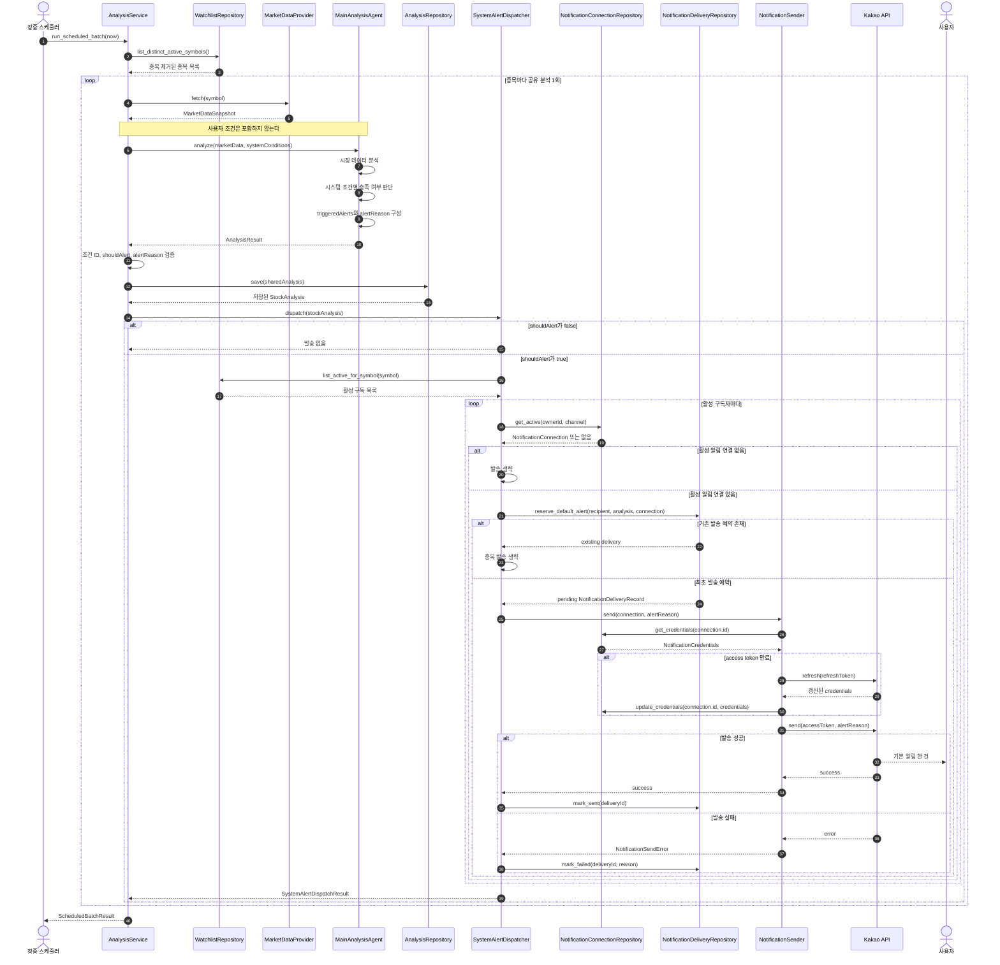
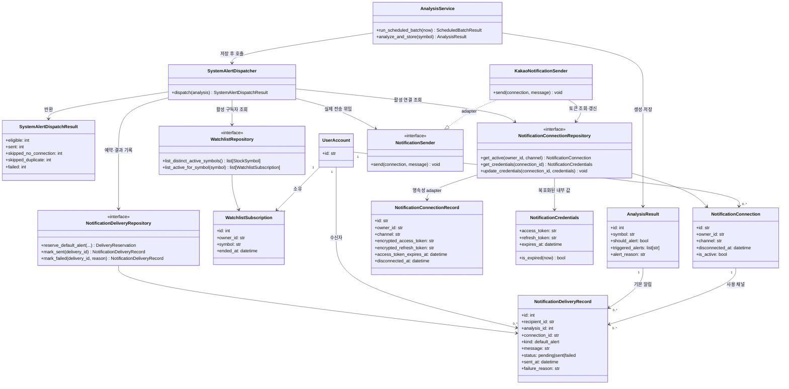

# 시스템 기본 알림 발송 설계

## 1. 목적

종목별 공유 분석이 완료된 뒤 시스템 알림 조건이 충족되었으면, 해당 종목의 활성 구독자에게 분석 결과의 `alert_reason`을 기본 알림으로 발송한다.

공유 분석은 종목마다 한 번만 생성한다. 사용자별로 달라지는 것은 분석이 아니라 발송 대상과 발송 결과다.

## 2. 관련 문서와 현재 코드

- [CONTEXT.md](../CONTEXT.md): `Stock Analysis`, `System Market Signal`, `Notification Connection`, `Alert Evaluation`의 기준 언어
- [login_feature_design.md](login_feature_design.md): 공유 분석과 사용자별 알림 흐름의 상위 설계
- `app/services/services.py`: 공유 분석 생성과 스케줄 배치의 현재 구현
- `app/interfaces/notifications.py`: 전역 토큰을 전제로 한 기존 `AlertNotifier` 인터페이스
- `app/integrations/kakao_notify.py`: 기존 카카오 알림 adapter

현재 코드는 활성 구독에서 중복을 제거한 종목 집합을 만들고, 종목별 공유 분석을 저장한 뒤 종료한다. 시스템 알림 발송 유스케이스는 공유 분석 저장 직후부터 시작한다.

## 3. 합의된 설계 결정

### 공유 분석과 기본 알림

- 공유 종목 분석은 사용자와 무관하게 종목마다 한 번 생성한다.
- 공유 분석에는 시스템 알림 조건만 전달한다.
- 여러 시스템 조건이 충족될 수 있지만, 한 분석 결과의 `triggered_alerts`와 `alert_reason`으로 종합한다.
- `should_alert=true`이고 유효한 `alert_reason`이 있으면 기본 알림 발송 대상 분석이다.
- 기본 알림은 충족된 시스템 조건마다 나누지 않고, 사용자마다 `alert_reason` 한 건을 발송한다.

### 발송 대상

기본 알림 수신자는 다음 조건을 모두 만족해야 한다.

- 분석 종목의 관심 종목 구독이 활성 상태다.
- 사용자 계정의 알림 연결이 활성 상태다.
- 같은 사용자에게 같은 공유 분석의 기본 알림을 이미 발송하지 않았다.

초기 구현에서는 별도의 사용자 수신 설정이나 사용자 알림 조건이 없어도 기본 알림을 발송한다. 사용자별 음소거와 시스템 신호별 수신 설정은 후속 범위다.

### 카카오 연결과 자격 증명

- `NotificationConnection`은 사용자와 알림 채널의 활성 연결 상태만 노출한다.
- 하나의 `NotificationConnectionRecord`가 연결 상태와 암호화된 access/refresh token을 함께 저장한다.
- 별도의 credential 저장소 클래스는 도입하지 않는다.
- `NotificationConnectionRepository`가 활성 연결 조회와 토큰 조회·갱신을 함께 담당한다.
- `KakaoNotificationSender`는 전달받은 연결 ID로 토큰을 조회한다.
- access token이 유효하면 그대로 사용하고, 만료됐으면 refresh token으로 갱신한 뒤 새 토큰을 저장하고 발송한다.
- 평문 토큰은 dispatcher와 도메인 연결 객체에 노출하지 않는다.

### 사용자 조건 평가와의 분리

시스템 기본 알림은 `UserAlertCondition`의 충족 여부를 판단하지 않으므로 `AlertEvaluation`을 생성하지 않는다.

사용자 정의 조건은 별도 유스케이스에서 조건마다 독립적인 `AlertEvaluation`을 생성한다. 시스템 기본 알림과 사용자 조건 알림은 모두 최종적으로 사용자별 `Notification Delivery` 기록을 만들지만, 발송의 원인은 서로 다르다.

## 4. 유스케이스 흐름

1. 장중 스케줄러가 활성 관심 종목 구독에서 중복을 제거한 종목 집합을 구한다.
2. 각 종목의 시장 데이터를 조회한다.
3. 시스템 알림 조건을 포함해 공유 분석을 한 번 수행한다.
4. 분석 결과의 조건 ID와 `alert_reason`을 검증하고 공유 분석을 저장한다.
5. `SystemAlertDispatcher`가 저장된 공유 분석을 받는다.
6. 기본 알림 대상 분석이면 해당 종목의 활성 구독자를 조회한다.
7. 구독자마다 활성 `NotificationConnection`을 조회한다.
8. 사용자와 공유 분석을 기준으로 `NotificationDeliveryRecord`를 한 번만 예약한다.
9. `NotificationSender`에 실제 외부 채널 전송을 위임한다.
10. 사용자별 발송 성공 또는 실패를 `NotificationDeliveryRecord`에 기록한다.

## 5. 시퀀스 다이어그램



## 6. 새로 도입하는 클래스와 인터페이스

### `SystemAlertDispatcher`

공유 분석 하나를 입력받아 사용자별 기본 알림 발송 전체를 조율하는 애플리케이션 모듈이다.

외부 인터페이스는 `dispatch()` 하나만 제공한다. 활성 구독자 조회, 알림 연결 확인, 중복 방지, 외부 전송 위임과 결과 기록은 구현 내부에 감춘다.

```python
@dataclass(frozen=True)
class SystemAlertDispatchResult:
    eligible: int
    sent: int
    skipped_no_connection: int
    skipped_duplicate: int
    failed: int


class SystemAlertDispatcher:
    def dispatch(
        self,
        analysis: AnalysisResult,
    ) -> SystemAlertDispatchResult:
        ...
```

인터페이스의 불변조건은 다음과 같다.

- 기본 알림 대상이 아닌 분석은 외부 전송을 만들지 않는다.
- 한 사용자의 발송 실패가 다른 사용자의 발송을 중단시키지 않는다.
- 한 사용자에게 같은 공유 분석의 기본 알림을 두 번 발송하지 않는다.
- 분석 성공과 알림 발송 성공은 서로 다른 결과로 취급한다.

### `NotificationConnection`

사용자 계정이 외부 알림 채널을 통해 메시지를 받을 수 있는 연결 상태를 나타낸다. 로그인 신원과 독립적이다.

```python
@dataclass(frozen=True)
class NotificationConnection:
    id: str
    owner_id: str
    channel: Literal["kakao"]
    connected_at: datetime
    disconnected_at: datetime | None

    @property
    def is_active(self) -> bool:
        ...
```

dispatcher는 이 객체로 활성 연결의 존재와 식별자만 확인한다. access token과 refresh token은 이 객체에 포함하지 않는다.

### `NotificationConnectionRecord`

하나의 알림 연결과 그 연결이 사용하는 암호화된 토큰을 저장하는 ORM 모델이다. 애플리케이션 모듈에 직접 노출하지 않고 SQLAlchemy adapter 내부에서 사용한다.

```python
class NotificationConnectionRecord(Base):
    id: Mapped[str]
    owner_id: Mapped[str]
    channel: Mapped[str]
    encrypted_access_token: Mapped[str]
    encrypted_refresh_token: Mapped[str | None]
    access_token_expires_at: Mapped[datetime | None]
    connected_at: Mapped[datetime]
    disconnected_at: Mapped[datetime | None]
```

### `NotificationCredentials`

카카오 adapter가 발송하는 동안만 사용하는 복호화된 내부 값이다. 독립적인 모듈이나 저장소를 만들지 않는다.

```python
@dataclass(frozen=True)
class NotificationCredentials:
    access_token: str
    refresh_token: str | None
    expires_at: datetime | None

    def is_expired(self, now: datetime) -> bool:
        ...
```

### `NotificationDeliveryRecord`

도메인 개념인 `Notification Delivery`를 구현하는 단일 ORM 모델이다. 한 사용자에게 한 알림을 전달하려 한 시도와 결과를 나타내며, 공유 분석의 전역 `alert_sent_at`을 대체한다.

초기 구현에서는 별도의 도메인 클래스와 ORM 클래스로 나누지 않는다. `NotificationDeliveryRecord` 하나를 발송 이력, 성공·실패 상태와 중복 방지에 사용한다.

```python
class NotificationDeliveryRecord(Base):
    __tablename__ = "notification_deliveries"
    __table_args__ = (
        UniqueConstraint(
            "recipient_id",
            "analysis_id",
            "kind",
            name="uq_notification_delivery_recipient_analysis_kind",
        ),
    )

    id: Mapped[int]
    recipient_id: Mapped[str]
    analysis_id: Mapped[int]
    connection_id: Mapped[str]
    kind: Mapped[str]
    message: Mapped[str]
    status: Mapped[str]
    created_at: Mapped[datetime]
    sent_at: Mapped[datetime | None]
    failure_reason: Mapped[str | None]
```

초기 기본 알림의 중복 기준은 다음 조합이다.

```text
recipient_id + analysis_id + kind
```

### `NotificationSender`

선택된 알림 연결을 사용해 메시지를 외부 채널로 실제 전송하는 인터페이스다. 기존 `AlertNotifier.send_alert(alert_reason)`을 다중 사용자용 계약으로 교체한다.

```python
class NotificationSendError(RuntimeError):
    ...


class NotificationSender(Protocol):
    def send(
        self,
        *,
        connection: NotificationConnection,
        message: str,
    ) -> None:
        ...
```

`SystemAlertDispatcher`는 대상 선정과 발송 정책을 소유한다. `NotificationSender` adapter는 카카오 HTTP 요청과 채널별 오류 변환만 소유한다.

### `KakaoNotificationSender`

`NotificationSender` 인터페이스를 만족하는 카카오 adapter다. 기존 전역 `.env` 토큰을 사용하는 `KakaoAlertNotifier`를 대체한다.

```python
class KakaoNotificationSender(NotificationSender):
    def send(
        self,
        *,
        connection: NotificationConnection,
        message: str,
    ) -> None:
        ...
```

`send()`는 `connection.id`로 `NotificationConnectionRepository.get_credentials()`를 호출한다. access token이 만료되지 않았으면 바로 사용하고, 만료됐으면 refresh token으로 갱신한 뒤 `update_credentials()`로 저장하고 메시지를 발송한다.

## 7. 새로 도입하는 저장소 인터페이스

### `NotificationConnectionRepository`

```python
class NotificationConnectionRepository(Protocol):
    def get_active(
        self,
        *,
        owner_id: str,
        channel: str,
    ) -> NotificationConnection | None:
        ...

    def get_credentials(
        self,
        connection_id: str,
    ) -> NotificationCredentials:
        ...

    def update_credentials(
        self,
        connection_id: str,
        credentials: NotificationCredentials,
    ) -> None:
        ...
```

연결 상태와 토큰은 같은 `NotificationConnectionRecord`에 저장한다. repository adapter는 연결 조회 시 토큰을 복호화하지 않고, `get_credentials()`가 호출될 때만 토큰을 복호화한다. 별도의 `NotificationCredentialRepository` 또는 `KakaoCredentialStore`는 만들지 않는다.

### `NotificationDeliveryRepository`

`reserve_default_alert()`는 조회 후 저장을 분리하지 않고 중복 방지까지 원자적으로 수행해야 한다.

```python
@dataclass(frozen=True)
class DeliveryReservation:
    delivery: NotificationDeliveryRecord
    created: bool


class NotificationDeliveryRepository(Protocol):
    def reserve_default_alert(
        self,
        *,
        recipient_id: str,
        analysis_id: int,
        connection_id: str,
        message: str,
    ) -> DeliveryReservation:
        ...

    def mark_sent(
        self,
        delivery_id: int,
    ) -> NotificationDeliveryRecord:
        ...

    def mark_failed(
        self,
        delivery_id: int,
        *,
        reason: str,
    ) -> NotificationDeliveryRecord:
        ...
```

## 8. 기존 클래스와 인터페이스 변경

### `AnalysisService`

`SystemAlertDispatcher`를 생성하지 않고 주입받는다. 스케줄 배치에서 공유 분석을 저장한 뒤 `dispatch()`를 호출한다.

```python
class AnalysisService:
    def __init__(
        self,
        *,
        analysis_repository: AnalysisRepository,
        watchlist_repository: WatchlistRepository,
        market_data_provider: MarketDataProvider,
        agent: AnalysisAgent,
        system_alert_dispatcher: SystemAlertDispatcher,
    ) -> None:
        ...
```

발송 실패는 이미 저장된 공유 분석의 실패로 바꾸지 않는다. `ScheduledBatchResult`가 분석 결과와 알림 발송 요약을 구분해 반환하도록 확장할 수 있다.

### `WatchlistRepository`

기존 종목 집합 조회에 더해 특정 종목의 활성 구독자를 반환하는 메서드를 추가한다.

```python
class WatchlistRepository(Protocol):
    def list_distinct_active_symbols(
        self,
    ) -> list[StockSymbol]:
        ...

    def list_active_for_symbol(
        self,
        symbol: StockSymbol,
    ) -> list[WatchlistSubscription]:
        ...
```

### `AlertNotifier`

수신자를 표현할 수 없는 기존 인터페이스는 유지하지 않는다.

```python
# 제거 대상
class AlertNotifier(Protocol):
    def send_alert(self, alert_reason: str) -> None:
        ...
```

호출자는 `NotificationSender.send(connection=..., message=...)`를 사용한다.

### `AnalysisRepository`

공유 분석을 전역적으로 발송 완료 처리하는 아래 메서드는 제거한다.

```python
# 제거 대상
def mark_alert_sent(result: AnalysisResult) -> AnalysisResult:
    ...


# 제거 대상
def has_sent_alert_for_conditions(
    symbol: str,
    triggered_alerts: list[str],
) -> bool:
    ...
```

`AnalysisResult.should_alert`, `triggered_alerts`, `alert_reason`은 시스템 신호가 감지된 공유 분석 결과로 유지한다. 사용자별 발송 상태는 `NotificationDeliveryRecord`가 담당하므로 `AnalysisResult.alert_sent_at`은 제거 대상이다.

## 9. 클래스 다이어그램



## 10. 모듈 책임과 seam

`SystemAlertDispatcher.dispatch(analysis)`를 시스템 기본 알림 유스케이스의 외부 인터페이스로 둔다. 호출자는 구독자 조회, 연결 확인, 중복 처리, 외부 전송과 결과 기록의 순서를 알 필요가 없다.

`NotificationSender`는 외부 알림 채널 seam이다. 운영 환경의 `KakaoNotificationSender`와 테스트 환경의 fake adapter가 같은 인터페이스를 만족한다.

`NotificationConnectionRepository`는 연결 상태와 토큰 영속성을 하나의 인터페이스로 단순화한다. dispatcher는 `get_active()`만 사용하고, 카카오 adapter는 `get_credentials()`와 `update_credentials()`를 사용한다. 별도의 credential 저장소 seam은 만들지 않는다.

저장소 인터페이스는 애플리케이션 모듈과 영속성 구현 사이의 seam이다. 중복 방지 불변조건은 `NotificationDeliveryRepository.reserve_default_alert()`와 데이터베이스 유일성 제약이 함께 보장한다.

## 11. 실패와 중복 시나리오

### 일부 사용자 발송 실패

사용자 A 발송이 성공하고 사용자 B 발송이 실패해도 공유 분석은 성공 상태로 유지한다. A의 `NotificationDeliveryRecord`는 `sent`, B의 기록은 `failed`가 된다. 다른 사용자 발송도 계속한다.

### 스케줄러 재실행

동일한 공유 분석을 대상으로 `dispatch()`가 다시 호출되어도 이미 예약된 사용자별 기본 알림은 다시 전송하지 않는다.

### 알림 연결 없음

활성 구독은 있지만 활성 알림 연결이 없으면 공유 분석 접근에는 영향을 주지 않고 기본 알림만 생략한다.

### 여러 시스템 조건 충족

한 공유 분석에서 여러 시스템 조건이 충족되어도 `triggered_alerts`는 근거 목록으로 보존하고, 종합된 `alert_reason` 한 건만 사용자에게 발송한다.

## 12. 이번 설계에서 도입하지 않는 것

- 시스템 조건별 개별 알림 발송
- 시스템 기본 알림을 위한 `AlertEvaluation`
- 사용자별 음소거 및 시스템 신호별 수신 설정
- 사용자 정의 조건 평가와 발송
- 비동기 작업 큐 또는 outbox
- 다중 알림 채널 동시 발송

## 13. 후속 결정

- 토큰 암호화 키의 생성·보관·교체 방식
- 실패한 `Notification Delivery`의 자동 재시도 정책
- 강제 수동 분석이 기본 알림 발송까지 수행할지 여부
- 스케줄러와 발송 worker를 분리할 시점
- 사용자별 음소거와 시스템 신호별 수신 설정 도입 방식
