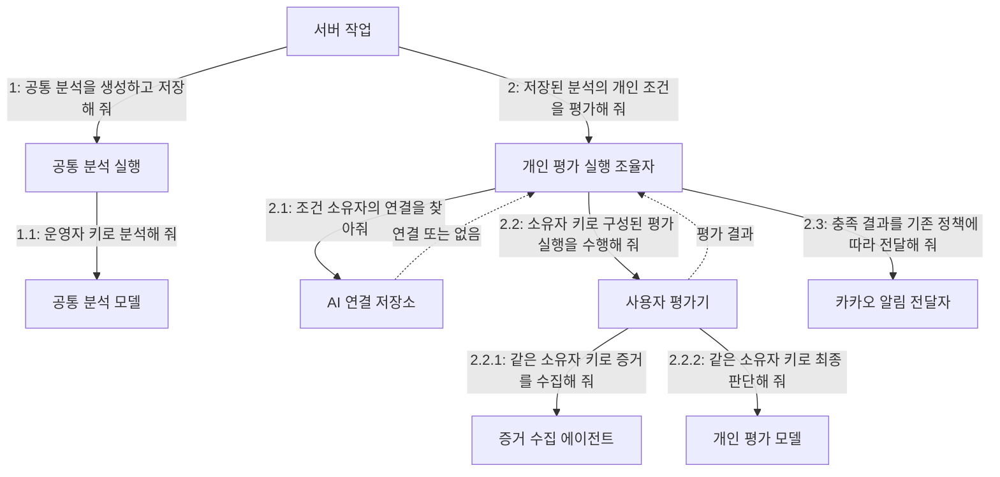

# 사용자별 AI 키: 공통 분석과 개인 평가의 책임 분리

상태: 핵심 정책 합의, 세부 정책 검토 중. 구현 완료 문서가 아니다.
코드 대조 기준: 2026-09-20 작업 트리. 구현 전 관련 심볼의 최신 상태를 다시 확인한다.

## 1. 문서 사용법과 범위

이 문서는 후속 구현 에이전트가 비용 부담 주체와 데이터 소유권을 혼동하지 않도록 하는 설계 계약이다. 확정 정책(R), 구현 제약(C), 검증 기준(T), 미결정 사항(Q)을 구분한다. 구현 제약은 확정 정책을 지키기 위한 기술적 경계이며, 미결정 사항의 추천안을 사용자 승인으로 해석하지 않는다.

기존 공통 종목 분석을 유지하며 사용자별 알림 평가의 Gemini 인증 정보를 분리한다. 초대 코드 구현, 전체 웹 전환, 호스팅, 결제, Android 배포는 범위 밖이다. 클래스 수, API 경로, DB 컬럼과 라이브러리는 이 문서에서 확정하지 않는다.

## 2. 확정 정책

| ID | 정책 |
| --- | --- |
| R1 | 중앙 서버는 사용자 화면이 닫혀 있어도 주기적으로 공통 종목 분석을 생성하고 이력을 축적한다. |
| R2 | 공통 종목 분석은 운영자 Gemini 키를 사용한다. 사용자별로 복제하거나 사용자 키를 돌아가며 소비하는 구조로 바꾸지 않는다. |
| R3 | 사용자 지정 알림 조건 평가는 해당 조건 소유자의 Gemini 키를 사용한다. 구독자의 식별은 서버의 구독·조건 소유 관계에서 얻는다. |
| R4 | 사용자 평가 중 AI 증거 수집과 최종 판단 모두 같은 소유자의 키를 사용한다. 외부 데이터 조회 인증과 Gemini 인증은 별개이다. |
| R5 | 개인 키 없이 공통 분석 조회와 시스템 기본 알림을 이용할 수 있다. 기존 베타 권한·구독·소유권·카카오 연결·발송 정책은 여전히 적용된다. |
| R6 | 사용자 지정 조건의 AI 평가는 개인 키 등록 후 활성화한다. 등록 전 조건 작성·저장 허용 여부는 미정이다. |
| R7 | Gemini 키는 평가용이며, 실제 카카오 전송에는 해당 사용자의 카카오 알림 연결을 사용한다. |
| R8 | 종목 분석은 공통 기록, 알림 평가는 조건별 기록, 알림 전달은 사용자별 기록으로 유지한다. 개인 키나 개인 조건을 공통 분석에 포함하지 않는다. |

### 인증 정보 선택 표

| 실행 목적 | 인증 정보 | 비고 |
| --- | --- | --- |
| 정기 공통 분석 | 운영자 Gemini 키 | R1, R2 |
| 개인 조건의 AI 증거 수집 | 조건 소유자 Gemini 키 | R3, R4 |
| 개인 조건 최종 평가 | 조건 소유자 Gemini 키 | R3, R4 |
| 시스템 기본 알림 전달 | 사용자 카카오 연결 | 기존 분석의 신호를 전달하며 새 AI 호출을 추가하지 않는다. |
| 개인 조건 알림 전달 | 사용자 카카오 연결 | R7 |
| 조건 등록 시 AI 검증 | 미정 Q1 | 중앙 키가 남아 있는 현재 구현을 목표 정책으로 오해하지 않는다. |
| 수동 분석·최초 조회 시 공통 분석 생성 | 운영자 키라는 경계 유지 | 허용 범위와 사용량 통제는 Q7. 개인 키로 몰래 전환하지 않는다. |

## 3. 유스케이스

### UC1. 사용자 AI 연결 등록·관리

주 액터는 기존 서비스 접근 조건을 충족한 사용자이다. 목적은 자신의 개인 조건 평가에 사용할 Gemini 연결을 등록하는 것이다.

기본 방향은 계정 식별 → 개인 키 제출 → 해당 계정에 연결 저장 → 연결 상태 반환이다. 자동 평가에서 키가 사용된다는 사실을 안내해야 한다. 실제 검증 호출과 활성화 시점, 교체 실패, 삭제 및 진행 중 요청의 처리는 Q2~Q4에서 결정한다. 이 미결정 단계의 구체적 성공 응답이나 상태명을 임의로 확정하지 않는다.

키 원문을 다시 조회하는 유스케이스는 제공하지 않는다. 다른 계정의 연결을 조회·교체·삭제할 수 없다.

### UC2. 정기 공통 분석 생성

주 액터는 스케줄러이다. 기존 분석 대상·주기 정책으로 종목 분석을 생성하고 저장한다. 운영자 키를 사용하며 개인 키 등록 여부를 공통 분석의 실행 조건으로 삼지 않는다. 저장 후 시스템 기본 알림과 사용자 조건 평가 흐름을 진행한다. 한 사용자의 키 실패가 저장된 공통 분석을 무효로 만들면 안 된다.

### UC3. 구독자의 개인 조건 평가

주 액터는 공통 분석 후 평가 실행을 요청하는 서버 작업이다.

1. 저장된 공통 분석에 대해 기존 규칙으로 활성 구독·조건 대상을 찾는다.
2. 조건 소유자를 서버 기록에서 식별한다.
3. 소유자의 AI 연결을 확보한다. 키가 없으면 개인 AI 평가를 실행하지 않는다.
4. 소유자 전용 평가 실행에 AI 증거 수집과 최종 판단을 맡긴다.
5. 결과를 기존 알림 평가 계약에 따라 기록한다.
6. 조건 충족 시 기존 활성 상태·카카오 연결·중복 전달 정책을 확인하고 알림을 전달한다.

키 없음, 키 무효, 한도 초과, 공급자 오류는 조건 미충족이라는 AI 판단이 아니다. 기록 상태와 재실행 여부는 Q5, Q6에서 결정한다. 다른 계정의 평가와 공통 분석은 독립적으로 계속할 수 있어야 한다.

### UC4. 개인 키 없이 서비스 이용

기존 접근 권한을 갖춘 계정은 저장된 공통 분석을 조회할 수 있다. 활성 구독과 카카오 연결 등 기존 요건이 충족되면 시스템 기본 알림도 받을 수 있다. 개인 키가 없다는 이유로 이 흐름을 차단하지 않는다. 개인 지정 조건의 AI 평가는 실행하지 않는다.

## 4. 도메인과 협력 책임

기존 CONTEXT.md의 종목 분석·사용자 알림 조건·알림 평가·알림 전달 정의를 유지한다.

사용자 AI 연결은 개인 조건의 AI 평가를 위해 사용자 계정이 제공한 AI 서비스 연결이다. 로그인 신원, 카카오 알림 연결, 베타 이용 권한과 다른 개념이다. API 키는 이 연결의 비밀 인증 정보이며 계정 식별자가 아니다.

| 역할 | 책임 | 맡지 않는 책임 |
| --- | --- | --- |
| 공통 분석 실행 조율자 | 공통 분석 생성·저장과 후속 처리 시작 | 개인 키 선택 |
| 개인 평가 실행 조율자 | 조건 소유자 확인, 해당 연결 확보, 평가와 기록 조율 | 타인의 키로 대체하거나 모든 AI 판단 직접 수행 |
| 사용자 AI 연결 관리 | 계정별 연결 등록·교체·삭제·상태 관리 | 종목 분석과 알림 조건 판단 |
| AI 연결 저장소 | 연결 및 비밀 인증 정보의 보호된 저장·조회 | 비용 부담 정책 결정 |
| 사용자 평가기 | 공통 분석과 개인 조건을 바탕으로 판단 | 키 원문을 결과에 포함하거나 발송 직접 실행 |
| 증거 수집 에이전트 | 개인 조건에 필요한 증거 수집 | 운영자 키로 암묵적 전환 |
| 알림 전달자 | 기존 발송 정책과 카카오 연결로 전달 | Gemini 키를 카카오 인증으로 사용 |

역할은 논리적 구분이다. 모든 역할을 새 클래스로 만드는 요구가 아니다. 인증 정보는 실행 의존성으로 전달하며 LLM 프롬프트나 에이전트가 읽는 업무 데이터로 취급하지 않는다.

### 책임 중심 커뮤니케이션 다이어그램

연결이 없으면 2.2를 실행하지 않는다. 2.3은 평가 결과 기록 이후 조건 충족·발송 요건 충족 시에만 실행한다. 그림은 키가 프롬프트를 통해 전달된다는 뜻이 아니다. 공통 분석 저장과 평가 결과 저장의 세부 협력은 기존 설계를 따른다.

## 5. 구현 제약

| ID | 제약과 이유 |
| --- | --- |
| C1 | 사용자 요청마다 전역 환경변수 GEMINI_API_KEY를 변경하지 않는다. 동시 작업에서 계정 키가 섞일 수 있다. |
| C2 | 개인 평가에 사용자 키를 명시적으로 전달한다. 키 누락·오류 시 운영자 키나 다른 계정 키로 암묵적으로 대체하지 않는다. 이는 R2~R4의 비용 경계를 지키기 위한 제약이다. |
| C3 | 최종 모델뿐 아니라 증거 수집 모델과 그 내부 캐시도 소유자별로 격리한다. 이전 계정의 모델 인스턴스를 재사용하지 않는다. |
| C4 | 키는 보호된 서버 저장소에 보관하고 복호화 권한을 제한한다. 암호화 비밀은 데이터와 분리한다. 키 원문을 응답·로그·오류 문자열·추적·프롬프트·분석 기록에 남기지 않는다. |
| C5 | 개인 키가 없는 계정을 기존 중앙 키로 자동 연결하거나 기존 계정에 운영자 키를 복제하지 않는다. |
| C6 | 평가 불가를 matched=false로 기록하지 않는다. 알림 발송 실패도 조건 평가 실패로 바꾸지 않는다. |
| C7 | 기존 분석-조건 평가 중복 방지 및 평가-연결 전달 중복 방지를 유지한다. 키 등록 후 과거 평가를 재시도할지는 별도 정책이다. |
| C8 | 한 사용자의 연결 장애가 다른 사용자의 평가, 공통 이력 조회 또는 기본 알림을 중단하지 않도록 구성과 실행을 모두 격리한다. |

## 6. 현재 코드와 변경 검토 지점

다음은 관찰한 현재 상태이며 목표 구현으로 간주하지 않는다.

| 위치·심볼 | 현재 상태 | 변경 검토 |
| --- | --- | --- |
| app/core/container.py / build_user_alert_dispatcher | 하나의 평가기를 생성해 dispatcher에 전달 | 대상 소유자에 맞는 평가 실행 구성 |
| app/application/user_alerts.py / UserAlertDispatcher.dispatch | target.owner_id가 있으며 공통 self.evaluator로 평가. 평가 예약 후 실패 기록 | 소유자 연결 선택, 키 없는 대상의 처리와 예약 순서 |
| app/application/user_alert_evaluator.py / LangGraphUserAlertEvaluator | 증거 수집과 최종 판단 조율 | 양쪽 모델이 동일 소유자 키를 쓰도록 보장 |
| app/application/custom_rule_agent.py / build_custom_rule_llm, _get_bound_llm | 환경변수 키를 읽고 도구 결합 모델을 인스턴스에 보관 | 명시적 인증 정보 전달과 캐시 격리 |
| app/integrations/llm/gemini_alert_evaluation_model.py | 환경변수 키 사용 | 개인 평가용 인증 정보 주입 |
| app/integrations/llm/gemini_analysis_agent.py | 환경변수 키 사용 | 공통 분석은 운영자 인증 유지 |
| app/integrations/llm/gemini_rule_validation_agent.py, app/api/deps.py | 조건 등록 검증도 중앙 키 사용 | Q1 결정 후 처리 |
| app/services/services.py / get_latest_analysis, run_manual_analysis | 조회 결과가 없거나 수동 실행 시 새 공통 분석 생성 | Q7 사용량 정책과 함께 검토 |
| app/repositories/notifications.py | 평가 예약과 중복 방지, 전달 기록 | 키 없는 평가가 영구적으로 재평가를 막지 않도록 Q5 결정 후 검토 |

서버 API 호출 시점 외에 스케줄러 경로도 반드시 확인한다. API 경로만 키를 교체하면 백그라운드 평가는 계속 중앙 키를 사용할 수 있다.

## 7. 검증 기준

실제 사용자 키·실제 유료 호출 없이 가짜 인증 정보와 대역 모델로 검증한다.

| ID | 시나리오 | 기대 결과 |
| --- | --- | --- |
| T1 | A와 B가 같은 종목을 구독 | 기존 한 배치에서 공통 분석은 종목당 한 번, 운영자 키만 사용. 개인 키는 공통 분석에 사용되지 않음 |
| T2 | A와 B의 조건을 순차·동시에 평가 | A의 증거 수집·최종 판단은 A 키, B는 B 키. 캐시 재사용으로 키 혼용 없음 |
| T3 | A는 개인 키 없음, B는 있음 | A 개인 AI 호출 0회, B 정상 평가. A 공통 분석 조회·기본 알림은 기존 조건에 따라 가능 |
| T4 | A 키가 무효이거나 한도 초과 | 운영자·B 키로 대체 호출하지 않음. 공통 기록과 B 처리 유지. 조건 미충족으로 기록하지 않음 |
| T5 | 사용자 조건 충족 후 전달 | 개인 평가 결과 저장 후 수신자 카카오 연결 사용. 전달 실패와 평가 결과 분리 |
| T6 | 같은 분석·조건 작업 재진입 | 기존 중복 방지 유지. 재시도 허용 범위는 Q5, Q6에 맞게 추가 검증 |
| T7 | 다른 계정의 AI 연결 조회·변경 요청 | 거부. 성공·실패 응답과 로그에 키 원문 없음 |
| T8 | 기존 데이터로 마이그레이션 | 공통 분석·구독·평가·전달 기록 보존. 개인 키 없는 계정에 중앙 키 자동 배정 없음 |
| T9 | 키 교체·삭제 도중 작업 실행 | Q4에서 정한 이후 요청과 진행 중 요청의 경계를 검증 |

개인 조건이 없는 대상과 AI 추가 자료가 필요 없는 조건도 포함한다. 최종 평가 모델만 검사하고 증거 수집 호출을 빠뜨리지 않는다.

## 8. 미결정 사항과 추천안

아래는 미승인 정책이다. 구현자는 영향받는 동작을 확정하기 전에 결정을 받아 문서에 반영한다. 명시된 추천을 이미 합의된 정책으로 취급하지 않는다.

| ID | 결정할 내용 | 검토용 추천 |
| --- | --- | --- |
| Q1 | 조건 등록 검증 비용 주체 및 개인 키 없는 조건 저장 | AI 검증은 개인 키 사용. 저장·활성화 조건은 함께 결정 |
| Q2 | 개인 키 유효성 확인과 비용 | 최소한의 검증 호출 여부와 발생 가능한 사용량 안내 |
| Q3 | 자동 평가 동의·활성화 시점 | 사용자가 자동 평가 목적을 확인한 뒤 활성화 |
| Q4 | 교체·삭제 시 진행 중 작업과 신규 작업 | 신규 호출은 최신 연결 사용, 삭제 후 신규 호출 금지. 이미 공급자에 전송한 요청의 취소는 보장하지 않는 안 |
| Q5 | 키 없는 평가의 기록과 등록 후 과거 분석 재평가 | 미실행과 조건 미충족을 구분. 과거 재평가 여부는 별도 결정 |
| Q6 | 한도 초과·공급자 오류 재시도 및 사용자별 실행 한도 | 유한 재시도와 사용자별 호출 제한. 구체적 횟수·간격은 미정 |
| Q7 | 수동·최초 조회 분석의 허용량 및 공통 분석 주기 | 중앙 사용량이 남으므로 별도의 실행량 통제 필요 |

## 9. 구현 순서와 완료 조건

1. Q1~Q7 중 구현 범위에 영향을 주는 정책을 결정하고 문서를 갱신한다.
2. AI 연결의 사용자 흐름·권한·보관 계약을 확정하고 기존 데이터 보존 방식을 설계한다.
3. 소유자별 인증 정보 전달과 모델 생성 경계를 연결한다. 증거 수집과 최종 평가를 함께 바꾼다.
4. 스케줄러, 사용자 평가 기록과 알림 전달 경로를 연결한다.
5. T1~T9 및 기존 관련 회귀 테스트를 수행하고 실제 적용된 정책·남은 제한을 기록한다.

이 문서 작성이나 다이어그램 완성만으로 구현 준비 완료를 선언하지 않는다. 미결정 정책을 추측해서 채우거나 현재 중앙 키 동작을 개인 평가의 기본값으로 남기지 않는다.

## 10. 관련 문서

- [도메인 용어](../CONTEXT.md)
- [사용자별 알림 평가 및 전달 설계](user_alert_evaluation_delivery_design.md)
- [시스템 기본 알림 전달 설계](system_alert_delivery_design.md)
- [비공개 베타 접근 설계](web_private_beta_design.md)

본 문서는 인증 정보 선택 경계를 추가한다. 기존 알림의 활성 구독, 시간대, 평가·전달 중복 방지 정책을 변경하지 않는다. 충돌이 발견되면 해당 정책과 본 문서의 관계를 확인한 후 명시적으로 결정한다.
