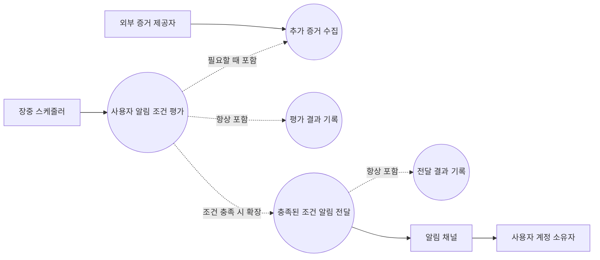
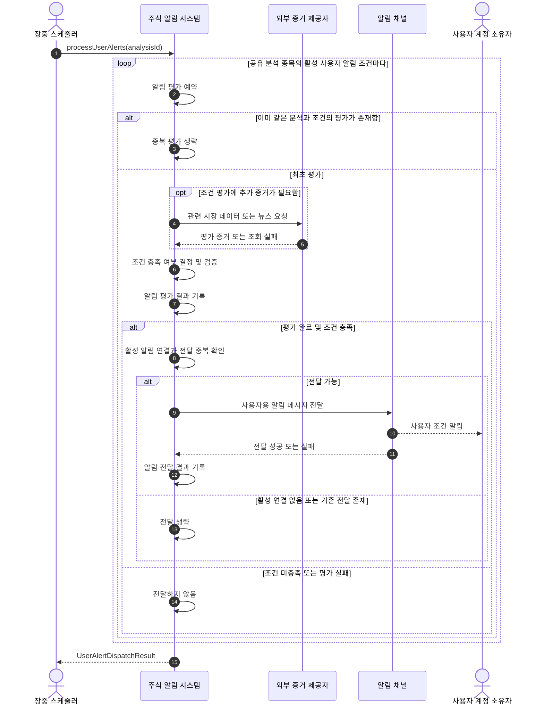
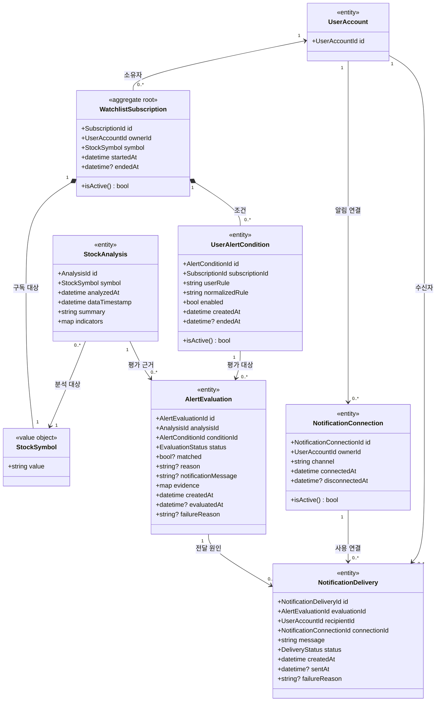
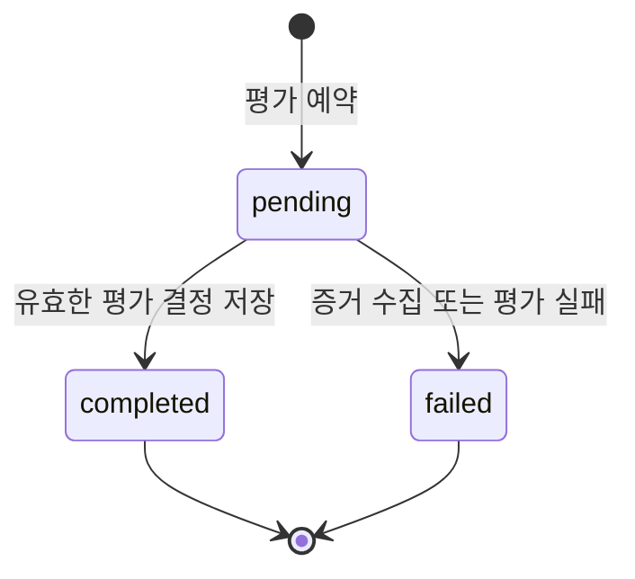
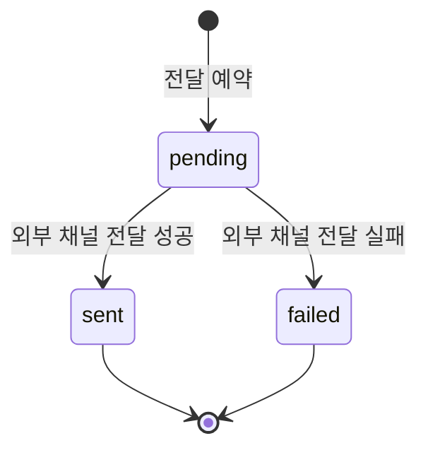
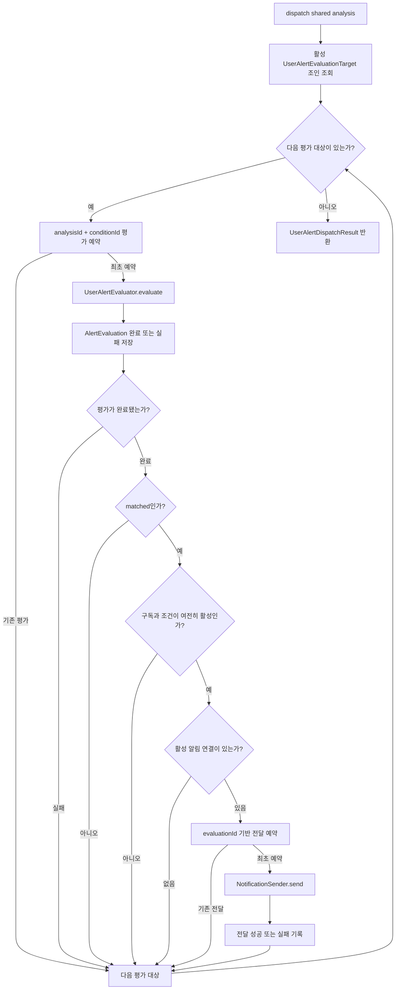
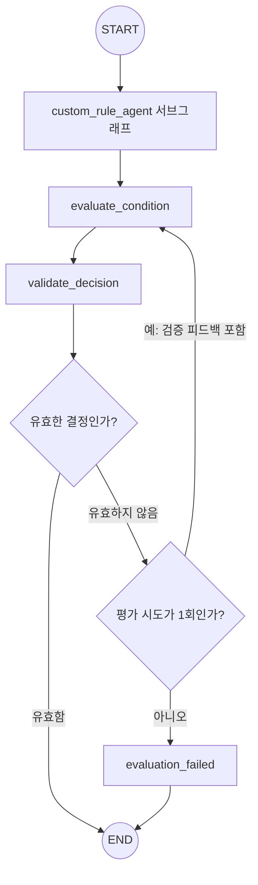
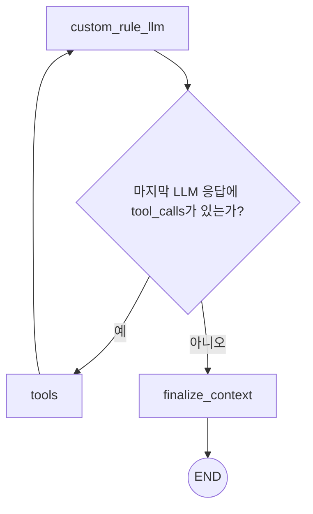

# 사용자별 알림 평가 및 전달 설계

> 상태: 구현 완료 (`design/user-alert-evaluation-ooad`)
>
> 범위: 유스케이스, 시스템 시퀀스, 도메인 모델
>
> 기준 브랜치: `origin/main`의 시스템 기본 알림 전달 구현

## 1. 목적

공유 `종목 분석(Stock Analysis)`이 저장된 뒤, 해당 종목을 구독하는 각 사용자의 활성 `사용자 알림 조건(User Alert Condition)`을 독립적으로 평가하고, 충족된 조건의 소유자에게 알림을 전달한다.

공유 종목 분석은 사용자와 무관하게 종목마다 한 번만 만든다. 사용자별로 달라지는 정보는 공유 분석에 포함하지 않고 다음 기록으로 분리한다.

- 조건 충족 여부와 판단 근거: `알림 평가(Alert Evaluation)`
- 외부 채널 전달 시도와 결과: `알림 전달(Notification Delivery)`

## 2. 관련 문서와 현재 상태

- [CONTEXT.md](../CONTEXT.md): 이 문서에서 사용하는 도메인 언어
- [login_feature_design.md](login_feature_design.md): 다중 사용자 소유권과 상위 도메인 모델
- [system_alert_delivery_design.md](system_alert_delivery_design.md): 시스템 시장 신호의 기본 알림 전달
- `app/application/custom_rule_agent.py`: 사용자 조건에 필요한 외부 증거를 수집하는 현재 구현
- `app/application/analysis_graph.py`: 과거 사용자 조건을 공유 분석에 포함하기 위해 만든 그래프
- `app/services/services.py`: 현재 공유 분석에는 시스템 조건만 전달하는 실행 경로

현재 `MainAnalysisAgent`에는 `custom_rule_agent` 노드가 있지만, `AnalysisService`가 `DEFAULT_SYSTEM_ALERT_CONDITIONS`만 전달하므로 운영 분석 경로에서는 실행되지 않는다. 이 분리는 공유 분석에 사용자 정보를 섞지 않는 현재 도메인 모델과 일치한다.

이번 설계에서는 `CustomRuleAgent`를 공유 분석 그래프가 아니라 사용자별 알림 평가 구현 내부에서 재사용한다.

## 3. 설계 원칙과 결정

### 3.1 공유 분석과 사용자 평가를 분리한다

- 공유 종목 분석은 시스템 알림 조건만 사용한다.
- 사용자 알림 조건은 공유 분석이 저장된 뒤 별도로 평가한다.
- 사용자 조건, 수집한 외부 증거, 평가 결과와 사용자용 문안은 공유 분석에 저장하지 않는다.
- 한 사용자의 평가 실패가 공유 분석이나 다른 사용자의 평가를 실패시키지 않는다.

### 3.2 조건마다 독립적인 알림 평가를 만든다

한 알림 평가는 정확히 하나의 공유 분석과 하나의 사용자 알림 조건을 연결한다.

```text
StockAnalysis 1 + UserAlertCondition 1 = AlertEvaluation 최대 1
```

같은 사용자가 같은 종목에 세 조건을 가지고 있으면 세 조건을 각각 평가한다. 초기 정책에서는 충족된 평가마다 알림 전달도 독립적으로 시도한다. 여러 평가를 한 메시지로 합치는 정책은 이번 범위에 포함하지 않는다.

### 3.3 검증과 평가를 구분한다

- `RuleValidationAgent`: 사용자 조건을 등록할 수 있는지 검증한다.
- `UserAlertEvaluator`: 이미 등록된 조건이 특정 공유 분석 시점에 충족됐는지 평가한다.

`Validator`라는 이름은 등록 검증과 실행 시점 평가를 혼동시키므로 사용하지 않는다.

### 3.4 증거 수집과 최종 판단을 구분한다

- `UserAlertEvaluator`는 모든 사용자 알림 조건에 대해 항상 `CustomRuleAgent`를 먼저 호출한다.
- `CustomRuleAgent`는 사용자 조건만 입력받아 해석하고, 외부 증거가 필요할 때만 허용된 도구를 호출해 `CustomRuleContext`를 반환한다.
- `CustomRuleAgent`의 입력은 사용자 알림 조건 하나로 유지한다.
- 공유 분석만으로 평가 가능한 조건이면 `CustomRuleAgent`는 도구를 호출하지 않고 빈 추가 증거를 반환할 수 있다.
- `CustomRuleAgent`는 조건 충족 여부나 발송 여부를 결정하지 않는다.
- `UserAlertEvaluator`는 공유 분석, 사용자 조건과 `CustomRuleContext`를 종합해 `AlertEvaluationDecision`을 반환한다.
- 실제 발송 가능 여부는 에이전트가 아니라 애플리케이션 정책이 결정한다.

### 3.5 평가, 전달과 실패를 구분한다

다음 상태는 서로 바꿔 해석하지 않는다.

| 결과 | 의미 |
| --- | --- |
| 모델 결과 `matched` | 조건이 충족되어 평가를 `completed`, `matched=true`로 저장 |
| 모델 결과 `not_matched` | 조건이 충족되지 않아 평가를 `completed`, `matched=false`로 저장 |
| 모델 결과 `indeterminate` | 자료 부족 등으로 판단할 수 없어 평가를 `failed`로 저장 |
| 평가 실패 | 증거 수집 또는 판단 결과를 신뢰할 수 없음 |
| 전달 실패 | 조건은 충족됐지만 외부 채널 전송에 실패함 |

평가 실패를 조건 미충족으로 저장하지 않으며, 전달 실패가 완료된 평가를 실패로 바꾸지 않는다.

## 4. 액터와 시스템 범위

### 주 액터

**장중 스케줄러**
: 공유 종목 분석이 저장된 뒤 사용자별 알림 처리를 시작한다.

### 지원 액터

**외부 증거 제공자**
: 관련 종목 시장 데이터나 뉴스를 제공한다.

**알림 채널**
: 카카오 등 사용자가 연결한 외부 채널로 메시지를 전달한다.

### 이해관계자

**사용자 계정 소유자**
: 자신이 활성 구독에 등록한 조건이 충족됐을 때만, 그 근거를 이해할 수 있는 메시지를 받는다.

## 5. 유스케이스 모델



## 6. 핵심 유스케이스

### UC-01 사용자별 알림 조건을 평가하고 전달한다

#### 트리거

장중 스케줄러가 새로 저장된 공유 종목 분석에 대해 사용자별 알림 처리를 요청한다.

#### 사전 조건

- 공유 종목 분석이 저장되어 식별자를 가진다.
- 공유 분석의 종목 코드가 정규화되어 있다.
- 사용자 알림 조건은 등록 시점의 검증을 통과한 조건이다.

#### 성공 보장

- 같은 공유 분석과 사용자 알림 조건에는 상태와 관계없이 알림 평가가 최대 한 건 존재한다.
- 새로 예약한 평가를 정상적으로 처리한 경우에는 `completed` 또는 `failed`의 종결 상태가 된다.
- 충족된 평가의 전달 시도와 결과는 평가와 분리되어 기록된다.
- 한 조건의 평가 또는 전달 실패가 다른 조건의 처리를 중단시키지 않는다.
- 같은 공유 분석과 같은 조건을 다시 처리해도 중복 평가나 중복 전달을 만들지 않는다.

#### 기본 흐름

1. 시스템은 공유 분석의 종목에 해당하는 활성 평가 대상(`UserAlertEvaluationTarget`)을 조회한다.
2. 평가 대상은 활성 관심 종목 구독, 그 소유자와 그 구독의 활성 사용자 알림 조건을 포함한다.
3. 시스템은 `(analysis_id, condition_id)`를 기준으로 알림 평가를 예약한다.
4. 이미 같은 평가가 존재하면 해당 평가 대상을 중복 처리하지 않는다.
5. `UserAlertEvaluator`는 공유 분석과 사용자 알림 조건을 입력받는다.
6. `UserAlertEvaluator`는 사용자 알림 조건을 `CustomRuleAgent`에 전달한다.
7. `CustomRuleAgent`는 외부 증거가 필요하면 허용된 도구를 호출하고, 필요하지 않으면 도구 호출 없이 `CustomRuleContext`를 반환한다.
8. `UserAlertEvaluator`는 공유 분석, 조건과 `CustomRuleContext`를 바탕으로 조건 충족 여부, 판단 근거와 사용자용 메시지를 결정한다.
9. 시스템은 평가 결정이 입력 조건에 대한 유효한 결과인지 검증한다.
10. 시스템은 `outcome`을 매핑해 완료되거나 실패한 알림 평가를 저장한다.
11. 평가가 실패했거나 조건이 충족되지 않았으면 해당 평가 대상의 처리를 종료한다.
12. 조건이 충족됐으면 소유자의 활성 알림 연결을 조회한다.
13. 활성 연결이 있으면 알림 평가를 원인으로 알림 전달을 예약한다.
14. 시스템은 평가의 사용자용 메시지를 외부 알림 채널에 전달한다.
15. 전달 성공 또는 실패를 알림 전달에 기록한다.
16. 모든 평가 대상의 처리가 끝나면 평가와 전달 요약을 스케줄러에 반환한다.

#### 대안 흐름

**A1. 활성 사용자 알림 조건이 없음**

- 시스템은 평가나 전달을 만들지 않고 정상 종료한다.

**A2. 이미 예약된 알림 평가**

- 동일한 `(analysis_id, condition_id)`의 평가가 있으면 에이전트와 외부 도구를 다시 호출하지 않는다.

**A3. 공유 분석만으로 평가 가능**

- `CustomRuleAgent`에는 정상적으로 진입한다.
- `CustomRuleAgent`의 LLM이 도구를 요청하지 않으면 빈 추가 증거를 포함한 `CustomRuleContext`를 반환한다.
- `UserAlertEvaluator`는 공유 분석과 조건을 주된 근거로 평가한다.

**A4. 조건 미충족**

- `matched=false`와 판단 근거를 완료된 알림 평가에 저장한다.
- 알림 전달은 만들지 않는다.

**A5. 증거 수집 또는 평가 실패**

- 알림 평가를 `failed`로 기록한다.
- 평가 모델이 자료 부족으로 `indeterminate`를 반환한 경우도 `failed`로 기록한다.
- 조건 미충족으로 바꾸지 않으며 알림을 전달하지 않는다.
- 다른 조건의 처리는 계속한다.

**A6. 유효하지 않은 에이전트 결정**

- 누락된 판단 근거처럼 수정 가능한 형식 오류이면 오류 정보를 포함해 한 번 다시 평가할 수 있다.
- 재평가 결과도 유효하지 않으면 알림 평가를 `failed`로 기록한다.

**A7. 활성 알림 연결 없음**

- 알림 평가는 `completed`, `matched=true`로 유지한다.
- 알림 전달은 만들지 않고 `skipped_no_connection`으로 집계한다.

**A8. 외부 채널 전달 실패**

- 알림 평가는 변경하지 않는다.
- 알림 전달만 `failed`로 기록하고 다른 조건 처리를 계속한다.

**A9. 평가 도중 구독 또는 조건 종료**

- 전달 직전에 소유권과 활성 상태를 다시 확인한다.
- 더 이상 활성 상태가 아니면 평가 이력은 보존하되 전달하지 않는다.

## 7. 시스템 시퀀스 다이어그램

이 다이어그램은 내부 클래스가 아니라 주식 알림 시스템을 하나의 블랙박스로 표현한다.



### 시스템 연산

```python
processUserAlerts(analysis_id: AnalysisId) -> UserAlertDispatchResult
```

이 시스템 연산은 다음을 보장한다.

- 공유 분석 자체는 변경하지 않는다.
- 사용자별 조건을 서로 섞지 않는다.
- 평가 예약, 평가, 저장, 전달과 결과 기록의 순서를 감춘다.
- 부분 실패가 전체 공유 분석의 성공 여부를 바꾸지 않는다.

## 8. 도메인 모델

### 8.1 도메인 개념

| 개념 | 종류 | 책임 |
| --- | --- | --- |
| `UserAccount` | 엔티티 | 사용자 소유권의 기준 |
| `WatchlistSubscription` | 애그리게이트 루트 | 한 사용자 계정과 종목 코드 사이의 활성 구독 생명주기 관리 |
| `StockSymbol` | 값 객체 | 구독과 분석 대상 종목을 정규화해 식별 |
| `UserAlertCondition` | 엔티티 | 활성 구독에 속하며 사용자가 알림받을 시장 상황을 표현 |
| `StockAnalysis` | 엔티티 | 특정 시점의 사용자 독립적인 공유 종목 분석 |
| `AlertEvaluation` | 엔티티 | 한 공유 분석에 대해 한 사용자 조건을 평가한 결과와 상태 보존 |
| `NotificationConnection` | 엔티티 | 사용자와 외부 알림 채널의 활성 연결 상태 관리 |
| `NotificationDelivery` | 엔티티 | 평가를 원인으로 한 사용자별 외부 채널 전달 시도와 결과 보존 |

### 8.2 도메인 클래스 다이어그램



### 8.3 `AlertEvaluation` 불변식

- `(analysisId, conditionId)` 조합당 최대 하나만 존재한다.
- `conditionId`가 가리키는 조건의 종목은 `analysisId`가 가리키는 공유 분석의 종목과 같아야 한다.
- 평가 대상 조건은 평가 예약 시점에 활성 구독에 속한 활성 조건이어야 한다.
- 평가의 소유자는 조건이 속한 관심 종목 구독의 소유자로 결정하며, 평가에 별도의 변경 가능한 소유권을 두지 않는다.
- `completed` 상태는 `matched`와 비어 있지 않은 `reason`을 가져야 한다.
- `completed`이고 `matched=true`이면 비어 있지 않은 `notificationMessage`를 가져야 한다.
- `completed`이고 `matched=false`이면 `notificationMessage`는 `null`로 정규화한다.
- `failed` 상태는 `failureReason`을 가지며 알림 전달의 원인이 될 수 없다.
- 조건이나 구독이 나중에 종료되어도 과거 알림 평가는 삭제하지 않는다.
- 평가에 사용한 증거는 다른 사용자의 공유 분석 조회 결과에 노출하지 않는다.

### 8.4 `NotificationDelivery` 불변식

- 사용자 조건 알림의 전달 원인은 완료되고 충족된 알림 평가여야 한다.
- 전달의 `recipientId`는 평가 조건이 속한 구독의 `ownerId`, 연결의 `ownerId`와 같아야 한다.
- 같은 알림 평가와 같은 알림 연결에는 전달을 최대 한 번만 예약한다.
- 전달 실패는 원인이 된 알림 평가의 상태를 변경하지 않는다.
- 시스템 기본 알림은 `AlertEvaluation`을 만들지 않으며 기존 분석 기반 전달 원인을 유지한다.

### 8.5 알림 평가 생명주기



초기 범위에서는 실패한 평가의 자동 재시도를 정의하지 않는다. 재시도를 도입할 때 동일 평가 레코드의 시도 횟수를 늘릴지, 별도 평가 시도를 만들지 결정해야 한다.

### 8.6 알림 전달 생명주기



## 9. `UserAlertDispatcher` 모듈 설계

### 9.1 시스템 기본 알림과 반복 단위의 차이

`SystemAlertDispatcher`는 공유 분석에서 시스템 시장 신호의 충족 여부와 메시지가 이미 결정된 뒤 실행된다. 따라서 같은 메시지를 받을 활성 구독자를 반복하면 된다.

`UserAlertDispatcher`는 공유 분석만으로 사용자 알림 여부가 결정되지 않는다. 하나의 관심 종목 구독에 여러 사용자 알림 조건이 존재할 수 있고 조건마다 평가 결과가 다르므로, 반복 단위는 구독이 아니라 사용자 알림 조건 한 건이다.

| 모듈 | 반복 단위 | 이유 |
| --- | --- | --- |
| `SystemAlertDispatcher` | 활성 관심 종목 구독 | 공유 분석에서 알림 판단이 이미 끝남 |
| `UserAlertDispatcher` | 활성 사용자 알림 조건 | 조건마다 공유 분석을 근거로 별도 평가해야 함 |

`UserAlertDispatcher`는 사용자 조건을 공유 분석 에이전트에 다시 넣지 않는다. 이미 저장된 공유 분석과 사용자 조건 한 건을 별도의 `UserAlertEvaluator`에 전달한다.

```text
공유 분석을 다시 생성하는 흐름이 아님

StockAnalysis + UserAlertCondition
              ↓
      UserAlertEvaluator
              ↓
  AlertEvaluationDecision
```

### 9.2 `UserAlertEvaluationTarget`

`UserAlertEvaluationTarget`은 도메인 엔티티나 영속 레코드가 아니다. 이번 공유 분석에서 평가할 사용자 조건 한 건과 dispatcher가 소유권·활성 상태·수신자를 확인하는 데 필요한 정보를 묶은 애플리케이션 입력값이다.

```python
@dataclass(frozen=True)
class UserAlertEvaluationTarget:
    owner_id: str
    subscription_id: int
    condition_record_id: int
    condition: UserAlertCondition
```

각 필드의 사용자는 다음과 같다.

| 필드 | 사용 모듈 | 용도 |
| --- | --- | --- |
| `owner_id` | `UserAlertDispatcher` | 알림 연결과 수신자 확인 |
| `subscription_id` | `UserAlertDispatcher` | 전달 직전 구독 활성 상태 재확인 |
| `condition_record_id` | `UserAlertDispatcher` | 평가 유일성 예약과 조건 활성 상태 재확인 |
| `condition` | `UserAlertEvaluator` | 공유 분석에 대한 조건 충족 여부 평가 |

evaluator에는 target 전체를 넘기지 않는다. 사용자 소유권과 알림 연결은 평가 판단에 필요하지 않으므로 공유 분석과 조건만 전달한다.

```python
decision = evaluator.evaluate(
    analysis=analysis,
    condition=target.condition,
)
```

### 9.3 활성 평가 대상 조회와 N+1 방지

다음처럼 활성 구독을 한 번 조회한 뒤 반복문 안에서 구독별 조건을 다시 조회하면 N+1 쿼리가 발생한다.

```python
subscriptions = watchlists.list_active_for_symbol(analysis.symbol)  # 1번

for subscription in subscriptions:                                # N개
    conditions = conditions.list_active_for_subscription(
        subscription.id,                                           # N번
    )
```

활성 구독이 N개이면 구독 목록 조회 1번과 구독별 조건 조회 N번이 실행된다.

```text
전체 쿼리 수 = 1 + N

구독 3개   → 4번
구독 100개 → 101번
```

중첩 반복 자체가 문제가 아니라 반복문 안에서 데이터베이스 쿼리를 실행하는 것이 문제다. 구독 전체와 조건 전체를 각각 일괄 조회하면 2번으로 줄일 수 있지만, 이번 유스케이스는 소유자·구독·조건을 항상 함께 사용하므로 조인 조회로 평가 대상을 직접 반환한다.

```sql
SELECT
    subscription.owner_id,
    subscription.id AS subscription_id,
    condition.*
FROM watchlist_items AS subscription
JOIN custom_alert_conditions AS condition
  ON condition.watchlist_subscription_id = subscription.id
WHERE subscription.symbol = :symbol
  AND subscription.ended_at IS NULL
  AND condition.enabled = true
  AND condition.ended_at IS NULL;
```

조회 seam은 구현의 조인과 ORM 세부사항을 dispatcher에서 감춘다.

```python
class UserAlertEvaluationTargetQuery(Protocol):
    def list_active_for_symbol(
        self,
        symbol: StockSymbol,
    ) -> list[UserAlertEvaluationTarget]:
        ...
```

이 최적화는 데이터베이스 조회에 관한 것이다. 평가 대상이 M개라면 조건별 독립성을 위해 `UserAlertEvaluator` 호출은 여전히 M번 수행한다.

### 9.4 외부 인터페이스와 내부 흐름

`UserAlertDispatcher.dispatch(analysis)`를 사용자 알림 유스케이스의 외부 인터페이스로 둔다. 호출자는 평가 대상 조회, 중복 방지, 평가 저장, 연결 확인과 전달 순서를 알 필요가 없다.

```python
class UserAlertDispatcher:
    def dispatch(
        self,
        analysis: StockAnalysis,
    ) -> UserAlertDispatchResult:
        ...
```

내부 흐름은 다음과 같다.



평가 예약은 evaluator 호출보다 먼저 수행한다. 그래야 스케줄러가 동일 공유 분석을 동시에 처리해도 비싼 LLM과 도구 호출을 중복 실행하지 않는다.

`AlertEvaluationDecision`은 발송 명령이 아니다. dispatcher는 결정의 `outcome`을 평가 상태로 매핑한 뒤, 완료되고 충족된 평가에 대해서만 현재 활성 상태, 알림 연결과 전달 중복을 차례로 확인해야 한다.

## 10. 도메인 모델에서 도출되는 평가 인터페이스

도메인 모델을 구현할 때 `UserAlertEvaluator`는 다음의 작은 인터페이스를 갖는 깊은 모듈로 둔다.

```python
class UserAlertEvaluator(Protocol):
    def evaluate(
        self,
        *,
        analysis: StockAnalysis,
        condition: UserAlertCondition,
    ) -> AlertEvaluationDecision:
        ...
```

`AlertEvaluationDecision`은 영속 엔티티가 아니라 평가 모듈이 반환하는 값이다. 조건 식별자는 호출자가 이미 알고 있으므로 LLM 출력에 다시 요구하지 않는다.

```python
class AlertEvaluationDecision(BaseModel):
    outcome: Literal[
        "matched",
        "not_matched",
        "indeterminate",
    ]
    reason: str
    notification_message: str | None = None
    evidence: list[str] = Field(default_factory=list)
```

`matched: bool`만 사용하면 자료 부족으로 판단하지 못한 경우와 근거를 바탕으로 조건이 충족되지 않았다고 판단한 경우를 구분할 수 없다. `indeterminate`는 정상적인 미충족이 아니라 평가 실패로 취급한다.

| `outcome` | `AlertEvaluation.status` | `AlertEvaluation.matched` | 전달 가능 |
| --- | --- | --- | --- |
| `matched` | `completed` | `true` | 가능 |
| `not_matched` | `completed` | `false` | 불가능 |
| `indeterminate` | `failed` | `null` | 불가능 |

dispatcher는 검증된 결정을 다음과 같이 영속 상태로 매핑한다.

```python
if decision.outcome == "indeterminate":
    evaluations.mark_failed(
        evaluation_id,
        reason=decision.reason,
    )
    return

evaluation = evaluations.complete(
    evaluation_id,
    matched=decision.outcome == "matched",
    reason=decision.reason,
    notification_message=decision.notification_message,
    evidence=decision.evidence,
)
```

### 10.1 최종 판단을 수행하는 LLM seam

`evaluate_condition` 노드는 자연어 조건의 최종 의미 판단을 직접 구현하지 않고 전용 `AlertEvaluationModel` interface를 호출한다.

```python
class AlertEvaluationModel(Protocol):
    def evaluate(
        self,
        *,
        analysis: StockAnalysis,
        condition: UserAlertCondition,
        custom_context: CustomRuleContext,
        validation_errors: list[str] | None = None,
    ) -> AlertEvaluationDecision:
        ...
```

운영 환경의 `GeminiAlertEvaluationModel`과 테스트 환경의 fake adapter가 같은 interface를 만족한다. 공유 종목 분석을 생성하는 기존 `GeminiAnalysisAgent`는 재사용하지 않는다.

| 모듈 | 책임 |
| --- | --- |
| `GeminiAnalysisAgent` | 시장 데이터를 분석해 사용자 독립적인 공유 종목 분석 생성 |
| `GeminiAlertEvaluationModel` | 공유 분석을 근거로 사용자 알림 조건 한 건 평가 |

LLM에는 조건 판단에 필요한 사용자 독립 분석과 조건, 추가 증거만 전달한다. 사용자 계정 ID, 구독 ID와 알림 연결은 입력에 포함하지 않는다.

```python
payload = {
    "stock_analysis": {
        "symbol": analysis.symbol,
        "analyzed_at": analysis.analyzed_at,
        "data_timestamp": analysis.data_timestamp,
        "summary": analysis.summary,
        "key_reasons": analysis.key_reasons,
        "risk_factors": analysis.risk_factors,
        "indicators": analysis.support_levels,
    },
    "user_alert_condition": {
        "user_rule": condition.user_rule,
        "normalized_rule": condition.normalized_rule,
    },
    "custom_rule_context": {
        "gathered_facts": custom_context.gathered_facts,
        "evidence": custom_context.evidence,
        "summary": custom_context.summary,
    },
}
```

평가 모델의 시스템 프롬프트는 최소한 다음 규칙을 포함한다.

```text
너는 사용자 주식 알림 조건 평가 모델이다.

- 하나의 공유 종목 분석과 하나의 사용자 알림 조건만 평가한다.
- 제공된 stock_analysis와 custom_rule_context만 근거로 사용한다.
- 새로운 사실을 추측하거나 만들지 않는다.
- 외부 도구를 호출하지 않는다.
- 조건이 명확히 충족되면 matched를 반환한다.
- 조건이 명확히 충족되지 않으면 not_matched를 반환한다.
- 자료가 부족해 판단할 수 없으면 indeterminate를 반환한다.
- 알림을 직접 발송하지 않는다.
- 반드시 AlertEvaluationDecision JSON 구조로 응답한다.
```

예상 출력은 다음과 같다.

```json
{
  "outcome": "matched",
  "reason": "삼성전자의 등락률이 6.2%로 사용자 기준인 5%를 초과했습니다.",
  "notification_message": "삼성전자가 6.2% 상승해 설정하신 5% 상승 조건을 충족했습니다.",
  "evidence": [
    "stock_analysis.indicators.change_percent=6.2"
  ]
}
```

### 10.2 `UserAlertEvaluator` LangGraph

`UserAlertEvaluator`의 LangGraph 구현은 모든 사용자 조건에 대해 항상 `CustomRuleAgent`를 중첩 그래프로 호출한다. 바깥 그래프는 추가 증거 필요 여부를 미리 판단하지 않는다.



그래프 상태와 `custom_rule_agent` 노드는 다음 형태다.

```python
class UserAlertEvaluationState(TypedDict, total=False):
    analysis: StockAnalysis
    condition: UserAlertCondition
    custom_context: CustomRuleContext
    decision: AlertEvaluationDecision
    validation_errors: list[str]
    attempts: int
    failure_reason: str


def _run_custom_rule_agent(
    self,
    state: UserAlertEvaluationState,
) -> dict:
    context = self.custom_rule_agent.build_context(
        state["condition"],
    )
    return {"custom_context": context}
```

`CustomRuleAgent`에는 공유 분석을 넘기지 않는다. 공유 분석은 `evaluate_condition` 노드가 사용자 조건과 추가 증거를 종합할 때 사용한다.

```python
def _evaluate_condition(
    self,
    state: UserAlertEvaluationState,
) -> dict:
    decision = self.evaluation_model.evaluate(
        analysis=state["analysis"],
        condition=state["condition"],
        custom_context=state["custom_context"],
        validation_errors=state.get("validation_errors") or None,
    )
    return {"decision": decision}
```

`validate_decision`은 LLM이 아니라 일반 Python 코드로 결과의 의미 불변식을 검증한다.

```python
def _validate_decision(
    self,
    state: UserAlertEvaluationState,
) -> dict:
    decision = state["decision"]
    errors: list[str] = []

    if not decision.reason.strip():
        errors.append("evaluation requires a reason")

    if decision.outcome == "matched":
        if not (decision.notification_message or "").strip():
            errors.append(
                "matched evaluation requires a notification message"
            )
    elif decision.notification_message:
        errors.append(
            "only matched evaluation can have a notification message"
        )

    return {"validation_errors": errors}
```

Pydantic은 JSON 구조와 타입을 검증하고, `validate_decision`은 `outcome`, 판단 근거와 메시지 사이의 의미 규칙을 검증한다. 출력 구조 또는 의미 검증에 실패하면 검증 피드백을 포함해 정확히 한 번 다시 평가하고, 두 번째 결과도 유효하지 않으면 평가 실패로 처리한다. 유효한 `indeterminate`는 형식 오류가 아니므로 재시도하지 않으며 dispatcher가 실패한 알림 평가로 저장한다. 도구 호출과 HTTP transport 오류는 초기 범위에서 자동 재시도하지 않는다.

### 10.3 `CustomRuleAgent` 내부 도구 분기

외부 도구 호출 여부는 바깥 evaluator 그래프가 아니라 `CustomRuleAgent` 내부 conditional edge가 결정한다.



```python
def _route_after_llm(
    state: CustomRuleAgentState,
) -> str:
    last_message = state["messages"][-1]

    if getattr(last_message, "tool_calls", None):
        return "tools"

    return "finalize"
```

따라서 조건 진입 규칙은 다음과 같다.

```text
활성 사용자 알림 조건
→ 항상 CustomRuleAgent 진입
→ tool_calls가 있으면 도구 실행
→ tool_calls가 없으면 추가 도구 없이 CustomRuleContext 확정
→ 공유 분석 + 조건 + CustomRuleContext로 최종 평가
```

평가 그래프는 결정을 반환하고 영속화나 외부 알림 전송을 직접 수행하지 않는다. 평가 예약과 저장, 활성 연결 확인과 전달은 사용자별 알림 유스케이스가 조율한다.

## 11. 주요 시나리오로 모델 검증

### 한 사용자의 여러 조건이 동시에 충족됨

한 공유 분석과 세 사용자 조건 사이에 세 알림 평가가 생성된다. 두 조건만 충족됐다면 두 평가만 알림 전달의 원인이 된다. 초기 정책에서는 두 메시지를 독립적으로 전달한다.

### 두 사용자가 같은 문장의 조건을 등록함

조건 문장이 같아도 서로 다른 관심 종목 구독에 속한 서로 다른 사용자 알림 조건이다. 각 조건은 독립적인 알림 평가와 전달 이력을 가진다.

### 평가 후 사용자가 구독을 종료함

평가 이력은 보존한다. 전달 전에 구독과 조건의 활성 상태를 다시 확인해 아직 전달하지 않은 메시지는 보내지 않는다.

### 조건은 충족됐지만 카카오 연결이 없음

알림 평가는 `completed`, `matched=true`다. 외부 전달을 시도하지 않으며 연결이 나중에 생겨도 과거 평가를 자동 발송하지 않는다.

### 에이전트가 판단 근거 없이 `matched=true`를 반환함

이는 조건 미충족이 아니라 유효하지 않은 평가 결정이다. 허용된 재평가 후에도 근거가 없으면 알림 평가를 `failed`로 기록한다.

### 스케줄러가 같은 공유 분석을 다시 처리함

`(analysisId, conditionId)` 유일성 때문에 새 평가를 만들거나 에이전트를 다시 호출하지 않는다. 이미 예약된 전달도 다시 보내지 않는다.

## 12. 현재 구현과의 차이

- `AnalysisService`가 공유 분석에 시스템 조건만 전달하는 현재 동작은 유지한다.
- `MainAnalysisAgent`의 과거 `custom_rule_agent` 분기는 공유 분석 실행 경로에서 사용하지 않는다.
- `LangGraphCustomRuleAgent`는 `UserAlertEvaluator` 내부의 증거 수집 모듈로 재사용한다.
- 현재 `AlertConditionRepository.list_enabled_for_symbol()`은 조건의 소유자와 구독 정보를 함께 반환하지 않으므로, 구현 시 조인 결과를 `UserAlertEvaluationTarget`으로 반환하는 조회가 필요하다.
- 현재 `NotificationDeliveryRecord`의 `(recipient_id, analysis_id, kind)` 유일성은 한 사용자의 여러 사용자 조건 전달을 구분하지 못하므로, 사용자 조건 전달에는 `evaluation_id` 기반 원인과 유일성이 필요하다.

## 13. 이번 범위에서 제외하는 것

- 사용자 알림 평가와 전달의 실제 구현
- 여러 충족 조건을 한 메시지로 합치는 정책
- 실패한 평가와 전달의 자동 재시도
- 비동기 작업 큐, outbox와 다중 worker 소유권
- 사용자별 알림 시간대, cooldown과 음소거
- 조건 등록 시 구조화된 실행 계획을 미리 생성하는 최적화
- 과거 평가를 알림 연결 생성 후 소급 전달하는 기능

## 14. 후속 설계 결정

- 공유 분석의 요약과 지표만으로 평가하기 부족한 조건을 위해 원본 `MarketDataSnapshot`을 어떻게 참조할지
- `pending` 평가가 프로세스 중단으로 남았을 때 만료와 재처리를 어떻게 정의할지
- 에이전트의 유효하지 않은 결정을 몇 번까지 재평가할지
- 평가 증거의 보존 기간과 사용자에게 공개할 범위
- 사용자 조건 알림을 조건별로 보낼지, 사용자와 분석 단위로 묶을지에 대한 후속 정책
- 기존 `CustomAlertCondition` 구현 명칭을 도메인 용어인 `UserAlertCondition`으로 언제 변경할지
