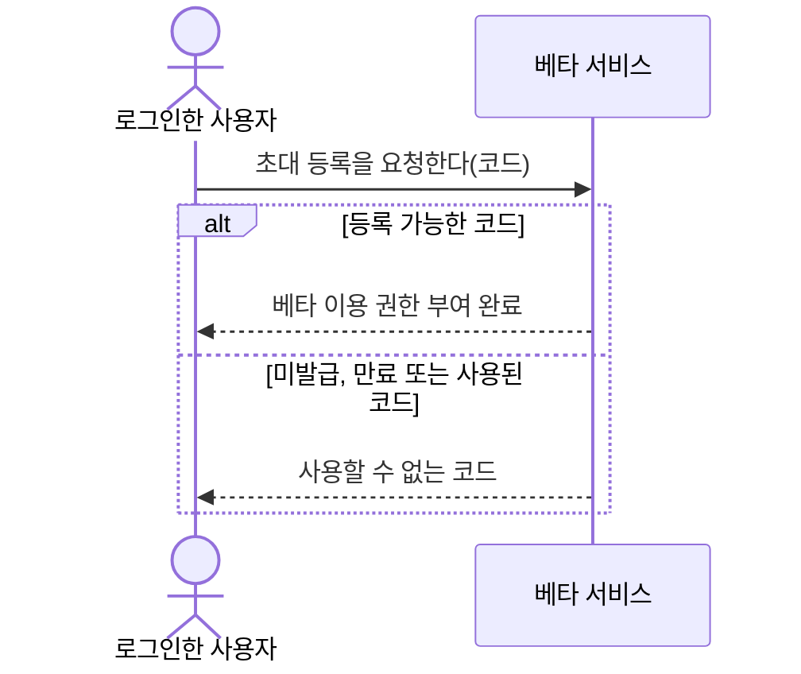
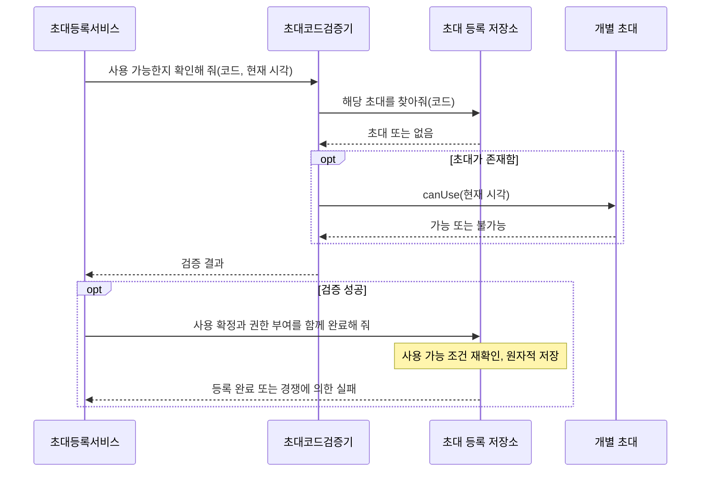

# 초대 등록과 웹 메인 화면 구현 계획

## 목표와 범위

카카오 로그인 후 베타 이용 권한이 없으면 초대 등록 화면으로, 권한이 있으면 메인 화면으로 안내한다. 코드 등록 성공 시 메인 화면으로 이동한다. 메인 화면에서 본인의 관심종목을 등록·삭제하고 공통 분석 이력과 상세 결과를 조회한다. 운영자는 베타 권한과 무관하게 기존 `/admin`에서 발급할 수 있으나 일반 서비스 이용에는 동일한 베타 권한이 필요하다.

기존 계정의 데이터는 보존하고 베타 권한을 자동 부여하지 않는다. 기존 권한 보유자의 재등록 요청은 다른 코드를 소비하지 않고 기존 권한 상태를 반환한다. 코드 만료는 이미 부여된 권한을 만료시키지 않는다. 개인 AI 키, 사용자 지정 조건 화면, Android 패키징, 공개 배포는 이번 범위에 포함하지 않는다.

## 책임과 협력

사용자의 등록 요청을 받은 등록 서비스는 검증기에 코드의 사용 가능 여부를 묻는다. 검증기는 저장소에서 개별 초대를 찾아 그 객체의 `can_use(now)` 판단을 이용한다. 등록 서비스는 검증 성공 후 저장소의 원자적 등록 작업에 사용 확정과 계정 권한 부여를 함께 요청한다. 저장소는 미사용·미만료 조건을 다시 검사해 동시 등록에서도 한 계정만 성공하도록 한다. 권한 부여 실패 시 코드 사용도 되돌린다. 사전 검증 성공만으로 등록 성공을 반환하지 않는다.

로그인 신원, 운영자 권한, 베타 이용 권한은 별도 개념이다. 서버는 서비스 API에서 로그인·베타 권한·기존 소유권 제한을 확인한다. 쿠키 인증의 변경 요청에는 기존 Origin 검사를 적용하고 Electron Bearer 인증도 베타 이용 권한 검사를 따른다. 운영 작업은 운영자 권한으로 보호한다.

이 시스템 시퀀스 다이어그램은 외부에서 관찰하는 요청과 응답만 표현한다. 내부 협력은 아래와 같으며 메서드명은 설계용 메시지 표기다.

## 웹 계약

- 세션 응답에 `has_beta_access: boolean`을 추가한다.
- `POST /auth/web/invitations/redeem`에 `{code}`를 보내고 성공 시 갱신된 세션을 받는다. 미로그인 401, 사용할 수 없는 코드 400. 기존 권한은 코드를 소비하지 않고 반환한다.
- 페이지: `/login`, `/invite`, `/app`, 기존 `/admin`. 서버 직접 접속과 React 내 이동 모두 같은 접근 흐름을 따른다.
- 관심종목과 분석 조회는 기존 `/watchlist`, `/stocks/{symbol}/analysis` 및 이력 상세 API를 사용한다. 웹에서는 저장된 공통 결과를 조회하며 결과 없음은 빈 상태로 표시한다. 조회만으로 유료 분석을 새로 요청하지 않는다.
- 운영자에게는 초대 발급 이동 링크를 제공한다. 운영자에게도 초대 등록을 통해 일반 서비스 권한을 얻는 경로를 제공한다.

## 구현 에이전트 및 커밋

| 단계 | 담당 모델과 추천 이유 | 산출물 |
| --- | --- | --- |
| 등록·권한·API | GPT-5.6 Sol / high: 트랜잭션, 동시성, 인증 경계에 대한 통합 판단 필요 | 도메인 협력, 권한 저장·마이그레이션, 서비스 API·페이지 보호 |
| 웹 화면 | GPT-5.6 Terra / high: 확정된 API와 React 구조 안에서 화면·상태 전이 구현 | 등록 화면, 메인 관심종목·공통 분석 조회, 단위 테스트 |
| 통합 검증 | GPT-5.6 Sol / high: 실제 브라우저와 서버 연동의 회귀 검증 | 브라우저 시나리오 및 문제 수정 |

구현 에이전트가 코드를 작성하고 주 에이전트는 설계·계약 조율과 검증을 담당한다. Astra 모델은 구현에 배정하지 않는다. 각 담당 영역은 실패 테스트 → 최소 구현 → 회귀 확인 순서의 TDD로 진행한다. 계획, 백엔드, 웹 화면, 통합 검증을 의미 있는 커밋 단위로 나눈다. 기존 미추적 `desktop-demo/pnpm-lock.yaml`은 변경하거나 포함하지 않는다.

## 테스트 명세

- 미발급·사용됨·정확히 7일 경계·만료 코드 거부, 유효 코드 한 번 등록 성공.
- 코드 사용과 권한 부여 원자성, 권한 저장 실패 시 롤백, 서로 다른 DB 세션의 동시 등록에서 한 계정만 성공.
- 권한 영속성·다음 로그인 유지, 이미 권한을 가진 계정의 재등록이 다른 코드를 소비하지 않음.
- 기존 데이터 보존 마이그레이션, 비로그인 401, 무권한 403, 타인 관심종목·분석 접근 제한 유지, 쿠키 변경 요청 Origin 검사.
- 일반 계정과 운영자 권한 분리, 운영 작업 권한 확인, 코드 원문 응답·로그 유출 방지.
- UI 등록 오류·중복 클릭·성공 이동·새로고침·재로그인·로그아웃·401 처리.
- 메인 관심종목 등록·삭제·이력과 상세 조회·결과 없음·오류·모바일 레이아웃.
- 실제 FastAPI와 React를 연결한 브라우저 테스트에서 운영자 발급 → 일반 사용자 등록 → 메인 화면 → 관심종목 → 저장된 분석 조회 → 재접속을 검증한다. 외부 카카오·AI는 대역으로 하고 실제 유료 호출은 하지 않는다.

마지막에 전체 회귀·웹 빌드를 확인하고 기존 로컬 설정과 DB를 보존해 서버를 재시작한다. 실제 접속 주소와 남은 제약을 사용자에게 전달한다.

## 구현 및 검증 기록

초대 사용과 베타 권한 부여는 단일 저장 트랜잭션으로 구현했다. 코드의 사전 판단은 저장소에서 찾은 개별 초대의 `can_use`에 맡기고, 사용 확정 시 미사용·미만료 조건을 다시 검사한다. 계정별 베타 권한은 운영자 설정과 분리해 저장한다. 기존 사용자·분석·알림 데이터의 마이그레이션 보존을 검증했다.

React는 로그인 후 권한에 따라 `/invite` 또는 `/app`으로 안내한다. 메인에서는 관심종목 관리와 저장된 공통 분석 이력·상세 조회만 제공한다. 기존 운영자 발급 화면은 별도로 유지한다.

검증 결과: Python 전체 134개, 집중 베타 48개, 기존 Electron 15개, React 27개, Playwright 통합 6개 통과. 웹 타입 검사와 프로덕션 빌드도 통과했다. 브라우저 통합은 실제 FastAPI와 빌드된 React, 임시 SQLite 및 카카오 대역을 사용했다. 운영자 발급 → 다른 사용자 등록 → 관심종목·저장된 분석 조회 → 재로그인, 미발급·기사용 코드와 권한별 거부를 확인했다. 초기 브라우저 검증 실패는 입력칸 선택자의 모호성 때문이었으며 선택자를 좁혀 통과시켰다. 웹 화면 첫 구현의 테스트 선행 실패 기록은 확보되지 않았으므로 이 부분을 RED 선행으로 주장하지 않는다. 이후 발견한 비동기 화면 회귀는 실패 테스트를 먼저 추가하고 수정했다.

실제 카카오 계정 로그인과 외부 데이터·AI 호출을 통한 신규 분석 생성은 자동 브라우저 테스트에서 대역으로 검증했다. 로컬 실제 서비스는 별도로 실행해 HTTP 응답과 DB 마이그레이션을 확인한다.

로컬 `127.0.0.1:8000` 서버를 새 빌드로 재시작했다. `/login`은 200과 빌드 자산을 반환했고, 비로그인 `/invite`, `/app`, `/admin`은 `/login`으로 이동했다. 실제 SQLite는 마이그레이션 `0010_beta_access_grants`에 도달했으며 기존 운영자 계정과 초대 기록 1건이 보존되었다. 변경 전에 SQLite 온라인 백업을 만들었다. 현재 권한 부여 기록은 0건이므로 첫 사용자는 초대 코드를 등록해야 한다.
