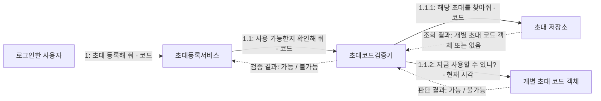

# 웹 비공개 베타 출시 및 초대 설계

상태: 요구사항과 초대 코드 검증 협력 합의 완료. 코드 사용 확정·권한 부여 협력은 후속 설계 대상이며 기능 구현 전이다.
관련 이슈: https://github.com/PhilPark-geosr/stock-agent/issues/35

## 1. 출시 방향

웹으로 먼저 출시하여 실제 사용자 테스트를 거친 뒤 Android 앱을 Google Play에 출시한다. 첫 웹 테스트는 초대받은 사용자만 허용한다. 앱 전환 기술과 호스팅 제공자는 아직 확정하지 않았다.

## 2. 합의한 요구사항

- 카카오 로그인 후 초대 코드를 먼저 등록한 사용자 계정에 베타 이용 권한을 부여한다. 수신자를 사전에 지정하지 않는다.
- 초대 코드 하나는 사용자 계정 하나만 사용할 수 있다. 동시 등록에서도 한 계정만 성공해야 한다.
- 등록 기한은 발급 시점부터 7일이다. 현재 시각이 발급 시각으로부터 7일이 되는 시점 이상이면 사용할 수 없다.
- 사용 가능 조건은 발급된 코드이며, 등록 기한이 지나지 않았고, 아직 사용되지 않았다는 것이다.
- 코드 만료는 미사용 코드의 등록 기한이며 이미 부여된 베타 이용 권한을 만료시키지 않는다.
- 이용 권한이 없는 계정은 관심 종목, 분석 및 알림 기능을 사용할 수 없어야 한다.
- 이미 베타 이용 권한을 받은 계정의 접속은 아래 유스케이스에 포함하지 않는다. 진입 전 권한 확인은 별도 흐름에서 다룬다.

### 기존 이용 권한이 있는 계정의 서버 호출

이미 베타 이용 권한을 받은 계정은 유효한 로그인 세션으로 초대 코드를 다시 등록하지 않고 관심 종목·분석·알림 서버 API를 호출할 수 있다. 서버는 요청 시 로그인과 베타 이용 권한을 확인하고, 기존 사용자별 소유권 제한을 적용한다. 베타 이용 권한은 다른 계정의 데이터 접근이나 운영자 전용 기능의 호출 권한을 의미하지 않는다.

이 처리는 초대 코드 등록 유스케이스의 기본·대안 흐름에 포함하지 않으며, 별도의 서버 접근 권한 확인 흐름으로 다룬다.

## 3. 유스케이스: 초대 코드 등록

### 목적과 범위

베타 이용 권한이 없는 사용자 계정이 초대 코드를 등록하여 이용 권한을 얻는다. 이번에 상세화한 협력은 이 유스케이스 중 코드 사용 가능 여부를 검증하는 부분이다. 검증 성공 자체는 등록 완료나 권한 부여를 의미하지 않는다.

| 항목 | 내용 |
| --- | --- |
| 주 액터 | 로그인한 사용자 |
| 사전 조건 | 카카오 로그인이 완료되어 사용자 계정이 식별되었고, 해당 계정에 베타 이용 권한이 없다. |
| 시작 사건 | 사용자가 초대 코드를 제출한다. |
| 성공 사후 조건 | 제출한 코드가 해당 계정에 의해 사용된 것으로 확정되고, 그 계정에 베타 이용 권한이 부여된다. |
| 실패 사후 조건 | 이 요청으로 인한 코드 소비 또는 권한 부여가 발생하지 않는다. |

### 기본 흐름

1. 사용자가 초대등록서비스에 초대 코드 등록을 요청한다. 권한을 받을 계정은 로그인으로 식별된 계정이다.
2. 초대등록서비스가 초대코드검증기에 코드 사용 가능 여부 확인을 요청한다.
3. 초대코드검증기가 초대 저장소에 해당 코드의 초대 조회를 요청한다.
4. 초대 저장소가 해당하는 개별 초대 코드 객체를 반환한다.
5. 초대코드검증기가 찾아온 객체에 현재 시각에 사용할 수 있는지 판단을 요청한다.
6. 개별 초대 코드 객체가 자신의 발급 시각과 사용 여부를 바탕으로 판단하고 결과를 반환한다.
7. 초대코드검증기가 초대등록서비스에 검증 결과를 반환한다.
8. 검증 성공 후 코드 사용 확정과 계정의 권한 부여를 함께 완료한다. 이 단계의 객체별 책임과 메시지는 후속 설계에서 정한다.
9. 사용자에게 등록 결과를 반환한다.

### 대안 및 실패 흐름

- 3~4단계: 조회 결과가 없으면 검증기가 사용 불가를 반환한다. 개별 초대 코드 객체에 판단을 요청하지 않는다.
- 5~6단계: 기한이 지났거나 이미 사용된 초대이면 객체가 사용 불가를 반환한다.
- 검증에 실패하면 코드 사용 확정과 권한 부여를 진행하지 않는다.
- 검증 이후 다른 요청이 먼저 등록을 완료할 수 있으므로, 최종 등록에서도 한 계정만 성공하도록 보장해야 한다. 단순한 사전 검증으로 동시 등록 보장이 끝나는 것은 아니다.
- 이미 권한을 받은 계정은 대안 흐름으로 넣지 않는다. 이 유스케이스의 사전 조건에 해당하지 않는다.

## 4. 도메인 모델링과 책임 할당

### 도메인 개념

| 개념 | 의미와 책임 |
| --- | --- |
| 사용자 계정 | 로그인한 사용자를 식별하고 베타 이용 권한이 귀속되는 기준이다. |
| 초대 코드 | 발급된 개별 초대를 나타낸다. 코드로 식별되며 자신의 발급 시각과 사용 여부를 바탕으로 현재 사용 가능한지 판단한다. 단순 입력 문자열과 구분한다. |
| 베타 이용 권한 | 사용자 계정이 비공개 베타 기능을 이용할 수 있는 자격이다. 초대 코드의 유효기간과 독립적이다. |

```mermaid
classDiagram
    class UserAccount[사용자 계정]
    class Invitation[초대 코드] {
        사용가능여부판단(현재시각)
    }
    class BetaAccess[베타 이용 권한]
    UserAccount "1" -- "0..1" BetaAccess : 보유
    Invitation "1" -- "0..1" BetaAccess : 등록으로 부여
```

위 그림은 개념 관계를 표현한다. 베타 이용 권한을 별도 구현 클래스나 테이블로 만들지는 아직 결정하지 않았다. 검증에 필요한 정보는 책임에서 도출되며, 필드와 저장 방식은 이 문서에서 확정하지 않는다.

### 협력 역할

| 객체 또는 역할 | 책임 | 책임의 경계 |
| --- | --- | --- |
| 초대등록서비스 | 초대 등록 유스케이스를 조율한다. | 개별 초대의 만료·사용 규칙을 직접 계산하지 않는다. |
| 초대코드검증기 | 조회와 개별 초대의 판단을 종합하여 코드 사용 가능 여부를 반환한다. | 조회 결과가 없으면 사용 불가로 판단하고, 객체가 있으면 그 객체에 판단을 맡긴다. |
| 초대 저장소 | 입력 코드에 해당하는 개별 초대를 찾는다. | 조회 결과로 객체 또는 없음을 반환한다. |
| 개별 초대 코드 객체 | 자신의 기한과 사용 여부에 따라 현재 사용 가능 여부를 판단한다. | 모든 발급 코드를 검색하는 역할이 아니라 찾아온 특정 초대 하나를 나타낸다. |

서비스와 저장소는 협력을 지원하는 역할이며 도메인 개념과 동일하게 취급하지 않는다. 역할별 구현 클래스 구성은 후속 구현 설계에서 검토한다.

### 책임을 도출한 과정

처음 메시지는 “사용 가능한 초대 코드인지 확인해 줘”였다. 이 메시지의 수신자가 곧바로 개별 초대라고 결정되는 것은 아니다.

1. 사용 가능 조건을 발급 여부·등록 기한·미사용 여부로 구체화했다.
2. 발급 여부는 코드에 해당하는 초대를 찾는 책임으로 구분했다.
3. 메시지 전체를 받는 역할로 초대코드검증기를 두었다.
4. 조회한 정보를 검증기가 직접 계산하는 대안과, 찾아온 객체에 판단을 맡기는 대안을 비교했다.
5. 후자를 선택했다. 검증기는 조회를 조율하고 개별 초대 코드 객체가 자신의 규칙을 판단한다.

## 5. 커뮤니케이션 다이어그램: 사용 가능 여부 검증

실선은 요청 메시지, 점선은 반환 결과이며 번호는 메시지 순서를 나타낸다. 현재 합의한 검증 협력까지만 표현한다.



- 사용자 계정의 식별은 로그인으로 확보된 요청 맥락이다.
- E는 D가 반환한 바로 그 객체이다. 저장소와 무관한 새 객체가 아니다.
- 조회 결과가 있을 때만 1.1.2를 보낸다. 없으면 검증기가 사용 불가를 반환한다.
- 기존 권한 조회 및 이미 권한이 있는 계정의 분기는 이 협력에 넣지 않는다.
- 코드 사용 확정, 계정의 권한 부여 및 사용자에게 최종 결과를 반환하는 메시지는 후속 설계에서 연결한다.

## 6. 다음 설계 및 검증 항목

- 코드 사용 확정과 권한 부여의 책임 배치 및 전체 성공·실패 경계.
- 동일 코드 동시 등록에서 한 계정만 성공하도록 하는 보장.
- 별도 흐름인 기존 이용 권한 확인과 기존 데이터의 처리 정책.
- 베타 이용 권한 회수와 테스트 종료 시 처리.
- 초기 초대 규모와 분석 사용량 한도.
- 만료 경계·재사용·조회 실패·동시 등록·권한 없는 API 접근 테스트.
- 공개 전 전체 분석 실행 API의 접근 보호.

이 문서는 설계 합의를 기록하며 구현 완료를 의미하지 않는다.
