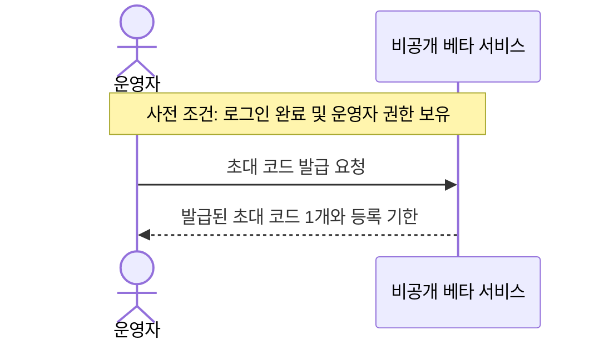
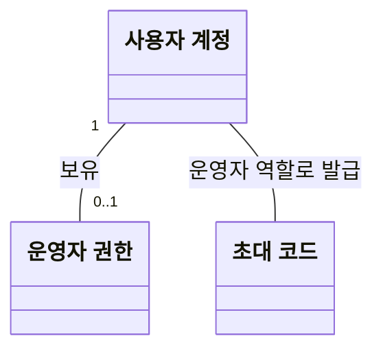
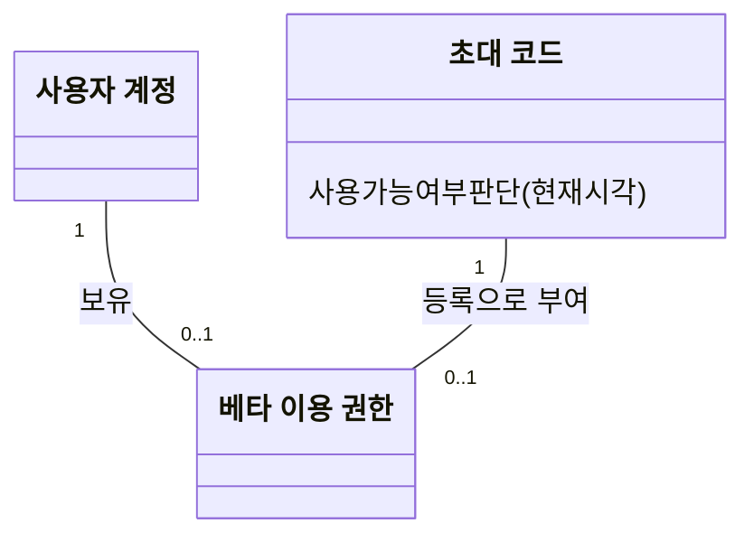
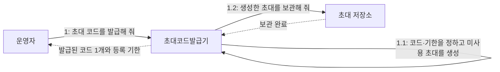
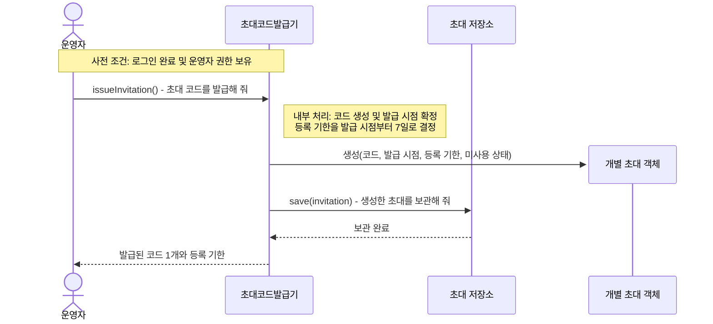
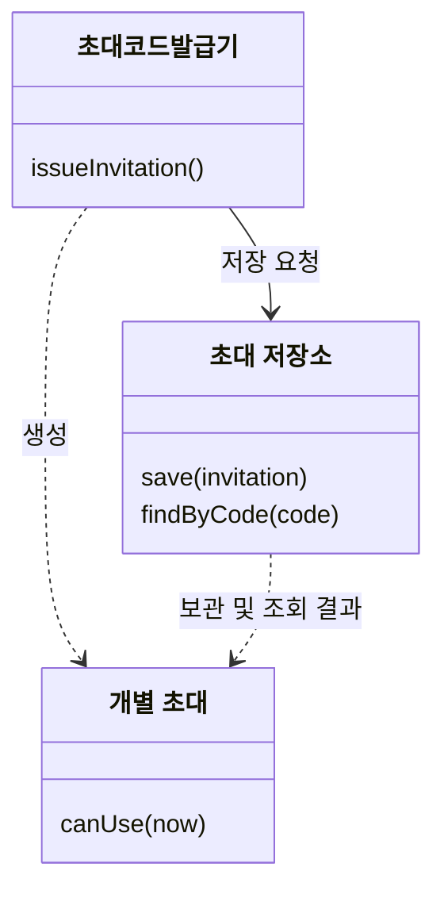
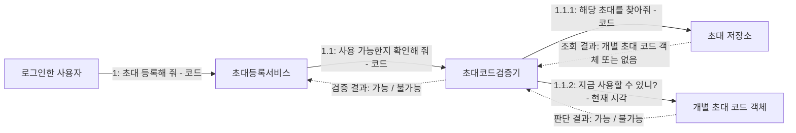

# 웹 비공개 베타 출시 및 초대 설계

상태: 요구사항, 초대 코드 발급 유스케이스·개념 모델・기본 협력, 초대 코드 검증 협력 합의 완료. 코드 사용 확정·권한 부여 협력은 후속 설계 대상이며 기능 구현 전이다.
관련 이슈: https://github.com/PhilPark-geosr/stock-agent/issues/35

## 1. 출시 방향

웹으로 먼저 출시하여 실제 사용자 테스트를 거친 뒤 Android 앱을 Google Play에 출시한다. 첫 웹 테스트는 초대받은 사용자만 허용한다. 웹은 React·TypeScript·Vite로 만들고 후속 Android 앱은 Capacitor로 패키징한다. 기존 FastAPI 중앙 서버는 유지하며 호스팅 제공자는 아직 확정하지 않았다.

### 첫 웹 베타 범위

- 초대 로그인(카카오 로그인 후 초대 코드 등록) → 관심 종목 등록 → 공통 분석 조회 → 카카오 시스템 기본 알림까지 제공한다.
- 개인 API 키를 사용하는 기능은 후속 출시로 미룬다. 사용자 AI 키 설계의 Q1~Q7 추천안을 승인하거나 폐기한 것은 아니다.
- 기존 사용자 지정 조건 기능의 첫 베타 노출·실행 제한 방법은 구현 전 확인한다. 출시 범위 합의가 기존 코드의 변경 완료를 뜻하지 않는다.

### 초대 발급과 운영자 권한

- 같은 웹 서비스의 `/admin` 화면에서 운영자가 발급 버튼을 눌러 초대 코드를 발급한다. 첫 베타의 발급 수단으로 별도 운영자 명령을 채택하지 않는다.
- 최소 화면은 발급 버튼과 발급된 코드·등록 기한 표시로 구성한다. 운영자는 웹 주소와 코드를 복사해 테스트할 사람에게 직접 전달한다. 자동 메시지 발송은 첫 범위에 포함하지 않는다.
- 발급 시점부터 등록 기한 7일이 시작된다. 직접 전달받은 사람의 신원에 코드를 묶지 않으며, 먼저 등록을 완료한 계정이 이용 권한을 얻는 기존 정책을 유지한다.
- 초기 운영자는 프로젝트 소유자 본인의 사용자 계정 하나로 한정하며 서버 설정으로 지정한다. 운영자 추가·관리 화면은 첫 범위에 포함하지 않는다.
- 운영자 권한은 베타 이용 권한과 별개이다. 베타 초대를 등록해도 운영자 권한은 생기지 않는다.
- `/admin` 접근과 초대 발급 API 모두 서버에서 로그인 및 운영자 권한을 확인한다. 화면이나 버튼을 숨기는 것으로 권한 검사를 대신하지 않는다.
- 초기 운영자 지정은 본인이 카카오 로그인으로 서비스 계정을 생성한 뒤, 그 서비스 계정 ID를 서버 설정에 명시하는 방식으로 한다. 첫 로그인 계정을 자동으로 운영자로 지정하지 않으며, 닉네임·이메일 또는 카카오 사용자 식별자를 운영자 설정의 기준으로 사용하지 않는다.
- 서버는 로그인으로 식별한 서비스 계정 ID와 설정된 운영자 계정 ID를 비교하여 운영자 여부를 확인한다.
- 운영자는 베타 이용 권한이 없어도 `/admin`에서 초대 코드를 발급할 수 있다. 관심 종목·공통 분석·알림 등 일반 서비스 이용에는 베타 이용 권한을 별도로 확인한다.
- 미로그인 상태로 운영자 기능에 접근하면 로그인을 안내하고 발급하지 않는다. 로그인했으나 운영자가 아닌 계정은 접근을 거부하고 발급하지 않는다. 화면을 거치지 않은 직접 API 요청도 동일한 접근 조건을 적용한다.

### 운영자 접근 확인 흐름 — 합의 완료

1. 시스템이 요청자의 유효한 로그인 여부를 확인한다. 미로그인이면 로그인이 필요함을 알리고 발급을 진행하지 않는다.
2. 로그인한 서비스 계정 ID가 서버 설정에 지정된 운영자 계정 ID인지 확인한다. 일치하지 않으면 접근을 거부하고 발급을 진행하지 않는다.
3. 운영자이면 베타 이용 권한 보유 여부와 무관하게 초대 발급 흐름을 진행한다.

이 흐름은 발급 유스케이스의 사전 조건을 확보하는 접근 확인 흐름이다. 발급 성공을 가정한 유스케이스에 발급 실패를 추가하는 것은 아니다. 접근 확인의 실제 구현 위치는 기존 인증 구조를 확인하여 정하며, 별도 권한 관리 시스템을 요구하지 않는다.

## 2. 합의한 요구사항

- 카카오 로그인 후 초대 코드를 먼저 등록한 사용자 계정에 베타 이용 권한을 부여한다. 수신자를 사전에 지정하지 않는다.
- 초대 코드 하나는 사용자 계정 하나만 사용할 수 있다. 동시 등록에서도 한 계정만 성공해야 한다.
- 등록 기한은 발급 시점부터 7일이다. 현재 시각이 발급 시각으로부터 7일이 되는 시점 이상이면 사용할 수 없다.
- 사용 가능 조건은 발급된 코드이며, 등록 기한이 지나지 않았고, 아직 사용되지 않았다는 것이다.
- 코드 만료는 미사용 코드의 등록 기한이며 이미 부여된 베타 이용 권한을 만료시키지 않는다.
- 이용 권한이 없는 계정은 관심 종목, 분석 및 알림 기능을 사용할 수 없어야 한다.
- 이미 베타 이용 권한을 받은 계정의 접속은 아래 유스케이스에 포함하지 않는다. 진입 전 권한 확인은 별도 흐름에서 다룬다.

### 기존 이용 권한이 있는 계정의 서버 호출

이미 베타 이용 권한을 받은 계정은 유효한 로그인 세션으로 초대 코드를 다시 등록하지 않고 관심 종목·분석·알림 서버 API를 호출할 수 있다. 서버는 요청 시 로그인과 베타 이용 권한을 확인하고, 기존 사용자별 소유권 제한을 적용한다. 베타 이용 권한은 다른 계정의 데이터 접근이나 운영자 전용 기능의 호출 권한을 의미하지 않는다.

이 처리는 초대 코드 등록 유스케이스의 기본·대안 흐름에 포함하지 않으며, 별도의 서버 접근 권한 확인 흐름으로 다룬다.

## 2.1. 유스케이스: 초대 코드 발급

**범위:** 비공개 베타 서비스

**수준:** 사용자 목표

**주 액터:** 운영자

**목적:** 운영자가 참여 희망자에게 전달할 초대 코드를 발급받는다.

**사전 조건:** 운영자는 로그인되어 있으며 운영자 권한을 보유한다.

**시작 사건:** 운영자가 초대 코드 발급을 요청한다.

**성공 사후 조건:**

- 새로운 초대 코드 1개가 발급된 것으로 기록된다.
- 발급된 코드는 미사용 상태이다.
- 운영자는 발급된 코드와 등록 기한을 제공받는다.

**기본 성공 흐름:**

1. 운영자가 초대 코드 발급을 요청한다.
2. 시스템이 새로운 초대 코드 1개를 발급하고 등록 기한을 정한다.
3. 시스템이 운영자에게 발급된 코드와 등록 기한을 제공한다.

**관련 업무 규칙:**

- 초대 코드는 운영자만 발급할 수 있다.
- 한 번의 요청으로 코드 1개를 발급한다.
- 등록 기한은 발급 시점부터 7일이며, 정확히 7일이 되는 시점부터 사용할 수 없다.
- 수신자를 사전에 지정하지 않는다.
- 코드 하나는 먼저 등록을 완료한 계정 하나만 사용할 수 있다.
- 발급만으로 베타 이용 권한이 부여되지는 않는다.
- 코드의 만료가 이미 부여된 이용 권한을 만료시키지는 않는다.

**설계 가정:** 발급은 성공한다고 가정하며 실패 흐름은 이번 유스케이스에서 다루지 않는다. 실제 시스템에서 실패가 불가능하다는 보장은 아니다.

**범위 밖:**

- 운영자가 참여 희망자에게 코드를 직접 전달하는 활동
- 참여자의 초대 코드 등록과 베타 이용 권한 획득

### 시스템 시퀀스 다이어그램: 초대 코드 발급

시스템을 하나의 블랙박스로 표현한다. UI, 내부 객체, 저장소와 구현 클래스의 협력은 포함하지 않는다. 로그인과 운영자 권한 보유는 사전 조건이며, 권한 검사를 생략한다는 의미는 아니다.

발급 기록과 미사용 상태는 성공 사후 조건으로 규정하며, 이를 실현하는 시스템 내부 메시지는 후속 책임 설계에서 다룬다.

## 3. 유스케이스: 초대 코드 등록

### 목적과 범위

베타 이용 권한이 없는 사용자 계정이 초대 코드를 등록하여 이용 권한을 얻는다. 이번에 상세화한 협력은 이 유스케이스 중 코드 사용 가능 여부를 검증하는 부분이다. 검증 성공 자체는 등록 완료나 권한 부여를 의미하지 않는다.

| 항목 | 내용 |
| --- | --- |
| 주 액터 | 로그인한 사용자 |
| 사전 조건 | 카카오 로그인이 완료되어 사용자 계정이 식별되었고, 해당 계정에 베타 이용 권한이 없다. |
| 시작 사건 | 사용자가 초대 코드를 제출한다. |
| 성공 사후 조건 | 제출한 코드가 해당 계정에 의해 사용된 것으로 확정되고, 그 계정에 베타 이용 권한이 부여된다. |
| 실패 사후 조건 | 이 요청으로 인한 코드 소비 또는 권한 부여가 발생하지 않는다. |

### 기본 흐름

1. 사용자가 초대등록서비스에 초대 코드 등록을 요청한다. 권한을 받을 계정은 로그인으로 식별된 계정이다.
2. 초대등록서비스가 초대코드검증기에 코드 사용 가능 여부 확인을 요청한다.
3. 초대코드검증기가 초대 저장소에 해당 코드의 초대 조회를 요청한다.
4. 초대 저장소가 해당하는 개별 초대 코드 객체를 반환한다.
5. 초대코드검증기가 찾아온 객체에 현재 시각에 사용할 수 있는지 판단을 요청한다.
6. 개별 초대 코드 객체가 자신의 발급 시각과 사용 여부를 바탕으로 판단하고 결과를 반환한다.
7. 초대코드검증기가 초대등록서비스에 검증 결과를 반환한다.
8. 검증 성공 후 코드 사용 확정과 계정의 권한 부여를 함께 완료한다. 이 단계의 객체별 책임과 메시지는 후속 설계에서 정한다.
9. 사용자에게 등록 결과를 반환한다.

### 대안 및 실패 흐름

- 3~4단계: 조회 결과가 없으면 검증기가 사용 불가를 반환한다. 개별 초대 코드 객체에 판단을 요청하지 않는다.
- 5~6단계: 기한이 지났거나 이미 사용된 초대이면 객체가 사용 불가를 반환한다.
- 검증에 실패하면 코드 사용 확정과 권한 부여를 진행하지 않는다.
- 검증 이후 다른 요청이 먼저 등록을 완료할 수 있으므로, 최종 등록에서도 한 계정만 성공하도록 보장해야 한다. 단순한 사전 검증으로 동시 등록 보장이 끝나는 것은 아니다.
- 이미 권한을 받은 계정은 대안 흐름으로 넣지 않는다. 이 유스케이스의 사전 조건에 해당하지 않는다.

## 4. 도메인 모델링과 책임 할당

### 도메인 개념

#### 초대 코드 발급의 개념 모델 — 합의 완료

운영자는 운영자 권한을 가진 사용자 계정이 맡는 역할이며 별개의 계정 종류로 모델링하지 않는다. 운영자 권한은 베타 이용 권한과 구분한다.

- 초대 코드는 단순 문자열이 아니라 그 문자열로 식별되는 발급된 개별 초대이다. 등록 기한은 초대에 속한 업무 정보로 다루며, 별도 독립 개념으로 분리하지 않는다.
- 발급 시 수신 계정은 정해지지 않으며 베타 이용 권한도 새로 생기지 않는다. 수신 계정과의 관계나 권한 부여는 등록 유스케이스에서 다룬다.
- 그림의 발급 관계는 업무상 관계이다. 사용자 계정 객체가 실행 중 초대 객체를 직접 생성한다는 책임 할당이나 발급자 정보의 영속 저장을 확정하는 것이 아니다.
- 운영자 권한의 개념 표현은 별도 구현 클래스나 테이블을 요구하지 않는다. 발급기와 저장소의 책임 배치는 아래 협력 역할에서 다루며, 별도 코드생성기는 두지 않는다.

#### 초대 코드 등록의 개념과 기존 판단 책임

| 개념 | 의미와 책임 |
| --- | --- |
| 사용자 계정 | 로그인한 사용자를 식별하고 베타 이용 권한이 귀속되는 기준이다. |
| 초대 코드 | 발급된 개별 초대를 나타낸다. 코드로 식별되며 자신의 발급 시각과 사용 여부를 바탕으로 현재 사용 가능한지 판단한다. 단순 입력 문자열과 구분한다. |
| 베타 이용 권한 | 사용자 계정이 비공개 베타 기능을 이용할 수 있는 자격이다. 초대 코드의 유효기간과 독립적이다. |

위 그림은 개념 관계를 표현한다. 베타 이용 권한을 별도 구현 클래스나 테이블로 만들지는 아직 결정하지 않았다. 검증에 필요한 정보는 책임에서 도출되며, 필드와 저장 방식은 이 문서에서 확정하지 않는다.

### 협력 역할

#### 초대 코드 발급 요청의 수신자 — 합의 완료

“초대 코드를 발급해 줘”라는 메시지의 수신자는 **초대코드발급기**로 정한다. 발급기는 미사용 상태와 등록 기한을 가진 초대 한 개가 발급된 것으로 기록되고, 코드와 등록 기한이 반환되도록 발급 완료를 조율한다.

- 초대등록서비스는 제출된 코드의 등록과 이용 권한 획득을 조율하는 기존 역할이므로 발급 역할과 구분한다.
- 코드생성기는 문자열 생성에 초점을 둔 이름이므로 발급 완료를 조율하는 역할의 이름으로 선택하지 않는다.
- 개별 초대 객체는 발급 요청 시 아직 생성되기 전이므로 첫 수신자로 선택하지 않는다.
- 발급기는 코드 생성·등록 기한 결정·미사용 초대 객체 생성을 직접 처리하고, 저장은 초대 저장소에 요청한다. 별도 코드생성기나 발급정책 객체는 두지 않는다.
- 이는 설계자가 발급 조율 책임을 역할에 할당한 것이다. 실행 중 그 역할을 수행하는 객체가 요청을 받아 협력하며, 별도 구현 클래스 구성은 아직 확정하지 않는다.

#### 초대 코드 발급의 기본 협력 — 합의 완료

| 역할 | 책임 |
| --- | --- |
| 초대코드발급기 | 코드 생성, 발급 시점부터 7일의 등록 기한 결정, 미사용 초대 객체 생성, 저장 요청, 코드와 등록 기한 반환 |
| 초대 저장소 | 발급된 초대를 보관하고 이후 코드로 조회할 수 있게 함 |
| 개별 초대 객체 | 이후 검증에서 자신의 기한과 사용 여부로 사용 가능 여부 판단 |

작은 발급 기능을 별도 생성기·정책 객체로 나누지 않는다. 발급 완료를 조율하는 역할과 발급 기록을 보관하는 역할만 분리한다. 발급기가 초대를 생성하는 책임과, 이미 생성된 초대가 사용 가능 여부를 판단하는 책임은 구분한다.

1.1은 발급기 내부 처리이며 다른 객체에 위임하는 메시지가 아니다. 이 협력은 로그인과 운영자 권한을 갖춘 요청의 발급 성공 흐름을 표현한다. 접근 권한 확인 책임의 배치는 별도로 다루며, 실제 발급 요청의 서버 권한 검사 요구는 유지한다. 코드 생성 방식과 저장 구현은 이 그림에서 확정하지 않는다.

#### 초대 코드 발급의 설계 다이어그램

위에서 합의한 책임 분담을 바탕으로 발급 성공 흐름을 상세화한다. 로그인 및 운영자 권한이 확보된 요청을 대상으로 하며, 권한 확인의 객체별 책임과 실패 흐름은 이 그림에 포함하지 않는다. 서버의 운영자 권한 검사 요구는 그대로 유지한다.

다음 메서드 이름은 메시지를 표현하기 위한 **설계용 표기 제안**이다. 실제 구현의 클래스·메서드 이름, 인자 형식, 반환 타입, 접근 제한자, DB 구조를 확정하지 않는다. 시퀀스는 실행 중 객체의 협력을, 클래스 다이어그램은 설계자가 할당한 책임과 의존 관계를 표현한다.

##### 시퀀스 다이어그램: 발급 성공 흐름

생성 메시지는 새 초대 객체가 만들어지는 시점을 나타내며, 이미 존재하는 초대에 발급을 요청하는 메시지가 아니다. `save`에 전달하는 초대는 방금 생성한 바로 그 객체이다. 발급기는 보관 완료 후 결과를 반환한다. 코드 생성과 기한 결정은 내부 처리로 표현하며 별도 생성기나 정책 객체를 추가하지 않는다.

##### 클래스 다이어그램: 발급과 기존 조회·판단 책임

| 설계용 표기 | 메시지의 의미 | 사용 흐름 |
| --- | --- | --- |
| issueInvitation() | 초대 코드 한 개를 발급해 줘 | 이번 발급 흐름 |
| save(invitation) | 생성한 초대를 보관해 줘 | 이번 발급 흐름 |
| findByCode(code) | 해당 코드의 초대를 찾아줘 | 기존 등록 검증 흐름 |
| canUse(now) | 지금 너를 사용할 수 있니? | 기존 등록 검증 흐름 |

`findByCode`와 `canUse`는 기존에 합의한 조회·판단 책임을 함께 표시한 것이며 발급 과정에서 호출하지 않는다. 조회 결과가 없으면 검증기가 사용 불가를 판단하고, 있으면 반환받은 바로 그 객체에 `canUse`를 요청한다. 이 설계 클래스 다이어그램은 앞선 도메인 개념 모델과 구분하며, 운영자·사용자 계정·권한의 전체 클래스 구성을 제시하는 그림이 아니다.

#### 초대 코드 검증의 협력 역할

| 객체 또는 역할 | 책임 | 책임의 경계 |
| --- | --- | --- |
| 초대등록서비스 | 초대 등록 유스케이스를 조율한다. | 개별 초대의 만료·사용 규칙을 직접 계산하지 않는다. |
| 초대코드검증기 | 조회와 개별 초대의 판단을 종합하여 코드 사용 가능 여부를 반환한다. | 조회 결과가 없으면 사용 불가로 판단하고, 객체가 있으면 그 객체에 판단을 맡긴다. |
| 초대 저장소 | 발급된 초대를 보관하고 입력 코드에 해당하는 개별 초대를 찾는다. | 조회 결과로 객체 또는 없음을 반환하며, 개별 초대의 사용 가능 규칙은 판단하지 않는다. |
| 개별 초대 코드 객체 | 자신의 기한과 사용 여부에 따라 현재 사용 가능 여부를 판단한다. | 모든 발급 코드를 검색하는 역할이 아니라 찾아온 특정 초대 하나를 나타낸다. |

서비스와 저장소는 협력을 지원하는 역할이며 도메인 개념과 동일하게 취급하지 않는다. 역할별 구현 클래스 구성은 후속 구현 설계에서 검토한다.

### 책임을 도출한 과정

처음 메시지는 “사용 가능한 초대 코드인지 확인해 줘”였다. 이 메시지의 수신자가 곧바로 개별 초대라고 결정되는 것은 아니다.

1. 사용 가능 조건을 발급 여부·등록 기한·미사용 여부로 구체화했다.
2. 발급 여부는 코드에 해당하는 초대를 찾는 책임으로 구분했다.
3. 메시지 전체를 받는 역할로 초대코드검증기를 두었다.
4. 조회한 정보를 검증기가 직접 계산하는 대안과, 찾아온 객체에 판단을 맡기는 대안을 비교했다.
5. 후자를 선택했다. 검증기는 조회를 조율하고 개별 초대 코드 객체가 자신의 규칙을 판단한다.

## 5. 커뮤니케이션 다이어그램: 사용 가능 여부 검증

실선은 요청 메시지, 점선은 반환 결과이며 번호는 메시지 순서를 나타낸다. 현재 합의한 검증 협력까지만 표현한다.

- 사용자 계정의 식별은 로그인으로 확보된 요청 맥락이다.
- E는 D가 반환한 바로 그 객체이다. 저장소와 무관한 새 객체가 아니다.
- 조회 결과가 있을 때만 1.1.2를 보낸다. 없으면 검증기가 사용 불가를 반환한다.
- 기존 권한 조회 및 이미 권한이 있는 계정의 분기는 이 협력에 넣지 않는다.
- 코드 사용 확정, 계정의 권한 부여 및 사용자에게 최종 결과를 반환하는 메시지는 후속 설계에서 연결한다.

## 6. 다음 설계 및 검증 항목

- 합의한 운영자 접근 정책을 기존 인증 구조에 연결하고 미로그인·비운영자·베타 권한 없는 운영자의 발급 접근을 검증.
- 코드 사용 확정과 권한 부여의 책임 배치 및 전체 성공·실패 경계.
- 동일 코드 동시 등록에서 한 계정만 성공하도록 하는 보장.
- 별도 흐름인 기존 이용 권한 확인과 기존 데이터의 처리 정책.
- 베타 이용 권한 회수와 테스트 종료 시 처리.
- 초기 초대 규모와 분석 사용량 한도.
- 만료 경계·재사용·조회 실패·동시 등록·권한 없는 API 접근 테스트.
- 공개 전 전체 분석 실행 API의 접근 보호.

이 문서는 설계 합의를 기록하며 구현 완료를 의미하지 않는다.
