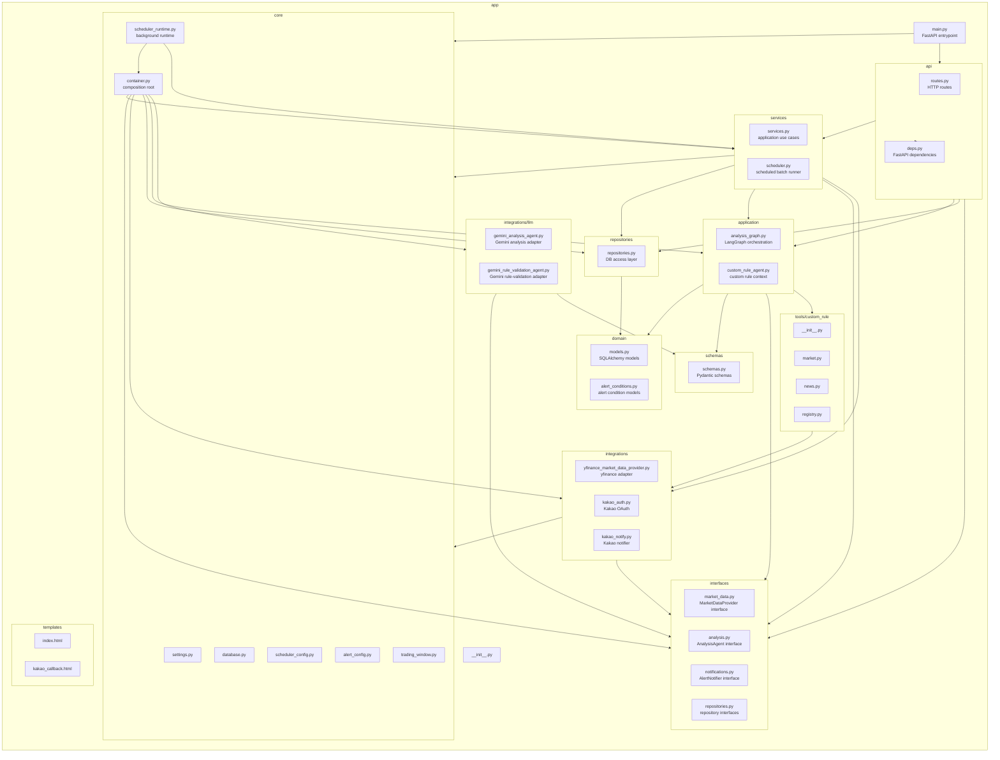

# App 폴더 구조 리팩토링 계획

## Summary

이 문서는 GitHub issue #12, 브랜치 `12-organize-backend`에서 진행하는 백엔드 폴더 구조 정리 계획이다.

1차 목표는 기존 비즈니스 로직을 변경하지 않고, 현재 `app/`의 평면 파일 구조를 역할별 패키지 구조로 이동하는 것이다. 허용되는 변경은 파일 이동에 필요한 import 경로 수정, 템플릿 경로 수정, 테스트 import/patch 경로 수정으로 제한한다.

마이그레이션 전후 기존 테스트는 반드시 통과해야 한다.

```powershell
.\.python311\python.exe -m pytest
```

기준선은 `28 passed, 2 warnings`다.

## Package Diagram



## 1차 Implementation Plan

현재 파일 기준으로만 이동하고, 파일 내부 책임 분리는 하지 않는다.

| Before | After |
| --- | --- |
| `app/routes.py` | `app/api/routes.py` |
| `app/settings.py` | `app/core/settings.py` |
| `app/database.py` | `app/core/database.py` |
| `app/scheduler_config.py` | `app/core/scheduler_config.py` |
| `app/alert_config.py` | `app/core/alert_config.py` |
| `app/trading_window.py` | `app/core/trading_window.py` |
| `app/models.py` | `app/domain/models.py` |
| `app/alert_conditions.py` | `app/domain/alert_conditions.py` |
| `app/schemas.py` | `app/schemas/schemas.py` |
| `app/repositories.py` | `app/repositories/repositories.py` |
| `app/services.py` | `app/services/services.py` |
| `app/scheduler.py` | `app/services/scheduler.py` |
| `app/agent.py` | `app/integrations/llm/gemini_analysis_agent.py` |
| `app/analysis_graph.py` | `app/application/analysis_graph.py` |
| `app/custom_rule_agent.py` | `app/application/custom_rule_agent.py` |
| `app/rule_validation.py` | `app/interfaces/rule_validation.py`, `app/integrations/llm/gemini_rule_validation_agent.py` |
| `app/market_data.py` | `app/interfaces/market_data.py`, `app/integrations/yfinance_market_data_provider.py` |
| service dependency assembly | `app/core/container.py`, `app/api/deps.py` |
| scheduler runtime wiring | `app/core/scheduler_runtime.py` |
| `app/kakao_auth.py` | `app/integrations/kakao_auth.py` |
| `app/kakao_notify.py` | `app/integrations/kakao_notify.py` |
| `app/custom_rule_tools/*` | `app/tools/custom_rule/*` |

`app/main.py`, `app/__init__.py`, `app/templates/*`는 위치를 유지한다.

각 새 폴더에는 `__init__.py`를 둔다. `app.services`, `app.repositories`, `app.schemas`는 기존처럼 public symbol을 import할 수 있도록 패키지 `__init__.py`에서 re-export한다.

## 2차 Refactoring Plan

1차가 테스트 통과 상태로 머지된 뒤 별도 이슈와 브랜치에서 진행한다.

- `repositories/repositories.py`를 watchlist, analysis, alert condition repository로 분리한다.
- `schemas/schemas.py`를 market, analysis, watchlist, alert condition schema로 분리한다.
- `services/services.py`를 analysis service, alert service/policy, dependency factory로 분리한다.
- `settings.py`, `scheduler_config.py`, `alert_config.py`, `kakao_settings()`를 typed config 모델 중심으로 통합하는 방안을 검토한다.
- 1차에서 둔 compatibility export는 내부 import와 테스트가 모두 새 경로로 이동한 뒤 제거한다.
- 깨진 한글 문자열 정리는 별도 cleanup 이슈로 분리한다.

## Test Plan

작업 전후 다음 명령을 실행한다.

```powershell
.\.python311\python.exe -m pytest
```

완료 조건은 다음과 같다.

- 전체 테스트 통과
- FastAPI 앱 import 및 startup 정상
- `/`, `/health`, watchlist, alert condition, scheduler, latest analysis API 테스트 통과
- LangGraph/custom rule agent 테스트 통과
- 기존 API 동작과 DB schema 변경 없음
