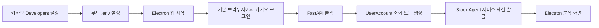
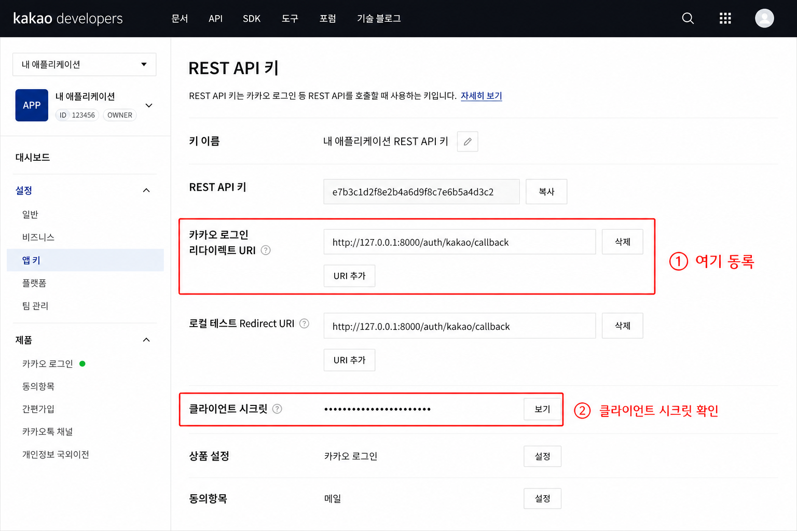

# 카카오 서비스 로그인 및 알림 연결 설정 가이드

Stock Agent Electron 앱에서 카카오 계정으로 로그인하고, 별도 동의를 통해 카카오톡 기본 알림을 연결하기 위한 로컬 개발 설정입니다.

## 전체 흐름



카카오 access token은 `/v2/user/me`에서 카카오 회원번호를 확인할 때만 사용하고 저장하지 않습니다. 이후 요청은 카카오 토큰이 아닌 Stock Agent 자체 세션으로 인증합니다.

## 사전 준비

- [카카오 Developers](https://developers.kakao.com/) 계정
- Python 3.11 이상과 프로젝트 Python 의존성
- Node.js 22.12 이상과 npm 10 이상
- 로컬 콜백 서버 주소 `http://127.0.0.1:8000`

## 카카오 Developers 설정

### 애플리케이션과 REST API 키

1. 카카오 Developers에서 **내 애플리케이션 → 애플리케이션 추가하기**를 선택합니다.
2. 생성한 앱에서 **카카오 로그인**을 활성화합니다.
3. **앱 설정 → 플랫폼 키 → REST API 키**에서 REST API 키를 복사합니다.
4. 같은 REST API 키 설정의 **카카오 로그인 Redirect URI**에 다음 값을 등록합니다.

   ```text
   http://127.0.0.1:8000/auth/kakao/callback
   http://127.0.0.1:8000/notification-connections/kakao/callback
   ```

5. 클라이언트 시크릿을 활성화했다면 시크릿 값도 복사합니다.

Redirect URI는 로그아웃 Redirect URI가 아니라 REST API 키의 카카오 로그인 Redirect URI에 등록해야 합니다. `localhost`와 `127.0.0.1`, 포트, 경로 및 마지막 슬래시가 하나라도 다르면 카카오가 요청을 거부합니다.



### 동의항목

서비스 로그인은 카카오 회원번호만 사용합니다. 이메일, 프로필과 `talk_message` 동의항목을 로그인 인가 요청에 추가하지 않습니다.

`talk_message`는 로그인 후 사용자가 **카카오 알림 연결**을 선택했을 때 별도 인가 요청으로 추가 동의를 받습니다. 카카오 Developers의 동의항목에서 카카오톡 메시지 전송 권한을 사용할 수 있게 설정해야 합니다. 서비스 로그인 권한과 알림 연결 권한은 같은 상태로 취급하지 않습니다.

## 환경변수

프로젝트 루트에서 예제 파일을 복사합니다.

```powershell
Copy-Item .env.example .env
```

다음 값을 입력합니다.

```env
KAKAO_REST_API_KEY=your-kakao-rest-api-key
KAKAO_REDIRECT_URI=http://127.0.0.1:8000/auth/kakao/callback
KAKAO_NOTIFICATION_REDIRECT_URI=http://127.0.0.1:8000/notification-connections/kakao/callback
KAKAO_CLIENT_SECRET=
NOTIFICATION_TOKEN_FERNET_KEY=generated-fernet-key
```

| 변수 | 필수 여부 | 설명 |
| --- | --- | --- |
| `KAKAO_REST_API_KEY` | 필수 | 카카오 Developers의 REST API 키 |
| `KAKAO_REDIRECT_URI` | 필수 | 콘솔에 등록한 로그인 콜백과 완전히 같은 URI |
| `KAKAO_NOTIFICATION_REDIRECT_URI` | 필수 | 콘솔에 등록한 별도 알림 연결 콜백과 완전히 같은 URI |
| `KAKAO_CLIENT_SECRET` | 조건부 | 카카오 콘솔에서 클라이언트 시크릿을 활성화한 경우에만 입력 |
| `NOTIFICATION_TOKEN_FERNET_KEY` | 알림 연결 시 필수 | 저장하는 access/refresh token을 암호화하는 Fernet 키 |

`KAKAO_ACCESS_TOKEN`과 `KAKAO_REFRESH_TOKEN`은 서비스 로그인 환경변수가 아닙니다. 서비스 로그인 과정은 이 값을 `.env`에 쓰지 않습니다.

Fernet 키는 다음 명령으로 한 번 생성해 `.env`에 넣고 안전하게 보관합니다. 기존 연결이 있는 상태에서 키를 바꾸면 저장된 토큰을 복호화할 수 없습니다.

```powershell
uv run python -c "from cryptography.fernet import Fernet; print(Fernet.generate_key().decode())"
```

## 실행과 로그인

### Electron이 로컬 백엔드도 시작하는 방법

```powershell
uv sync
Set-Location desktop-demo
npm ci
npm start
```

Electron은 기본 백엔드 `http://127.0.0.1:8000`의 상태를 확인하고 실행 중이 아니면 프로젝트의 Python 환경으로 FastAPI를 시작합니다.

### 백엔드를 별도로 실행하는 방법

첫 번째 터미널:

```powershell
uv run uvicorn app.main:app --reload
```

두 번째 터미널:

```powershell
Set-Location desktop-demo
npm start
```

백엔드 시작 시 Alembic 마이그레이션이 자동으로 적용됩니다.

### 사용자 로그인

1. Electron 로그인 화면에서 **카카오로 로그인**을 누릅니다.
2. 기본 브라우저에서 카카오 로그인을 완료합니다.
3. 브라우저에 “로그인이 완료되었습니다. 앱으로 돌아가세요.”가 표시되는지 확인합니다.
4. Electron이 자동으로 분석 화면으로 전환되는지 확인합니다.

앱은 5분 동안 로그인 완료를 확인합니다. 만료되거나 취소한 경우 로그인 화면에서 다시 시도할 수 있습니다.

## 세션 보안

- 서비스 세션은 발급 후 30일에 절대 만료됩니다.
- 서버는 원문 세션 토큰 대신 SHA-256 해시만 저장합니다.
- Electron renderer와 `localStorage`에는 토큰을 전달하지 않습니다.
- Electron main process가 토큰을 사용하며, 디스크 저장 시 OS 암호화 기능인 `safeStorage`를 사용합니다.
- `safeStorage`를 사용할 수 없으면 토큰은 평문 파일로 남기지 않고 현재 실행의 메모리에만 보관합니다.
- API가 401을 반환하거나 사용자가 로그아웃하면 저장된 세션을 제거합니다.

## 현재 알림 범위

현재 구현은 다음을 제공합니다.

- 사용자별 관심 종목 구독과 알림 조건 저장
- 활성 구독에 기반한 공용 종목 분석 접근
- 시스템 시장 조건만 사용하는 공용 분석
- 로그인과 독립적인 카카오 알림 연결·해제
- 스케줄 분석의 시스템 신호에 대한 사용자별 기본 알림과 성공·실패 이력

사용자별 조건 평가는 후속 설계 범위입니다. 카카오 메시지 연결은 `talk_message` 별도 동의를 사용하며 토큰은 Fernet으로 암호화해 저장합니다. access token 만료 시 refresh token으로 갱신하지만 이 과정은 서비스 로그인과 분리됩니다.

## 문제 해결

| 증상 | 확인 사항 |
| --- | --- |
| `KOE004` | 카카오 로그인이 활성화되어 있는지 확인 |
| `KOE006` | 콘솔과 `.env`의 Redirect URI를 문자 단위로 비교 |
| `KOE101` | REST API 키를 `KAKAO_REST_API_KEY`에 넣었는지 확인 |
| 클라이언트 시크릿 오류 | 시크릿을 활성화한 경우 `.env` 값이 같은지 확인하고 서버 재시작 |
| 앱이 로그인 완료를 확인하지 못함 | FastAPI가 8000 포트에서 실행되는지, 로그인 시도가 5분 이내인지 확인 |
| 재실행 후 다시 로그인 화면 표시 | OS의 `safeStorage` 사용 가능 여부와 Electron user data 파일 접근 권한 확인 |
| 카카오 알림 설정 필요 | `NOTIFICATION_TOKEN_FERNET_KEY`와 알림 callback 환경변수를 확인 |
| 알림 연결 Redirect URI 오류 | 콘솔에 `/notification-connections/kakao/callback` 주소가 별도로 등록됐는지 확인 |

`.env`와 세션 저장 파일은 Git에 커밋하지 말고 키나 토큰을 로그·스크린샷에 노출하지 않습니다.
