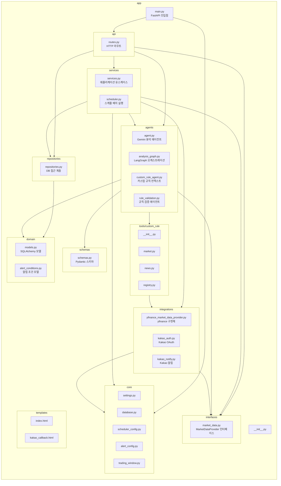

# PR: 백엔드 앱 패키지 구조 정리

Closes #12

## 요약

이 PR은 기존 비즈니스 동작을 변경하지 않고, 백엔드 `app/` 패키지를 역할과 경계가 드러나는 구조로 정리합니다.

이번 리팩토링의 범위는 구조 정리에 집중했습니다.

- 평면적으로 놓여 있던 `app/*.py` 모듈을 역할별 패키지로 이동했습니다.
- 시장 데이터 연동은 인터페이스와 yfinance 구현체를 분리했습니다.
- 파일 이동에 필요한 import 경로와 템플릿 경로를 수정했습니다.
- 기존 `app.services`, `app.repositories`, `app.schemas` import가 계속 동작하도록 패키지 `__init__.py`에서 public symbol을 re-export했습니다.
- `settings.py` 이동 후에도 프로젝트 루트의 `.env`를 읽도록 수정하고 회귀 테스트를 추가했습니다.
- 패키지 구조와 후속 리팩토링 계획을 `docs/app_structure_refactoring_plan.md`에 문서화했습니다.

## 패키지 다이어그램



## 패키지 의미와 경계

| 패키지 | 의미 | 경계 |
| --- | --- | --- |
| `app.main` | 애플리케이션 진입점 | FastAPI 앱 생성, lifespan 연결, 라우터 등록, 백그라운드 스케줄러 시작을 담당합니다. |
| `app.api` | HTTP 인터페이스 계층 | FastAPI route, 요청/응답 연결, HTTP 예외 변환, 템플릿 렌더링을 담당합니다. 비즈니스 작업은 service 또는 repository에 위임합니다. |
| `app.core` | 공통 인프라와 설정 | 환경변수 로딩, DB 세션, 스케줄 설정, 알림 시간 설정, 시간대/장 시간 유틸을 담당합니다. 비즈니스 유스케이스는 포함하지 않습니다. |
| `app.domain` | 핵심 도메인 정의 | SQLAlchemy ORM 모델과 알림 조건 도메인 모델/상수를 담당합니다. FastAPI route 처리와 분리합니다. |
| `app.schemas` | Pydantic/API 데이터 계약 | 요청/응답/전송용 스키마와 schema parse/serialization helper를 담당합니다. |
| `app.interfaces` | 애플리케이션이 기대하는 추상 계약 | 외부 구현체를 직접 모르고도 service/agent가 의존할 수 있는 Protocol과 공통 error를 담당합니다. 현재는 `MarketDataProvider`와 `MarketDataError`를 둡니다. |
| `app.repositories` | 영속성 경계 | SQLAlchemy query/write 작업과 DB record를 도메인 객체로 변환하는 책임을 가집니다. |
| `app.services` | 애플리케이션 유스케이스 계층 | 분석 실행, 스케줄 배치, 알림 판단, 의존성 조립 같은 orchestration을 담당합니다. |
| `app.agents` | LLM/LangGraph 에이전트 계층 | Gemini 분석, 커스텀 규칙 컨텍스트 수집, 그래프 오케스트레이션, 자연어 규칙 검증을 담당합니다. |
| `app.integrations` | 외부 시스템 구현체 | yfinance, Kakao OAuth, Kakao 알림 같은 외부 연동 세부사항을 담당합니다. 인터페이스를 구현하거나 외부 API를 감쌉니다. |
| `app.tools` | 에이전트 도구 구현 | 커스텀 규칙 에이전트가 사용하는 allowlisted LangChain tool을 담당합니다. |
| `app.templates` | 서버 렌더링 HTML | API 계층에서 사용하는 Jinja 템플릿을 담당합니다. |

## 주요 변경사항

- `app/routes.py`를 `app/api/routes.py`로 이동했습니다.
- 설정과 DB 인프라 파일을 `app/core/`로 이동했습니다.
- ORM 모델과 알림 조건 모델을 `app/domain/`으로 이동했습니다.
- `MarketDataProvider`와 `MarketDataError`를 `app/interfaces/market_data.py`로 분리했습니다.
- `YFinanceMarketDataProvider`를 `app/integrations/yfinance_market_data_provider.py`로 분리했습니다.
- service, scheduler, repository, schema, agent, integration, custom-rule tool 모듈을 각 패키지 경계로 이동했습니다.
- 각 패키지에 `__init__.py`를 추가했습니다.
- `app.services`, `app.repositories`, `app.schemas`는 compatibility re-export를 제공하도록 구성했습니다.
- `routes.py` 이동 후 템플릿 lookup 경로를 수정했습니다.
- `settings.py` 이동 후 `.env` 루트 경로 계산을 수정하고 `tests/test_settings.py`를 추가했습니다.
- 테스트 import를 새 canonical package path로 갱신했습니다.

## 동작 및 호환성

- API 응답 형태는 변경하지 않았습니다.
- DB schema는 변경하지 않았습니다.
- 비즈니스 로직 변경은 의도하지 않았습니다.
- `AnalysisService`는 yfinance 구현체가 아니라 `MarketDataProvider` 인터페이스에 의존합니다.
- 기존 public import 중 `app.services`, `app.repositories`, `app.schemas`는 패키지 re-export를 통해 계속 동작합니다.

## 검증

```powershell
.\.python311\python.exe -m pytest
```

결과:

```text
29 passed, 2 warnings
```

서버 smoke check:

```text
GET /health -> 200
GET /       -> 200
```

이동된 settings 모듈이 프로젝트 루트의 `.env`를 읽는 것도 확인했습니다.

```text
env_file=D:\project\stock-agent\.env
GEMINI_API_KEY_loaded=True
```

## 후속 작업

다음 리팩토링에서는 큰 모듈을 책임 단위로 더 세분화합니다.

- `repositories/repositories.py`를 watchlist, analysis, alert condition repository로 분리합니다.
- `schemas/schemas.py`를 market, analysis, watchlist, alert condition schema로 분리합니다.
- `services/services.py`를 analysis service, alert policy/service, dependency factory 모듈로 분리합니다.
- 설정 계층을 typed config object 중심으로 통합하는 방안을 검토합니다.
- 내부 import와 테스트가 모두 canonical package path로 이동한 뒤 compatibility re-export 제거를 검토합니다.
