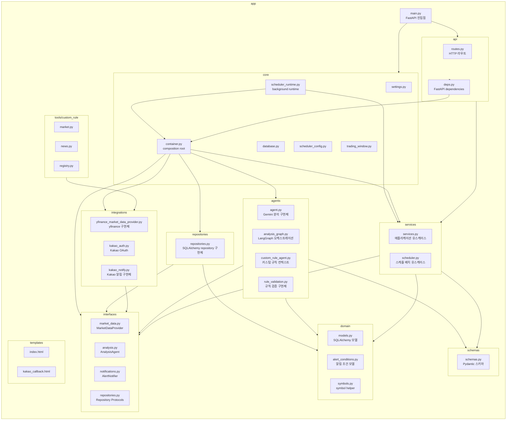

# PR: 백엔드 앱 패키지 구조 정리

Closes #12

## 요약

이 PR은 기존 비즈니스 동작을 유지하면서 백엔드 `app/` 패키지를 레이어 경계가 드러나는 구조로 정리합니다.

이번 리팩토링에서는 단순 폴더 이동을 넘어, Application Layer가 Infrastructure Layer의 concrete 구현체에 직접 의존하지 않도록 의존성 역전 구조를 적용했습니다.

- 평면적으로 놓여 있던 `app/*.py` 모듈을 역할별 패키지로 이동했습니다.
- `AnalysisService`가 repository, market data, analysis agent, notifier의 concrete 구현체가 아니라 `app.interfaces`의 계약에 의존하도록 정리했습니다.
- 실제 구현체 조립은 `app/core/container.py`로 이동했습니다.
- FastAPI dependency 조립은 `app/api/deps.py`로 이동했습니다.
- 백그라운드 scheduler runtime wiring은 `app/core/scheduler_runtime.py`로 이동했습니다.
- `MarketDataProvider`와 `YFinanceMarketDataProvider`를 인터페이스/구현체로 분리했습니다.
- `settings.py` 이동 후에도 프로젝트 루트의 `.env`를 읽도록 수정하고 회귀 테스트를 추가했습니다.

## 이번 PR에서 정리한 아키텍처

```text
┌──────────────────────────────────────────────────────────────┐
│ Presentation Layer                                           │
│ app/api                                                      │
│ - routes.py: HTTP endpoint                                   │
│ - deps.py: FastAPI dependency wiring                         │
│                                                              │
│ app/templates                                                │
│ - Jinja HTML templates                                       │
└───────────────────────────────┬──────────────────────────────┘
                                │
                                ▼
┌──────────────────────────────────────────────────────────────┐
│ Application Layer                                            │
│ app/services                                                 │
│ - services.py: analysis use case                             │
│ - scheduler.py: scheduled batch use case                     │
│                                                              │
│ depends on app.interfaces only                               │
│ does not import concrete repositories/integrations/agents     │
└───────────────────────────────┬──────────────────────────────┘
                                │
                                ▼
┌──────────────────────────────────────────────────────────────┐
│ Domain / Interface Layer                                     │
│ app/domain                                                   │
│ - core domain concepts: models, alert conditions, symbols    │
│                                                              │
│ app/schemas                                                  │
│ - Pydantic data contracts                                    │
│                                                              │
│ app/interfaces                                               │
│ - AnalysisAgent, MarketDataProvider, AlertNotifier           │
│ - Repository Protocols                                       │
└───────────────────────────────┬──────────────────────────────┘
                                │
                                ▼
┌──────────────────────────────────────────────────────────────┐
│ Infrastructure / Adapter Layer                               │
│ app/repositories                                             │
│ - SQLAlchemy repository implementations                      │
│                                                              │
│ app/agents                                                   │
│ - Gemini / LangGraph implementations                         │
│                                                              │
│ app/integrations                                             │
│ - yfinance / Kakao adapters                                  │
│                                                              │
│ app/tools                                                    │
│ - LangChain tools for custom rule agents                     │
└──────────────────────────────────────────────────────────────┘

┌──────────────────────────────────────────────────────────────┐
│ Composition / Runtime                                        │
│ app/core                                                     │
│ - container.py: concrete implementation assembly             │
│ - scheduler_runtime.py: background scheduler runtime wiring  │
│ - database.py, settings.py, scheduler_config.py              │
└──────────────────────────────────────────────────────────────┘
```

핵심 의존 방향은 다음과 같습니다.

```text
api/routes
  → services
    → interfaces

core/container
  → services + concrete implementations

repositories / agents / integrations
  → implement interfaces
```

## 패키지 다이어그램



## 패키지 의미와 경계

| 패키지 | 의미 | 경계 |
| --- | --- | --- |
| `app.main` | 애플리케이션 진입점 | FastAPI 앱 생성, lifespan 연결, 라우터 등록, 백그라운드 스케줄러 시작을 담당합니다. |
| `app.api` | HTTP 인터페이스 계층 | FastAPI route와 dependency wiring을 담당합니다. 유스케이스 실행은 service에 위임합니다. |
| `app.core` | 공통 인프라와 composition root | 환경변수, DB 세션, 스케줄 설정, runtime wiring, concrete 구현체 조립을 담당합니다. |
| `app.domain` | 핵심 도메인 정의 | ORM 모델, 알림 조건 모델, symbol 정규화 같은 도메인 개념을 담당합니다. |
| `app.schemas` | Pydantic/API 데이터 계약 | 요청/응답/전송용 스키마와 serialization helper를 담당합니다. |
| `app.interfaces` | Application Layer가 의존하는 추상 계약 | repository, market data provider, analysis agent, notifier protocol과 공통 error를 담당합니다. |
| `app.services` | 애플리케이션 유스케이스 계층 | 분석 실행, 분석 결과 저장 흐름, 알림 판단, 스케줄 배치 유스케이스를 담당합니다. concrete infrastructure를 직접 import하지 않습니다. |
| `app.repositories` | DB adapter 구현체 | `app.interfaces.repositories`의 SQLAlchemy 구현체를 담당합니다. |
| `app.agents` | LLM/LangGraph 구현체 | Gemini 분석, LangGraph 오케스트레이션, 규칙 검증 구현체를 담당합니다. |
| `app.integrations` | 외부 시스템 adapter 구현체 | yfinance, Kakao OAuth, Kakao 알림 같은 외부 연동 세부사항을 담당합니다. |
| `app.tools` | 에이전트 도구 구현 | 커스텀 규칙 에이전트가 사용하는 allowlisted LangChain tool을 담당합니다. |
| `app.templates` | 서버 렌더링 HTML | API 계층에서 사용하는 Jinja 템플릿을 담당합니다. |

## 주요 변경사항

- `app/services/services.py`에서 concrete repository, yfinance provider, Gemini agent, Kakao notifier, FastAPI dependency import를 제거했습니다.
- `app/interfaces/`에 `analysis.py`, `market_data.py`, `notifications.py`, `repositories.py`를 추가했습니다.
- `app/core/container.py`에서 실제 구현체를 조립하도록 변경했습니다.
- `app/api/deps.py`에서 FastAPI dependency를 제공하도록 변경했습니다.
- `app/services/scheduler.py`는 `AnalysisProvider`만 받아 실행하고, DB 세션 기반 runtime은 `app/core/scheduler_runtime.py`로 이동했습니다.
- `MarketDataProvider`는 `app/interfaces/market_data.py`, `YFinanceMarketDataProvider`는 `app/integrations/yfinance_market_data_provider.py`로 분리했습니다.
- concrete 구현체 클래스가 자신이 따르는 Protocol을 명시적으로 상속하도록 정리했습니다.
- `normalize_symbol`은 repository 구현체가 아니라 `app/domain/symbols.py`로 이동했습니다.
- 패키지 구조와 후속 계획을 `docs/app_structure_refactoring_plan.md`에 문서화했습니다.

## 동작 및 호환성

- API 응답 형태는 변경하지 않았습니다.
- DB schema는 변경하지 않았습니다.
- 비즈니스 로직 변경은 의도하지 않았습니다.
- Application Layer는 Infrastructure Layer의 concrete class가 아니라 `app.interfaces`의 Protocol에 의존합니다.
- 기존 public import 중 `app.services`, `app.repositories`, `app.schemas`는 패키지 re-export를 통해 계속 동작합니다.

## 검증

```powershell
.\.python311\python.exe -m pytest
```

결과:

```text
29 passed, 2 warnings
```

서버 smoke check:

```text
GET /health -> 200
GET /       -> 200
```

settings 모듈이 프로젝트 루트의 `.env`를 읽는 것도 확인했습니다.

```text
env_file=D:\project\stock-agent\.env
GEMINI_API_KEY_loaded=True
```

## 후속 작업

- `repositories/repositories.py`를 watchlist, analysis, alert condition repository 파일로 세분화합니다.
- `schemas/schemas.py`를 market, analysis, watchlist, alert condition schema 파일로 세분화합니다.
- `services/services.py`를 analysis service, alert policy/service, dependency factory 모듈로 세분화합니다.
- 설정 계층을 typed config object 중심으로 통합하는 방안을 검토합니다.
