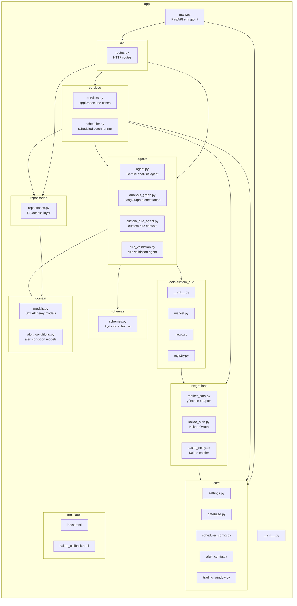

# PR: Organize backend app package structure

Closes #12

## Summary

This PR reorganizes the backend `app/` package into explicit architectural boundaries without changing business behavior.

The first refactoring pass focuses on package structure only:

- Move flat `app/*.py` modules into role-based packages.
- Update imports and template paths required by the move.
- Keep public service/repository/schema imports available through package `__init__.py` re-exports.
- Add a regression test for project-root `.env` loading after moving `settings.py`.
- Document the package structure and follow-up refactoring plan in `docs/app_structure_refactoring_plan.md`.

## Package Diagram



## Package Boundaries

| Package | Meaning | Boundary |
| --- | --- | --- |
| `app.main` | Application entrypoint | Creates FastAPI app, wires lifespan, includes routers, and starts background scheduler. |
| `app.api` | HTTP interface layer | Owns FastAPI routes, request/response wiring, HTTP exceptions, and template rendering. It should delegate business work to services or repositories. |
| `app.core` | Shared infrastructure and configuration | Owns environment loading, DB session setup, scheduler config, alert window config, and time-window helpers. It should not contain business workflows. |
| `app.domain` | Core domain definitions | Owns ORM models and alert-condition domain models/constants. It should stay independent from FastAPI route handling. |
| `app.schemas` | Pydantic/API data contracts | Owns request/response/data-transfer schemas and schema parse/serialization helpers. |
| `app.repositories` | Persistence boundary | Owns SQLAlchemy query/write operations and conversion from database records to domain objects. |
| `app.services` | Application use-case layer | Owns orchestration such as analysis, scheduled batch execution, alert decision checks, and dependency assembly. |
| `app.agents` | LLM and LangGraph agent layer | Owns Gemini analysis, custom-rule context gathering, graph orchestration, and natural-language rule validation. |
| `app.integrations` | External system adapters | Owns yfinance, Kakao OAuth, and Kakao notification integration details. |
| `app.tools` | Agent tool implementations | Owns allowlisted LangChain tools used by custom-rule agents. |
| `app.templates` | Server-rendered HTML | Owns Jinja templates used by the API layer. |

## Key Changes

- Moved route handling from `app/routes.py` to `app/api/routes.py`.
- Moved configuration and DB infrastructure into `app/core/`.
- Moved ORM and alert-condition models into `app/domain/`.
- Moved service, scheduler, repository, schema, agent, integration, and custom-rule tool modules into their package boundaries.
- Added package `__init__.py` files and compatibility re-exports for `app.services`, `app.repositories`, and `app.schemas`.
- Fixed template lookup after moving `routes.py`.
- Fixed `.env` root detection after moving `settings.py` and added `tests/test_settings.py`.
- Updated tests to import from the new canonical package paths.

## Behavior And Compatibility

- No API response shape changes.
- No DB schema changes.
- No business-logic changes intended.
- Existing public imports from `app.services`, `app.repositories`, and `app.schemas` continue to work through package re-exports.

## Verification

```powershell
.\.python311\python.exe -m pytest
```

Result:

```text
29 passed, 2 warnings
```

Manual server smoke check:

```text
GET /health -> 200
GET /       -> 200
```

Also verified that the moved settings module loads the project-root `.env`:

```text
env_file=D:\project\stock-agent\.env
GEMINI_API_KEY_loaded=True
```

## Follow-Up

The next refactoring pass should split the large package modules by responsibility:

- `repositories/repositories.py` into watchlist, analysis, and alert-condition repositories.
- `schemas/schemas.py` into market, analysis, watchlist, and alert-condition schemas.
- `services/services.py` into analysis service, alert policy/service, and dependency factory modules.
- Consider consolidating settings into typed config objects.
- Remove compatibility re-exports once all internal and test imports use canonical package paths.
